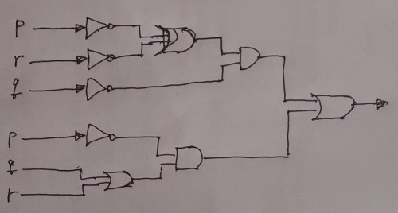

Construct a combinatorial circuit using inverters, OR gates, and AND gates that produces the output $$((\neg p \vee \neg r) \wedge \neg q) \vee (\neg p \wedge (q \vee r))$$ from input bits p, q, and r.

Solution

