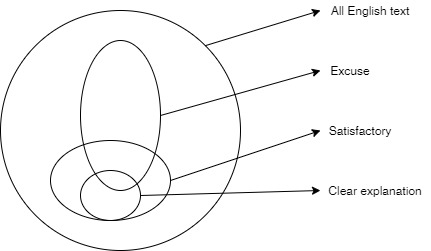

let P(x), Q(x), and R(x) be the statements "x is a clear explanation," "x is satisfactory," and "x is a excuse," respectively. Suppose that the domain for x consists of all English text. Express each of these statements using quantifiers, logical connectives, and P(x), Q(x), and R(x).

1. All clear explanations are satisfactory.
2. Some excuses are unsatisfactory.
3. Some excuses are not clear explanations.
4. Does (c) follow from (a) and (b)?

Solution

1. $$\forall x (P(x) \rightarrow Q(x))$$
2. $$\exist x (R(x) \wedge \neg Q(x))$$
3. $$\exist x (R(x) \wedge \neg P(x))$$
4. Yes

d. 

