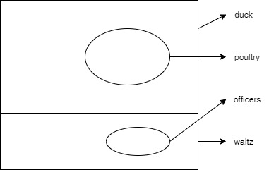

Let P(x), Q(x), R(x), and S(x) be the statements "x is a duck," "x is one of my poultry," "x is an officer," and "x is willing to waltz," respectively. Express each of these statements using quantifiers; logical connectives; and P(x), Q(x), R(x), S(x).

1. No ducks are willing to waltz.
2. No officers ever decline to waltz.
3. All my poultry are ducks.
4. My poultry are not officers.
5. Does (d) follow from (a), (b), and (c)? If not , is there a correct conclusion?

Soulution

1. $$\neg \exist x (P(x) \wedge S(x))$$
2. $$\neg \exist x (R(x) \wedge S(x))$$
3. $$\forall x (Q(x) \rightarrow P(x))$$
4. $$\forall x (Q(x) \rightarrow \neg R(x))$$
5. Yes

e. 

