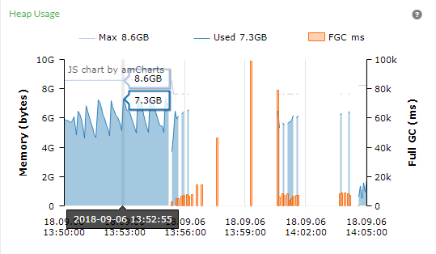

# 一次应用莫名宕机排查经历

## 问题现象

程序运行一段时间（时间长度不固定）应用开始出现频繁 FGC 最后应用宕机

## 问题排查过程

1. 查看问题发生时服务器状态
1. 分析应用宕机后留下来的 heap dump 文件
1. review 代码
1. 验证问题

### 查看问题发生时服务器状态

第一时间发现问题的是运维的小伙伴，通过 zabbix 发现服务器的内存基本满了，CPU 占用 100% 
打开 pinpoint 的 inspect 页面查看，应用在频繁 FGC 最后挂掉了


初步判定应该是发生了 memory leak 

### 分析应用宕机后留下来的 heap dump 文件

heap dump 的分析工具有很多 jhat, jvisualvm, mat 等。这里选择了 mat 
原本准备用 eclipse 插件看，结果因为太大，还没导入内存就满了，如果没有 heap dump 文件可以在发生问题时使用命令 dump 一份

```
jmap -dump:format=b,file=/opt/tmp/heapdump.hprof <pid>
```

使用命令

```
// 创建索引文件，提升后续生成报告的速度
${MAT_HOME}/ParseHeapDump.sh heap.hprof
// 生成可疑问题报告，主要看这份
${MAT_HOME}/ParseHeapDump.sh heap.hprof org.eclipse.mat.api:suspects
// 上面报告的预览部分
${MAT_HOME}/ParseHeapDump.sh heap.hprof org.eclipse.mat.api:overview
${MAT_HOME}/ParseHeapDump.sh heap.hprof org.eclipse.mat.api:top_components
```

通过查看报告发现了几个可疑点

1. 查看 Class Histogram 发现一个自定义类 ```PatientVisit``` 有 1694219 个，占了 2.3G 空间
2. 查看 Leaks 有 6 个 Problem Suspect 查看 stacktrace 看到一行代码

```
PatientVisit patientVisitRet = patientVisitMapper.selectOne(patientVisit);
```

返回值就是那个特别多的类

### review 代码

这行代码的作用是根据主键查询对应的记录，按理来说不会莫名其妙生成那么多对象，review 了整个方法的代码，发现这个业务被调整过了，调整过后在某种情况下主键可以会为 null 翻了一下 mybatis 的代码

```
  @Override
  public <T> T selectOne(String statement, Object parameter) {
    // Popular vote was to return null on 0 results and throw exception on too many.
    List<T> list = this.<T>selectList(statement, parameter);
    if (list.size() == 1) {
      return list.get(0);
    } else if (list.size() > 1) {
      throw new TooManyResultsException("Expected one result (or null) to be returned by selectOne(), but found: " + list.size());
    } else {
      return null;
    }
  }
```

mybatis 的实现是先把对象从数据库里面读取出来，然后根据 list 的 size 判断是返回对象还是抛出异常。也就是说如果条件不对的话会把大量的数据读到内存，甚至会把整表都读到内存里，囧。

### 验证问题

找到对应的接口，在测试环境稍微用 jemter 压了下，观察内存状态，果然开始 FGC 接着应用就挂掉了，至此基本判断这个问题是由于查询条件为 null 引起的 memory leak 问题

## 总结

1. 自用电脑内存越大越好
1. 监控还是很重要的，不嫌多
2. 编码过程中注意校验入参
3. 排查问题过程中保持平常心

<p style="text-align: center"><a href="/">回首页</a></p>
 
<p align="right">13/09/2018</p>