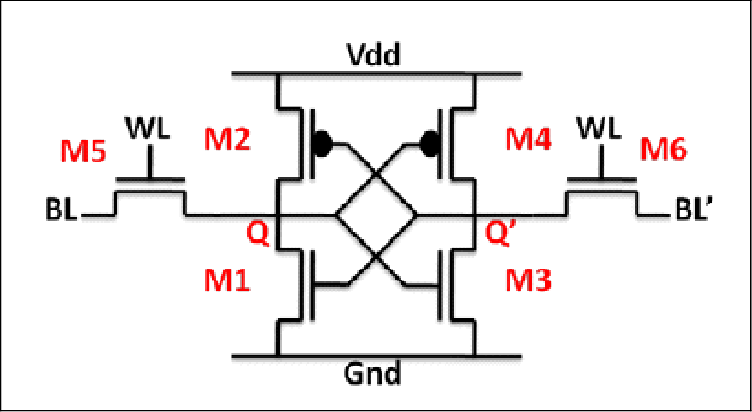
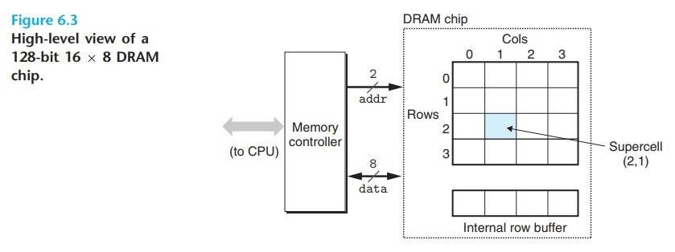
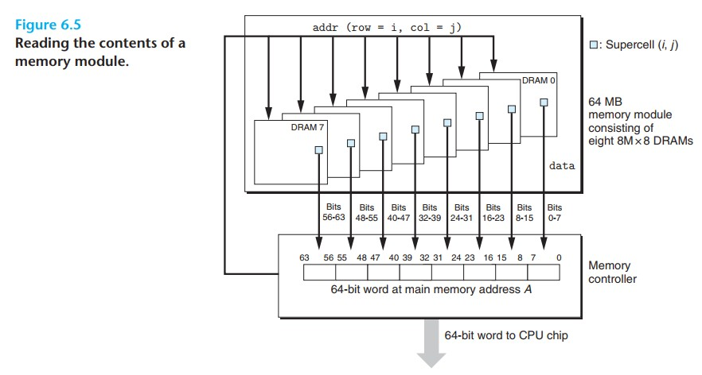

# Computer Systems 学习笔记（一）

今天学习第 6 章内存层次结构（The Memory Hierarchy）从 CPU 的视角看内存就是一块很长很长的数组，CPU 可以花费一定的时间访问任何位置，这是因为内存系统做了封装隐藏的具体的实现。实际上内存系统由多个层次组成，平衡了成本，容量和访问速度，靠近 CPU 的存储设备成本高，容量小，但是访问速度快，远离 CPU 的存储设备成本低，容量大，但是访问速度慢。
访问寄存器（register）只需要 0 个时钟周期（cycles）一个时钟周期是 CPU 主频的倒数，比如 4GHz 的电脑一个时钟周期是 0.25纳秒
访问缓存（cache）需要 4 - 75 个时钟周期
访问内存（main memory）需要上百个时钟周期
访问硬盘（disk）需要数千万时钟周期
访问网络硬盘已经是毫秒级别的时间了
计算机技术的成功很大程度上靠着存储技术的发展

Random Access Memory(RAM)

RAM 有两种 static RAM 和 dynamic RAM。SRAM 比 DRAM 访问速度快但是贵很多，一般用作 CPU 的缓存，DRAM 一般用作内存

SRAM 的每个位存储在 bistable memory cell 中，这个东西通过 six-transistor circuit 实现，这个东西大概是这样的电路图

DRAM 的每个位存储在电容里面，电容很小，所以可以做的很密集，自然容量就比较大。不同于 SRAM，DRAM 很容易受干扰，一旦被干扰了就再也无法恢复了

\    | 晶体管数量/bit | 访问时间 | 是否持久 | 抗干扰   | 
SRAM | 6             |  1x     | 持久     | 抗干扰   |
DRAM | 1             | 10x     | 不持久   | 不抗干扰 |

传统 DRAM 由 supercell 组成，每个 supercell 有 w 个 DRAM cells 表示为 d * w
supercell 是一个 r 行 c 列的矩阵，d = r * c 如下图所示

DRAM 芯片与一个叫 memory controller 的电路链接，数据通过 pins 传输 1pin = 1bit 图中包含了 8（因为 w = 8）个 data pins 和 2 （r = c = 4 = 2^2）个 addr pins 黑色箭头部分。pins 被要求设计的越少越好所以 supercell 以矩阵的形式组织，如果以一字长蛇阵摆开，那么就需要 4（16 = 2^4）个 pins 。但是通过矩阵组织也有个缺点，定位某个 supercell(i, j) 时需要 2 步，先发送 RAS(row access strobe)，再发送 CAS(column access strobe) 增加了访问时间

DRAM 芯片被打包在 memory modules 里，然后插在主板上，下图是 8M * 8 DRAM 芯片组，8 片每片提供 8 位，组成一个 64 位信息

加强型 DRAM 年代从远到近依次排序 FPM DRAM，EDO DRAM，SDRAM，DDR SDRAM，VRAM 其中 DDR 是最熟悉的，买内存的时候都会看到这个参数

Nonvolatile Memory

SRAM 和 DRAM 在断电后都会丢失信息，但是 Nonvolatile Memory 不会丢失。由于一些历史原因它被称为 ROM(read only memory) 实际上现在的 ROM 既可以读也可以写
ROM 最开始是只能读的，随着技术的发展，出现了 programmable ROM(PROM) 它允许被写一次，每个单元有个保险丝，被击穿一次就烧掉了。技术继续发展，出现了 erasable programmable ROM(EPROM) 它有一个石英窗口，用紫外线照一下可以恢复为 0 ，EPROM 大概可以擦写 1000 次。在之后发展出了 electrically erasable programmable ROM(EEPROM) 可以擦写 100,000 次。在往后出现了 Flash memory 基于它有发展出 solid state Disk(SSD)。从 PROM 开始就可以写了，只是 ROM 的名字被一直沿用了下来。

注：
1秒 = 10^3 毫秒 = 10^6 微秒 = 10^9 纳秒 = 10^12 皮秒
1/4GHz = 1 / (4 * 10^9)秒 = 0.25 纳秒

<a href="/">回首页</a>

 

04/20/2020
