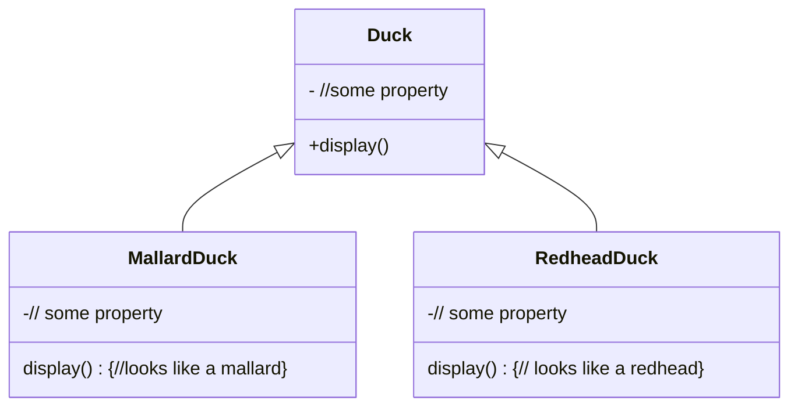
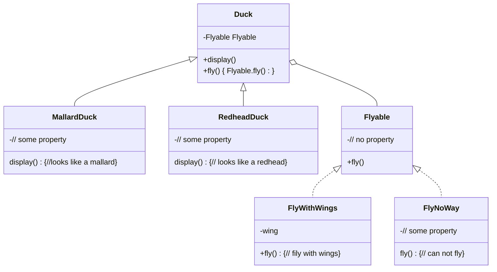
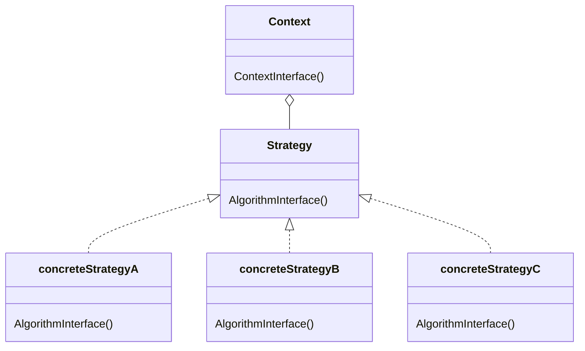
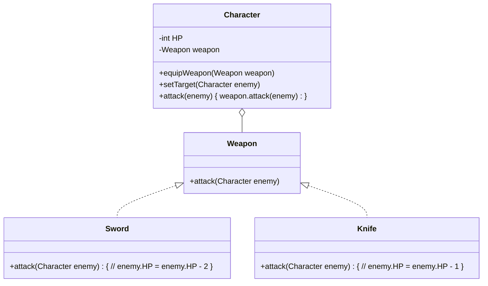

### Head First Design Patterns 学习笔记（一） 

今天学习策略模式（Strategy Pattern）。假设有一家公司，开发了一个模拟鸭溏模拟器，鸭溏里有各种各样的鸭子：野鸭、红头鸭、小黄鸭和诱饵鸭（打猎用的），原则上只要你能想到就能加上
他们原来的系统设计是这样的

然后产品经理的二期需求来了，产品经理希望鸭溏里的鸭子可以飞起来
基于原来的设计，我们很容易的想到在父类的接口上增加一个 **fly()** 方法，然后每个子类都实现对应的方法就好了。但是这种方式有个问题，那就是一部分鸭子飞行的方式其实是相同的，有些鸭子用翅膀飞，有些鸭子根本不会飞，反应到代码中就是实现方式相同的，每个子类都实现这个方法会导致重复代码。重复代码是一种坏味道（bad smell）

既然继承体系走不通，我们不妨试试组合。首先我们抽象飞这个行为，定义 Flyable 接口。然后通过持有一个 Flyable 的引用，把 Duck 的 fly() 方法委托给 Flyable

这种把相似（family）的算法封装到独立的类，使每个算法可以独立的变化，这种模式叫 Strategy Pattern 我们看一下官方定义

>**The Strategy Pattern** defines a family of algorithms,
encapsulates each one, and makes them interchangeable.
Strategy lets the algorithm vary independently from
clients that use it.

这是定义也是它的目的（Intent），在之后其他模式中，我们会看到结构类似但是属于的不同模式，了解一个模式的目的是区分它们的重要手段

Strategy Pattern 包含 3 部分 Strategy, ConcreteStrategy, Context。这里引用 GoF 的描述。GoF 是 Gang Of Four 的缩写，设计模式的四个巨佬，分别是：Erich Gamma, Richard Helm, Ralph Johnson, and John Vlissides

> * Strategy (Compositor)
>   * declares an interface common to all supported algorithms. Context uses this interface to call the algorithm defined by a ConcreteStrategy.
> * ConcreteStrategy (SimpleCompositor, TeXCompositor,ArrayCompositor) 
>   * implements the algorithm using the Strategy interface.
> * Context (Composition)
>   * is configured with a ConcreteStrategy object.
>   * maintains a reference to a Strategy object.
>   * may define an interface that lets Strategy access its data.

Strategy 负责定义接口，这个接口要适用于所有的 ConcreteStrategy，Context 只依赖 Strategy 不依赖特定的 ConcreStrategy 

ConcreteStrategy 是 Strategy 其中一个具体实现，实现特定的算法（业务逻辑），所有类似的算法在不同的 ConcreteStrategy 类中独立变化，不影响其他类，若要新增算法只需新建一个 ConcreteStrategy 类即可 

Context 使用 Strategy 接口，因为有多态这个特性，就可以某个特定的算法。Context 有时候会把自己作为参数传给 Strategy 所以可能需要定义一些方法，让 Strategy 可以访问自己的数据 

Strategy Pattern 遵循了三条设计原则（Design Principle）
> * identify the aspects of your application that vary and separate them from what stays the same.
> * Program to an interface, not an implementation.
> * Favor composition over inheritance.

第一条需要识别应用中容易变化的部分，并建议将它隔离合适的类中，这一条非常吃领域知识，这个是行业从业经验发挥作用的地方

第二条建议面向接口（应该不是 java 的 Interface 而是指一个事物的抽象）编程，不要面向实现编程，这一条指导我们减少对特定类的依赖，转而依赖它的抽象，增加灵活性

第三条建议多使用组合（一个对象持有另一个对象的引用）而非继承。继承相当于持有父类对象的引用（super），组合和继承各有各的优缺点，在使用过程中需要权衡，建议更加偏爱组合一点

这里再举个例子，适合用 Strategy Pattern 来解决。我们知道 RPG 游戏里有许多武器，通过冒险可以获得各式各样的武器，不同的武器可以对敌人造成不同的伤害，那么我们可以这么来设计系统

角色通过 equipWeapon() 方法装备武器，在攻击 attack() 时委托（delegate）给武器类，这样每种武器可以实现自己的攻击方式

Strategy Pattern 在工作中很常用，像区分版本的功能，基于开关的功能，AB 测试，还有一些来来回回反复的需求。我之前做的一个项目需要抓取不同平台的订单信息，通过定义 fetchOrder 接口，不同的平台可以有自己的抓取逻辑，在变更时不会影响其他平台的逻辑，而且如果要新增一个平台只需要新增实现类，对原来的逻辑也没有响应，这样可以有效的减少无意识引入的 bug 

<a href="/">回首页</a>

 

04/14/2020
