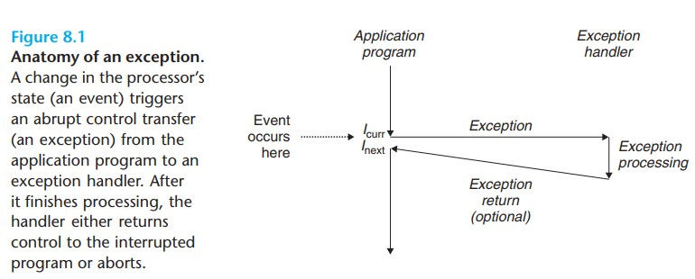
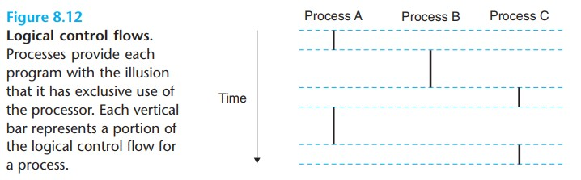
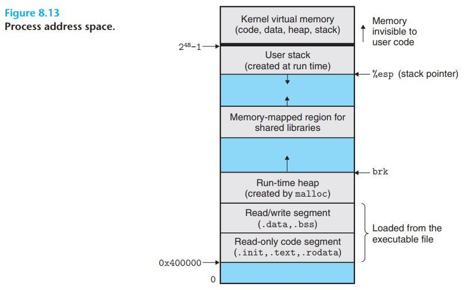
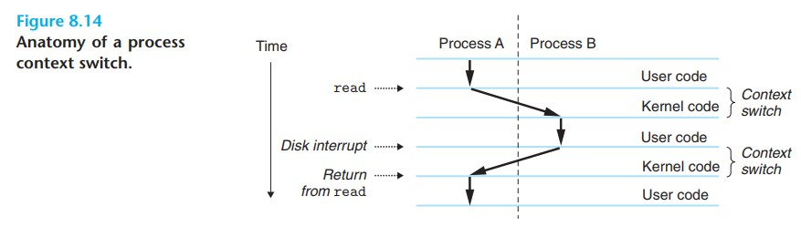
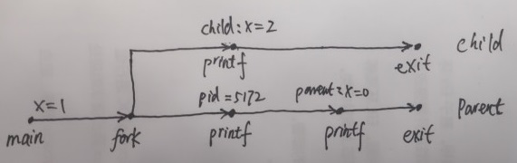
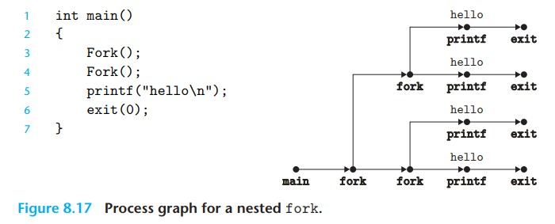
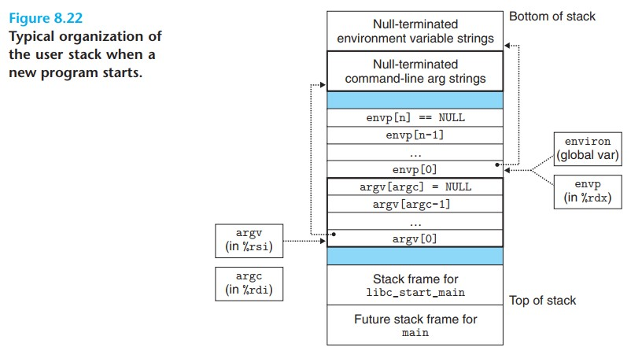

# Exceptional Control Flow 学习笔记

今天学习《Computer Systems》第八章 Exceptional Control Flow。

假设有一组数据 a<sub>0</sub>, a<sub>1</sub>,..., a<sub>n-1</sub> 其中 a<sub>k</sub> 表示指令 I<sub>k</sub> 的地址，那么我们把 a<sub>k</sub> 到 a<sub>k + 1</sub> 的过程叫做 *control transfer* 一系列的 control transfer 连起来叫做 *control flow*

通常情况下处理器按照 I<sub>k</sub>, I<sub>k+1</sub> 顺序执行指令，在遇到 jump, call, return 指令时跳转到对应的地址继续执行，这些都是响应程序内部状态变化的机制。

特殊情况下，当系统遇到类似网络包到达系统请求保存到内存，或者程序要求从硬盘读取的数据读到了，再或者父进程创建的子进程终止了，这时候处理器就不能按照顺序执行指令了，会跳转到特定的程序处理，这个过程我们叫做 *exceptional control flow(ECF)*

## Exceptions

Exception 是 ECF 的一种形式，部分由硬件实现，部分是操作系统实现。下面这张图展示了它的基本思想



I<sub>curr</sub> 处发生 exception 处理器通过 *exception table* 跳转到对应的处理程序 *exception handler* 处理程序执行完成后会有 3 种结果 

+ 处理程序把控制权还给 I<sub>curr</sub>
+ 处理程序把控制前还给 I<sub>next</sub>
+ 处理程序不还控制权，直接中断程序

Exception 有 4 种类型：*interrupt*, *trap*, *fault*, *abort* 

|类别|原因|Async/sync|返回行为|
|--|--|--|--|
|Interrupt| I/O 设备的信号|Async|返回 I<sub>next</sub>|
|Trap|故意的 exception|Sync|返回 I<sub>next</sub>|
|Fault|可能可以恢复的 exception|Sync|返回 I<sub>curr</sub>|
|Abort|不可恢复的错误|Sync|不返回|

Interrupt 会在 I<sub>curr</sub> 执行完成后执行 handler 程序，所以它返回的是 I<sub>next</sub>，Trap 是故意发生的 exception 它是指令执行的结果，所以它也是返回到 I<sub>next</sub>，Fault 是发生故障后尝试恢复，恢复成功返回 I<sub>curr</sub> 进行重试，恢复不了丢给 Abort 中断程序。

Trap 最大的作用是提供了 *system call* 一种允许用户程序调用内核服务的方式，syscall *n* 就是调用 n 号服务，Linux 提供了大量的服务，下表是其中一些服务

|编号|服务名|描述|
|--|--|--|
|0|read|读取文件|
|1|write|写文件|
|2|open|打开文件|
|3|close|关闭文件|
|4|stat|获得文件状态信息|
|9|mmap|映射内存页到文件|
|12|brk|Reset the top of heap|
|32|dup2|拷贝文件描述符|
|33|pause|挂起进程等待信号|
|37|alarm|Schedule delivery of alarm signal|
|39|getpid|获得进程 id|
|57|fork|创建进程|
|59|execve|执行程序|
|60|_exit|终止程序|
|61|wait4|等待进程终止|
|62|kill|给进程发信号|

C 程序可以直接调用 syscall 不过通常不这么用，因为有标准库封装并且提供了更好用的版本。如果需要直接调用，那么根据约定，服务编号 n 放在 %rax 6 个参数分别放在 %rdi %rsi %rdx %r10 %r8 %r9 销毁 %rcx 和 %r11 返回数据放在 %rax -4095 ~ -1 表示错误码

比如我们熟悉的打印 hello world 代码可以有几个版本

普通版本 [hello1.c](https://github.com/sbwkl/todo-example/blob/master/computer-systems/exceptional-control-flow/hello1.c)

调用包装方法版本 [hello2.c](https://github.com/sbwkl/todo-example/blob/master/computer-systems/exceptional-control-flow/hello2.c)

汇编版本 [hello-asm64.sa](https://github.com/sbwkl/todo-example/blob/master/computer-systems/exceptional-control-flow/hello-asm64.sa)

3 个版本都可用 gcc 编译
```
# 编译普通版本
gcc -o hello1 hello1.c

# 编译调用包装方法版本
gcc -o hello2 hello2.c

# 编译汇编版本

gcc -x assembler -o hello-asm64 hello-asm64.sa
```

## processes

processes(进程)是正在运行的程序实例，它是一个非常重要的抽象。它给程序创造了 2 个假象 1 程序独占 CPU 2 程序独占内存



进程创造独占 CPU 的假象通过 logical control flow 实现，图中黑色加粗的竖线 physical control flow 被分成了 3 条 logical control flow 分别代表 ProcessA ProcessB 和 ProcessC 如果 logical control flow 有重叠部分，那么我们称为 *concurrent flow* 比如图中的 AB 和 AC，BC 没有重叠所以不算。如果 2 个 flow 并发运行在不同的处理器核或者不同的电脑，这种称为 *parallel flow*。parallel fllow 是 concurrent flow 的子集

进程创造独占内存的假象通过 private address space 实现，每个进程都有自己独立的 private address space 它的结构如下图所示

程序的代码段从 0x400000 开始，之前的地址空间保留。顶端的地址空间内核使用，堆向上生长，栈向下生长

处理器提供 2 种模式 *user mode* 和 *kernel mode* 也叫 *supervisor mode* 通常用 *mode bit* 来控制，如果 mode bit 被设置，那么就是 kernel mode 反之就是 user mode 。kernel mode 下可以访问任何指令和内存的任何位置，user mode 下不能访问 *privileged instructions* 比如停止处理器，改变 mode bit，初始化 I/O 操作等，也不能直接访问内核的代码和数据，只能间接通过 syscall 访问

进程最初是 user mode 切换到 kernel mode 的唯一方式是通过 exception，当 exception 发生，控制权转交到 exception handler，处理器切换到 kernel mode，handler 执行完成后将控制权还给进程或终止

Linux 通过 /proc 文件系统暴露内核数据，比如通过 /proc/cupinfo /proc/loadavg /proc/uptime 可以查看 cpu 信息，平均负载和在线时间。/proc/*process id*/ 下可以查看进程对应的信息。2.6 版本引入了 /sys 文件系统暴露更加底层的信息

内核通过 *Context Switch* 实现多任务，它是 ECF 的一种高级形式。内核维护重启进程必要的 *context* 信息，包括一些寄存器的值，PC 值，用户栈信息，内核栈信息等。Context Switch 会做 3 件事

+ 保存当前进程的 context
+ 恢复某个被挂起的进程的 context
+ 控制权交给这个进程

Context Switch 发生的实际

+ syscall 执行过程中被阻塞时，比如 read 读取磁盘的数据，由于读数据是在太慢了（对 cpu 来说）处理器会切换去执行其他进程
+ 某些 syscall 显式要求切换，比如 sleep 要求挂起当前进程
+ 收到 interrupt 比如定时器每隔一段时间产生一个 interrupt，内核觉得当前进程运行足够就了，然后切换到其他进程，保证雨露均沾



图中进程 A 发起了 read 请求，在读取数据时被阻塞，内核 context switch 切换到进程 B 执行，当数据读取到内存发送 interrupt 内核执行 context switch 切换回进程 A 继续执行

## Process Conrol

从程序员的视角我们认为进程有 3 个状态

+ Running : 进程正在 CPU 上执行或者等待被内核调度执行
+ Stoped : 进程收到信号 SIGSTOP, SIGTSTP, SIGTTIN, SIGTTOU 中的任何一个后被挂起且不会被调度，收到信号 SIGCONT 后继续执行
+ Terminated : 永久停止的进程，3 种情况会变成这个状态
  + 收到默认行为是终止进程的信号
  + 从主程序返回
  + 调用 ```exit``` 方法

举个例子，准备一个每隔 1s 打印一次的 [shell 脚本](https://github.com/sbwkl/todo-example/blob/master/computer-systems/exceptional-control-flow/timer.sh)

在终端 1 启动脚本
```
# 后台启动脚本
nohup sh timer.sh &

# 查询 pid 假设是 31852
ps aux | grep timer

# 向 pid 发送 SIGSTOP 信号，查看终端 2 发现日志停止打印
kill -19 31852

# 向 pid 发送 SIGCONT 信号，查看终端 2 发现日志继续打印
kill -18 31852

# 向 pid 发送 SIGKILL 信号，查看终端 2 发现日志又停止打印了

# 向 pid 发送 SIGCONT 信号，此时报错了，没有该进程
```

在终端 2 查看信息
```
# 打印输出日志，可以看到每隔 1 秒有输出
tail -f target/timer.log

Fri May 22 01:32:18 UTC 2020
Fri May 22 01:32:19 UTC 2020
Fri May 22 01:32:20 UTC 2020

```

C 语言提供了大量方法操作进程，本质是调用内核提供的 syscall

```
#include <unistd.h>
#include <sys/types.h>
#include <stdlib.h>

# 获得进程 pid 是一个非 0 的正整数
pid_t getpid(void);

# 获得进程父 pid
pid_t getppid(void);

# 终止进程并返回状态码
void exit(int status);

# 创建进程，当前进程和被创建的进程属于父子关系
pid_t fork()

# 加载和执行 filename 程序
int execve(const char *filename, const char *argv[], const char *envp[]);

# 找到环境变量 name 对应的值，如果没有返回 NULL
char *getenv(const char*name);

# 如果环境变量不存在，添加环境变量，如果存在 && overwrite 不是 0 覆盖旧的环境变量
int setenv(const char *name, const char *newvalue, int overwrite);

# 删除环境变量 name
void unsetenv(const char *name);

# 等待进程返回，这个方法用起来复杂点
pid_t waitpid(pid_t pid, int *statusp, int option);
# 简单版本 waitpid 相当于 waitpid(-1, int *statusp, 0)
pid_t waitpid(int *statusp);

# 挂起当前进程一定时间
unsigned int sleep(unsigned int secs);

# 挂起当前进程，等待信号到达，信号一直不来就一直挂着
int pause(void);
```

### Creating and Terminating Processes

fork 方法用于父进程创建子进程，它比较有特点调用 1 次，返回 2 次，一次返回子进程 pid 一次返回 0。创建的进程和父进程并发执行，子进程是父进程在创建那一刻的拷贝。这里有个[例子程序](https://github.com/sbwkl/todo-example/blob/master/computer-systems/exceptional-control-flow/fork.c)

```
# 先编译个动态库
gcc -shared -fpic -o target/libcsapp.so csapp.c
# 编译 fork.c
gcc -o target/fork fork.c target/libcsapp.so -pthread

# 执行 fork 查看输出
target/fork

pid = 5172
parent: x = 0
clild : x=2
```

父进程打印了子进程的 pid 子进程有相同的变量 x 但是 x 的地址是不同的，所以父进程打印出 0 子进程打印出 2 另外 2 个进程是并发执行的所以原则上任何打印顺序都是合理的

*process graph* 可以帮助理解 fork 方法，这种图顶点代表执行的程序语句，有向边代表执行顺序，比如上面的例子可以这么描述



如果是多层嵌套的 fork 那么进程数会指数级增加



### Reaping Child Processes

父进程创建子进程，子进程被终止，父进程需要回收子进程，否则子进程会变为僵尸进程(*zombie*)，如果父进程先一步被终止了，内核会安排 *init* 进程称为这些孤儿进程的养父进程。如果父进程还没回收子进程就终止了，内核也会安排 *init* 来回收这些僵尸进程。init 的 pid = 1 且只要系统还启动着就不会被终止。

进程通过 waitpid 方法来回收，默认情况下（options = 0）暂停执行等待子进程 terminated，子进程在一个叫做 *wait set* 的集合中，如果 wait set 中有已经被终止的子进程，那么 waitpid 会马上返回。wait set 通过参数 pid 确定

+ 如果 pid > 0 wait set 只有这条 pid 记录，也就是只有这个 pid 终止的时候会返回
+ 如果 pid = -1 wait set 由所有子进程组成，任何子进程终止都会返回

修改 options 参数可以修改默认行为，

+ WNOHANG : 不等待子进程，直接返回 0 如果在子进程执行中要做其他工作，这种行为很合适
+ WUNTRACED : 暂停执行等待子进程 terminated 或者 stoped 然后返回，比默认行为多 stoped 情况
+ WCONTINUED : 暂停执行等待子进程发生下面 2 个行为中的一个
  + 子进程 terminated
  + 处于 stoped 状态的进程收到 SIGINT 信号重新运行

可以通过 or 组合，比如 WNOHANG | WUNTRACED

通过 statusp 检查子进程的退出状态，为 NULL 时不能检查

+ WIFEXITED(status) : true = 进程正常退出
  + WEXITSTATUS(status) : 当 WIFEXITED() == true 返回 exit status 
+ WIFSIGNALED(status) : ture = 子进程因未捕获的信号而终止
  + WTERMSIG(status) : 当 WIFSIGNALED() == true 返回信号编号
+ WIFSTOPPED(status) : true = 子进程处于 stoped 
  + WSTOPSIG(status) : 当 WIFSTOPPED() == true 返回导致子进程 stope 的信号编号
+ WIFCONTINUED(status) : true = 子进程收到 SIGINT 重新运行

如果调用 waitpid 时没有子进程，返回 -1 并且设置 errno = ECHILD 如果调用 waitpid 被信号中断，返回 -1 并设置 errno = EINTR

准备一个[例子](https://github.com/sbwkl/todo-example/blob/master/computer-systems/exceptional-control-flow/waitpid1.c)

```
# 编译 waitpid1.c
gcc -o target/waitpid1 waitpid1.c target/libcsapp.so -pthread

# 执行 waitpid1 查看输出，输出顺序可能会调换
target/waitpid1

child 1336 terminated normally with exit status = 101
child 1335 terminated normally with exit status = 100
```

### Loading and Running Programs

execve 方法用于加载和执行可执行文件，它也比较有特点，正常情况下调用 1 次，从不返回。只有当调用发生异常时才会返回，比如找到执行文件。参数 argv 和 envp 是以 NULL 做结尾的数组，通常以下图的方式组织



main 方法其实有 3 个参数

+ argc : argv 数组的个数
+ argv : 参数数组，数组第一个元素是启动命令本身
+ envp : 环境变量数组

### Using fork and execve to Run Programs

使用 fork 和 execve 方法可以自己实现一个 [shell 程序](https://github.com/sbwkl/todo-example/blob/master/computer-systems/exceptional-control-flow/shellex.c)。*sehll* 是一个交互式的应用程序，替用户执行其他程序，本身就是一个壳子。原始的 shell 是 *sh* 程序，后面发展出了很多变种，诸如 *csh*, *tcsh*, *ksh*, *bash* 等等。

shell 主要有 2 个工作 
+ read : 读取用户输入的命令行
+ evaluate : 解析命令行并且创建进程执行

```
# 编译我们的 shell 程序
gcc -o target/shellex shellex.c target/libcsapp.so -pthread

# 执行 target/shellex 出现交互界面，输入 /usr/bin/ls / 列出根目录下的文件
target/shellex 
> /usr/bin/ls /
anaconda-post.log  bin	dev  etc  home	lib  lib64  media  mnt	opt  proc  root  run  sbin  srv  sys  tmp  usr	var
> 

```
Fgets 读取用户输入的命令行，交给 eval 方法执行，eval 方法通过 parseline 解析生成 argv 如果以 & 结尾则认为是后台运行的程序，builtin_command 方法判断是否是可执行的命令，如果可执行则 fork 子进程把命令行交给子进程执行，前台任务父进程等待子进程终止并回收。

## Signals

在展示进程状态的例子中我们就用到了 signal 我们可以通过 kill 命令向特定的进程发送信号，具体的信号信息可以通过命令 ```man 7 signal``` 查询

signal 是一个小的消息体来通知进程系统中有某种类型的事件发生，包括 2 个步骤

+ Sending a signal : 内核通过修改进程上下文某些状态给进程发消息，一般有 2 个理由
  + 内核侦测到系统事件
  + 有进程执行 kill 命令，进程可以给自己发 signal
+ Receiving a signal : 进程以某种方式处理信号，可以是忽略，终止进程或者执行自定义 signal hanlder 方法

发送但尚未被接受的信号叫 *pending signal* 同一时间同类型最多有 1 条 pending signal 多的直接被丢弃，进程可以有选择的阻塞某种信号，信号被阻塞后可以正常发送，但是不会被接收，直到解除阻塞，信号只会被接受一次

内核为每个进程维护 pending bit vector 代表 pending signal，blocked bit vector 代表 blocked signal。比如当信号 k 发送时设置 pending bit vector 第 k 位，而当信号 k 被接受时，清除第 k 位

### Sending Signals

每个进程属于一个进程组，默认情况下子进程属于父进程所在的进程组，可以通过方法获得和改变进程组 id

```
#include <unistd.h>

# 获得进程组 id
pid_t getpgrp(void);

# 改变进程组 id，pid = 0 取当前进程 pid，pgid = 0 当前进程号当作进程组 id
int setpgrp(pid_t pid, pid_t pgid);
```

Linux 有多种方式可以发送信号
+ 通过 kill 命令可以给进程或者进程组内的所有进程发信号
  ```
  # 给进程 15213 发信号 9
  kill -9 15213
  # 给进程组 15213 内所有进程发信号 9
  kill -9 -15213
  ```
+ 通过键盘发信号 ctrl + c 给前台进程所在的组发信号 SIGINT，ctrl + z 给前台进程所在组发信号 SIGTSTP
+ 通过 kill 方法
  ```
  #include <sys/types.h>
  #include <signal.h>

  int kill(pit_t pid, int sig);
  ```
+ 通过 alarm 方法
  ```
  #include <unistd.h>
  # 让内存 secs 秒后给自己发一个 SIGALARM 信号，再次调用会取消上次的信号并返回还剩几秒
  unsigned int alarm(unsigned int secs);
  ```

### Receiving Signals

当进程从 kernel mode 切换回 user mode 会校验有没有未阻塞的等待信号(pending & ~blocked)如果存在内核会选取某个信号要求进程接收处理，完成后把控制权交还给进程，信号有 4 种默认行为

+ The process terminated
+ The process terminated and dumps core
+ The process stops (suppends) until restarted by a SIGCONT signal
+ The process ignores the signal

可以通过 signal 方法改变默认行为，注意 SIGSTOP 和 SIGKILL 这两个信号改变不了默认行为

```
# include <signal.h>
typedef void (*sighandler_t)(int);

# 改变信号处理行为，如果成功返回上个信号处理程序地址，否则返回 SIG_ERR
sighandler_t signal(int signum, sighandler_t handler);
```
+ handler = SIG_IGN 忽略信号
+ handler = SIG_DFL 恢复为默认行为
+ handler = signal handler 地址，改变为 handler 对应方法的行为，这个过程叫做 *installing the handler* 调用 handler 叫做 *catching the signal* 执行 handler 叫做 *handling the signal*

### Blocking and Unblocking Signals

Linux 提供了显式和隐式 2 种方式阻塞信号

+ Implicit blocking mechanism : 内核会阻塞正在执行中的信号
+ Explicit blocking mechanism : 使用 sigprocmask 阻塞和解除阻塞

```
#include <signal.h>

/* 阻塞和解除阻塞信号 */
int sigprocmask(int how, const sigset_t *set, const sigset_t *oldset);
/* 初始化 set 为空集合*/
int sigemptyset(sigset_t *set);
/* 全部信号加入 set */
int sigfillset(sigset_t *set);
/* signum 添加到 set*/
int sigaddset(sigset_t *set, int signum);
/* 从 set 中移除 signum */
int sigdelset(sigset_t *set, int signum);
/* signum 在 set 中返回 1 否则 0*/
int sigismember(const sigset *set, int signum);
```

sigprocmask 方法的行为和 how 有关，它有 3 个值

+ SIG_BLOCK :  把 set 中的信号追加到 blocked 中 (blocked = blocked | set)
+ SIG_UNBLOCK : 从 blocked 中删除 set 的信号 (blocked = blocked & ~set)
+ SIG_SETMASK : blocked = set

oldset 如果不是 NULL 原先的 blocked 会被保存在 oldset

临时阻塞信号的代码可以这样写

```
Sigset_t mask, prev;
Sigemptyset(&mask);
Sigaddset(&mask, SIGINT);

Sigprocmask(SIG_BLOCK, &mask, &prev);

/* do something*/

Sigprocmask(SIG_SETMASK, &prev, NULL);
```

### Writing Signal Handlers

信号处理是 Linux 系统编程中比较棘手的问题，它的难度主要来源于 3 点

+ handler 和 main 并发运行，且共享全局变量，程序之间会互相干扰
+ 信号到达的时机和方式通常反直觉
+ 不同的系统有不同的信号处理语义

为了写出安全、正确、可移植的信号处理程序一些规则可以参考

#### Safe Signal Handling

+ *Keep handlers as simple as possible* : 简单才方便规避问题。比如处理程序只是设置全局变量并且马上返回，剩下的事情交给 main 程序来处理
+ *Call only async-signal-safe functions in your handler* : 这类方法有特点要么是 *reentrant* 要么不能被信号处理程序中断，通过 man 7 signal 查看所有 async-signal-safe functions
+ *Save and restore errno* : 一些 async-signal-safe 方法会设置 errno 需要在完成 handler 前把 errno 设置回来
+ *Protect accesses to shared global data structures by blocking all signals* : 这是因为访问数据结构通常需要一系列指令，如果执行过程中被中断最后访问到的数据很有可能不是预期想要的数据
+ *Declare global variables with volatile* : 使用 volatile  关键字保证每次都从内存读取数据，避免变量会缓存在寄存器或者 L1, L2, L3
+ *Declare flags with sig_atomic_t* : 这个关键字可以保证读和写的原子性，本质是通过一条指令完成操作，所以不会被中断

#### Corrent Signal Handling

信号处理其中一处反直觉的地方在于信号不是排队处理的，只有一个 pending signal 后续的信号全部被丢弃，也就是说系统可能发了 3 个信号，实际只能收到 1 个。这里举一个例子

bug  版本 [signal1](https://github.com/sbwkl/todo-example/blob/master/computer-systems/exceptional-control-flow/signal1.c)

正确的版本 [signal2](https://github.com/sbwkl/todo-example/blob/master/computer-systems/exceptional-control-flow/signal2.c)

bug 版本中假设了信号是排队到来的，每个信号到来时会回收 1 个子进程，然而实际上因为处理速度的原因可能会有信号丢失，这就导致有子进程一直不能被回收而成为了僵尸进程

正确版本中修复了这个问题每次收到信号直接回收所有已终止的子进程

#### Portable Signal Handling

Unix 信号处理程序另一个不优雅的地方是不同的系统有不同的信号处理语义，比如

+ The semantics of the signal function varies : 有些 Unix 系统会在处理信号后恢复成默认行为，这时候就需要每次 reinstall
+ System calls can be interrupted : 有些 syscall 如 read, write, accept 可能会阻塞进程较长时间，称为 *slow system calls* 有些 Unix 系统在 syscall 在信号处理程序返回时不会继续执行，而是直接返回错误，这时候需要手动重新运行 syscall

为了解决上面 2 个问题 Posix standard 定义了 sigaction 方法

```
#include <signal.h>

int sigaction(int signum, struct sigaction *act, struct sigaction *oldact)
```
sigaction 没有广泛使用，原因是它需要用户设置复杂结构的条目，W.Richard Stevens 包装这个方法，提供更加方便使用的版本

```
handler_t *Signal(int signum, handler_t *handler) {
  struct sigaction action, old_action;

  action.sa_handler = handler;
  sigemptyset(&action.sa_mask);
  action.sa_flags = SA_RESTART;

  if (sigaction(signum, &action, &old_action) < 0) {
    unix_error("Signal error");
  }
  return (old_action.sa_handler);
}
```
用法与 signal 一样，信号处理的语义更加丰富

+ 只有当前被执行的信号才会阻塞
+ 信号不会排队，多余的信号被丢弃
+ 被中断的 syscall 会重新运行
+ handler 被 install 后会一直保持

sigsuspend 方法可以挂起进程并且将 blocked set 临时替换为 mask 

```
#include <signal.h>

int sigsuspend(const sigset_t *mask)
```

## Nonlocal Jumps

C 语言提供了一种用户级别的异常控制流，叫做 nonlocal jump 它可以把控制权直接从一个函数转移到另一个正在执行的函数，通过 setjmp 和 longjmp 2 个函数实现

```
#include <setjmp.h>

/* 返回 0 调用 longjmp 时返回非 0 */
int setjmp(jmp_buf buf);
int sigsetjmp(sigjmp_buf buf, int savesigs);

/* retval 是调用 longjmp 时 setjmp 返回的值 */
void longjmp(jmp_buf buf, int retval);
void siglongjmp(sigjmp_buf buf, int retval);
```

setjmp 相当于在函数里打了标记，在调用 longjmp 时会回到 setjmp 处，这个特性子在处理错误和异常时很好用，可以无视冗长的调用链，直接跳转到标记地点继续执行。这是一个例子 [setjmp](https://github.com/sbwkl/todo-example/blob/master/computer-systems/exceptional-control-flow/setjmp.c)


<p style="text-align: center"><a href="/">回首页</a></p>
 
<p align="right">05/30/2020</p>