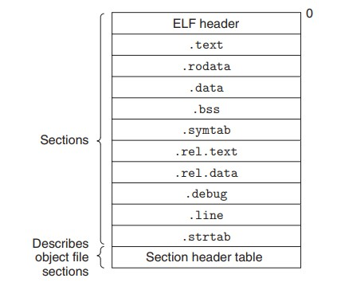
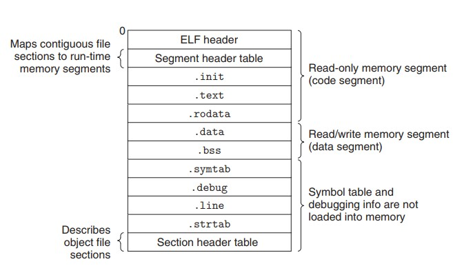

# Computer Systems 学习笔记

今天学习《Computer Systems》第七章 Linking。Linking 的作用是把不同的代码和数据合并到一个文件中，这个文件可以被加载内存中执行。

Linking 可以发生在 3 个时间点

+ compile time : 从源代码编译成机器码
+ load time : 程序被 loader 加载到内存
+ run time : 应用程序运行

Linking 操作的对象是 Object Files 它可以分成 3 类

+ Relocation object file 通过编译器和汇编器产生，可以和其他 relocation object file 一起在 compile time 创建 Executable object file 包含代码和数据
+ Executable object file 通过 Linker 产生，可以被直接加载到内存中执行
+ Shared object file 一种特殊的 relocation object file 允许在 load time 和 run time 加载到内存和动态链接

Linking 对于软件开发非常重要，它的存在允许程序分开编译。这样就可以分模块管理不同的程序，提升了灵活性。因为分模块开发，每次只需要编译修改过的模块，节省编译时间


先来看一个例子

准备 Linux 环境

准备代码 main.c & sum.c

main.c
```
int sum(int *a, int n);

int array[2] = {1, 2};

int main() {
    int val = sum(array, 2);
    return val;
}
```

sum.c
```
int sum(int *a, int n) {
    int i, s = 0;
    for (i = 0; i < n; i++) {
          s += a[i];
    }
}
```

执行命令 

```
# -Og 指定优化等级
# -o 指定生成文件地址，有文件夹需提前创建，不指定默认生成文件 a.out 
gcc -Og -o prog main.c sum.c

# 虽然不会有输出，但是程序是执行了的
./prog
```

Linking 的过程通过一个叫 Linker 的程序完成，它主要完成 2 个任务

1. Symbol resolution 把 symbol 引用和 symbol 定义一一关联起来，symbol 可以是方法，全局变量或者静态变量
2. Relocation 编译器和汇编器生成的代码和数据段从地址 0 开始，Linker 通过 relocation entries 给代码和数据段分配正确的内存地址

## Relocation object file

Relocation object file 是由编译器和汇编器生成的，不同的平台会使用不同的格式，基础概念相通，Linux 使用 ELF(Executable and Linkable Format) 格式见图，可以通过 readelf 查看详细内容



```
# -c 编译 & 汇编，但是不 link 此时会生成 .o 文件，也就是 relocation object file
gcc -c main.c

# 查看 main.o 内容
readelf -a main.o
```

[sum.o 的内容](###main.o)，不同的系统可能略有不同


每个 relocation object file 都有一个 symbol table(.symtab section) 包含 3 种不同类型的 symbol

+ Golbal symbols : 定义的非静态 C 方法和全局变量
+ Externals : 对 Golbal symbols 的引用
+ Local synbols : 静态 C 方法和静态全局变量，不能被其他模块引用

注意：Linker 不关心非静态局部变量（local nonstatic program variables），它们在运行时维护在栈里面，所以它们不会出现在 .symtab 中。比如 main.c 中的变量 val 就没有出现在 .symtab 但是如果用 static 修饰 val 那么它又会出现在 .symtab 中

## Symbol Resolution

这是 Linker 第一个主要任务，负责把每一个 symbol 引用找到对应的定义（有且仅有一个），如果遇到重名的情况 Linker 会根据 3 条规则选择

1. 多个 strong symbols 那么就报错
2. 一个 strong symbol 和多个 weak symbol 选择 strong symbol
3. 多个 weak symbol 随便选

汇编器决定 symbol 是 strong/weak 的依据是

+ Strong symbol : 方法和初始化的全局变量
+ Weak symbol : 未初始化的全局变量

### Linking with Static Libraries

Static Libraries 后面统一叫静态库，是一组打包的 relocation object file 命令规范通常是 lib*library*.a 可以通过命令内容
```
# 查看包含的 relocation object file
ar -t <静态库路径>

# 查看包含的 relocation object file & 每个文件内容
nm <静态库路径>
```
Static Libraries 的优点

+ 通用的方法拿来就用，不用重复造轮子
+ 编译时按需构建文件，只拷贝需要的 symbol 到 executable object file 减少程序执行时的内存开销
+ 需要修改 static libraries 只需要修改某个文件，在编译打包即可

下面是一个创建 static libraries 的例子

addvec.c
```
int addcnt = 0;

void addvec(int *x, int *y, int *z, int n) {
  int i;

  addcnt++;

  for(i = 0; i < n; i++) {
    z[i] = x[i] + y[i];
  }
}
```

multvec.c
```
int multcnt = 0;

void multvec(int *x, int *y, int *z, int n) {
  int i;
  multcnt++;
  for (i = 0; i < n; i++) {
    z[i] = x[i] * y[i];
  }
}
```
vector.h
```
void addvec(int *x, int *y, int *z, int n);
void multvec(int *x, int *y, int *z, int n);
```

main.c
```
#include <stdio.h>
#include "vector.h"

int x[2] = {1, 2};
int y[2] = {3, 4};
int z[2];

int main() {
  addvec(x, y, z, 2);
  printf("z = [%d %d] \n", z[0], z[1]);
  return 0;
}
```

```
# 编译 addvec.c 和 multvec.c 生成 .o 文件
gcc -c addvec.c multvec.c

# 打包成静态库
ar rcs libvector.a addvec.o multvec.o

# 编译 main.c
gcc -c main.c

# 链接并生成 executable object file
gcc -static -o prog main.o ./libvector.a

# 执行文件，输出 z = [4 6]
./prog
z = [4 6]
```

通过 nm 查看 prog 的内容可以发现只有 addvec 被拷贝，multvec 则没有，这样可以减少加载到内存的开销

```
# 查询 addvec 对应的值是 000000000040101f 这个一般是一个偏移量，用来确定在内存中的地址
nm prog | grep addvec
000000000040101f T addvec

# 查询 multevc 没有输出
nm prog | grep multvec
```

### How Linkers Use Static Libraries to Resolve References

Linker 维护 3 个集合 E U D 分别代表

+ E : relocation object file 集合，最终并成 executable object file
+ U : 未解析的 symbol 集合
+ D : 已经解析到的 symbol 定义

遍历命令行传入的文件列表，对每个文件 f 做以下处理

+ f 是 object file 把 f 加到 E 更新 U & D
+ f 是静态库， U 中 symbol 和 f 中 symbol 对比匹配，如果匹配把对应的文件 m 加到 E 更新 U & D 
+ 所有文件处理完后有 2 种结果
  +  U 不为空，报错
  +  U 为空，执行下一个任务把 E 中所有文件合起来生成 executable object file

注意：解析过程文件是按照命令行指定的顺序从左到右执行，不当的顺序可能会导致链接错误，如果模块间存在互相依赖需要特别注意顺序

## Relocation （这段理解不深，可能会有错误）

这是 Linker 第二个主要任务，经过 Symbol Resolution 之后，Linker 已经知道了所有需要的 symbol 以及对应的大小，那么也就可以开始计算每个 symbol 的内存地址了，分两步

1. Relocating sections and symbol definitions. E 中的所有文件合并成一个，相同的 section 合并在一起并且分配内存地址
2. Relocating symbol references within sections. 通过 relocation entry 修改，使程序指向正确的内存地址

Relocation Entries

汇编器不知道 symbol 的地址，它会生成 relocation entries 来指导 Linker 修改

```
# 查看 main.o 的 relocation entries
readelf -r main.o

Relocation section '.rela.text' at offset 0x1f0 contains 2 entries:
  Offset          Info           Type           Sym. Value    Sym. Name + Addend
00000000000e  00080000000a R_X86_64_32       0000000000000000 array + 0
000000000013  000a00000002 R_X86_64_PC32     0000000000000000 sum - 4

Relocation section '.rela.eh_frame' at offset 0x220 contains 1 entries:
  Offset          Info           Type           Sym. Value    Sym. Name + Addend
000000000020  000200000002 R_X86_64_PC32     0000000000000000 .text + 0
```
relocation entry 包含 4 个属性

+ Offset
+ Symbol
+ Type
+ Addend

通过下面公式计算

```
foreach section s {
     foreach relocation entry r {
          refptr = s + r.offset; /* ptr to reference to be relocated */

          /* Relocate a PC-relative reference */
          if (r.type == R_X86_64_PC32) {
               refaddr = ADDR(s) + r.offset; /* ref’s run-time address */
               *refptr = (unsigned) (ADDR(r.symbol) + r.addend - refaddr);
          }

          /* Relocate an absolute reference */
          if (r.type == R_X86_64_32)
               *refptr = (unsigned) (ADDR(r.symbol) + r.addend);
     }
}
```

Linker 修改完所有的程序后生成 executable object file

## Executable Object Files

Executable object file 和 relocation object file 很像，格式见图

Linux loader 可以加载 executable object file 到内存中，然后找到第一条指令地址开始执行程序。Static linker 的工作到这里就结束了，接下来的工作要交给 Dynamic linker。

### Dynamic Linking with Shared Libraries

通过命令
```
gcc -shared -fpic -o libvector.so addvec.c multvec.c
gcc -o prog2l main2.c ./libvector.so
```
通过这种方式生成的 prog2l 不会把 libvector.so 的数据段和代码段合并过来，而是在程序被 loading 的时候才会被解析和引用

### Loading and Linking Shared Libraries from Applications

Dynamic linker 不仅可以在 load time 加载和链接静态库，它也能在 run time 也就是程序运行的时候动态的去加载需要的静态库，它主要通过一个接口实现

```
#include <dlfcn.h>

/**
  * 加载和链接静态库 filename 是静态库所在路径
  * Returns: pointer to handle if OK, NULL on error
  */
void *dlopen(const char *filename, int flag);

/**
  * 找到传入 symbol 对应的地址
  * Returns: pointer to symbol if OK, NULL on error
  */
void *dlsym(void *handle, char *symbol);

/**
  * 卸载静态库
  * Returns: 0 if OK, −1 on error
  */
int dlclose (void *handle);

/** 
  * 返回最近一次执行 dlopen dlsym dlclose 的错误信息
  * Returns: error message if previous call to dlopen, dlsym, or dlclose failed;
  * NULL if previous call was OK
  */
const char *dlerror(void);
```

还是原来的例子
```
#include <stdio.h>
#include <stdlib.h>
#include <dlfcn.h>

int x[2] = {1, 2};
int y[2] = {3, 4};
int z[2];

int main() {
  void *handle;
  void (*addvec)(int *, int *, int *, int);
  char *error;

  handle = dlopen("./libvector.so", RTLD_LAZY);
  if (!handle) {
    fprintf(stderr, "%s\n", dlerror());
    exit(1);
  }

  addvec = dlsym(handle, "addvec");
  if ((error = dlerror()) != NULL) {
    fprintf(stderr, "%s\n", error);
    exit(1);
  }

  addvec(x, y, z, 2);

  printf("z = [%d %d]\n", z[0], z[1]);

  if (dlclose(handle) < 0) {
    fprintf(stderr, "%s\n", dlerror());
    exit(1);
  }
  return 0;
}
```

```
# 编译 dll.c
gcc -rdynamic -o prog2r dll.c -ldl

# 执行
./prog2r
z = [4 6]
```

代码比第一个版本复杂了很多，换来是更大的灵活性，更少的内存开销，是否每个程序都要这么写这些需要根据实际情况权衡

## Library Interpositioning

Linux linker 提供了很强大的技术叫做 library interpositioning 它允许你拦截调用的方法，然后用自己的代码替换，有点类似代理模式。有 3 种方法可以实现这个黑科技

准备测试用的程序

malloc.h
```
#define malloc(size) mymalloc(size)
#define free(ptr) myfree(ptr)

void *mymalloc(size_t size);
void myfree(void *ptr);
```

int.c
```
#include <stdio.h>
#include <malloc.h>

int  main() {
  int  *p = malloc(32);
  free(p);
  return (0);
}
```

Compile-Time Interpositioning

```
#ifdef COMPILETIME
#include <stdio.h>
#include <malloc.h>

void *mymalloc(size_t size) {
  void *ptr = malloc(size);
  printf("[compiletime]malloc(%d)=%p\n", (int) size, ptr);
  return ptr;
}

void myfree(void *ptr) {
  free(ptr);
  printf("[compiletime]free(%p)\n", ptr);
}
#endif
```

```
gcc -DCOMPILETIME -c mymalloc.c -o target/mymalloc.o
gcc -I. -o target/intc int.c target/mymalloc.o

target/intc
[compiletime]malloc(32)=0x186e010
[compiletime]free(0x186e010)
```

Link-Time Interpositioning

```
#ifdef LINKTIME
#include <stdio.h>

void *__real_malloc(size_t size);
void __real_free(void *ptr);

void *__wrap_malloc(size_t size) {
  void *ptr = __real_malloc(size);
  printf("[linktime]malloc(%d) = %pp\n", (int) size, ptr);
  return ptr;
}

void __wrap_free(void *ptr) {
  __real_free(ptr);
  printf("[linktime]free(%p)\n", ptr);
}
#endif
```

```
gcc -DLINKTIME -c mymalloc.c -o target/mymalloc.o
gcc -c int.c -o target/int.o
gcc -Wl,--wrap,malloc -Wl,--wrap,free -o target/intl target/int.o target/mymalloc.o

target/intl
[linktime]malloc(32) = 0x24f0010p
[linktime]free(0x24f0010)
```

Run-Time Interpositioning

```
#ifdef RUNTIME
#define _GNU_SOURCE
#include <stdio.h>
#include <stdlib.h>
#include <dlfcn.h>

void *malloc(size_t size) {
  void *(*mallocp)(size_t size);
  char *error;

  mallocp = dlsym(RTLD_NEXT, "malloc");
  if ((error = dlerror()) != NULL) {
    fputs(error, stderr);
    exit(1);
  }
  char *ptr = mallocp(size);
  printf("[rumtime]malloc(%d) = %p\n", (int) size, ptr);
  return ptr;
}


void free(void *ptr) {
  void (*freep)(void *) = NULL;
  char *error;

  if(!ptr) {
    return;
  }

  freep = dlsym(RTLD_NEXT, "free");
  if ((error = dlerror()) != NULL) {
    fputs(error, stderr);
    exit(1);
  }
  freep(ptr);
  printf("[runtime]free(%p)\n", ptr);
}
#endif
```

```
gcc -DRUNTIME -shared -fpic -o target/mymalloc.so mymalloc.c  -ldl
gcc -o target/intr int.c

LD_PRELOAD="./target/mymalloc.so" target/intr
[rumtime]malloc(32) = 0x1925010
[runtime]free(0x1925010)
```

3 种方式复杂度、灵活性依次提高，尤其是第 3 种方式，对 intr 完全没有修改，这也就意味着第 3 中方式可以对任何程序使用，都可以生效，比如

```
# /usr/bin/uptime 是系统查看在线时间的程序
LD_PRELOAD="./target/mymalloc.so" /usr/bin/uptime

[rumtime]malloc(37) = 0x20ae040
[rumtime]malloc(568) = 0x20ae070
[rumtime]malloc(120) = 0x20ae2b0
[runtime]free(0x20ae2b0)
[runtime]free(0x20ae070)
[rumtime]malloc(568) = 0x20ae070
[rumtime]malloc(120) = 0x20ae2b0
[runtime]free(0x20ae2b0)
[runtime]free(0x20ae070)
[rumtime]malloc(568) = 0x20ae070
[rumtime]malloc(4096) = 0x20ae2b0
[runtime]free(0x20ae070)
[runtime]free(0x20ae2b0)
[rumtime]malloc(568) = 0x20ae070
[rumtime]malloc(4096) = 0x20ae2b0
[runtime]free(0x20ae070)
[runtime]free(0x20ae2b0)
[rumtime]malloc(34) = 0x20ae070
[rumtime]malloc(10) = 0x20ae0a0
[rumtime]malloc(15) = 0x20ae0c0
[rumtime]malloc(568) = 0x20ae0e0
[rumtime]malloc(29) = 0x20ae320
[runtime]free(0x20ae0e0)
[rumtime]malloc(20) = 0x20ae0e0
[rumtime]malloc(2) = 0x20ae100
[runtime]free(0x20ae100)
[rumtime]malloc(384) = 0x20ae120
[rumtime]malloc(2) = 0x20ae100
[runtime]free(0x20ae100)
 05:48:00 up 2 days,  4:25,  2 users,  load average: 0.72, 0.43, 0.35
```

#### main.o
```
ELF Header:
  Magic:   7f 45 4c 46 02 01 01 00 00 00 00 00 00 00 00 00 
  Class:                             ELF64
  Data:                              2's complement, little endian
  Version:                           1 (current)
  OS/ABI:                            UNIX - System V
  ABI Version:                       0
  Type:                              REL (Relocatable file)
  Machine:                           Advanced Micro Devices X86-64
  Version:                           0x1
  Entry point address:               0x0
  Start of program headers:          0 (bytes into file)
  Start of section headers:          664 (bytes into file)
  Flags:                             0x0
  Size of this header:               64 (bytes)
  Size of program headers:           0 (bytes)
  Number of program headers:         0
  Size of section headers:           64 (bytes)
  Number of section headers:         12
  Section header string table index: 11

Section Headers:
  [Nr] Name              Type             Address           Offset
       Size              EntSize          Flags  Link  Info  Align
  [ 0]                   NULL             0000000000000000  00000000
       0000000000000000  0000000000000000           0     0     0
  [ 1] .text             PROGBITS         0000000000000000  00000040
       000000000000001f  0000000000000000  AX       0     0     1
  [ 2] .rela.text        RELA             0000000000000000  000001f0
       0000000000000030  0000000000000018   I       9     1     8
  [ 3] .data             PROGBITS         0000000000000000  00000060
       0000000000000008  0000000000000000  WA       0     0     4
  [ 4] .bss              NOBITS           0000000000000000  00000068
       0000000000000000  0000000000000000  WA       0     0     1
  [ 5] .comment          PROGBITS         0000000000000000  00000068
       000000000000002e  0000000000000001  MS       0     0     1
  [ 6] .note.GNU-stack   PROGBITS         0000000000000000  00000096
       0000000000000000  0000000000000000           0     0     1
  [ 7] .eh_frame         PROGBITS         0000000000000000  00000098
       0000000000000038  0000000000000000   A       0     0     8
  [ 8] .rela.eh_frame    RELA             0000000000000000  00000220
       0000000000000018  0000000000000018   I       9     7     8
  [ 9] .symtab           SYMTAB           0000000000000000  000000d0
       0000000000000108  0000000000000018          10     8     8
  [10] .strtab           STRTAB           0000000000000000  000001d8
       0000000000000017  0000000000000000           0     0     1
  [11] .shstrtab         STRTAB           0000000000000000  00000238
       0000000000000059  0000000000000000           0     0     1
Key to Flags:
  W (write), A (alloc), X (execute), M (merge), S (strings), I (info),
  L (link order), O (extra OS processing required), G (group), T (TLS),
  C (compressed), x (unknown), o (OS specific), E (exclude),
  l (large), p (processor specific)

There are no section groups in this file.

There are no program headers in this file.

Relocation section '.rela.text' at offset 0x1f0 contains 2 entries:
  Offset          Info           Type           Sym. Value    Sym. Name + Addend
00000000000e  00080000000a R_X86_64_32       0000000000000000 array + 0
000000000013  000a00000002 R_X86_64_PC32     0000000000000000 sum - 4

Relocation section '.rela.eh_frame' at offset 0x220 contains 1 entries:
  Offset          Info           Type           Sym. Value    Sym. Name + Addend
000000000020  000200000002 R_X86_64_PC32     0000000000000000 .text + 0

The decoding of unwind sections for machine type Advanced Micro Devices X86-64 is not currently supported.

Symbol table '.symtab' contains 11 entries:
   Num:    Value          Size Type    Bind   Vis      Ndx Name
     0: 0000000000000000     0 NOTYPE  LOCAL  DEFAULT  UND 
     1: 0000000000000000     0 FILE    LOCAL  DEFAULT  ABS main.c
     2: 0000000000000000     0 SECTION LOCAL  DEFAULT    1 
     3: 0000000000000000     0 SECTION LOCAL  DEFAULT    3 
     4: 0000000000000000     0 SECTION LOCAL  DEFAULT    4 
     5: 0000000000000000     0 SECTION LOCAL  DEFAULT    6 
     6: 0000000000000000     0 SECTION LOCAL  DEFAULT    7 
     7: 0000000000000000     0 SECTION LOCAL  DEFAULT    5 
     8: 0000000000000000     8 OBJECT  GLOBAL DEFAULT    3 array
     9: 0000000000000000    31 FUNC    GLOBAL DEFAULT    1 main
    10: 0000000000000000     0 NOTYPE  GLOBAL DEFAULT  UND sum

No version information found in this file.
```

## 遇到的问题

#### 无法 ssh 到虚拟机

原因：windows7 下使用 docker 本质上是在虚拟机上使用，端口是不通的，需要隐射

1. 使用自带 ssh 的 centos 7 镜像 
   ```docker pull jdeathe/centos-ssh```
2. 容器端口隐射到虚拟机端口 
   ```
   # SSH_SUDO 指定了切换到 root 不需要密码
   # -p 2020:22 容器的 22 端口隐射到容器外（也就是虚拟机）的 2020 端口
   docker run -d \
   --name ssh.1 \
   -p 2020:22 \
   --env "SSH_SUDO=ALL=(ALL) NOPASSWD:ALL" \
   jdeathe/centos-ssh
   ```
3. （mac 系统不需要这一步）虚拟机端口隐射到 windows 系统端口
   ```
   # 192.168.99.100:2020 (虚拟机) 隐射到 0.0.0.0:2020 (本地 windows)
   netsh interface portproxy add v4tov4 listenport=2020 listenaddress=0.0.0.0 connectport=2020 connectaddress=192.168.99.100
   ```
4. 下载[证书](https://github.com/mitchellh/vagrant/blob/master/keys/vagrant)，使用 ssh 工具

#### bash: cc1: command not found

原因：cc1 命令没有放到环境变量下面，通过 find / -name cc1 找到 cc1 文件的位置，假设在 /usr/libexec/gcc/x86_64-redhat-linux/4.8.5/cc1

创建软链即可使用 cc1 命令
ln -s /usr/bin/cc1 /usr/libexec/gcc/x86_64-redhat-linux/4.8.5/cc1

如果不想创建软链可以直接使用全路径 /usr/libexec/gcc/x86_64-redhat-linux/4.8.5/cc1


#### /usr/bin/ld: con not find -lc 
执行命令 ```gcc -static -o prog2c main2.o ./libvector.a``` 遇到的问题

原因：缺少组件，安装即可

yum install glic-static

#### No manual entry for man
执行命令 ```man nm``` 遇到的问题，这是查看文档的命令 


原因：我使用了 docker 虚拟机，默认不下载文档
注释掉文件 /etc/yum.conf 中的 tsflags=nodocs 重新安装 man
```
yun -y reinstall man-pages man-db
mandb 
```

## 参考资料

+ [gcc 优化等级文档](https://gcc.gnu.org/onlinedocs/gcc/Optimize-Options.html])
+ [x86 指令文档](https://www.felixcloutier.com/x86/)

<p style="text-align: center"><a href="/">回首页</a></p>
 
<p align="right">05/14/2020</p>