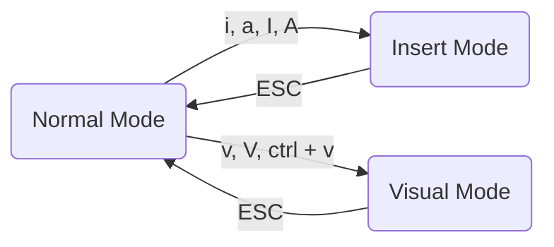

# vim 备忘录

安装 vimrc， 它在 vim 上增加了一些插件，调整了一些配置，使初学者在接触 vim 时更加有亲切感。

```
# 安装 vimrc
git clone --depth=1 https://github.com/amix/vimrc.git ~/.vim_runtime
sh ~/.vim_runtime/install_awesome_vimrc.sh

# 安装 vim
yum install vim

# 设置 vi = vim 在 ~/.bashrc 中添加
export EDITOR=vim
alias vi="vim"
```
自己的配置定义在 my_configs.vim 我这里配置了 2 项
1. tab 缩进 2 个空格
2. NERDTree 的窗口出现右边

```
:set shiftwidth=2
let g:NERDTreeWinPos = "right"
```

vim 有 3 中模式

+ Normal Mode : 这个模式下通常敲各种命令
+ Insert Mode : 这个模式就是编辑模式，类似普通文本编辑器操作
+ Visual Mode : 这个模式是选中区域，通常用来复制

通过按对应的字母完成状态之间互相切换


|常用操作|快捷键|
|--|--|
|查看快捷键|:nmap :imap :vmap :map 分别是 n, i, v 模式下快捷键|
|打开 NERDTree |,nn|
|刷新| r |
|撤销| u |
|撤销上一次撤销| ctrl + r|
|移动到下一个单词开头         | w  |
|移动到单词结尾处             | e  |
|光标处开始编辑               | i  |
|光标下一个单词处开始编辑     | a  |
|当前行开头开始编辑           | I  |
|当前行结尾开始编辑           | A  |
|移动到当前行结尾             | $  |
|移动到当前行开头             | ^  |
|移动到文档开头               | gg |
|移动到文档结尾               | GG |
|搜索文本 word                           | /{word}           |
|下一处                             |   n               |
|上一处                             |   N               |
|切换窗口                   | ctrl + w + w         |
|全文 foo 替换为 bar                | :%s/foo/bar/g     |
|替换时先询问                       | :%s/foo/bar/gc    |
|6 - 10 行 foo 替换为 bar           | :6,10s/foo/bar/g  |
|切换到 visual mode                     | v                 |
|切换到 visual mode 并选中一行          | V                 |
|切换到 visual mode 光标控制选中 block                         | ctrl + v          |
|复制                               | y                 |
|剪切                                | d                 |
|粘贴到光标后面                 | p                 |
|粘贴到光标前面                | P                 |
|复制当前行含换行符                  | yy or Y           |
|复制当前行不含换行符    | y$                |
|copy the current word              | yiw               |
|copy the current word              | yaw               |
|copy to x not include x            | yt[x]             |
|copy to x include x                | yf[x]             |
|find a file                          | ctrl + f          |
|edit file                            | :edit {file path} |
|reload file                          | :e (short for :edit)|
|add file                             | :new {file path}  |
|copy all content to current file     | :r {file path}    |
|d1G, dG| 删除光标所在行到第一行的数据，删除光标所在行到最后一行的数据|
|d0, d$| 删除光标所在到第一个字符，删除光标所在到最后一个字符|
|ndd| 删除 n 行|
|nx, nX|nx 删除当前字符后 n 个字符，nX 删除光标前 n 个字符|