# Virtual Memory 学习笔记

今天学习《Computer Systems》第九章 Virtual Memory。

虚拟主存是一个很棒的想法，源于它提供了 3 个重要的能力

+ 通过主存看作 disk 的缓存，更有效率的利用了主存
+ 通过提供统一的地址空间简化主存管理
+ 保护地址空间，防止被其他进程破坏

## Physical And Virtual Addressing

主存可以看作总容量为 M 的数组，每个元素都有唯一的地址叫做 *physical address(PA)* 通过 PA 来访问元素的方式叫做 *physical addressing* 早期的电脑使用 physical addressing 现代 CPU 使用 *virtual addressing* CPU 先产生 *virtual address(VA)* 在访问主存前先通过一个叫 *memory management unit(MMU)* 设备把 VA 转化为 PA 这个过程叫 *address translation* 再使用 PA 访问主存

## Address Spaces

*address space* 是一个有序的正整数集合 {0, 1, 2, ...} 如果正整数是连续的，叫做 *linear address space* 

*virtual address space* 是 CPU 产生的容量为 N = 2<sup>n</sup> 的集合 {0, 1, ..., N - 1} 也叫做 n-bit address space 现代计算机 n 通常等于 32 或者 64 同理 *physical address space* 也是一个集合 {0, 1, ..., M - 1} M = 2<sup>m</sup> 当然 M 并不总是 2 的幂，这里是简化处理。一个数据可以有 1 个 PA 和多个 VA

## VM as a Tool for Caching

VM 系统把 virtual memory 分成大小相同的块叫做 *virtual pages(VPs)*，每块大小 P = 2<sup>p</sup> 同理 phisical memory 也被分成大小相同的块叫做 *physical pages(PPs)* 大小也是 P (PPs 也被叫做 *page frames*)

在某个时间点 VP 的集合由 3 个互不相交的子集组成

+ Unallocated : Pages that have not yet been allocated (or created) by VM system. Unallocated blocks do not have any data associated with them, and thus do not occupy any space on disk.
+ Cached : Allocated pages that are currently cached in physical memory.
+ Uncached : Allocated pages that are not cached in physical memory.

看下图更好理解

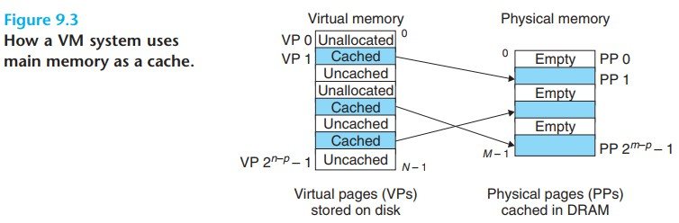

VP 1, 4, 6 缓存物理主存，VP 2, 5, 7 分配了单没有缓存

*Page table* 是 VP 和 PP 的映射关系，每条映射关系叫做 *page table entire(PTE)*，PTE 的条数 = N / P 每条 PTE 由 1 个 *valid bit* 和 n-bit address 组成，valid  bit 表示 VP 是否被缓存，当 valid = 1 存储物理页的起始地址，当 valid = 0 如果地址存了 NULL 说明还未被分配，否则就是分配了尚未缓存。对应上面说的 3 个互不相交的子集。

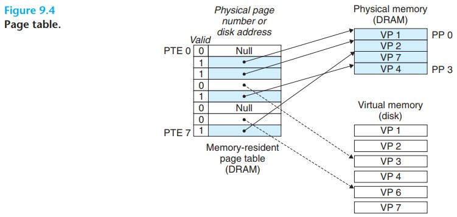

上图中如果访问 VP2 的数据，valid = 1 表明被缓存，可以通过 PTE 做地址翻译直接访问数据

上图中如果访问 VP3 的数据，valid = 0 表明未被缓存。访问未被缓存的数据叫做 *page fault* 会触发异常，控制权交到对应的异常处理程序。在这个例子中

1. 选取被替换的块，假设是 VP4 对应 PP3
2. 如果 VP4 有变更，拷贝回 disk
3. 更新 VP4 对应的 PTE 不再对应到 PP3
4. 从 disk 拷贝 VP3 的内容到 PP3 
5. 更新 VP3 对应的 PTE

从虚拟主存的视角，拷贝来拷贝去的块叫做 *page*，page 在硬盘和主存之间传输的活动称为 *swapping* 或者 *paging*，从硬盘到主存叫 *swapping in* 从主存到硬盘叫 *swapping out* 知道最后时刻才把 page swapping in 到主存的策略叫做 *demand paging* 现代 CPU 都是用这个策略，其他的还有靠预测提现 swapping in 的策略

操作系统可以分配新的虚拟主存也，比如调用 malloc 方法，会在磁盘上创建空间并且更新对应 PTE

因为 locality 的存在虚拟主存工作的很好，尽管程序在整个执行过程中引用很多不同的页，但是在某个时间点需要的页的集合很小，叫做 *working set* 或者 *resident set* 当第一次初始化把 pages 加载主存之后接下来对主存的访问都可以命中缓存，不需要额外的开销。当我们的程序有良好 locality 就能很好的利用虚拟主存，当然如果程序的 locality 很差那么从虚拟主存中得到收益也会很差。比较极端的情况 working set 比物理主存还要大可能会出现一种叫做 *thrashing* 的现象，page 持续不断的 swapping in 和 out 这个时候性能就会很差。

## VM as a Tool for Memory Management

虚拟主存简化主存管理，操作系统给每个进程分配了不同的 page table 做主存映射，不同的 VP 可以映射到同一块 PP 这是一对多关系

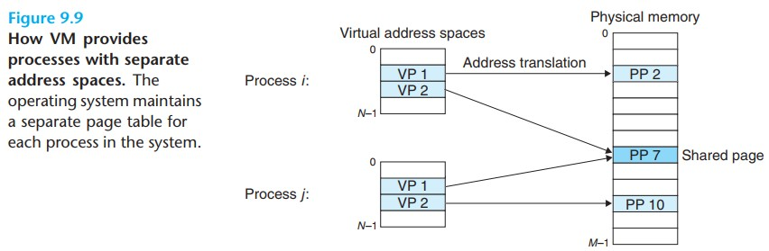

虚拟主存从以下几个方面简化主存管理

+ Simplifying linking. 每个进程使用不独立的地址空间允许进程有相同的主存镜像格式。比如 64 位系统代码段（code segment）都是从 0x40000 开始，后面跟着数据段（data segment）最顶部是 stack 向下增长，不需要管实际的物理主存地址在哪里，这是 MMU 要干的事。这样统一的格式极大的简化了 linker 的设计和实现
+ Simplifying loading. 加载 object file 的 .text 和 .data 到新的进程， loader 只需要分配 VP 标记为 invalid 地址指向适当的位置就好了。loader 不会直接拷贝数据到主存，当有指令引用到地址时虚拟主存会自动按需加载到主存。将一组连续的虚拟页映射到任何文件的任何地址叫做 *memory mapping*，Linux 提供为应用程序提供 mmap 做 memory mapping
+ Simplifying sharing. 正常情况下每个进程有自己私有的 code, data, heap, stack area，不同的进程不共享数据。某些情况比如调用 C 标准库方法，这时候共享可以减少主存开销，共享的方式也很简单，不同进程的不同 VP 映射到同一块 PP 即可
+ Simplifying memory allocation. 虚拟主存提供简单的机制分配额外的主存给进程。进程要求额外主存（比如调用 malloc 方法）操作系统分配连续的 VP 给进程，因为有 page table 的存在，VP 对应的 PP 不需要连续，可以随机分布在任何位置，提高主存的使用率

## VM as a Tool for Memory Protection

现代计算机系统需要提供主存的访问控制。一个用户进程不能修改只读代码，也不能修改内核的数据和代码，也不能访问和修改其他进程的主存数据。在有 PTE 的前提下要实现访问控制就很简单，只需要给每条 PTE 增加几个权限位就可以实现

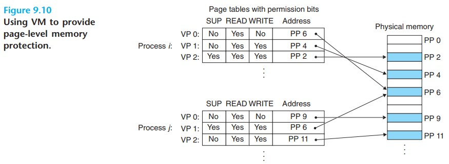

在上图这个例子中增加了 3 个位 SUP 表示只有内核可以访问，READ 和 WRITE 控制是否可以读或者写这个 VP 如果有进程违反了这个规定，CPU 会触发异常，发送 SIGSEGV 给违反规定的进程。Linux shell 通常输出 "segmentation fault"

## Address Translation

Formally, address translation is a mapping between the elements of an Nelement virtual address space (VAS) and an M-element physical address space (PAS)

n-bit 虚拟地址包括 2 部分：p-bit *virtual page offset (VPO)* 和 (n - p)-bit *virtual page number (VPN)* 同理 m-bit 物理地址也包括 2 部分：p-bit *physical page offset (PPO)* 和 (m - p)-bit *physical page number (PPN)* 其中 PPO 始终等于 VPO

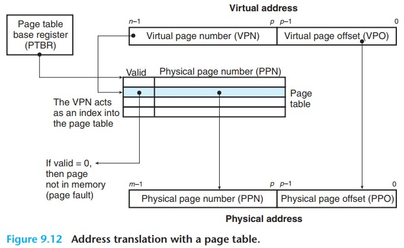

MMU 使用 page table 执行映射，*page table base register (PTBR)* 指向当前 page table

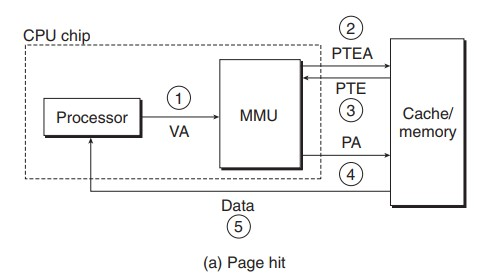

在 page hit 的情况下，地址翻译包括 5 个步骤

+ Step 1. CPU 产生虚拟地址发送给 MMU
+ Step 2. MMU 生成 PTE 地址请求内容
+ Step 3. 缓存/主存返回 PTE 给 MMU
+ Step 4. MMU 翻译成物理地址发送给缓存/主存
+ Step 5. 缓存/主存返回数据给 CPU 

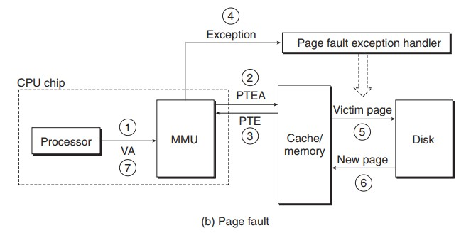

在 page fault 的情况下，地址翻译包括 7 个步骤

+ Step 1 ~ 3 同 page hit 的情况
+ Step 4. valid = 0 触发异常，page fault exception handler 开始工作
+ Step 5. 异常处理程序挑选一块 PP swapping out
+ Step 6. 异常处理程序 swapping in 新的页
+ Step 7. 异常处理程序交还控制权，restart 指令，按照 page hit 的流程再来一遍

### Speeding Up Address Translation with a TLB

*Translation lookside buffer (TLB)* 是一个很小的 PTE 缓存，每行包含一个 PTE。假设 TLB 有 T = 2<sup>t</sup> set 然后 VPN 的低 t 位表示 *TLB index (TLBI)* 剩下的位表示 *TLB tag (TLBT)*

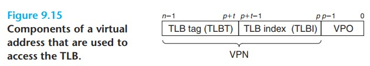

在 TLB hit 情况下获取 PTE 的步骤


+ Step 1. CPU 产生虚拟地址
+ Step 2. MMU 从 TLB 找到 PTE
+ Step 3. MMU 把虚拟地址翻译成物理地址，发送给主存
+ Step 4. 主存返回数据给 CPU

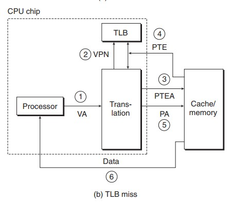

如果发生 TLB miss MMU 从 L1 缓存拿到 PTE 然后把 PTE 保存在 TLB 并覆盖掉一条已经存在的记录

### Multi-Level Page Tables

假设 32-bit 地址空间，页大小 4k，PTE 大小 4-byte 这时候 page table 需要 4M 主存并且常驻。对于稀缺的主存来说是一种很大的浪费，而且我们真正使用的其实是很小一部分。

为了解决这个问题，设计了带有层级结构的 page table 下图描述 two-level page table

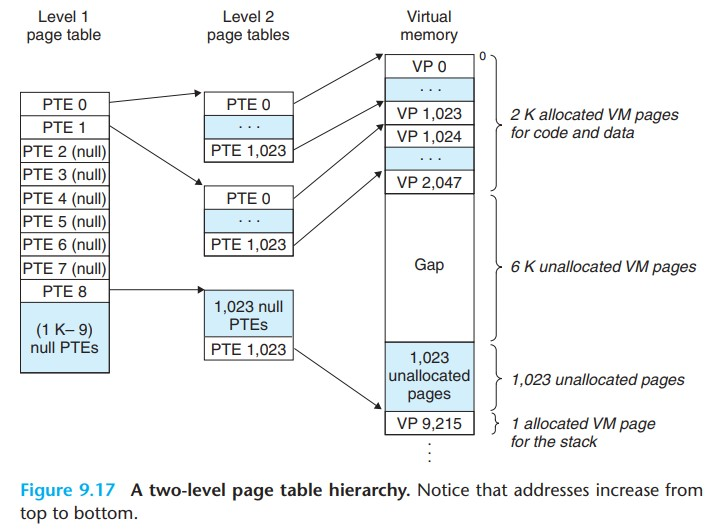

+ Level 1 的 PTE 代表 4M 的块，每个块有 1024 个连续的页，对于 4GB 的地址空间，只需要 1024 条 PTE 就足够了
+ Level 2 的 PTE 代表 4K 的页
+ Level 2 所有 PTE 都是 NULL 那么 level 1 的 PTE 也是 NULL
+ Level 2 有任何一条 PTE allocated 那么对应 level 1 的 PTE 指向 level 2 的起始地址

Multi-level page table 会分成多个 VPN 每个 VPN 指向对应 level 的 page table 直到左后一级 page table 得到 PPN 再和 VPO 组成物理地址，因为 TLB 的存在，地址翻译并不会比单层级慢多少

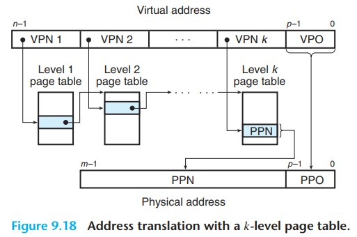

## Memory Mapping

### Linux Virtual Memory Areas

Linux 用 *area (也叫 segment)* 的集合来组织虚拟内存。Area 是连续的已分配的虚拟内存，比如 code segment, data segment, heap, shared library segment 等。VP 都包含在 area 中，不再 area 中的 VP 不能被进程引用到。

内核为每个进程维护独立的 *task structure (task_structure)*，它包含或指向进程运行需要的所有信息，比如 pid，PC，用户栈等。其中一条指向 *mm_struct* 描述虚拟内存的当前状态，mm_struct 其中有 2 个字段 *pgd* 和 *mmap*。

+ pgd : 指向 level 1 page table 的起始地址
+ mmap : 指向 vm_area_structs (area structs) 列表

Area struct 包括以下字段

+ fvm_start. 指向 area 其实地址
+ fvm_end. 指向 area 结束地址
+ vm_port. 描述 read/write 权限
+ vm_flags. 描述 shared/private 与其他进程共享或者进程私有
+ vm_next. 指向下一个 area

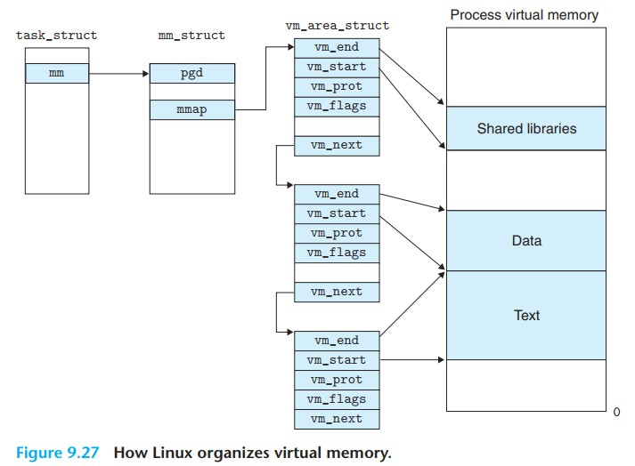

*Memory mapping* 是指 Linux area 和磁盘上的 *object* 建立关联，area 可以关联 2 种类型的 object

+ Regular file in the Linux file system. 文件被分成 page 大小的块，每块包含 VP 的初始信息。由于 demand paging 文件实际不会加载到物理内存，直到 cpu 请求数据才会别加载，如果 area 比文件大，剩下的部分用 0 填充。
+ Annoymous file. 这个文件是内核创建的，所有位都是 0。当 CPU 接触到这个 ares 的 VP 内核会选取一个物理页 swap out 然后用 0 覆盖这个页。这个过程没有从磁盘传输数据所以关联到 annoymout file 的页也叫 *demand-zero pages*

VP 初始化后会在内核维护的 *swap file (swap space or swap area)* 间换来换去。swap file 限制 VP 的最大数量

### Shared Objects Revisited

映射到 area 的 object 有 2 种存在形式 *shared object* 和 *private object*。对 shared object 的改变其他进程是可见的，也会反应到原始的 object。private object 对其他进程是不可见的，也不会反应到原始 object。映射 shared object 的 area 叫做 *shared area* 同理还有 *private area*

Private object 映射到虚拟内存使用 *copy-on-write* 的技术。最开始只有一份 private object 在物理内存中，不同的进程都映射到同一块物理内存，这点和 shared object 是一样的。当有进程尝试写入数据，会触发 protection fault 然后异常处理程序开始工作，在物理内存创建新的 page 副本，更新 page table 指向新的副本，授权写权限，然后返回重新执行 CPU 指令，这时候就可以写入数据了。这么做还是为了更有效的利用物理内存。

### The *fork* Function Revisited

当前进程调用 fork 函数时，内核分配唯一的 pid 和很多数据结构，为了给新进程创建虚拟内存内核拷贝当前进程的 mm_struct, area structs 和 page table。page 都标记为 read-only，area 标记为 private copy-on-write。此时子进程有了和父进程一样的虚拟内存，当父子进程开始执行随后的指令时，copy-on-wirte 机制保证私有地址空间的抽象，也就是各自改各自的数据。

### The *execve* Function Revisited

当前进程调用 execve 函数会把当前的程序替换为 execve 指定的程序，有以下几个步骤

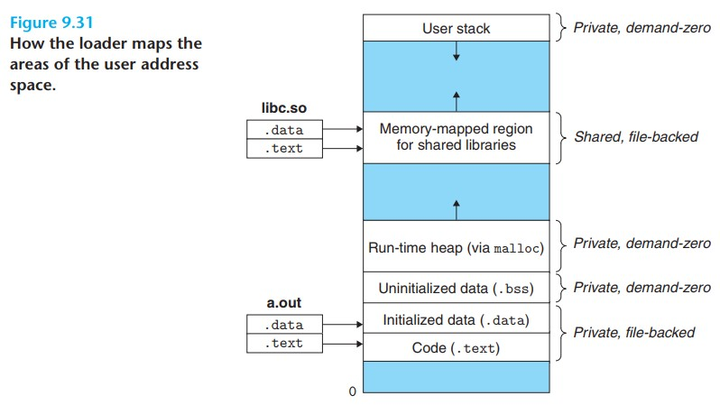

1. Delete existing user areas. 删除虚拟地址中用户部分 area struct
2. Map private areas. 创建新程序的 area structs。 code 对应 .text，data 对应 .data，bss, stack, heap 都是 demand-zero 
3. Map shared areas. 如果新程序链接 shared objects 建立映射
4. Set the program counter (PC). 更新 PC 到新程序的入口地址

### User-level Memory Mapping with the *mmap* Function

Linux 提供 mmap 函数完成映射，提供 munmap 函数删除


```
#include <unistd.h>
#include <sys/mman.h>

/* 成功返回 area 地址，失败返回 -1 */
void *mmap(void *start, size_t length, int port, int flags, int fd, off_t offset);

/* 成功返回 0 失败 -1 */
int munmap(void *start, size_t length);
```
mmap 参数
+ start. 没啥用，期望从虚拟地址 start 开始，实际上内核说了算，传 NULL 就好了
+ length. 映射大小
+ prot. 指定 page 访问权限，可以用 | 组合
  + PROT_EXEC 包含指令的页，可以被 CPU 执行
  + PROT_READ 读权限
  + PROT_WRITE 写权限
  + PROT_NONE 不能访问
+ flags. 指定映射类型，可以用 | 组合
  + MAP_ANON 映射文件是 annoymous file 
  + MAP_PRIVATE private copy-on-write object
  + MAP_SHARED shared object
+ fd. 指定映射文件
+ offset. 距离文件开始位置的偏移量

munmap 参数
+ start. 其实地址
+ lenght. 删除的大小

删除后尝试引用这个区域的数据会触发 segmentation fault

## Dynamic Memory Allocation

