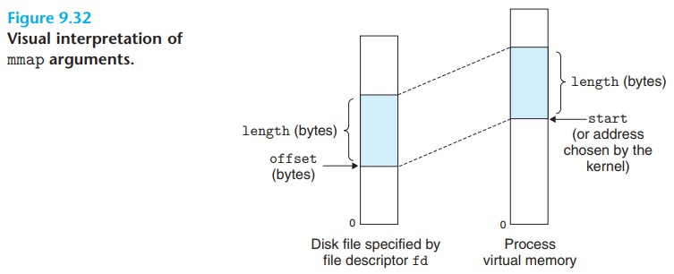

# Virtual Memory 学习笔记

今天学习《Computer Systems》第九章 Virtual Memory。

虚拟内存是一个很棒的想法，源于它提供了 3 个重要的能力

+ 通过主存看作 disk 的缓存，更有效率的利用了主存
+ 通过提供统一的地址空间简化主存管理
+ 保护地址空间，防止被其他进程破坏

## Physical And Virtual Addressing

主存可以看作总容量为 M 的数组，每个元素都有唯一的地址叫做 *physical address(PA)* 通过 PA 来访问元素的方式叫做 *physical addressing* 早期的电脑使用 physical addressing 现代 CPU 使用 *virtual addressing* CPU 先产生 *virtual address(VA)* 在访问主存前先通过一个叫 *memory management unit(MMU)* 设备把 VA 转化为 PA 这个过程叫 *address translation* 再使用 PA 访问主存

## Address Spaces

*Address space* 是一个有序的正整数集合 {0, 1, 2, ...} 如果正整数是连续的，叫做 *linear address space* 

*Virtual address space* 是 CPU 产生的容量为 N = 2<sup>n</sup> 的集合 {0, 1, ..., N - 1} 也叫做 n-bit address space 现代计算机 n 通常等于 32 或者 64 同理 *physical address space* 也是一个集合 {0, 1, ..., M - 1} M = 2<sup>m</sup>  当然 M 并不总是 2 的幂，这里是简化处理。一个数据可以有 1 个 PA 和多个 VA

## VM as a Tool for Caching

VM 系统把 virtual memory 分成大小相同的块叫做 *virtual pages (VPs)*，每块大小 P = 2<sup>p</sup> 同理 phisical memory 也被分成大小相同的块叫做 *physical pages (PPs)* 大小也是 P (PPs 也被叫做 *page frames*)

在某个时间点 VP 的集合由 3 个互不相交的子集组成

+ Unallocated : Pages that have not yet been allocated (or created) by VM system. Unallocated blocks do not have any data associated with them, and thus do not occupy any space on disk.
+ Cached : Allocated pages that are currently cached in physical memory.
+ Uncached : Allocated pages that are not cached in physical memory.

看下图更好理解


VP 1, 4, 6 缓存物理主存，VP 2, 5, 7 分配了单没有缓存

*Page table* 是 VP 和 PP 的映射关系，每条映射关系叫做 *page table entire(PTE)*，PTE 的条数 = N / P 每条 PTE 由 1 个 *valid bit* 和 n-bit address 组成，valid  bit 表示 VP 是否被缓存，当 valid = 1 存储物理页的起始地址，当 valid = 0 如果地址存了 NULL 说明还未被分配，否则就是分配了尚未缓存。对应上面说的 3 个互不相交的子集。


上图中如果访问 VP2 的数据，valid = 1 表明被缓存，可以通过 PTE 做地址翻译直接访问数据

上图中如果访问 VP3 的数据，valid = 0 表明未被缓存。访问未被缓存的数据叫做 *page fault* 会触发异常，控制权交到对应的异常处理程序。在这个例子中

1. 选取被替换的块，假设是 VP4 对应 PP3
2. 如果 VP4 有变更，拷贝回 disk
3. 更新 VP4 对应的 PTE 不再对应到 PP3
4. 从 disk 拷贝 VP3 的内容到 PP3 
5. 更新 VP3 对应的 PTE

从虚拟主存的视角，拷贝来拷贝去的块叫做 *page*，它在硬盘和主存之间传输的活动称为 *swapping* 或者 *paging*，从硬盘到主存叫 *swapping in* 从主存到硬盘叫 *swapping out* 知道最后时刻才把 page swapping in 到主存的策略叫做 *demand paging* 现代 CPU 都是用这个策略，其他的还有靠预测提现 swapping in 的策略

操作系统可以分配新的虚拟主存也，比如调用 malloc 方法，会在磁盘上创建空间并且更新对应 PTE

因为 locality 的存在虚拟主存工作的很好，尽管程序在整个执行过程中引用很多不同的页，但是在某个时间点需要的页的集合很小，叫做 *working set* 或者 *resident set* 当第一次初始化把 pages 加载主存之后接下来对主存的访问都可以命中缓存，不需要额外的开销。当我们的程序有良好 locality 就能很好的利用虚拟主存，当然如果程序的 locality 很差那么从虚拟主存中得到收益也会很差。比较极端的情况 working set 比物理主存还要大可能会出现一种叫做 *thrashing* 的现象，page 持续不断的 swapping in 和 out 这个时候性能就会很差。

## VM as a Tool for Memory Management

虚拟主存简化主存管理，操作系统给每个进程分配了不同的 page table 做主存映射，不同的 VP 可以映射到同一块 PP 这是一对多关系


虚拟主存从以下几个方面简化主存管理

+ Simplifying linking. 每个进程使用不独立的地址空间允许进程有相同的主存镜像格式。比如 64 位系统代码段（code segment）都是从 0x40000 开始，后面跟着数据段（data segment）最顶部是 stack 向下增长，不需要管实际的物理主存地址在哪里，这是 MMU 要干的事。这样统一的格式极大的简化了 linker 的设计和实现
+ Simplifying loading. 加载 object file 的 .text 和 .data 到新的进程， loader 只需要分配 VP 标记为 invalid 地址指向适当的位置就好了。loader 不会直接拷贝数据到主存，当有指令引用到地址时虚拟主存会自动按需加载到主存。将一组连续的虚拟页映射到任何文件的任何地址叫做 *memory mapping*，Linux 提供为应用程序提供 mmap 做 memory mapping
+ Simplifying sharing. 正常情况下每个进程有自己私有的 code, data, heap, stack area，不同的进程不共享数据。某些情况比如调用 C 标准库方法，这时候共享可以减少主存开销，共享的方式也很简单，不同进程的不同 VP 映射到同一块 PP 即可
+ Simplifying memory allocation. 虚拟主存提供简单的机制分配额外的主存给进程。进程要求额外主存（比如调用 malloc 方法）操作系统分配连续的 VP 给进程，因为有 page table 的存在，VP 对应的 PP 不需要连续，可以随机分布在任何位置，提高主存的使用率

## VM as a Tool for Memory Protection

现代计算机系统需要提供主存的访问控制。一个用户进程不能修改只读代码，也不能修改内核的数据和代码，也不能访问和修改其他进程的主存数据。在有 PTE 的前提下要实现访问控制就很简单，只需要给每条 PTE 增加几个权限位就可以实现


在上图这个例子中增加了 3 个位 SUP 表示只有内核可以访问，READ 和 WRITE 控制是否可以读或者写这个 VP 如果有进程违反了这个规定，CPU 会触发异常，发送 SIGSEGV 给违反规定的进程。Linux shell 通常输出 "segmentation fault"

## Address Translation

Formally, address translation is a mapping between the elements of an Nelement virtual address space (VAS) and an M-element physical address space (PAS)

n-bit 虚拟地址包括 2 部分：p-bit *virtual page offset (VPO)* 和 (n - p)-bit *virtual page number (VPN)* 同理 m-bit 物理地址也包括 2 部分：p-bit *physical page offset (PPO)* 和 (m - p)-bit *physical page number (PPN)* 其中 PPO 始终等于 VPO


MMU 使用 page table 执行映射，*page table base register (PTBR)* 指向当前 page table


在 page hit 的情况下，地址翻译包括 5 个步骤

+ Step 1. CPU 产生虚拟地址发送给 MMU
+ Step 2. MMU 生成 PTE 地址请求内容
+ Step 3. 缓存/主存返回 PTE 给 MMU
+ Step 4. MMU 翻译成物理地址发送给缓存/主存
+ Step 5. 缓存/主存返回数据给 CPU 


在 page fault 的情况下，地址翻译包括 7 个步骤

+ Step 1 ~ 3 同 page hit 的情况
+ Step 4. valid = 0 触发异常，page fault exception handler 开始工作
+ Step 5. 异常处理程序挑选一块 PP swapping out
+ Step 6. 异常处理程序 swapping in 新的页
+ Step 7. 异常处理程序交还控制权，restart 指令，按照 page hit 的流程再来一遍

### Speeding Up Address Translation with a TLB

*Translation lookside buffer (TLB)* 是一个很小的 PTE 缓存，每行包含一个 PTE。假设 TLB 有 T = 2<sup>t</sup> set 然后 VPN 的低 t 位表示 *TLB index (TLBI)* 剩下的位表示 *TLB tag (TLBT)*


在 TLB hit 情况下获取 PTE 的步骤


+ Step 1. CPU 产生虚拟地址
+ Step 2. MMU 从 TLB 找到 PTE
+ Step 3. MMU 把虚拟地址翻译成物理地址，发送给主存
+ Step 4. 主存返回数据给 CPU


如果发生 TLB miss MMU 从 L1 缓存拿到 PTE 然后把 PTE 保存在 TLB 并覆盖掉一条已经存在的记录

### Multi-Level Page Tables

假设 32-bit 地址空间，页大小 4k，PTE 大小 4-byte 这时候 page table 需要 4M 主存并且常驻。对于稀缺的主存来说是一种很大的浪费，而且我们真正使用的其实是很小一部分。

为了解决这个问题，设计了带有层级结构的 page table 下图描述 two-level page table


+ Level 1 的 PTE 代表 4M 的块，每个块有 1024 个连续的页，对于 4GB 的地址空间，只需要 1024 条 PTE 就足够了
+ Level 2 的 PTE 代表 4K 的页
+ Level 2 所有 PTE 都是 NULL 那么 level 1 的 PTE 也是 NULL
+ Level 2 有任何一条 PTE allocated 那么对应 level 1 的 PTE 指向 level 2 的起始地址

Multi-level page table 会分成多个 VPN 每个 VPN 指向对应 level 的 page table 直到左后一级 page table 得到 PPN 再和 VPO 组成物理地址，因为 TLB 的存在，地址翻译并不会比单层级慢多少


## Memory Mapping

### Linux Virtual Memory Areas

Linux 用 *area (也叫 segment)* 的集合来组织虚拟内存。Area 是连续的已分配的虚拟内存，比如 code segment, data segment, heap, shared library segment 等。VP 都包含在 area 中，不再 area 中的 VP 不能被进程引用到。

内核为每个进程维护独立的 *task structure (task_structure)*，它包含或指向进程运行需要的所有信息，比如 pid，PC，用户栈等。其中一条指向 *mm_struct* 描述虚拟内存的当前状态，mm_struct 其中有 2 个字段 *pgd* 和 *mmap*。

+ pgd : 指向 level 1 page table 的起始地址
+ mmap : 指向 vm_area_structs (area structs) 列表

Area struct 包括以下字段

+ fvm_start. 指向 area 其实地址
+ fvm_end. 指向 area 结束地址
+ vm_port. 描述 read/write 权限
+ vm_flags. 描述 shared/private 与其他进程共享或者进程私有
+ vm_next. 指向下一个 area


*Memory mapping* 是指 Linux area 和磁盘上的 *object* 建立关联，area 可以关联 2 种类型的 object

+ Regular file in the Linux file system. 文件被分成 page 大小的块，每块包含 VP 的初始信息。由于 demand paging 文件实际不会加载到物理内存，直到 cpu 请求数据才会别加载，如果 area 比文件大，剩下的部分用 0 填充。
+ Annoymous file. 这个文件是内核创建的，所有位都是 0。当 CPU 接触到这个 ares 的 VP 内核会选取一个物理页 swap out 然后用 0 覆盖这个页。这个过程没有从磁盘传输数据所以关联到 annoymout file 的页也叫 *demand-zero pages*

VP 初始化后会在内核维护的 *swap file (swap space or swap area)* 间换来换去。swap file 限制 VP 的最大数量

### Shared Objects Revisited

映射到 area 的 object 有 2 种存在形式 *shared object* 和 *private object*。对 shared object 的改变其他进程是可见的，也会反应到原始的 object。private object 对其他进程是不可见的，也不会反应到原始 object。映射 shared object 的 area 叫做 *shared area* 同理还有 *private area*

Private object 映射到虚拟内存使用 *copy-on-write* 的技术。最开始只有一份 private object 在物理内存中，不同的进程都映射到同一块物理内存，这点和 shared object 是一样的。当有进程尝试写入数据，会触发 protection fault 然后异常处理程序开始工作，在物理内存创建新的 page 副本，更新 page table 指向新的副本，授权写权限，然后返回重新执行 CPU 指令，这时候就可以写入数据了。这么做还是为了更有效的利用物理内存。

### The *fork* Function Revisited

当前进程调用 fork 函数时，内核分配唯一的 pid 和很多数据结构，为了给新进程创建虚拟内存内核拷贝当前进程的 mm_struct, area structs 和 page table。page 都标记为 read-only，area 标记为 private copy-on-write。此时子进程有了和父进程一样的虚拟内存，当父子进程开始执行随后的指令时，copy-on-wirte 机制保证私有地址空间的抽象，也就是各自改各自的数据。

### The *execve* Function Revisited

当前进程调用 execve 函数会把当前的程序替换为 execve 指定的程序，有以下几个步骤


1. Delete existing user areas. 删除虚拟地址中用户部分 area struct
2. Map private areas. 创建新程序的 area structs。 code 对应 .text，data 对应 .data，bss, stack, heap 都是 demand-zero 
3. Map shared areas. 如果新程序链接 shared objects 建立映射
4. Set the program counter (PC). 更新 PC 到新程序的入口地址

### User-level Memory Mapping with the *mmap* Function

Linux 提供 mmap 函数完成映射，提供 munmap 函数删除



```
#include <unistd.h>
#include <sys/mman.h>

/* 成功返回 area 地址，失败返回 -1 */
void *mmap(void *start, size_t length, int port, int flags, int fd, off_t offset);

/* 成功返回 0 失败 -1 */
int munmap(void *start, size_t length);
```
mmap 参数
+ start. 没啥用，期望从虚拟地址 start 开始，实际上内核说了算，传 NULL 就好了
+ length. 映射大小
+ prot. 指定 page 访问权限，可以用 | 组合
  + PROT_EXEC 包含指令的页，可以被 CPU 执行
  + PROT_READ 读权限
  + PROT_WRITE 写权限
  + PROT_NONE 不能访问
+ flags. 指定映射类型，可以用 | 组合
  + MAP_ANON 映射文件是 annoymous file 
  + MAP_PRIVATE private copy-on-write object
  + MAP_SHARED shared object
+ fd. 指定映射文件
+ offset. 距离文件开始位置的偏移量

munmap 参数
+ start. 其实地址
+ lenght. 删除的大小

删除后尝试引用这个区域的数据会触发 segmentation fault

## Dynamic Memory Allocation

Dynamic Memory Allocator 更方便的管理内存，不需要使用 mmap 和 munmap 创建和删除虚拟内存，它管理虚拟内存 heap 区域，对于每个进程内核会维护变量 brk 指向 heap 顶端。Allocator 把 heap 当成大小不同块的集合，每个块有 2 种状态 *allocated* 或者 *free* 可以互相转化。

Allocator 有 2 种风格，区别在于如何释放内存，分配内存都必须显式分配

+ Explicit alloctors. 显式释放内存，比如调用 free 方法
+ Implicit alloctors. 也可以叫 *garbage collectors* 通过 *garbage collection (GC)* 自动释放内存

### The *malloc* and *free* Functions

```
#include <stdlib.h>
#include <unistd.h>

/* 成功返回分配块的指针，失败返回 NULL */
void *malloc(size_t size);

/* 成功返回旧的 brk 指针，失败返回 -1 */
void *sbrk(intptr_t incr);

void free(void *ptr);
```

malloc 方法配置至少 size 大小的内存块，需要考虑地址对齐有时候会大一点，它不会初始化内存块，如果需要初始化成 0 调用 *calloc* 方法，如果要改变大小调用 *remalloc* 方法

sbrk 方法可以增加/缩小 heap 大小，失败返回 -1 并且设置 errno = ENOMEM 如果 incr = 0 返回当前 brk 值

free 方法的入参 ptr 必须是分配块的起始地址，否则 free 的行为无法预测会出现各种诡异问题

### Why Dynamic Memory Alloctation

最大的原因是有些数据结构的大小只有在运行时才知道，比如我们从标准输入读取字符串，程序不知道要读取多少字符，也就不知道该申请多少内存，它只能申请足够大的内存以保证可以容纳所有字符，但是这样会减少内存的利用率。比较好的方式是在运行时动态分配需要的内存，需要 n 个就分配 n 个。

### Alloctor Requirements And Goals

Explicit alloctor 需要在严格的限制下运行

+ Handling arbitrary request sequences. 你永远不知道调用者是怎么来分配和释放内存的，会有各种姿势的顺序，所以 alloctor 要能处理任何顺序的请求
+ Making immediate responses to requests. Allocator 必须马上响应请求，不允许为了性能排序请求顺序或者缓存请求
+ Using only the heap. Allocator 只使用 heap
+ Aligning blocks (alignmemt requirement). 块对齐，就是所有地址都是 8 或者 16 的倍数，保证可以存储任何数据
+ Not modifiying allocated blocks. Allocator 只操作空闲的块，不允许操作已分配的块，譬如压缩已分配的块

Explicit alloctor 的目标

+ Goal 1: Maximizing throughput. 单位时间内完成的请求（malloc 和 free）数量最大
+ Goal 2: Maximizing memory utilization. 指标 *peak utilization (U<sub>k</sub>)* 最大。设 P<sub>k</sub> 是所有请求 *payload* 的总和，H<sub>k</sub> 是当前 heap 大小。U<sub>k</sub> = max<sub>i <= k</sub> P<sub>i</sub> / H<sub>k</sub>

这 2 个目标相互冲突，如何平衡 2 个目标是一个有意思的挑战

### Fragmentation

Fragmentation 是指未使用的内存不能满足分配要求，它是 U<sub>k</sub> 下降的主要原因。Fragmentation 有 2 种形式 

+ Internal fragmentation. 分配的块比请求的块大导致。比如请求块大小比最小块还小，比如为了对齐多分配一点空间。
+ External fragmentation. 空闲块总和满足请求块大小，单任何单一的空闲块不满足导致。它比较难以量化因为不仅依赖历史的内存请求，还依赖将来的内存请求，为了改善这个问题，allocator 偏向维护少量大的空闲块而不是大量小的空闲块

### Implementation Issues

为了平衡 2 个目标，allocator 通常要考虑这些问题，这些问题有很多解法，书中介绍了简单的方式，思路是一样的
+ Free block organization. 如何跟踪空间快
+ Placement. 如何确定合适的空闲块用于分配
+ Splitting. 分配后多余的部分怎么处理
+ Coalescing. 内存释放后怎么处理

### Implicit Free Lists

Allocator 通过再块中嵌入 header 的方式表示块是否被分配，header 占一个字 (4 byte = 32 bit) 前 29 bit 表示块大小，后 3 bit 表示其他信息，其中最后 1 bit (allocated bit) 等于 0 表示空闲，1 表示已分配。header 之后跟着 malloc 需要的内存 （也叫 payload） 后面跟着一些填充块，为了减少 external fragmentation 或者用来对齐，malloc 返回的指针指向 payload 起始地址而不是 header 起始地址。

通过这种方式把已分配和空闲块组织起来的方式叫 *implicit free list* 因为 header 隐含在内存块中。Allocator 可以通过 header 信息遍历这个 heap 区域，可以知道所有空闲块的信息。这种方式的优点是简单，缺点是寻找适合空闲块的时间与总块数（含已分配和空闲块）线性相关，因为 allocator 需要顺序遍历过去寻找。另外 header 占用一个字大小，假设 malloc(1) 也要分配至少 4 + 1 空间，还要再加上对齐的空间。

### Placing Allocated Blocks

应用程序调用 malloc(k) 请求 *k* byte 空间，allocator 检索合适的空闲块，检索的方式叫做 *placement policy* 常用策略有 first fit, next fit, best fit。

+ First fit. 从头开始找空闲块，使用第一块合适的空闲块
  + 优点：倾向在列表尾部保留大的空闲块
  + 缺点：容易在列表头留下小的空闲块，增加检索时间（总块数变多了）
+ Next fit. 从上次搜索结束的地方开始找，使用第一块合适的空闲块
  + 优点：比 first fit 快，尤其是列表头部有很多小的空闲块
  + 缺点：内存利用率比 fitst fit 低
+ Best fit. 遍历所有空闲块选择最小合适的空闲块
  + 优点：3 个当中内存利用率最高
  + 缺点：需要遍历整个 heap 区域，或者需要更加精密复杂的空闲块列表来支撑它

### Splitting Free Blocks

找到合适的空闲块后，有另外 2 种策略使用空闲块
+ 使用整个空闲块
  + 优点：简单，速度快
  + 缺点：产生 internal fragmentation 如果 placement policy 能找到合适的空闲块，那么这些随便可接受，否则内存利用率堪忧
+ 分成 2 部分，已分配和新的空闲块，优缺点和上一个反过来

### Getting Additional Heap Memory

如果当前的空闲块都不能满足大小要求，allocator 会通过 sbrk 方法向内核申请额外的 heap memory 然后转化成大的空闲块，插入到当前的空闲列表中，这时候就有合适的空闲块了

### Coalescing Free Blocks

Allocator 释放已分配的块时有可能和其他的空闲块相邻，这种现象叫 *false Fragmentation* 许多空闲块被切成小的，不能使用的空闲块，这会导致一个请求明明总大小有合适的空闲块，但是却无法分配。为了解决这个问题 allocator 使用 coalescing 操作，把相邻的空闲块合并起来，有 2 种方式
+ Immediate coalescing. 每次 free 立即合并相邻空闲块
  + 优点：简单，速度快 O(1)
  + 缺点：某些模式下可能会抖动，就是合了又拆，拆了又合
+ Deferred coalescing. 推迟到某个时刻再合并。比如推迟到有请求分配失败了，在扫描整个 heap 合并相邻的空闲块。优缺点反过来，有些 quick allocator 是这种方式的优化版本

### Coalescing with Boundary tags

Allocator 可以很容易确定下一块是否空闲，当然也就很容易合并。但是怎么找到前一块，使用 header 只能很方便的往后找，但是往前找就没办法了，除非整个 heap 扫一遍，但是显然不合适。Knuth 提出了一种优雅又通用的技术叫做 *boundary tags* 就是给每个块增加 *footer (boundary tag)* 内容和 header 一模一样，然后找前一块就和找后一块一样容易了。

Allocator 合并空闲块会遇到 4 种情形，假设前一块大小 m1 当前块大小 n 后一块大小 m2

1. The previous and next blocks are both allocated.
2. The previous block is allocated and the next block is free.
3. The previous block is free and the next block is allocated.
4. The previous and next blocks are both free.


Footer 占用一个字，在分配大量小块的情况下会显著增加开销，有一种优化方式是已分配块不加 footer 空闲块仍然保留 footer 前一块的空闲标记记在当前块的 header 信息中，这样既能满足合并需求，也有更多的空间用于 payload。

### Putting It Together: Implementing a Simple Allocator

// TODO 编写一个简单版本的 allocator 

### Explicit Free Lists

Implicit free list 实现比较简单但是实际使用中不常使用，因为它 malloc 时间是 O(n) n = 总块数，就是有点慢。更好的方式是通过一种显式的数据结构在组织空闲块。考虑到空闲块除了 header 和 footer 其他部分还没有用起来，可以在里面存储 2 个指针 *pred* 和 *succ*。pred 指向前一个空闲块，succ 指向后一个空闲块，这样就以双向链表的形式组织空闲块了。此时 malloc 时间是 O(n) n = 空闲块数，比 implicit free list 要好，free 时间可能是 O(n) 或者 O(1) 取决于排序策略。
+ Last-in-first-out (LIFO). 这种策略把新的 free 块放在列表头，LIFO 配合 first fit 倾向使用最新使用过的块，free 是 O(1) 如果用了 boundary tags coalescing 也是 O(1) 这个策略内存利用率不高
+ Address order. 按照地址升序排序，此时 free 是 O(n) 寻找合适 pred 需要时间。这个策略配合 first fit 内存使用率比较高，接近 best fit

Explicit free list 的缺点是需要占用 2 个指正的空间，增大了 minimum block size 可能会造成 internal fragmentation

### Segregated Free Lists

为了优化 malloc 耗时，一种流行的方式叫 *segregated storage* 它把大小相当的空闲块组成等价类，叫做 *size class*。Allocator 维护等价类的列表，这样 malloc(n) 时先搜索合适的 size class 然后在进一步搜索合适的空闲块，如果找不到再找大一号的 size class 直到找到为止。

Segregated storage 有几十种不同的方式，不同的 size class 划分，不同的 coalescing 执行时机，何时想操作系统申请额外空间，是否需要分割等等，书中介绍 2 种 *simple segregated storage* 和 *segregated fits*

#### Simple Segregated Storage

Simple segregated storage 的每个空闲列表包含大小一样的块取 size class 定义中的最大值。比如 size class 定义 {17-32} 那么块大小就是 32。malloc 操作：找到对应的 size class 如果列表不为空，直接取第一块，不分割。如果为空，向内核申请固定长度的额外空间，分成大小相等的块组成空闲列表，然后取第一块。Free 操作：释放的块插入到对应 size class 的列表头部

优点：简单，malloc 和 free 都是 O(1) 不分割不合并让它不需要 boundary tags 因为大小相等所以地址可以推算出来，空闲列表不需要双向只要有 succ 指针即可，减小 minimum block size 可以到 4 一个字的大小。
缺点：内存使用率不高，不分割容易导致 internal fragmentation 不合并容易导致 external fragmentation。

#### Segregated fits

Allocator 维护空闲列表的数组，每个空闲列表关联到 size class 空闲列表通过隐式或者显式组织。每个空闲列表块大小不一，都在 size class 的定义范围内。

Malloc 操作：根据请求块大小确定 size class 查找合适的空闲块，可以用 first fit, next fit 或者 best fit 如果找到分割（可选）把剩余的部分插入到合适的空闲列表，如果没找到检索下一个 size class 如果全 size class 都搜索了还是没找到，向内核申请额外空间，分割把剩余部分插入到合适的空闲列表。Free 操作：合并然后插入到合适的空闲列表

#### Buddy Systems

Buddy System 是 segregated fit 的特殊版本，特点是 size class 是 2 的幂。假设 allocator 有大小为 2<sup>m</sup> 的 heap，最初空闲列表只有一块 2<sup>m</sup> 的空闲块，当请求大小为 K 的内存时，先向上取整到 2<sup>k</sup> 大小，然后找到可用空闲块 2<sup>j</sup> 如果 k = j 那么直接用，不然就对半分直到 k = j 分割后剩下的空闲块叫做 *buddy* 放在合适的空闲列表中。释放块时会持续合并 free buddies 直到遇到已分配的 buddy 停止合并。

在直到当前地址和块大小的情况下，可以很容易推算出 buddy 块的地址，假设 32 bytes 大小的块有地址 xxx...x00000 那么 buddy 块地址是 xxx...x10000 只相差 1bit。

Buddy system 不是通用解，它的寻找操作和合并操作很快，缺点是内存使用率不高，块大小是 2 的幂容易造成 internal fragmentation 属于在某种 case 下的特殊解

## Garbage Collection

Garbage collector 是一种会自动 free 不再使用块的 allocator， 不再使用的块叫做 *garbage*，自动回收的过程叫做 *garbage collection*。支持 garbage collection 的系统比如 java 需要显式的分配内存，但是不要释放，garbage collector 会使用 *Mark & Sweep* 算法定期回收垃圾块。

### Garbage Collector Basics

Garbage collector 把内存看作 *directed reachability graph*，图的节点分为两类 *root nodes* 和 *heap nodes*。Root node 代表位置不在 heap 但是包含指向 heap 的指针，可以是寄存器，栈或者全局变量，heap node 代表 heap 中已分配的块。有向边 p -> q 表示 p 的某个位置指向 p 的某个位置。


如果从某个 root node 有路径可以到 p 我们就说 p 是可达的（reachable）。在某个时间点，不可达的 node 就是垃圾块，不会再被程序使用。Garbage collector 的任务就是维护 reachability graph 定期释放不可达的 node 提高内存利用率。

### Mark & Sweep Garbage Collectors

Mark & Sweep garbage collector 包含 2 个阶段

+ Mark phase. 标记所有可达的 node 标记通常保存在 header 的低位 bit 中
+ Sweep phase. 释放未被标记的块

伪代码实现 mark & sweep 算法

```
/* mark function */
void mark(ptr p) {
  if ((b = isPtr(b)) == NULL) {
    return;
  }
  if (blockMarked(b)) {
    return;
  }
  markBlock(b);
  len = length(b);
  for (i = 0; i < len; i++) {
    mark(b[i]);
  }
}

/* sweep function*/
void sweep(ptr b, ptr end) {
  while(b < end) {
    if (blockMarked(b)) {
      unmarkBlock(b);
    } else if (blockAllocated(b)) {
      free(b);
      b = nextBlock(b);
    }
  }
  return;
}
```

+ ptr isPtr(ptr p). 如果 p 指向已分配的块，返回那个快的起始地址，否则返回 NULL
+ int blockMarked(ptr b). true = b 已经被标记
+ int blockAllocated(ptr b). true = b 已经被分配
+ void markBlock(ptr b). 标记 b
+ int length(ptr b). 返回 b 的大小，以字为单位
+ void unmarkBlock(ptr b). 清楚 b 的标记
+ ptr nextBlock(ptr b). 下一块

## Common Memory-Related Bugs in C Programs

管理和使用虚拟内存是一件困难的事，一是出了 bug 很难排查，因为出现症状时距离出 bug 的地方有一段距离，无论是时间上还是空间上。二是一旦出 bug 都是些匪夷所思的问题。

### Dereferencing Bad Pointers

虚拟内存很大，一个进程通常使用其中的一部分，如果指针尝试引用未使用部分，操作系统会终止进程并报告 segmentation exception 如果尝试写 read-only 的部分会报告 protection exception。比如 scanf 是从 stdin 读取数据到变量，入参是变量的地址

```
scanf("%d", &val);
```

但是有些时候会写成

```
scanf("%d", val);
```

这时编译是不会报错的，会把 val 的值当作是地址来执行这个方法。好的情况是进程终止并报告错误，这样就能发现问题。如果 val 的值刚好是某个可读写的地址，那么会覆盖这个值，等出现问题时已经不知道过去多久了，而且很难排查到问题的原因在这里。

### Reading Uninitialized Memory

Heap 被 malloc 分配后不会初始化未 0 这点和 bss 不同，一个常见的问题是当作已经初始化 0 比如下面这个例子

```
int *matvec(int **A, int *x, int n) {
  int i, j;
  int *y = (int *) Malloc(n * sizeof(int));
  for (i = 0; i < n; i++) {
    for (j = 0; j < n; j++) {
      y[i] += A[i][j] * x[j];
    }
  }
  return y;
}
```

正确的做法是赋值 y[i] = 0 或者使用 calloc 方法，这个方法或默认初始化

### Allowing Stack Buffer Overflows

当写入数据时没有限制最大长度容易发生 *buffer overflow bug* 这是黑客常常用的功能

```
void bufoverflow() {
  char buf[64];
  gets(buf);
  return;
}
```

gets 方法拷贝任意长度的字符串到 buf 容易引起 bug 用 fgets 代替

### Assuming That Pointers and the Objects They Point to Are the Same size

这个问题是假设指针和指针指向的对象有相同的大小，实际情况是不一定，有可能一样有可能不一样

```
int **makeArray1(int n, int m) {
  int i;
  int **A = (int **) Malloc(n * sizeof(int));

  for (i = 0; i < n; i++) {
    A[i] = (int *) Malloc(m * sizeof(int));
  }
  return A;
}
```
第一次分配内存本意是创建 n 个指针的数组，实际上写成创建 n 个 int 的数组，这个例子在 int 和指针大小相同的系统没有问题，但是在指针比 int 大的系统循环部分会覆盖掉一部分其他数据，下次出现问题又不知道是什么时候，很难排查。正确的写法是 ```int **A = (int **) Malloc(n * sizeof(int *));``` 

### Making Off-by-One Errors

这个问题是多算了 1 个，类似点名数数的时候忘了自己

```
int **makeArray2(int n, int m) {
  int i;
  int **A = (int **) Malloc(n * sizeof(int *));

  for (i = 0; i <= n; i++) {
    A[i] = (int *) Malloc(m * sizeof(int));
  }
  return A;
}
```

循环终止条件错误的写成了 ```<=``` 导致循环时多循环一次，会覆盖掉某些数据

### Referencing a Pointer Instead of the Object It Point to

这个问题是不小心弄错了运算符优先级和结合性，上例子

```
int *binheapDelete(int **binheap, int *size) {
  int *packet = binheap[0];

  binheap[0] = binheap[*size - 1];
  *size--;
  heapify(binheap, *size, 0);
  return (packet);
}
```

-- 和 * 拥有一样的优先级，从右向左结合，```*size--``` 实际效果是 ```*(size--)``` 获取的是 size 前一个元素的值。正确的写法是 ```(*size)--```

### Misunderstanding Pointer Arithmetic

这个问题是忘记指针操作是以元素大小为单位的。

```
int *search(int *p, int val) {
  while(*p && *p != NULL) {
    p += sizeof(int);
  }
  return p;
}
```
本意是遍历 p 实际写法是步长为 4 的遍历，正确的写法是 p++ 即可

### Referencing Nonexistent Variables

这个问题是引用了不合法的本地变量

```
int *stackref() {
  int val;

  reutrn &val;
}
```
val 在 stackref 退出后已经不合法，虽然依旧可以被引用到。如果往 val 写入数据，可能会改变其他方法的数据引发一些莫名其妙的问题

### Referencing Data in Free Heap Blocks

这个问题是引用到已经被释放的块

```
int *heapref(int n, int m) {
  int i;
  int *x, *y;
  x = (int *) Malloc(n * sizeof(int));

  free(x);

  y = (int *) Malloc(m * sizeof(int));
  for (i = 0; i < m; i++) {
    y[i] = x[i]++;
  }
  return y;
}
```
变量 x 指向的块已经被释放，但是在循环中引用了，运气好的情况会直接终止并报错，运气不好可以读出此时 x 的值，但是内容肯定不是期望的内容，可能已经分配给别的变量了

### Introducing Memory Leaks

这个问题是分配了内存但是不释放，它会慢慢侵蚀内存，直到吃完所有内存。

```
void leak(int n) {
  int *x = (int *) Malloc(n * sizeof(int));
  return;
}
```
虽然 GC 能做一定程度的努力，但是显然不是万能的，有借有还再借不难。

<p style="text-align: center"><a href="/">回首页</a></p>
 
<p align="right">06/23/2020</p>