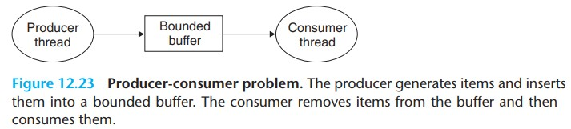

# Concurrent Programming 学习笔记
{:.no_toc}

今天学习《Computer Systems》第十二章 Concurrent Programming。

* TOC
{:toc}

并发编程有很多好处
+ Accessing slow I/O devices. 应用程序等待数据到达时如果让 CPU 去执行别的进程，可以提高利用率，对 CPU 来说寄存器以外的设备都挺慢的。
+ Interacting with humans. 人机交互有多任务的需求，不需要在一个任务上苦等。
+ Reducing latency by deferring work. 推迟某些操作以减少延迟。有些工作打包起来一起做更效率。
+ Servicing multiple network clients. 同时给多个客户端提供服务可以减少高延迟客户端垄断服务端的问题。
+ Computing in parallel on multi-core machines. 现代处理器通常是多核，并发编程能更好的利用。

使用应用级并发的程序叫做 *concurrent programs* 有 3 种方式实现

+ Processes. 这种方式，每个 logical control flow 是一个进程，由内核调度，拥有独立的虚拟地址空间，需要通过 *IPC (Interprocess communication)* 通信。
+ I/O multiplexing. logical control flow 表示成很多状态，当数据到达描述符时，应用程序会从一个状态转化为另一个状态。
+ Threads. 这种方式，每个 logical control flow 是一个线程，运行在一个进程中，由内核调度，像 processes 和 I/O multiplexing 的混合体，调度方式像 processes 数据共享像 I/O Multiplexing。

## Concurrent Programming with Processes

利用 processes 构建并发程序最简单的方式是通过函数 fork, execve, waitpid 构建。父进程负责接受请求，分配给子进程处理，父进程继续等待请求。

### A Concurrent Server Based on Processes

使用 processes 实现 [echo server](https://github.com/sbwkl/practice-example/blob/master/computer-systems/concurrent/echoserverp.c) 有 3 点需要注意
+ Server 需要长时间运行，所以要回收子进程，SIGCHLD 信号不是排队等待的，所以一次性要回收所有子进程
+ 子进程拥有父进程的所有描述符，实际上有些描述符用不上，为了防止内存泄漏，父进程关闭 connfd 子进程关闭 listenfd
+ 父子进程的 connfd 都关闭了，对应 file table 的引用数才会归 0 才会关闭连接

### Pros and Cons of Processes

父子进程共享 file table 不共享地址空间。不共享地址空间既是优点也是缺点，优点是不用担心意外覆盖其他进程的状态，避免一些莫名其妙的问题，缺点是进程间通信不方便，需要通过 IPC 通信。另外使用进程构建并发应用相对较慢，因为管理进程和 IPC 的开销比较大。

## Concurrent Programming with I/O Multiplexing

假如上述例子中的 echo server 既要响应 client 又要响应 stdin 的输入，这时候 server 要响应 2 种独立的 I/O 事件
+ network client 的连接请求
+ 用户的键盘输入

server 先处理哪个 I/O 都不合适，因为不知道谁的数据会先到达，其中一种解决方式是引入叫做 *I/O Multiplexing* 的技术。它主要的思想是使用 select 函数让内核挂起进程，当有 I/O 事件发生时交还控制权。

Select 是一个复杂的函数，有很多使用场景，书中介绍了其中一种：等待一组描述符，直到有描述符准备好读取。

```
#include <sys/select.h>

/* 成功返回准备好读取的描述符数量，失败返回 -1 */
int select(int n, fd_set *fdset, NULL, NULL, NULL);

/* 操作 fd_set 的辅助宏 */
/* 清除 fdset */
FD_ZERO(fd_set *fdset);
/* fdset 清除 fd */
FD_CLR(int fd, fd_set *fdset);
/* fdset 设置 fd */
FD_SET(int fd, fd_set *fdset);
/* 判断 fd 是否被设置 */
FD_ISSET(int fd, fd_set *fdset);
```

函数 select 维护一组描述符叫做 *descriptor sets*，类型为 fd_set 它是一个大小为 n 的 bit vector

b<sub>n-1</sub>,...,b<sub>1</sub>, b<sub>0</sub>

每个 b<sub>k</sub> 代表描述符 k 当 b<sub>k</sub> = 1 时，k 是集合的成员。

[源码 select.c](https://github.com/sbwkl/practice-example/blob/master/computer-systems/concurrent/select.c) 把 2 个描述符 STDIN_FILENO 和 listenfd 放进 read_set 中，通过 select 函数挂起进程等待数据到达，当 listenfd 数据到达时执行 echo 方法， 当 STDIN_FILENO 数据到达时执行 command 方法，需要注意其中一个数据后要处理完成后才能处理另一个。

### A Concurrent Event-Driven Server Based on I/O Multiplexing

I/O Multiplexing 是 event-driven 程序的基础，通过事件驱动流程进展，基础的思想是把 logical flow 变成 state machines。

State machine 是 *states*, *input events*, *transitions* 的集合，通常用有向图表示，节点代表 state，有向边代表 transition，有向边的标签代表 input event。

*self-loop* 是相同输入和输出状态的转化。

使用 I/O Multiplexing 实现 [echo server](https://github.com/sbwkl/practice-example/blob/master/computer-systems/concurrent/echoservers.c)

+ state. 等待描述符 d<sub>k</sub> 可以被读取，只有一个状态 transition 执行完成后又回到这个状态
+ input event. 描述符 d<sub>k</sub> 准备完成
+ transition. 添加 connfd 到数组 and 读取描述符 d<sub>k</sub> 内容，写回读取的内容

程序由 4 个函数组成，一个 main 函数和 3 个功能函数还有一个数据结构 pool 保存所有 client 连接信息。

```
 typedef struct {
   int       maxfd;                 /* select 入参 n，最大 fd*/
   fd_set    read_set;              /* select 每次执行会改变 fdset 这里用于保存*/
   fd_set    ready_set;             /* select 返回准备好的 fdset */
   int       nready;                /* 准备好的 fd 数量 */
   int       maxi;                  /* 当前最大有多少个 client 链接，和下面 2 个参数一起用 */
   int       clientfd[FD_SETSIZE];  /* connfd 数组，保存连接信息 */
   rio_t     clientrio[FD_SETSIZE]; /* rio 数组，保存连接信息 */
 } pool;

void init_pool(int listenfd, pool *p);
void add_client(int connfd, pool *p);
void check_clients(pool *p);
```

函数 main 从命令行解析端口号，打开 listenfd 初始化 pool 使用死循环重复处理请求。函数 select 会挂起进程直到有描述符就绪，如果 listenfd 就绪额外调用 add_client 函数把 connfd 添加到 pool 中，其他情况调用 check_clients 检查有没有 connfd 就绪

函数 init_pool 初始化 pool 设置所有的 clientfd 为 -1 把 listenfd 加入 read_set，因为就 1 个 fd 所以设置 maxfd = listenfd 因为还没有 clientfd 设置 maxi = -1

函数 add_client 把 connfd 添加到 pool.clientfd，把 对应的 rio 添加到 pool.clientrio 然后更新 maxfd, read_set, maxi 如果超过最大可添加个数会报错。

函数 check_clients 遍历所有的 connfd 发现就绪状态读取内容并且写回，如果发现 EOF 则关闭 connfd 从 clientfd 中移除

### Pros and Cons of I/O Multiplexing

优点：
+ 能够更好的控制程序的行为，比如可以设置 connfd 的优先级，这个在 processes 实现的 echo server 上是很难实现的。
+ 程序运行在一个进程里，共享地址空间，共享数据变得方便，同时 debug 程序也变得方便。
+ 通常更加高效，因为不需要进程上下文切换。

缺点：
+ 最大的缺点是代码复杂，这个 echo server 的例子代码量是 processes 的 3 倍多。
+ *granularity （粒度）* 的控制，在这个例子中 granularity 是从 connfd 读取一行数据，如果遇到恶心的 client 只给一部分数据然后就占着不用，这时候程序就会出 bug 不能提供服务。如果更小粒度处理部分数据，是一项很难的工作。
+ 不能充分利用多核处理器，因为就 1 个进程。

## Concurrent Programming with Threads

*Thread* 是运行在 process 上下文中的 logical flow。一个进程允许运行多个 thread 由内核来负责调度，每个 thread 拥有独立的 *thread context* 包含唯一的 *thread ID (tid)*, stack, stack pointer, program counter, general-purpose registers 和 condition codes。所有的 thread 共享虚拟地址空间

### Thread Execution Model

线程的执行模式和进程类似，第一个创建的进程叫做 *main thread*，它创建的进程叫做 *peer thread* 不存在父子关系，从创建 peer thread 开启，2 个线程并发运行，控制权交换通过 context switch 完成，基本与进程无异，因为线程的 context 相对较小，所以开销比进程小。

### Posix Threads

Posix Thread (Pthreads) 是 C 程序处理多线程的标准接口，定义约 60 个函数用于创建、杀死、回收线程，安全的共享数据，通知线程系统状态变化

```
#include <pthreads.h>
typedef void *(func)(void *);

/* 成功返回 0 失败返回非 0 */
int pthread_create(pthread_t *tid, pthread_attr_t *attr, func *f, void *arg);
pthread_t pthread_self(void);
void pthread_exit(void *thread_return);
/* 成功返回 0 失败返回非 0 */
int pthread_cancel(pthread_t tid);
/* 成功返回 0 失败返回非 0*/
int pthread_join(pthread_t tid, void **thread_return);
int pthread_detach(pthread_t tid);

pthread_once_t once_control = PTHREAD_ONCE_INIT;
int pthread_once(pthread_once_t *once_control, void (*init_routine)(void));
```
函数 pthread_create 创建进程运行 *thread routine* f 入参是 arg，参数 attr 用于改变线程的默认属性。

函数 pthread_self 用于获取当前线程的 tid

线程终止有 4 各种方式
+ 顶层线程例程返回
+ 线程显式调用 pthread_exit 终止，如果 main thread 调用 pthread_exit 需要等待所有的 peer thread 终止，然后再停止 main thread。
+ 线程调用 exit 函数，终止进程和所有关联的线程
+ 线程调用 pthread_cancel 函数终止某个线程

线程通过 pthread_join 等待其他 tid 进程终止，它会阻塞直到 tid 终止，返回值复制给 thread_return，回收内存资源。与 wait 函数不同，它只能等待指定 tid。

在任何时间，线程是 *joinable* 或者 *detached*。Joinable thread 可以被其他线程回收和杀死，他们的资源只有被回收之后才会释放，detached thread 不能被回收和杀死，他的内存资源在被系统终止时自动释放。

线程创建时默认是 joinable，调用函数 pthread_detach 把线程转化成 detached。为了防止内存泄漏，多用 detached thread。

函数 pthread_once 初始化与线程相关的系统状态，参数 once_control 全局变量或者静态变量，通常初始化为 PTHREAD_ONCE_INIT 第一次调用 pthread_once 时会执行 init_routine 无入参，无出参，之后再调用就不做任何操作。

### A Concurrent Server Based on Threads

使用 threads 实现 [echo server](https://github.com/sbwkl/practice-example/blob/master/computer-systems/concurrent/echoservert.c)

代码的实现和进程类似，有几点需要注意
+ 传参 connfd. 使用 malloc 分配内存，保证 connfd 之间互补印象。如果直接使用 connfdp 会出现线程取 connfd 和 accetp 之间的 *race*。如果先取到 connfd 再 accept 那么程序是正确的，但是如果先 accept 再取值 connfd 此时取到的是下一个 connfd 此时程序就不正确了。
+ 使用 detached thread. 因为没有显示的回收线程，调整成 detached 防止内存泄漏

## Shared Variables in Threaded Programs

理解 C 程序一个变量是否共享，需要知道 3 个基本问题
1. 线程的基础内存模型是什么
1. 这个模型下，变量实例是怎么隐射到内存的
1. 多少线程引用这些变量

当且仅当有多个线程引用一个变量，这个变量才是 *shared*。

### Threads Memory Model

线程运行在进程的上下文中，有独立的 *thread context* 除此之外其他部分都共享，比如代码段，heap，共享库，打开的文件。

线程不能读写其他线程的寄存器值，可以访问共享地址空间中的任何位置，如果一个线程改变了某个内存位置的值，那么其他线程都可以看到这个变更。

线程的 stack 一般是独立访问的，但是它不受保护，如果有线程通过某些手段拿到了指向另一个线程 stack 的指针，那么是可以读写指针的内容的。

### Mapping Variables to Memory

C 程序根据存储类型映射到内存
+ Global variables. 定义在函数外的变量，只保留一个实例，在虚拟内存的 read/write 区域，任何线程都可以引用
+ Local automatic varibales. 定义在函数内，不用 static 修饰，每个线程各自有实例，保存在线程的 stack 
+ Local static varibales. 定义在函数内，用 static 修饰，同 global variables

### Shared Variables

当且仅当 *v* 的一个实例被 1 个以上线程引用，我们称作变量 *v* 是 *shared*。

## Synchronizing Threads with Semaphores

共享变量很容易，但是很容易导致 *synchronization error* [例子 badcnt.c](https://github.com/sbwkl/practice-example/blob/master/computer-systems/concurrent/badcnt.c)。

这个例子中有 bug 的代码片段是 
```
for (i = 0; i < niters; i++) {
    cnt++;
}
```
对应的汇编代码是 


分为 5 个部分
+ H<sub>i</sub>: 循环头部的指令块（不重要）
+ L<sub>i</sub>: 加载共享变量 cnt 到寄存器 %rdx<sub>i</sub> i 表示线程 i
+ U<sub>i</sub>: 更新 %rdx<sub>i</sub> 自增 1
+ S<sub>i</sub>: 保存更新过的 %rdx<sub>i</sub> 写回共享变量 cnt
+ T<sub>i</sub>: 循环尾部的指令块（不重要）

因为 tid1, tid2 是并发运行的，那么可能出现 2 种执行顺序：正确的顺序和错误的顺序。

正确的顺序

|Step|Thread|Instr.|%rdx<sub>1</sub>|%rdx<sub>2</sub>|cnt|
|--|--|--|--|--|--|
|1|1|H<sub>1</sub>|-|-|0|
|2|1|L<sub>1</sub>|0|-|0|
|3|1|U<sub>1</sub>|1|-|1|
|4|1|S<sub>1</sub>|1|-|1|
|5|2|H<sub>2</sub>|-|-|1|
|6|2|L<sub>2</sub>|-|1|1|
|7|2|U<sub>2</sub>|-|2|2|
|8|2|S<sub>2</sub>|-|2|2|
|9|2|T<sub>2</sub>|-|2|2|
|10|1|T<sub>1</sub>|1|-|2|

错误的顺序

|Step|Thread|Instr.|%rdx<sub>1</sub>|%rdx<sub>2</sub>|cnt|
|--|--|--|--|--|--|
|1|1|H<sub>1</sub>|-|-|0|
|2|1|L<sub>1</sub>|0|-|0|
|3|1|U<sub>1</sub>|1|-|0|
|4|2|H<sub>2</sub>|-|-|0|
|5|2|L<sub>2</sub>|-|0|0|
|6|1|S<sub>1</sub>|1|-|1|
|7|1|T<sub>1</sub>|1|-|1|
|8|2|U<sub>2</sub>|-|1|1|
|9|2|S<sub>2</sub>|-|1|1|
|10|2|T<sub>2</sub>|-|1|1|

关键点：*In general, there is no way for you to predict whether the operating system will choose a corrent ordering for your threads.* 这就很尴尬了，意味着结果可能是正确的可能是错误的，还没发必现。

### Progress Graphs

通过一种叫做 *progress graph* 的图可以更加具象化指令的执行顺序，它是 n 个并发线程在 n 维空间的执行轨迹，每个轴代表一个线程。方便理解取 n = 2，2 个线程分别是横坐标和纵坐标，坐标轴上的点代表指令执行结束。

最初的状态叫 *inital state* 代表没有指令执行，在原点。指令执行叫做 *transition* 用有向边代表，在坐标系里只能向上或者向右移动，不能向下向左移动也不能斜着移动。


上图是表示的指令顺序是：H<sub>1</sub>, L<sub>1</sub>, U<sub>1</sub>, H<sub>2</sub>, U<sub>2</sub>, S<sub>1</sub>, T<sub>1</sub>, U<sub>2</sub>, S<sub>2</sub>, T<sub>2</sub>

维护共享变量 cnt 的指令（L<sub>i</sub>, U<sub>i</sub>, S<sub>i</sub>）组成 *critical section* 为了保证程序正确，每个线程访问需要互斥访问 cnt 叫做 *mutually exclusive access* 这个现象通常叫做 *mutually exclusion*

在 progress graph 中 2 个 critical section 构成 *unsafe region* 二维下是一个矩形。绕过（允许贴边） unsafe region 的轨迹叫做 *safe trajectory* 相对的进入 unsafe region 的轨迹叫做 unsafe trajectory


### Semaphores

任何 safe trajectory 表明执行结果正确，为了保证这个结果需要通过某种 *synchronize* 保证不进入 unsafe region。

Edsger Dijkstra 提出一种基于特殊变量 *semaphores* 的同步方式，semaphore *s* 是一个全局变量，正整数，只能通过 2 个操作维护 P & V。

P & V 是荷兰语 proberen (to test) 和 verhogen (to increment)。

+ P(s): If s is nonzero, then P decrements s and returns immediately. If s is zero, then suspend the thread until s becomes nonzero and the thread is restarted by V operation. After restarting, the P operaton decrements s and returns control to the caller.
+ V(s): The V operation increments s by 1. If there are any threads blocked at P operation waiting for s to be become nonzero, then the V operation restarts exactly one of this threads, which then completes its P operation by decrementing s.

P & V 操作是不可分割的，或者说是原子的，加载，加减一，保存不会被中断。V 操作肯定会重启一个线程，但是不确定重启哪一个。Posix 定义了 P & V 操作

```
#include <semaphore.h>

int sem_init(sem_t *sem, 0, unsigned int value);
int sem_wait(sem_t *sem); /* P(s) */
int sem_post(sem_t *sem); /* V(s) */
```

函数 sem_init 初始化 sem = value 第 2 个入参 0 表示线程共享信号量，为了方便使用包装函数

```
#include "csapp.h"

void P(sem_t *sem);
void V(sem_t *sem);
```

### Using Semaphores for Mutual Exclusion

Semaphores 提供一种方便的方式保证互斥访问共享变量：初始化 s = 1 用 P 和 V 包围需要访问共享变量的代码。


P & V 操作构成 s < 0 的区域叫做 *forbidden region*，轨迹不可能进入 forbidden region 因为 s < 0 是非法的，它又刚好包裹住 unsafe region 这样程序的执行结果就正确了。

这种保护共享变量的信号量叫做 *binary semaphore* 因为它的值只能是 0 或者 1。提供 mutual exclusion 的 binary semaphore 叫做 *mutexex*，P 操作叫做 locking the mutex，V 操作叫做 unlocking the mutex。

作为可用资源计数器的信号量叫做 *counting semaphores*。

### Using Semaphores to Schedule Shared Resources

Semaphores 另一个重要的用法是调度共享资源的访问，当程序状态满足某种条件，线程使用信号量操作唤醒另一个线程。2 个经典的例子是 *producer-consumer problem* 和 *readers-writers problem*。

#### Producer-Consumer Problem

Producer 线程和 consumer 线程共享 *bounded buffer*，producer 线程产生 item 插入到 buffer，consumer 线程从 buffer 移除 item 并消费。



插入和移除涉及到 buffer 的更新，需要保证互斥访问，同时当 buffer 满了 producer 需要等待 buffer 空出位置，当 buffer 为空，consumer 需要等待有 item 可用。[源码 sbuf.h](https://github.com/sbwkl/practice-example/blob/master/computer-systems/concurrent/sbuf.h), [源码 sbuf.c](https://github.com/sbwkl/practice-example/blob/master/computer-systems/concurrent/sbuf.c)

```
typedef struct {
  int   *buf;
  int   n;
  int   front;
  int   rear;
  sem_t mutex;
  sem_t slots;
  sem_t items;
} sbuf_t;

void sbuf_init(sbuf_t *sp, int n);
void sbuf_deinit(sbuf_t *sp);
void sbuf_insert(sbuf_t *sp, int item);
void sbuf_remove(sbuf_t *sp);
```

定义结构体 sbuf_t 记录 buffer 信息，buf 保存 item 信息，front 和 rear 跟踪第一个元素和最后一个元素，mutex 互斥访问 buffer 的信号，slots 记录可用位置数量，items 记录可用 item 数量，这 2 个技术信号量保证 buffer 满或者空的时候线程会等待。

函数 sbuf_init 初始化 sp 申请内存空间，设置参数值。函数 sbuf_deinit 释放申请的空间

函数 sbuf_insert 插入元素，如果可用位置为 0 会等待，直到有可用位置，访问 buf 通过 mutex 互斥访问

函数 sbuf_remove 移除元素，如果可用 item 为 0 会等待，直到有可用 item，访问 buf 通过 mutex 互斥访问

这个模操作来实现循环 6 的飞起

#### Readers-Writers Problem

Readers-writers problem 是互斥访问问题的泛化。一组线程访问共享对象，一部分线程读取，叫做 *readers*，一部分线程写入，叫做 *writers*。Wreiters 需要独占共享对象，readers 无所谓。

根据 readers 和 writers 的优先级不同有一些变种
+ First readers-writers problem. Faviors readers, requires that no readers be kept waiting unless a writer has already been granted permission to use the shared object. In other words, no reader should wait simply because a writer is waiting.
+ Second readers-writers problem. Faviors writers, requires that once a writer is ready to write, it preforms its write as soon as possible. Unlike the first problem, a reader that arrives after a writer must wait, even if the writer is also waiting.

```
/* solution to first readers-writers problem */
int readcnt;
sem_t mutex, w;

void reader(void) {
  while (1) {
    P(&mutex);
    readcnt++;
    if (readcnt == 1) {
      P(&w);
    }
    V(&mutex);

    /* do some read */

    P(&mutex);
    readcnt--
    if (readcnt == 0) {
      V(&w);
    }
    V(&mutex);
  }
}

void writer(void) {
  while (1) {
    P(&w);

    /* do some write */

    V(&w);
  }
}
```

互斥锁 w 保证只有一个线程可以进行写操作，互斥锁 mutex 保证 readcnt 计算正确。当第一个 reader 进入后 w 被锁定，只有当最后一个 reader 离开时 w 才会解锁，reader 不受影响。Reader-writers problem 的解决方案会导致叫做 *starvation* 的现象，就是一个线程被无止境的阻塞，不能进入下一步。比如上面的例子，只要 reader 够多，writer 就没法更新数据，一直在等待。

### Putting It Together: A Concurrent Server Based on Prethreading

源码 echoservert.c 的解决方案有一个缺点，每当有 client 连接到 server 需要创建新的线程处理，创建线程有比较大的开销，可以有高效的解决方案叫做 *prethreading* 使用 producer-consumer 模型。Server 包含 main thread 和一组 worker thread。main thread 接受 client 连接把 connfd 放到 buffer 中，worker thread 消费 buffer 中的 connfd 提供 client 服务。worker thread 的数量就是最大 client 连接的数量，超过就只能等待了。

使用 prethread 实现 [echo server](https://github.com/sbwkl/practice-example/blob/master/computer-systems/concurrent/echoservert-pre.c)

```
void *thread(void *vargp);
void init_echo_cnt(void);
void echo_cnt(int connfd);
```

程序由 4 个函数组成，一个 main 函数 3 个功能函数，main 函数创建一组 worker thread 然后通过死循环重复把 client 连接的 connfd 添加到 sbuf。

函数 thread 是线程的执行程序，先把线程调整为 detached thread 消费 sbuf 中的 connfd 然后调用 echo_cnt 函数处理逻辑

函数 init_echo_cnt 初始化 mutex 和 byte_cnt 设置 PTHREAD_ONCE_INIT 只会执行一次。

函数 echo_cnt 从 connfd 读取数据并写回，因为 byte_cnt 是共享变量需要用 P & V 操作保证正确的指令顺序。

## Using Threads for Parallelism

程序可以分为 sequential programs, concurrent programs, parallel programs。他们之间的关系如下图


准备 3 个实现累加功能的程序 [psum-mutex.c](https://github.com/sbwkl/practice-example/blob/master/computer-systems/concurrent/psum-mutex.c), [psum-array.c](https://github.com/sbwkl/practice-example/blob/master/computer-systems/concurrent/psum-array.c), [psum-local.c](https://github.com/sbwkl/practice-example/blob/master/computer-systems/concurrent/psum-local.c)

使用命令 ```docker update --cpus 4 ssh.1``` 调整容器为 4 核 CPU 观察到当线程数量在 1, 2, 4, 8, 16 CPU 使用率分别为 100%, 200%, 400%, 400%, 400%

<table>
    <thead>
        <tr>
            <th>\</th>
            <th colspan = "5" style = "text-align: center;">Numbers of threads</th>
        </tr>
    </thead>
    <tbody>
        <tr>
            <td>version</td>
            <td>1</td>
            <td>2</td>
            <td>4</td>
            <td>8</td>
            <td>16</td>
        </tr>
        <tr>
            <td>psum-mutex</td>
            <td>64s</td>
            <td>261s</td>
            <td></td>
            <td></td>
            <td></td>
        </tr>
        <tr>
            <td>psum-array</td>
            <td>6619ms</td>
            <td>7536ms</td>
            <td>9459ms</td>
            <td>6552ms</td>
            <td>5315ms</td>
        </tr>
        <tr>
            <td>psum-array</td>
            <td>6850ms</td>
            <td>3487ms</td>
            <td>1891ms</td>
            <td>1912ms</td>
            <td>1973ms</td>
        </tr>
    </tbody>
</table>

从 psum-mutex 的表现来看，增加线程数量并没有提高性能，反而越来越差了。这是因为 P & V 开销很大，很重要的一点：Synchronization overhead is expensive and should be avoided if possible. If it cannot be avoided, the overhead should be amortized as much as useful computation as possible.

版本 psum-array 规避了同步操作，每个线程 i 分配 psum[i] 只操作各自的变量就不需要 P & V 操作保证同步了，最后再把 psum 累加得到结果。这个版本性能是 psum-mutex 的好几倍，但是不知道是不是虚拟机的问题，增加线程并不能提升性能。

版本 psum-local 在 psum-array 的基础上使用变量 sum 消除多余的内存引用，利用 temporal locality 提升性能。

### Characterizing the Performance of Parallel Programs

衡量性能的指标

+ speedup. 定义 S<sub>p</sub> = T<sub>1</sub> / T<sub>p</sub> p 代表 CPU 数量，T<sub>k</sub> 表示在 k 核上运行时间。这个公式有时叫 *strong scaling*。
  + 当 T<sub>1</sub> 是 sequential 执行时间，那么 S<sub>p</sub> 叫做 *absolute speedup*
  + 当 T<sub>1</sub> 是 parallel 在 1 核 CPU 上的执行时间，那么 S<sub>p</sub> 叫做 *relative speedup*
+ efficiency. 定义 E<sub>p</sub> = S<sub>p</sub> / p = T<sub>1</sub> / (p * T<sub>p</sub>) 通常用百分比表示，衡量并行化的开销，越高说明更多时间用于计算，更少的时间用于同步

Absolute speedup 更加真实，但是测量它需要 2 个版本的代码，一个 sequential 一个 parallel 成本大，难度高，可能都没有源码，实际还是 relative speedup 用的多。

Speedup 的另一个观点叫做 *weak scaling* 指的是在增加处理器个数的同时增加问题规模，每个处理器的工作量趋于一个常量，基于这个观点，speedup 和 efficiency 用于表示单位时间可以完成工作量。

Weak scaling 在实际项目中更实用，它意味着可以平铺处理器解决更大规模的问题。

|||||||
|--|--|--|--|--|--|
|Theads(t)|1|2|4|8|16|
|Cores(p)|1|2|4|4|4|
|Running time(Tp)|6850ms|3487ms|1891ms|1912ms|1973ms|
|Speedup(Sp)|1|2.0|3.6|3.6|3.5|
|Efficiency(Ep)|100%|98%|90%|90%|87%|

## Other Concurrent Issues

### Thread Safety

如果一个函数没多个程序并发调用都可以产生正常的结果，那么这个函数是 *thread-safe* 的，否则就是 *thread-unsafe*。

4 类 thread unsafe 的函数
+ Class 1. Functions that do not protect shared variables. bancnt.c 就是例子，如果直接访问共享变量会出问题，解决办法也很简单用 P & V 把共享变量包起来即可。缺点是性能下降
+ Class 2. Functions that keep state across multiple invocations. 类似下面的伪代码，next_seed 就是 state 有 2 个函数都可以修改它，这种需要修改源代码，把 next_seed 通过入参传过来。
  ```
  unsigned next_seed = 1;

  unsigned rand(void) {
    next_seed = next_seed + 12534
  }

  void srand(unsigned new_seed) {
    next_seed = new_seed;
  }
  ```
+ Class 3. Functions that return a pointer to a static variable. 返回的指针指向静态变量，相当于就是访问共享变量，不加保护会导致问题。有 2 种解决方案
  + 重写函数，把结果保存到调用者传过来的地址上
  + 如果源代码难改或者找不到，使用 *lock-and-copy* 技术包装函数。基本的思想是用互斥锁保护 thread-unsafe 函数调用，再把返回值拷贝到私有内存地址。比如：
    ```
    char *ctime_ts(const time_t *timep, char *privatep) {
      char *sharedp;

      P(&mutex);
      sharedp = ctime(timep);
      strcmp(privatep, sharedp);
      V(&mutex);
      return privatep;
    }
    ```
+ Class 4. Functions that call thread-unsafe functions. 假设函数 f 调用 thread-unsafe 函数 g 那么有 2 种情况
  + g 是 class 2 的函数，那么 f 是 thread-unsafe
  + g 是 class 1, 3 函数，那么 f 可以是 thread-safe 

### Reentrancy

有一类很重要的 thread-safe 函数叫做 *reentrancy functions*。他们的关系如下图


Reentrancy 函数通常更加高效，因为不需要同步。

+ *Explicitly reentrant*. 如果函数所有入参是值传递，所有的数据引用是本地变量（没有引用全局或静态变量）
+ *Implicitly reentrant*. 宽松一点，允许引用传递参数。

*Reentrant* 包含以上 2 种，有一点需要注意 reentrancy 是调用者和被调用者的属性，而不仅仅是被调用者的属性

### Using Existing Library Functions in Threaded Programs

不重复造轮子，大部分 Linux 函数是 thread-safe 的，下表是一些 thread-unsafe 的函数。如果非要调用 thread-unsafe 方法，就要使用 lock-and-copy 技术，缺点有 3 
+ 同步操作性能下降
+ 如果返回的结构体复杂，需要深拷贝数据
+ 对 class 2 的函数不起作用

|Thread-unsafe function|Thread-unsafe class|Linux thread-safe version|
|--|--|--|
|rand|2|rand_r|
|strtok|2|strtok_r|
|asctime|3|asctime_r|
|ctime|3|ctime_r|
|gethostbyaddr|3|gethostbyaddr_r|
|gethostbyname|3|gethostbyname_r|
|inet_ntoa|3|(none)|
|localtime|3|localtime_r|

### Races

当程序的正确性依赖一个线程要在另一个线程到达 y 点前到达 x 点，那么就会发生 race，通常是程序员以为线程会按照特殊的轨迹执行，实际上不是这么回事，线程的执行轨迹可以随心所欲。

一个 race 的例子 [race.c](https://github.com/sbwkl/practice-example/blob/master/computer-systems/concurrent/race.c)，race 发生在线程取值 vargp 和 for 循环给 i 赋值之间，如果线程先取到 vargp 的值，那么程序运行正常，但是如果 for 循环先给 i 赋值，那么线程取到的 vargp 的值是下一个循环的值，程序不正确。修改的方法是申请内存空间或者用数组保存 i 然后线程再取值。

### Deadlocks

信号量引入了一个潜在的问题叫做 *deadlock* 线程在等待一个条件变为 true 但是它永远变不成 true


+ 程序的 P & V 操作顺序不正确，导致 forbidden regions 有重叠，当轨迹到达 *deadlock state d* 就不能继续执行了，2 个线程都在等对方的 V 操作，但是 V 操作永远不会到来。 
+ 线程重叠的 forbidden regions 行程 *deadlock region* 轨迹一旦进入就出不来了（注意只能向右和向上移动，前面都是 forbidden region）
+ 死锁很难解决，它概率发生，不可预测。

当使用 binary semaphores 时，可以使用 *mutex lock ordering rule* 规避死锁
+ Mutex lock ordering rule: Given a total ordering of all mutexes, a program is deadlock-free if each thread acquires its mutexes in order and releases them in reverse order.


<p style="text-align: center"><a href="/">回首页</a></p>
 
<p align="right">07/07/2020</p>