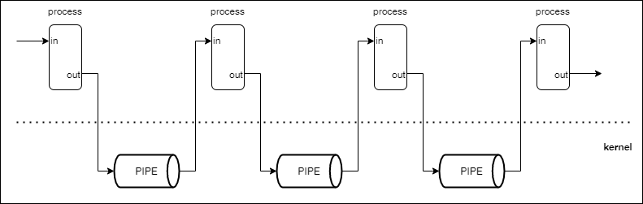
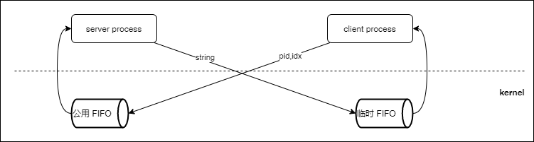

# 一起学 IPC: PIPE

IPC(Interprocess Communication)从字面上理解就是进程和进程之间通信的手段。当构建大型系统时，普遍被人接受的观点是把大型系统拆分成不同的进程，然后进程与进程之间采用某种机制互相通信，pipe 就是其中的一种机制。

PIPE 是一个单向的数据通道，一头写数据，一头读数据。写入的数据由内核缓存。在任何一台 Linux 机器上运行 man pipe 可以看到 pipe 的介绍。man 是 Linux 命令，manual 的前三个字母，用来查看文档，挺好用的。

```
#include <unistd.h>

int pipe(int pipefd[2]);
```

数组 pipefd 用来接收 2 个文件描述符，其中 pipefd[0] 用于读，pipefd[1] 用来写。返回值 0 表示调用成功，-1 表示发生错误。pipe 可以用来让子进程把结果返回给父进程，父进程如果想传参数给子进程很方便，只要在 fork 之前把数据初始化即可，子进程复制了父进程的地址空间。

```
#include <sys/wait.h>
#include <stdio.h>
#include <unistd.h>

int main(int argc, char **argv) {
  int pipefd[2];
  pipe(pipefd);
  if (fork() == 0) {
    close(pipefd[0]);
    write(pipefd[1], "Hello world!", 12);
    _exit(0);
  }
  close(pipefd[1]);
  char msg[1024];
  int n;
  while((n = read(pipefd[0], msg, sizeof(msg))) > 0) {
    printf("receive %d bytes msg: %s\n", n, msg);
  }
  wait(NULL);
}
```

需要注意的是从 PIPE 读取到 EOF(end of file) 的条件是所有的写描述符关闭。如果删掉代码 13 行，那么程序将一直阻塞在 31 行。虽然子进程的 pipefd[1] 关闭了（进程退出会关闭掉所有文件描述符），但是父进程的没有关闭。所以会一直尝试从 pipe 读取数据。另外 c 语言的标准 I/O 库有一个 buffer 会缓存数据，直到满足条件才会写到标准输出，这么设计的原因是 write 是非常昂贵的操作，为了性能尽量减少 write 的次数。这就好比从杭州拉货到宁波，肯定希望每次都拉满满的一车过去，必要的时候还可以对货物进行压缩以腾出更多的地方。

标准 I/O 的 buffer 有时候会导致我们写出 bug 代码，比如下面这段代码，在我的电脑上当 size < 1025 时不会有任何输出，原因是数据都在 buffer 里没有 write 就直接退出了，如果想要符合预期需要在 _exit 之前加一句 fflush(stdout)。

```
// bug 代码
#include <stdio.h>
#include <stdlib.h>
#include <unistd.h>

int main(int argc, char** argv) {
  int size = atoi(argv[1]);
  for (int i = 0; i < size; i++) {
    printf("%c", 'a');
  }
  _exit(0);
}
```

除了可以从子进程得到返回内容 PIPE 还可以把多个进程串成糖葫芦，这样上一个进程的处理结果就是下一个进程的处理内容，像图里一样。



```
// 省略引入头文件

int main(int argc, char **argv, char **envp) {

  char cmdstring[1024];
  int len = read(STDIN_FILENO, cmdstring, sizeof(cmdstring));
  cmdstring[len - 1] = '\0';

  char *cl[16];
  int n = 0;
  char *subcmd = strtok(cmdstring, "|");
  while (subcmd != NULL) {
    cl[n] = (char *) malloc(strlen(subcmd) * sizeof(char));
    strcpy(cl[n], subcmd);
    n++;
    subcmd = strtok(NULL, "|");
  }

  int *pl[16];
  for (int i = 0; i < n; i++) {
    pl[i] = (int *) malloc(2 * sizeof(int));
    pipe(pl[i]);
  }

  for (int i = 0; i < n; i++) {
    if (fork() == 0) {
      dup2(pl[i][0], STDIN_FILENO);
      if (i + 1 < n) {
        dup2(pl[i + 1][1], STDOUT_FILENO);
      }

      for (int i = 0; i < n; i++) {
        close(pl[i][0]);
        close(pl[i][1]);
      }

      execve(cl[i], argv, envp);
    }
  }
  for (int i = 0; i < n; i++) {
    close(pl[i][0]);
    close(pl[i][1]);
  }

  for (int i = 0; i < n; i++) {
    wait(NULL);
  }
}
```

5~17 解析输入的字符串，按照 | 分割，每个字符串代表一个命令

21~25 初始化 pipe 因为有好几个，用二维数组表示

27~41 创建子进程，并且重定向子进程的 stdin 和 stdout 重定向之后关闭所有 pipe 读写端口

42~45 关闭父进程所有 pipe 读写端口

47~49 等待子进程执行完毕并回收

程序会按照顺序执行输入的命令，并且将前一个命令的输出作为下一个命令的输入，直到最后一个命令执行完成并输出结果。我们可以写几个简单测试代码

```
// dynawing.c
#include <stdio.h>
#include <unistd.h>

int main(int argc, char **argv) {
  char msg[1024];
  int n;
  while((n = read(STDIN_FILENO, msg, sizeof(msg))) > 0) {
      msg[n] = '\0';
      printf("%s", msg);
  }
  printf("DYNAWING\n");
}
```

这段代码很简单，现将输入内容原封不动的输出，然后再输出「DYNAWING」。

```
./tinypipeshell
dynawing|dynasolider

DYNAWING
DYNASOLIDER

```

PIPE 在父子进程中很有用，但是有个缺，如果 2 个进程没有关系，这时候就很难拿到文件描述符，也就没法读写。解决这个问题需要用到 FIFO 或者叫 named pipe。

```
#include <sys/types.h>
#include <sys/stat.h>
#include <unistd.h>

int mkfifo(const char *pathname, mode_t mode);
int unlink(const char *pathname);
```

与 PIPE 相比 FIFO 的操作更加类似文件，首先需要使用 mkfifo 创建，之后所有知道 pathname 的进程都可以对 FIFO 进行读写。

FIFO 读取写入的内容都是由内核持久化的，并不会真正写入到文件，文件单纯起到一个确定唯一标识的作用。而且当获取到文件描述符后就算删掉文件也不影响代码运行。

一个简单的例子演示 FIFO 的使用，例子包含 2 个进程，client 和 server 如下图。



```server
// 省略头文件

static char *settings[2] = {
  "手持两把锟斤拷",
  "口中疾呼烫烫烫"
};

void exectask(char *buff);

int main(int argc, char **argv) {
  char *serverfifo = "/tmp/fifo/qrs.fifo";
  mode_t mode = S_IRUSR | S_IWUSR | S_IRGRP | S_IROTH;
  mkfifo(serverfifo, mode);
  int readfd = open(serverfifo, O_RDONLY);
  // exec when client come.
  open(serverfifo, O_WRONLY);

  char buff[4096]; 
  int n;
  while((n = read(readfd, buff, 4096)) > 0) {
    buff[n] = '\0';
    exectask(buff);
  }
  exit(0);
}

void exectask(char *buff) {
    int idx = atoi(strchr(buff, ',') + 1);
    char *pid = strtok(buff, ",");

    char clientpath[4096];
    snprintf(clientpath, 4096, "/tmp/fifo/%s.fifo", pid);
    int writefd = open(clientpath, O_WRONLY);
    if (idx > 0 && idx < 3) {
      write(writefd, settings[idx - 1], strlen(settings[idx - 1]));
    } else {
      write(writefd, "index out of range.", 19);
    }
    close(writefd);
}
```

3~6 定义响应的字符串

8 定义任务处理程序

11~17 创建公用的 FIFO 并分别打开读、写。14 行打开写是为了 18 的 while 循环不结束，如果没有这句，那么当 client 关闭时 FIFO 会收到 EOF 也就是 n == 0 那么循环就会退出了。另外 12 之后的代码在有 client 打开写端口之后才会执行，或者 12 和 14 还一下顺序也会执行。

20~22 从 FIFO 读取内容，传给 exectask 处理

28~29 根据逗号分割，前半截是 pid 后半截是 idx 比如 5462,1

31~39 往 client 的临时 FIFO 里面写对应的字符串内容，写完关闭文件描述符。


```client
// 省略头文件

int main(int argc, char **argv) {
  mode_t mode = S_IRUSR | S_IWUSR | S_IRGRP | S_IROTH;
  char clientfifo[4096];
  snprintf(clientfifo, 4096, "/tmp/fifo/%d.fifo", getpid());
  mkfifo(clientfifo, mode);

  char *serverfifo = "/tmp/fifo/qrs.fifo";
  int writefd = open(serverfifo, O_WRONLY);
  char buff[4096];
  snprintf(buff, 4096, "%d,%s", getpid(), argv[1]);
  write(writefd, buff, strlen(buff));
  close(writefd);

  int readfd = open(clientfifo, O_RDONLY);
  int n;
  while((n = read(readfd, buff, 4096)) > 0) {
    buff[n] = '\0';
    printf("%s", buff);
  }
  unlink(clientfifo);
  printf("\n");
}
```

4~7 创建临时 FIFO 用来获得返回值

9~14 往公用的 FIFO 按照格式写入数据，比如 5462,1

16~21 从临时 FIFO 中读取返回值

22 删除临时 FIFO 文件

运行效果 

```
# 编译代码
gcc -o qrs server.c
gcc -o qrc client.c

# 启动 server
./qrs

# 启动 client 要求返回 settings 第一个字符串
./qrc 1
手持两把锟斤拷
```

server 会顺序处理 client 的请求，这会导致一个问题，当有一个恶意的 client 写入内容后不读取临时 FIFO 的内容，这时候 server 阻塞无法处理其他 client 的请求，这就是一种 denial-of-service(DoS) 攻击。

比如我们的恶意 client 是这样的，其他内容都一样，只是没有读取临时 FIFO 那段代码

```
mode_t mode = S_IRUSR | S_IWUSR | S_IRGRP | S_IROTH;
char clientfifo[4096];
snprintf(clientfifo, 4096, "/tmp/fifo/%d.fifo", getpid());
mkfifo(clientfifo, mode);

char *serverfifo = "/tmp/fifo/qrs.fifo";
int writefd = open(serverfifo, O_WRONLY);
char buff[4096];
snprintf(buff, 4096, "%d,%s", getpid(), argv[1]);
write(writefd, buff, strlen(buff));
close(writefd);

while (1) {

}
```

解决这个问题的一种办法是让 server 具有同时处理多个 client 的能力。比如 fork 子进程来处理每个 client 的请求。

在原来代码的基础上，增加信号处理程序用来回收完成的子进程。这里的信号其实也是一种 IPC
```
void reap_child(int sig) {
  while (waitpid(-1, NULL, WNOHANG) > 0) {

  }
  return ;
}

signal(SIGCHLD, reap_child);
```

这种方式可以解决一定的问题，但是当恶意客户端足够多时 server 没法无限 fork 子程序，一旦达到上限 server 将无法提供服务。

PIPE 和 FIFO 都是由内核保留数据，当所有相关的进程都终止后留在 PIPE 或者 FIFO 里面的数据就丢失了。想要持久化数据到磁盘可以试试 POSIX message queue 命令 man mq_overview 可以查看详细信息。