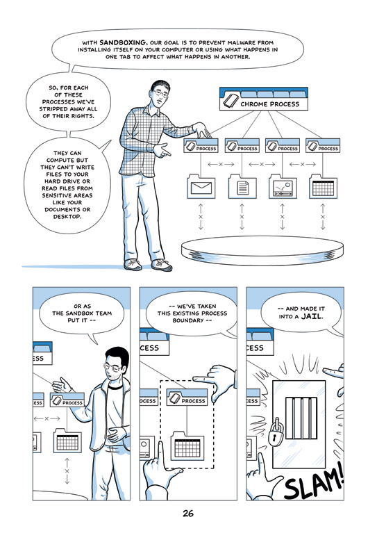
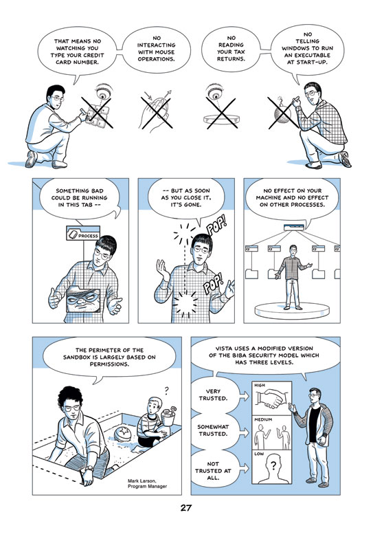

# 一起学 puppeteer

前段时间有个同事说：你试试 puppeteer，我就去谷歌了下相关的资料。根据官方描述 puppeteer 是一个 node 类库，通过提供 API 控制 Chrome 或者 Chromium 浏览器（有头无头都成），通讯的协议是 DevTools Protocol 协议。维护的团队是本家的 Chrome DevTools team 团队，他们也想通过 puppeteer 项目让大家更好的认识 DevTools Protocol。

Puppeteer 的 github 地址是 https://github.com/puppeteer/puppeteer，文档地址是 https://pptr.dev/。最近 1 个月 issue 新增 42 个，关闭 29 个，pr 新增 11 个，合并 21 个，看起来还蛮活跃的。

我对 puppeteer 的诉求是爬虫和自动化测试。Puppeteer 的 API 设计很符合直觉所以根据 README.md 的描述我们可以很快写出自己的 demo。


```typescript
import * as puppeteer from 'puppeteer';

class Index {

    async main() {
        const browser = await puppeteer.launch({ 
            headless: false, 
            args: ['--no-sandbox', '--disable-setuid-sandbox']
        });
        try {
            const page = await browser.newPage();
            await page.goto('https://console.authing.cn/login');
            await page.waitForSelector('button[type="button"]', {
                timeout: 5000
            })
            await page.click('div.styles_authing-tabs-inner__KEW7v div');
            await page.waitForSelector('#identity', {
                timeout: 3000
            })
            await page.type('#identity', 'zhangsan');
            await page.type('#password', 'password');
            await page.click('button[type="button"]');
            
            await page.waitForTimeout(10000);
            debugger;
        } finally {
            await browser.close();
        }
    }
}


(async () => {
    const index = new Index();
    await index.main();
})()
```

在终端运行 ```npm install``` 然后再运行 ```npm run try-try``` 就可以看到效果了。首先会打开一个 chromium 浏览器，然后输入地址，切换 tab 输入用户名/密码点击登录（肯定提示用户名密码不对）等待 10s 后关闭浏览器。

6 ~ 9 启动 chromium 浏览器，参数 ```headless: false``` 指定不使用无头浏览器，参数 ```--no-sandbox```, ```--disable-setuid-sandbox``` 生产尽量别用，可能会导致安全问题，关于 sandbox 是啥，这里有篇[漫画](https://www.google.com/googlebooks/chrome/med_26.html)解释。

> 
> 

21 ~ 25 打开一个新的 Tab 页，输入地址并且等待 button 元素出现，等待 5s 后超时。

26 ~ 39 点击按钮，等待 id 为 identity 的元素出现。

30 ~ 32 输入用户名、密码并提交。

37 关闭浏览器。

43 ~ 47 入口函数。

Puppeteer 通过 css selector 来定位元素，本质是 ```document.querySelector(selector)``` 方法。比较常用的有 ID selector 比如 #identity，class selector 比如 div.styles_authing-tabs-inner__KEW7v，attribute selector 比如 button[type="button"]，还有 type selector 比如 div。常写前端的同学应该都很熟悉，忘记了也可以查[文档](https://developer.mozilla.org/en-US/docs/Web/CSS/CSS_Selectors)。

如果遇到特别刁钻的元素还可以试试 ```page.$x(expression)``` 这个方法通过 xpath 选取元素比 css selector 更加灵活和强大。这个方法返回的是 ElementHandle 它的用法和 page 很类似，详细信息可以查[文档](https://pptr.dev/#?product=Puppeteer&version=v11.0.0&show=api-class-elementhandle)

为了完成自动化登录还需要通过滑动验证码验证，谷歌一番后觉得可能 python 更加适合做一些图像处理，这里借鉴的是这位大佬的[博客](https://juejin.cn/post/6970289221038931976) 《让 Python 爬虫也能读得懂「滑动验证码」》，这也是那个同事说的。当然这样做整体会复杂一点，node 和 python 需要通讯，而且为了让项目能跑起来，需要同时安装 node 环境和 python 环境。

通信用了 python-shell 这个 node 类库，使用方法也很简单，只需要指定 python 文件路径和入参即可，然后执行结果就会通过回调函数告诉 node。

```typescript
PythonShell.run(pythonFile, options, function (err, out) {
    
});
```

图像处理用了 opencv 类库，主要就是为了识别那个豁口，然后返回豁口的 (x, y) 坐标和图片的 (width, height)，用来确定滑块需要滑动多少个像素，python 的代码直接照抄那位大佬的，命名为 edge-detector.py 放到 src/utils 文件夹下。然后用 node 包装一下方便使用，万能的 Promise。

```typescript
import {PythonShell} from 'python-shell';

class ImageDetector {

    async detectEdge(imageUrl: string): Promise<Object> {
        
        return new Promise((resolve, reject) => {
            try {
                PythonShell.run('src/utils/edge-detector.py', {
                    args: [imageUrl]
                }, 
                function (err, out) {
                    if (err) throw err;
                    resolve(out);
                });
            } catch(e) {
                reject(e);
            }
        });
    }
}

export const imageDetector = new ImageDetector();
```

然后是解锁滑动验证码的代码，单独写了一个模块，包含 3 个辅助方法，命名 slideCaptcha.ts 放到 src/utils 文件夹下

```typescript
import { imageDetector } from 'utils/imageDetector';
import fetch from 'node-fetch';
import * as fs from 'fs';

class SlideCaptcha {

    async unlock(page): Promise<Object> {
        const resp:any = {};
        try {
            const frame = page.frames().find(frame => frame.name() == 'tcaptcha_iframe')
            const filepath = await this.saveCaptchaImage(frame);
            const offset = await this.getSlideOffset(frame, filepath);
            const coord = await this.getStartCoord(frame);

            await page.mouse.move(coord.x, coord.y);
            await page.mouse.down();
            await page.waitForTimeout(500);
            for (let i = 1; i <= offset; i++) {
                await page.mouse.move(coord.x + i, coord.y);
                await page.waitForTimeout(10);
            }
            await page.waitForTimeout(500);
            await page.mouse.up();
            await page.waitForTimeout(3000);
            resp.filepath = filepath;
        } catch(e) {
            console.log(e);
            resp.error = e;
        }
        return resp;
    }

    async saveCaptchaImage(frame): Promise<string> {
        const imageUrl = await frame.$eval('#slideBg', el => el.getAttribute('src'));
        const filepath = '/tmp/scrapy/login/catpchaBg.jpg';
        const response = await fetch(imageUrl);
        const dest = fs.createWriteStream(filepath);
        await response.body.pipe(dest)
        return filepath;
    }

    async getSlideOffset(frame, filepath): Promise<number> {
        const retArray = await imageDetector.detectEdge(filepath);
        const ret = JSON.parse(retArray[0]);
        const drag_bar = await frame.$('#slide');
        const bar_position = await drag_bar.boundingBox();
        const width = bar_position.width;
        const offset = width * (parseInt(ret['dx']) - 23) / parseInt(ret['width']) - 26;
        return offset;
    }

    async getStartCoord(frame) {
        const drag_btn = await frame.$('#tcaptcha_drag_thumb');
        const position = await drag_btn.boundingBox();
        return {
            'x': position.x, 
            'y': position.y + position.height / 2
        };
    }
}

export const slideCaptcha = new SlideCaptcha();
```

115 ~ 125 移动滑块，通过辅助方法得到滑块的起始位置和滑动距离，这里用 page.mouse 控制滑块。这里用 waitForTimeout 和 for 循环一个像素一个像素滑动是为了方便人眼看，实际上一滑到底也是可以的。

133 ~ 140 保存图片的辅助方法，取到 img 元素的 src 值，通过 fetch API 下载图片到本地，然后返回文件的本地路径

142 ~ 150 计算豁口的辅助方法，返回需要移动的像素。需要注意的是图片展示时实际上是被压缩的，所以图片像素和 web 页面的像素大小实际上是不一样的，所以需要等比缩小。这里的 23 是滑块图距离边缘有 23 像素，用画图工具测量的，这是图片的像素所以要等比缩一下。这里的 26 是 web 页面滑块距离左边的像素距离，这个可以再 css 样式表那边看到。

152 ~ 160 计算开始坐标，也就是滑动按钮起始位置的坐标。
