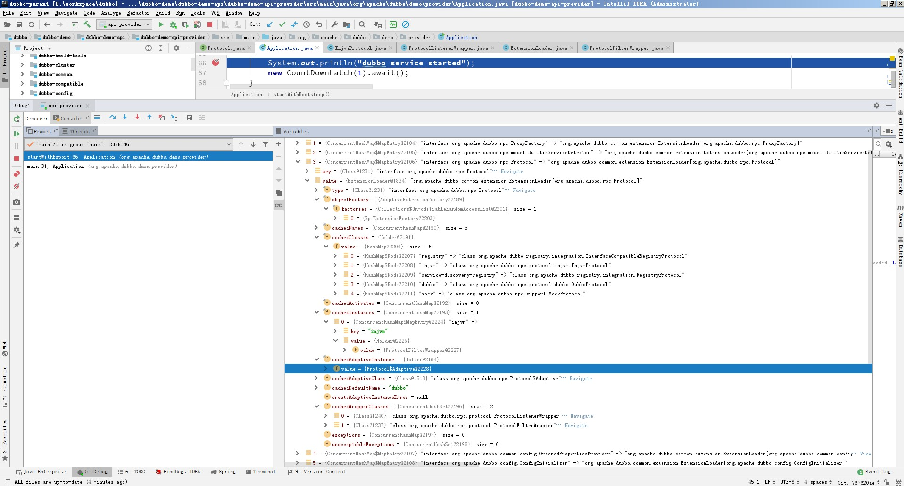
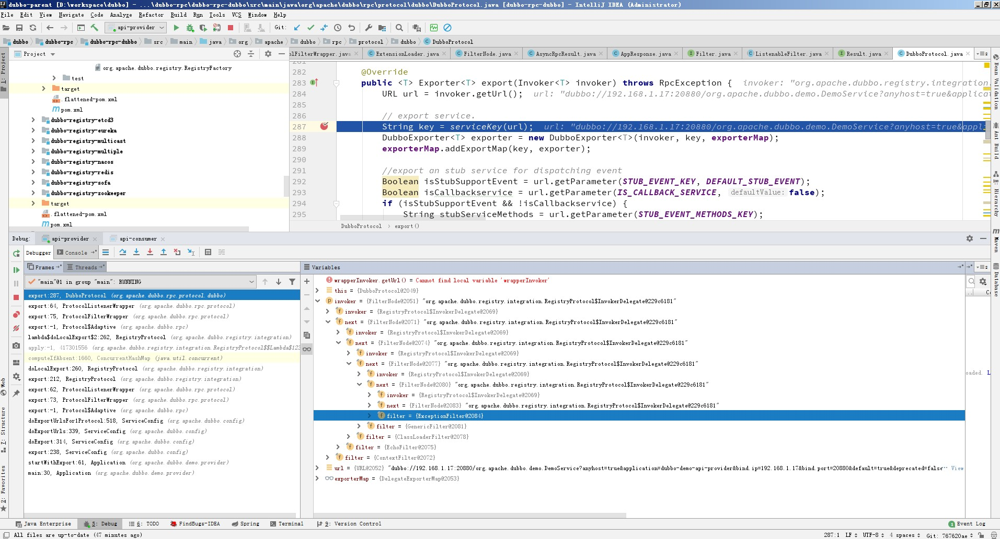

# 一起看 dubbo 源码

前段时间和同事聊天，聊起 dubbo 的泛化调用是怎么实现的，想着用了这么久的 dubbo 框架似乎没有好好看过它的源码，有点说不过去。

Dubbo 是一款高性能，基于 java 开源的 RPC 框架。RPC 是进程间通讯（IPC）的一种，目的是为了把复杂的业务功能拆分到不同的进程，每个进程负责维护各自的功能。

Dubbo 有一个很重要的扩展点加载机制，在 2.x 和 3.0 的文档里都有介绍，我认为是 dubbo 里非常重要的一个特性。

+ 2.x https://dubbo.apache.org/zh/docsv2.7/dev/spi
+ 3.0 https://dubbo.apache.org/zh/docs/concepts/extensibility

> 一般来说，系统会采用 Factory、IoC、OSGI 等方式管理扩展(插件)生命周期。考虑到 Dubbo 的适用面，不想强依赖 Spring 等 IoC 容器。 而自己造一个小的 IoC 容器，也觉得有点过度设计，所以选择最简单的 Factory 方式管理扩展(插件)。在 Dubbo 中，所有内部实现和第三方实现都是平等的。

根据 dubbo 的官方文档的解释，扩展点加载机制是一个类似 spring 的东西，最核心的类是 ExtensionLoader。它的核心流程是读取配置文件 ==> 缓存扩展实现的类 ==> 实例化对应的扩展类 ==> IOC 依赖属性注入 ==> AOP 生成包装类。

基本用法

```
Protocol PROTOCOL = ExtensionLoader.getExtensionLoader(Protocol.class).getAdaptiveExtension();
```

方法 getExtensionLoader 逻辑很简单，从 Map 中取对应的 loader 如果没有就 new 一个。


```
public static <T> ExtensionLoader<T> getExtensionLoader(Class<T> type) {
    ...
    ExtensionLoader<T> loader = (ExtensionLoader<T>) EXTENSION_LOADERS.get(type);
    if (loader == null) {
        EXTENSION_LOADERS.putIfAbsent(type, new ExtensionLoader<T>(type));
        loader = (ExtensionLoader<T>) EXTENSION_LOADERS.get(type);
    }
    return loader;
}
```

拿到 ExtensionLoader 对象后通过方法 getAdaptiveExtension 获得对应的扩展点的适配类。Dubbo 使用适配类来管理所有的扩展实例，适配类是扩展点的一个实现，以 protocol 为例，大概长这个样子。

```
...
public class Protocol$Adaptive implements Protocol {
    ...
    public Exporter export(Invoker arg0) throws RpcException {
        ...
        String extName = (url.getProtocol() == null ? "dubbo" : url.getProtocol());
        ...
        Protocol extension = ExtensionLoader.getExtensionLoader(Protocol.class).getExtension(extName);
        return extension.export(arg0);
    }

    public Invoker refer(Class arg0, URL arg1)
            throws RpcException {
        ...
        String extName = (url.getProtocol() == null ? "dubbo" : url.getProtocol());
        ...
        Protocol extension = ExtensionLoader.getExtensionLoader(Protocol.class).getExtension(extName);
        return extension.refer(arg0, arg1);
    }
}

```

这里可以把 ExtensionLoader 看做 Map，那这个模式就一下子熟悉起来了。项目中常常有这样的 case 比如有个接口要取淘宝、京东、拼多多的商品信息，就会用到类似的模式。

实际上源码里没有这个类，这个类是动态生成的。是从一串 string 在运行时动态生成的。

方法 getAdaptiveExtension 调用链很长，会把文档中的流程完整走一遍。方法本身没啥逻辑，和 ExtensionLoader 一样，从 Holder 中取 Adaptive 如果没有就通过 createAdaptiveExtension 创建

```
public T getAdaptiveExtension() {
    Object instance = cachedAdaptiveInstance.get();
    if (instance == null) {
        ...
        instance = createAdaptiveExtension();
        cachedAdaptiveInstance.set(instance);
        ...
    }

    return (T) instance;
}

```

方法 createAdaptiveExtension 有两个步骤

1. 拿到 AdaptiveClass 并初始化
2. 注入依赖

Dubbo 没有直接依赖 spring 所以类的生命周期要自己管理，对象创建、依赖注入这些都要自己实现。

方法 getAdaptiveExtensionClass 负责拿到 Class，这里能看到有两种方式，一种是直接拿 cachedAdaptiveClass 如果不存在那么通过 createAdaptiveExtensionClass 动态生成。这个方法会先生成一个字符串，然后再把字符串动态编译成 Class 估计是多数 AdaptiveClass 长得差不多，懒得写代码了。

拿到 AdaptiveClass 后通过 newInstance 创建对象，然后再通过 injectExtension 注入依赖。注入的逻辑是遍历所有方法，过滤出 set 开头，没有 DisableInject 注解，且参数不是基本类型（String、Boolean 这些也不算）的方法，然后取出属性名，注入对应的属性。

```

private T createAdaptiveExtension() {
    try {
        return injectExtension((T) getAdaptiveExtensionClass().newInstance());
    } catch (Exception e) {
        throw new IllegalStateException("Can't create adaptive extension " + type + ", cause: " + e.getMessage(), e);
    }
}

private Class<?> getAdaptiveExtensionClass() {
    getExtensionClasses();
    if (cachedAdaptiveClass != null) {
        return cachedAdaptiveClass;
    }
    return cachedAdaptiveClass = createAdaptiveExtensionClass();
}

private Class<?> createAdaptiveExtensionClass() {
    String code = new AdaptiveClassCodeGenerator(type, cachedDefaultName).generate();
    ClassLoader classLoader = findClassLoader();
    org.apache.dubbo.common.compiler.Compiler compiler =
            ExtensionLoader.getExtensionLoader(org.apache.dubbo.common.compiler.Compiler.class).getAdaptiveExtension();
    return compiler.compile(code, classLoader);
}

private T injectExtension(T instance) {

    if (objectFactory == null) {
        return instance;
    }

    try {
        for (Method method : instance.getClass().getMethods()) {
            if (!isSetter(method)) {
                continue;
            }
            /**
                * Check {@link DisableInject} to see if we need auto injection for this property
                */
            if (method.getAnnotation(DisableInject.class) != null) {
                continue;
            }
            Class<?> pt = method.getParameterTypes()[0];
            if (ReflectUtils.isPrimitives(pt)) {
                continue;
            }

            try {
                String property = getSetterProperty(method);
                Object object = objectFactory.getExtension(pt, property);
                if (object != null) {
                    method.invoke(instance, object);
                }
            } catch (Exception e) {
                logger.error("Failed to inject via method " + method.getName()
                        + " of interface " + type.getName() + ": " + e.getMessage(), e);
            }

        }
    } catch (Exception e) {
        logger.error(e.getMessage(), e);
    }
    return instance;
}

```

然后再看看赋值 cachedAdaptiveClass 的代码，也就是文档里的读取配置文件、缓存扩展实现类这部分。扩展实现类被缓存在 cachedClasses 以 KV(String-Class) 的形式存储。

然后又是老套路，不存在通过 loadExtensionClasses 加载。strategies 这个属性是通过 java 自带的 SPI 来注入，其实就是指定了 3 个 dubbo 配置文件的地址，然后 dubbo 会加载这 3 个地址下的所有配置文件。

```
private Map<String, Class<?>> getExtensionClasses() {
    Map<String, Class<?>> classes = cachedClasses.get();
    if (classes == null) {
            ...
            classes = loadExtensionClasses();
            cachedClasses.set(classes);
        }
    }
    return classes;
}

private Map<String, Class<?>> loadExtensionClasses() {
    cacheDefaultExtensionName();

    Map<String, Class<?>> extensionClasses = new HashMap<>();

    for (LoadingStrategy strategy : strategies) {
        loadDirectory(extensionClasses, strategy.directory(), type.getName(), strategy.preferExtensionClassLoader(),
                strategy.overridden(), strategy.excludedPackages());
        loadDirectory(extensionClasses, strategy.directory(), type.getName().replace("org.apache", "com.alibaba"),
                strategy.preferExtensionClassLoader(), strategy.overridden(), strategy.excludedPackages());
    }

    return extensionClasses;
}
```

方法 loadResource 会读取配置文件的内容，逐行解析，dubbo 对原生的 SPI 做了增强，配置文件支持 KV 形式定义，源码体现为 int i = line.indexOf('=')。

```

private void loadResource(Map<String, Class<?>> extensionClasses, ClassLoader classLoader,
                            java.net.URL resourceURL, boolean overridden, String... excludedPackages) {
    try {
        try (BufferedReader reader = new BufferedReader(new InputStreamReader(resourceURL.openStream(), StandardCharsets.UTF_8))) {
            String line;
            String clazz = null;
            while ((line = reader.readLine()) != null) {
                ...
                if (line.length() > 0) {
                    try {
                        String name = null;
                        int i = line.indexOf('=');
                        if (i > 0) {
                            name = line.substring(0, i).trim();
                            clazz = line.substring(i + 1).trim();
                        } else {
                            clazz = line;
                        }
                        if (StringUtils.isNotEmpty(clazz) && !isExcluded(clazz, excludedPackages)) {
                            loadClass(extensionClasses, resourceURL, Class.forName(clazz, true, classLoader), name, overridden);
                        }
                    } catch (Throwable t) {
                        ...
                    }
                }
            }
        }
    } catch (Throwable t) {
        ...
    }
}

```

方法 loadClass 把 class 分类

+ 带有 Adaptive 注解的是 AdaptiveClass 赋值给 cachedAdaptiveClass
+ 包装类添加到 cachedWrapperClasses 集合
+ 其他的类都放到 extensionClasses 里，最后被缓存到 cachedClasses。

另外在 2.7.15 版本里看到了 Wrapper 注解，不过并没有使用，猜测是用于判断是否包装类。

```
private void loadClass(Map<String, Class<?>> extensionClasses, java.net.URL resourceURL, Class<?> clazz, String name,
                        boolean overridden) throws NoSuchMethodException {
    ...
    if (clazz.isAnnotationPresent(Adaptive.class)) {
        cacheAdaptiveClass(clazz, overridden);
    } else if (isWrapperClass(clazz)) {
        cacheWrapperClass(clazz);
    } else {
        ...
        String[] names = NAME_SEPARATOR.split(name);
        if (ArrayUtils.isNotEmpty(names)) {
            cacheActivateClass(clazz, names[0]);
            for (String n : names) {
                cacheName(clazz, n);
                saveInExtensionClass(extensionClasses, clazz, n, overridden);
            }
        }
    }
}

private void cacheAdaptiveClass(Class<?> clazz, boolean overridden) {
    if (cachedAdaptiveClass == null || overridden) {
        cachedAdaptiveClass = clazz;
    } ...
}

private void cacheWrapperClass(Class<?> clazz) {
    if (cachedWrapperClasses == null) {
        cachedWrapperClasses = new ConcurrentHashSet<>();
    }
    cachedWrapperClasses.add(clazz);
}

private void saveInExtensionClass(Map<String, Class<?>> extensionClasses, Class<?> clazz, String name, boolean overridden) {
    Class<?> c = extensionClasses.get(name);
    if (c == null || overridden) {
        extensionClasses.put(name, clazz);
    } ...
}
```

最后看一下 objectFactory 这个属性在依赖注入 injectExtension 里用到，用来获取对应的依赖对象。这个属性赋值在构造方法里，现在看到就不陌生了，直接找 ExtensionFactory 的实现类里有没有用 @Adaptive 注解的就行，这里注入的是 AdaptiveExtensionFactory。它的 factories 属性包含 SpiExtensionFactory 这个对象，当然可以通过配置文件调整 org.apache.dubbo.common.extension.ExtensionFactory。

```
private ExtensionLoader(Class<?> type) {
    this.type = type;
    objectFactory =
            (type == ExtensionFactory.class ? null : ExtensionLoader.getExtensionLoader(ExtensionFactory.class).getAdaptiveExtension());
}
```

SpiExtensionFactory 获取的是适配类，也就是说默认模式下注入的依赖都是适配类的对象。
```
public <T> T getExtension(Class<T> type, String name) {
    if (type.isInterface() && type.isAnnotationPresent(SPI.class)) {
        ExtensionLoader<T> loader = ExtensionLoader.getExtensionLoader(type);
        if (!loader.getSupportedExtensions().isEmpty()) {
            return loader.getAdaptiveExtension();
        }
    }
    return null;
}
```


AdaptiveClass 使用如下的方式得到真正的实现类

```
Protocol extension = ExtensionLoader.getExtensionLoader(Protocol.class).getExtension(extName);
```

前半截拿到 ExtensionLoader 不多说了同上，主要看 getExtension 方法。

```
public T getExtension(String name, boolean wrap) {
    ...
    final Holder<Object> holder = getOrCreateHolder(name);
    Object instance = holder.get();
    if (instance == null) {
        ...
        instance = createExtension(name, wrap);
        holder.set(instance);
        ...
    }
    return (T) instance;
}

private T createExtension(String name, boolean wrap) {
    Class<?> clazz = getExtensionClasses().get(name);
    ...
    try {
        T instance = (T) EXTENSION_INSTANCES.get(clazz);
        if (instance == null) {
            EXTENSION_INSTANCES.putIfAbsent(clazz, clazz.getDeclaredConstructor().newInstance());
            instance = (T) EXTENSION_INSTANCES.get(clazz);
        }
        injectExtension(instance);


        if (wrap) {
            ...
            if (CollectionUtils.isNotEmpty(wrapperClassesList)) {
                for (Class<?> wrapperClass : wrapperClassesList) {
                    ...
                    instance = injectExtension((T) wrapperClass.getConstructor(type).newInstance(instance));
                }
            }
        }

        initExtension(instance);
        return instance;
    } catch (Throwable t) {
        ...
    }
}

```

老套路，为 null 则创建，根据 name 获得对应的扩展实现类，getExtensionClasses 能拿到所有的扩展实现类（除 Adaptive 和 Wrapper）之后初始化、注入依赖。这里体现了另一个 dubbo SPI 机制的另一个优点：按需加载。只有使用到的类会被初始化，可以节省资源。

如果需要包装（wrap == true）则会创建包装类，包装类缓存在 cachedWrapperClasses 对象里。这个包装类实现了类似 AOP 的功能，用的装饰器模式，格式有点像俄罗斯套娃

```
new ProtocolFilterWrapper(new ProtocolListenerWrapper(new InjvmProtocol()))
```

核心逻辑在最里面的 InjvmProtocol 这个对象里，ProtocolFilterWrapper 和 ProtocolListenerWrapper 做些锦上添花的工作。

到这里 dubbo 类加载这块的源码就差不多了，看接下来的源码也会稍微容易点。先把代码跑起来，看看对类加载这块代码的理解对不对。找到项目 dubbo-demo > dubbo-demo-api > dubbo-demo-api-provider 下的 org.apache.dubbo.demo.provider.Application 类，为了能在没有注册中心的情况下启动需要做一些修改，如果有注册中心，那只要改一下地址即可，比如已经有 zookeeper 了那就替换为对应的地址即可。

另外 ExtensionLoader 其实可以单独拿出来用，当做是 java SPI 的增强功能使用，不过日常工作中有 spring 这个大杀器在，用的场景也不多。

```
private static void startWithExport() throws InterruptedException {
    ServiceConfig<DemoServiceImpl> service = new ServiceConfig<>();
    service.setInterface(DemoService.class);
    service.setRef(new DemoServiceImpl());
    service.setApplication(new ApplicationConfig("dubbo-demo-api-provider"));

    // 使用 injvm 协议，使用这个协议 dubbo 启动不会检查注册中心，但是这个协议只能自己进程调用，实际业务中好像没啥用
    ProtocolConfig protocol = new ProtocolConfig();
    protocol.setName("injvm");
    service.setProtocol(protocol);
    // 注释掉注册中心代码
//    service.setRegistry(new RegistryConfig("zookeeper://192.168.1.77:2181"));
    service.export();

    System.out.println("dubbo service started");
    new CountDownLatch(1).await();
}
```

在最后一行打个断点，然后启动项目，记得加参数 classic，程序会运行到断点处停止。然后我们可以在 watches 处输入 ```ExtensionLoader.EXTENSION_LOADERS``` 可以看到下图


静态变量 EXTENSION_LOADERS 以 KV(class-ExtensionLoader) 的形式保存所有的 ExtensionLoader 对象，随便展开一个 ExtensionLoader 



各个属性和期望一样，Protocol 的实现类里有 2 个包装类，所以 InjvmProtocol 对象会被 ProtocolFilterWrapper 和 ProtocolListenerWrapper 装饰，最终使用时用的是类 ProtocolFilterWrapper 的引用

接下来看一下 export 的过程，顺着官方给的时序图来


在 dubbo 框架里 URL 基本贯穿整个调用链，这里可以吧 URL 理解成 Map 以 KV 的形式保存各种各样的配置，然后代码不断的读取和修改配置，也正因为 URL 贯穿整个调用链，而扩展点又是根据 URL 的值来确定的，从而把各个扩展点串了起来。

export 方法前面都挺清晰的

```
private void doExportUrlsFor1Protocol(ProtocolConfig protocolConfig, List<URL> registryURLs, int protocolConfigNum) {
    String name = protocolConfig.getName();
    ...
    String scope = url.getParameter(SCOPE_KEY);
    // don't export when none is configured
    if (!SCOPE_NONE.equalsIgnoreCase(scope)) {

        // export to local if the config is not remote (export to remote only when config is remote)
        if (!SCOPE_REMOTE.equalsIgnoreCase(scope)) {
            exportLocal(url);
        }
        // export to remote if the config is not local (export to local only when config is local)
        if (!SCOPE_LOCAL.equalsIgnoreCase(scope)) {
            if (CollectionUtils.isNotEmpty(registryURLs)) {
                for (URL registryURL : registryURLs) {
                    ...
                    Invoker<?> invoker = PROXY_FACTORY.getInvoker(ref, (Class) interfaceClass,
                            registryURL.addParameterAndEncoded(EXPORT_KEY, url.toFullString()));
                    DelegateProviderMetaDataInvoker wrapperInvoker = new DelegateProviderMetaDataInvoker(invoker, this);

                    Exporter<?> exporter = PROTOCOL.export(wrapperInvoker);
                    exporters.add(exporter);
                }
            } ...
        }
    }
    this.urls.add(url);
}
```
方法 doExportUrlsFor1Protocol 会根据 scope 决定需要暴露哪些服务，默认是 null 会暴露本地和远程两个服务，主要看远程暴露，两个步骤

+ PROXY_FACTORY 代理生成 invoker
+ PROTOCOL 协议暴露服务

PROXY_FACTORY 根据上面的理解拿到的是适配类（动态生成的），适配类的 getInvoker 方法会根据配置选取合适扩展点实现。模式配置的 proxy = null 选取的是默认扩展实现，也就是 ProxyFactory 类注解上的 javassist 对应的实现。查询配置文件可知识 JavassistProxyFactory。ProxyFactory 有一个包装类 StubProxyFactoryWrapper 所以调用链应该是 ProxyFactory$Adaptive.getInvoker ==> StubProxyFactoryWrapper.getInvoker ==> JavassistProxyFactory.getInvoker。具体的实现是 

```
public <T> Invoker<T> getInvoker(T proxy, Class<T> type, URL url) {
    // TODO Wrapper cannot handle this scenario correctly: the classname contains '$'
    final Wrapper wrapper = Wrapper.getWrapper(proxy.getClass().getName().indexOf('$') < 0 ? proxy.getClass() : type);
    return new AbstractProxyInvoker<T>(proxy, type, url) {
        @Override
        protected Object doInvoke(T proxy, String methodName,
                                    Class<?>[] parameterTypes,
                                    Object[] arguments) throws Throwable {
            return wrapper.invokeMethod(proxy, methodName, parameterTypes, arguments);
        }
    };
}
```

它会先生成一个 Wrapper 类，反编译过来大概长这样。通过在 ClassGenerator#toClass(ClassLoader, ProtectionDomain) 这个方法返回前打断点。然后在 watches 里执行 mCtc.writeFile() 可以把将要生成的 class 保存在本地，然后用 IDE 或者反编译软件打开就能得到反编译的代码。

```
...
public class Wrapper1 extends Wrapper implements DC {
    ...
    public Object invokeMethod(Object var1, String var2, Class[] var3, Object[] var4) throws InvocationTargetException {
        DemoServiceImpl var5;
        try {
            var5 = (DemoServiceImpl)var1;
        } catch (Throwable var8) {
            throw new IllegalArgumentException(var8);
        }

        try {
            if ("sayHelloAsync".equals(var2) && var3.length == 1) {
                return var5.sayHelloAsync((String)var4[0]);
            }

            if ("sayHello".equals(var2) && var3.length == 1) {
                return var5.sayHello((String)var4[0]);
            }
        } catch (Throwable var9) {
            throw new InvocationTargetException(var9);
        }

        throw new NoSuchMethodException("Not found method \"" + var2 + "\" in class org.apache.dubbo.demo.provider.DemoServiceImpl.");
    }

    public Wrapper1() {
    }
}
```
其他的都不重要，只要看 invokeMethod 方法，因为 JavassistProxyFactory 生成的 Inovker 调用的是 Wrapper.invokeMethod。从反编译代码可以看到，这里本质就是调用的本地的 DemoServiceImpl 的对应的 sayHello 和 sayHelloAsync 方法。换句话说当执行 Inovker.invoke(invocation) 其实就是调用了 proxy 中的某个方法，至于是哪个方法，由 invocation.getMethodName() 决定。而这个 proxy 就是 ServiceConfig 的 ref 属性，dubbo 接口实现类的对象。

然后是第二个步骤 invoker 暴露成 exporter。

同理 PROTOCOL 拿到的是适配类（动态生成）这里需要注意一点，此时 invoker 保存的 URL 是 registry://...&export=dubbo%3A%2F%2F...&pid=55468... 这样的格式，所以这时取到的协议是 registry 对应的协议而不是 dubbo 对应的协议，根据配置是 InterfaceCompatibleRegistryProtocol，当然也会被 ProtocolFilterWrapper 和 ProtocolListenerWrapper 装饰，所以这两个类的 export 和 refer 方法里有个 UrlUtils.isRegistry(url) 判断。

InterfaceCompatibleRegistryProtocol 没有重写 export 方法，用的是 RegistryProtocol 的实现

```
public <T> Exporter<T> export(final Invoker<T> originInvoker) throws RpcException {
    URL registryUrl = getRegistryUrl(originInvoker);
    // url to export locally
    URL providerUrl = getProviderUrl(originInvoker);

    ...
    // export invoker
    final ExporterChangeableWrapper<T> exporter = doLocalExport(originInvoker, providerUrl);
    ...
    return new DestroyableExporter<>(exporter);
}

private <T> ExporterChangeableWrapper<T> doLocalExport(final Invoker<T> originInvoker, URL providerUrl) {
    String key = getCacheKey(originInvoker);

    return (ExporterChangeableWrapper<T>) bounds.computeIfAbsent(key, s -> {
        Invoker<?> invokerDelegate = new InvokerDelegate<>(originInvoker, providerUrl);
        return new ExporterChangeableWrapper<>((Exporter<T>) protocol.export(invokerDelegate), originInvoker);
    });
}
```
computeIfAbsent 根据 javadoc 描述，如果 key 对应的 value 存在则返回， 否则根据 Function 创建对象。这里的 url 替换为了 providerUrl 也就是 dubbo://... 格式的，这里的 protocol 根据依赖注入的代码可知是 Protocol$Adaptive 也就是适配类。这次会调用到 DubboProtocol 了。新生成的 invoker 和原石的 originInvoker 会都保存在 ExporterChangeableWrapper 返回给 ServiceConfig 最后缓存在 exporters 对象里。

DubboProtocol 也会被 ProtocolFilterWrapper 和 ProtocolListenerWrapper 装饰，ProtocolFilterWrapper 这次总算干点事了，会按照标准的责任链模式把 filter 构建成 invoker，ProtocolListenerWrapper 好像依然打酱油，啥事没干。

```
private static <T> Invoker<T> buildInvokerChain(final Invoker<T> invoker, String key, String group) {
    Invoker<T> last = invoker;
    List<Filter> filters = ExtensionLoader.getExtensionLoader(Filter.class).getActivateExtension(invoker.getUrl(), key, group);

    if (!filters.isEmpty()) {
        for (int i = filters.size() - 1; i >= 0; i--) {
            final Filter filter = filters.get(i);
            last = new FilterNode<T>(invoker, last, filter);
        }
    }

    return last;
}
```

通过 ExtensionLoader 得到所有激活的 filters（有了前面类加载的理解，这段逻辑应该容易看懂了）。然后把 filter 倒序遍历，用 FilterNode 包装 filter 最后得到类似这样的结构



每个 FilterNode 持有下一个 FilterNode 的引用，上图中的 next 这样就把何时中断调用的控制权交给了 filter 只要 filter 不调用 next.invoke(invocation) 那么调用链就终止了

终于到 DubboProtocol 了

```
public <T> Exporter<T> export(Invoker<T> invoker) throws RpcException {
    URL url = invoker.getUrl();

    // export service.
    String key = serviceKey(url);
    DubboExporter<T> exporter = new DubboExporter<T>(invoker, key, exporterMap);
    exporterMap.addExportMap(key, exporter);

    ...
    openServer(url);
    optimizeSerialization(url);

    return exporter;
}
```

export 方法新建 exporter 对象，缓存到 exporterMap key 由 4 部分组成 port, path(interface), version, group 也就是这 4 个要素唯一确定一个服务，这个后面要用的，收到 consumer 端请求后，会从这个 Map 找对应的 exporter 在找到对应的 invoker，然后调用 operServer 方法

```
private void openServer(URL url) {
    // find server.
    String key = url.getAddress();
    //client can export a service which's only for server to invoke
    boolean isServer = url.getParameter(IS_SERVER_KEY, true);
    if (isServer) {
        ProtocolServer server = serverMap.get(key);
        if (server == null) {
            ...
            serverMap.put(key, createServer(url));
            ...
        } ...
    }
}

```

openServer 逻辑很简单，老套路，为 null 则通过 createServer 创建。

```
private ProtocolServer createServer(URL url) {
    ...
    ExchangeServer server;
    try {
        server = Exchangers.bind(url, requestHandler);
    } catch (RemotingException e) {
        throw new RpcException("Fail to start server(url: " + url + ") " + e.getMessage(), e);
    }
    ...
    return new DubboProtocolServer(server);
}
```
createServer 监听端口，由 requestHandler 来处理收到的消息。


再看 refer 的过程


```
public synchronized T get() {
    ...
    if (ref == null) {
        init();
    }
    return ref;
}

public synchronized void init() {
    ...
    ref = createProxy(map);
    ...
}

private T createProxy(Map<String, String> map) {
    if (shouldJvmRefer(map)) {
        ...
    } else {
        ...
        if (urls.size() == 1) {
            invoker = REF_PROTOCOL.refer(interfaceClass, urls.get(0));
        } else {
            ...
        }
    }
    ...
    // create service proxy
    return (T) PROXY_FACTORY.getProxy(invoker, ProtocolUtils.isGeneric(generic));
}

```
ReferenceConfig.get() 判读 ref 为 null 调用 init 初始化，init 会检查一些列配置，然后调用 createProxy 创建代理类。

createProxy 主要有 2 个步骤

+ 创建 invoker 对象
+ 创建 ref 代理类

步骤 1 根据配置配置的 url 数量不同，执行不同的逻辑，这里挑比较简单的 1 个注册中心的情况

根据类加载机制 REF_PROTOCOL 拿到的是 Protocol 的适配类，又因为 url 以 registry:// 开头，所以调用的应该是 InterfaceCompatibleRegistryProtocol 的 refer 方法（没有重写，实际会调用到 RegistryProtocol），当然那两个包装类肯定也会调用的，只是它们没有任何逻辑，纯纯的中间人。

```
public <T> Invoker<T> refer(Class<T> type, URL url) throws RpcException {
    url = getRegistryUrl(url);
    Registry registry = getRegistry(url);
    ...
    Cluster cluster = Cluster.getCluster(qs.get(CLUSTER_KEY));
    return doRefer(cluster, registry, type, url, qs);
}

protected <T> Invoker<T> doRefer(Cluster cluster, Registry registry, Class<T> type, URL url, Map<String, String> parameters) {
    URL consumerUrl = new URL(CONSUMER_PROTOCOL, parameters.remove(REGISTER_IP_KEY), 0, type.getName(), parameters);
    ClusterInvoker<T> migrationInvoker = getMigrationInvoker(this, cluster, registry, type, url, consumerUrl);
    return interceptInvoker(migrationInvoker, url, consumerUrl);
}


protected <T> ClusterInvoker<T> getMigrationInvoker(RegistryProtocol registryProtocol, Cluster cluster, Registry registry,
                                                    Class<T> type, URL url, URL consumerUrl) {
    return new ServiceDiscoveryMigrationInvoker<T>(registryProtocol, cluster, registry, type, url, consumerUrl);
}
```

getRegistryUrl 把 url 从 registry:// 转成对应的注册中心地址，这里是 zookeeper://... 然后 getRegistry 获得 ZookeeperRegistry，外面有一个装饰类。

在通过 getCluster 获得 cluster 默认是 FailoverCluster，doRefer 返回 ServiceDiscoveryMigrationInvoker。这几个套娃的 Invoker 也不知道干啥用的，看名字难道是搞什么迁移用的？兜兜转转调用到 InterfaceCompatibleRegistryProtocol.getInvoker 方法

```
public <T> ClusterInvoker<T> getInvoker(Cluster cluster, Registry registry, Class<T> type, URL url) {
    DynamicDirectory<T> directory = new RegistryDirectory<>(type, url);
    return doCreateInvoker(directory, cluster, registry, type);
}
```
然后会调用 registry.subscribe 我们用的是 zookeeper 当做注册中心会进入 ZookeeperRegistry

```
public void doSubscribe(final URL url, final NotifyListener listener) {
    try {
        if (ANY_VALUE.equals(url.getServiceInterface())) {
            ...
        } else {
            CountDownLatch latch = new CountDownLatch(1);
            try {
                List<URL> urls = new ArrayList<>();
                for (String path : toCategoriesPath(url)) {
                    ConcurrentMap<NotifyListener, ChildListener> listeners = zkListeners.computeIfAbsent(url, k -> new ConcurrentHashMap<>());
                    ChildListener zkListener = listeners.computeIfAbsent(listener, k -> new RegistryChildListenerImpl(url, k, latch));
                    if (zkListener instanceof RegistryChildListenerImpl) {
                        ((RegistryChildListenerImpl) zkListener).setLatch(latch);
                    }
                    zkClient.create(path, false);
                    List<String> children = zkClient.addChildListener(path, zkListener);
                    if (children != null) {
                        urls.addAll(toUrlsWithEmpty(url, path, children));
                    }
                }
                notify(url, listener, urls);
            } ...
        }
    } ...
}
```

根据 url 和 listener 唯一确定一个 zkListener，然后给 zk 添加监听器，url 变化或者订阅都会调用 notify 方法，刷新 invoker 对象。在 AbstractProtocol 的 refer 方法打断点可以看到整个调用栈，最后到 DubboProtocol 的 refer 方法。

```
public <T> Invoker<T> refer(Class<T> type, URL url) throws RpcException {
    return new AsyncToSyncInvoker<>(protocolBindingRefer(type, url));
}

public <T> Invoker<T> protocolBindingRefer(Class<T> serviceType, URL url) throws RpcException {
    optimizeSerialization(url);

    // create rpc invoker.
    DubboInvoker<T> invoker = new DubboInvoker<T>(serviceType, url, getClients(url), invokers);
    invokers.add(invoker);

    return invoker;
}

private ExchangeClient[] getClients(URL url) {
    // whether to share connection
    int connections = url.getParameter(CONNECTIONS_KEY, 0);
    // if not configured, connection is shared, otherwise, one connection for one service
    if (connections == 0) {
        ...
        return getSharedClient(url, connections).toArray(new ExchangeClient[0]);
    } ...

}
private ExchangeClient initClient(URL url) {
    ...
    ExchangeClient client;
    try {
        // connection should be lazy
        if (url.getParameter(LAZY_CONNECT_KEY, false)) {
            client = new LazyConnectExchangeClient(url, requestHandler);

        } else {
            client = Exchangers.connect(url, requestHandler);
        }

    } ...

    return client;
}

```

DubboProtocol 根据 url 的信息创建 client。


步骤 2 invoker 创建成功后 PROXY_FACTORY 调用 StubProxyFactoryWrapper.getProxy 方法创建代理类，又要开始动态创建类了。

```
public <T> T getProxy(Invoker<T> invoker, boolean generic) throws RpcException {
    Set<Class<?>> interfaces = new HashSet<>();
    ...
    interfaces.add(invoker.getInterface());
    interfaces.addAll(Arrays.asList(INTERNAL_INTERFACES));

    return getProxy(invoker, interfaces.toArray(new Class<?>[0]));
}

public <T> T getProxy(Invoker<T> invoker, Class<?>[] interfaces) {
    return (T) Proxy.getProxy(interfaces).newInstance(new InvokerInvocationHandler(invoker));
}
```

默认情况下生成的代理会实现 invoker.getInterface(), EchoService, Destroyable 这 3 个接口，泛化调用额外多实现 GenericService 接口，URL 里的 interfaces 属性可以也可以手动指定需要实现的接口，所有的接口会放在 interfaces 集合里，然后通过方法 Proxy.getProxy(interfaces) 生成一个 Proxy 子类，反编译过来大概长这样

```
...
public class Proxy0 extends Proxy implements DC {
    public Object newInstance(InvocationHandler var1) {
        return new proxy0(var1);
    }

    public Proxy0() {
    }
}
```

非常简单，只有一个方法 newInstance，返回一个 proxy0 对象。这里很坑爹，这两个类命名超级像，唯一的差别是一个 P 大写，一个 p 小写。用 mCtc.writeFlie() 保存文件的时候 window 又不区分大小写，搞得我还以为是一个类，就纳了闷了这个类里面啥都没有，那初始化起来有个屁用。

```
...
public class proxy0 implements DC, EchoService, Destroyable, DemoService {
    public static Method[] methods;
    private InvocationHandler handler;

    public void $destroy() {
        Object[] var1 = new Object[0];
        this.handler.invoke(this, methods[0], var1);
    }

    public String sayHello(String var1) {
        Object[] var2 = new Object[]{var1};
        Object var3 = this.handler.invoke(this, methods[1], var2);
        return (String)var3;
    }

    public CompletableFuture sayHelloAsync(String var1) {
        Object[] var2 = new Object[]{var1};
        Object var3 = this.handler.invoke(this, methods[2], var2);
        return (CompletableFuture)var3;
    }

    public Object $echo(Object var1) {
        Object[] var2 = new Object[]{var1};
        Object var3 = this.handler.invoke(this, methods[3], var2);
        return (Object)var3;
    }

    public proxy0() {
    }

    public proxy0(InvocationHandler var1) {
        this.handler = var1;
    }
}

```

关键的类会实现所有传入的接口，也是最终返回的对象，每个方法都有实现，委托给构造方法的入参 InvocationHandler，在这里是 InvokerInvocationHandler，这样在调用 DemoService.sayHello 的时候实际上会调用 InvokerInvocationHandler.invoke 方法。

最终把这个对象赋值给 ref，消费端的初始化过程就结束。

如前面所说，当消费端调用 sayHello 方法时会调用 invoke 方法，接下来的过程主要是拼装参数到 invocation 然后发往 provider 端。

```
public Object invoke(Object proxy, Method method, Object[] args) throws Throwable {
    ...
    RpcInvocation rpcInvocation = new RpcInvocation(method, invoker.getInterface().getName(), protocolServiceKey, args);
    String serviceKey = invoker.getUrl().getServiceKey();
    rpcInvocation.setTargetServiceUniqueName(serviceKey);
    ...
    return invoker.invoke(rpcInvocation).recreate();
}
```
初始化 RpcInvocation 然后一层一层向里面调用，到 MockClusterInvoker 的时候可以看到 mock 功能是如何实现的，到 AbstractClusterInvoker 的时候可以看到 loadbalance 是如何实现的，到 FailoverClusterInvoker 的时候可以看到故障转移是如何实现的，到 InvokerWrapper 会挨个调用 filter 最后一路到 DubboInvoker。

```
protected Result doInvoke(final Invocation invocation) throws Throwable {
    ...
    ExchangeClient currentClient;
    if (clients.length == 1) {
        currentClient = clients[0];
    } else {
        currentClient = clients[index.getAndIncrement() % clients.length];
    }
    try {
        boolean isOneway = RpcUtils.isOneway(getUrl(), invocation);
        int timeout = calculateTimeout(invocation, methodName);
        invocation.put(TIMEOUT_KEY, timeout);
        if (isOneway) {
            ...
        } else {
            ExecutorService executor = getCallbackExecutor(getUrl(), inv);
            CompletableFuture<AppResponse> appResponseFuture =
                    currentClient.request(inv, timeout, executor).thenApply(obj -> (AppResponse) obj);
            // save for 2.6.x compatibility, for example, TraceFilter in Zipkin uses com.alibaba.xxx.FutureAdapter
            FutureContext.getContext().setCompatibleFuture(appResponseFuture);
            AsyncRpcResult result = new AsyncRpcResult(appResponseFuture, inv);
            result.setExecutor(executor);
            return result;
        }
    } ...
}

```
dubbo 通过 ExchangeClient 默认是 netty4 把消息发往 provider 端，provider 端处理完之后返回消息，client


Dubbo 的必须的外部依赖不多，主要有 javassist、netty 等。

Javassist(Java Programming Assistant) 是一个工具库维护字节码更加方便，它可以做到在 java 运行时创建类或者修改类。Dubbo 用它创建好多适配类，估计是不高兴写这部分格式差不多的代码。

Dubbo 使用 javasist 开发一个工具类 JavassistCompiler 用来在运行时将字符串编译成 Class 类，然后再使用，所以在 debug 代码时有时候会进入虚空。

它的使用方法可以看单元测试 JavassistCompilerTest getSampleCode() 返回的字符串就是日常写的 java 代码，经过 JavassistCompiler 编译成 Class 在通过反射调用 sayHello 方法。

```
@Test
public void testCompileJavaClass() throws Exception {
    JavassistCompiler compiler = new JavassistCompiler();
    Class<?> clazz = compiler.compile(getSimpleCode(), JavassistCompiler.class.getClassLoader());

    // Because javassist compiles using the caller class loader, we should't use HelloService directly
    Object instance = clazz.newInstance();
    Method sayHello = instance.getClass().getMethod("sayHello");
    Assertions.assertEquals("Hello world!", sayHello.invoke(instance));
}

String getSimpleCode() {
    StringBuilder code = new StringBuilder();
    code.append("package org.apache.dubbo.common.compiler.support;");

    code.append("public class HelloServiceImpl" + SUFFIX.getAndIncrement() + " implements HelloService {");
    code.append("   public String sayHello() { ");
    code.append("       return \"Hello world!\"; ");
    code.append("   }");
    code.append("}");
    return code.toString();
}
```

除了

Netty 是一个通信框架，写 Socket 更加方便，而且它是 NIO 的，性能会更好。

