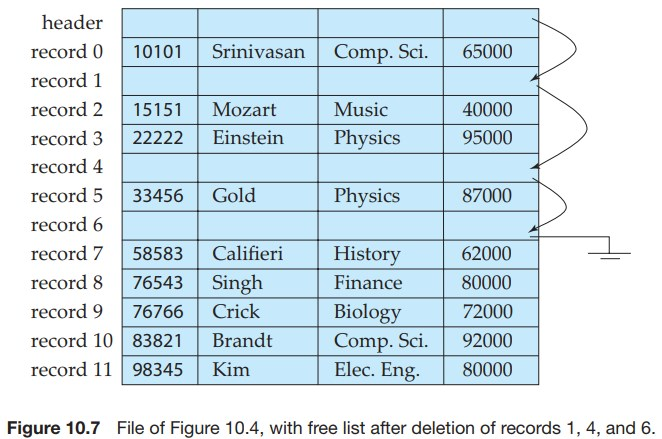
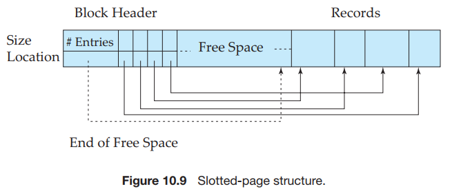
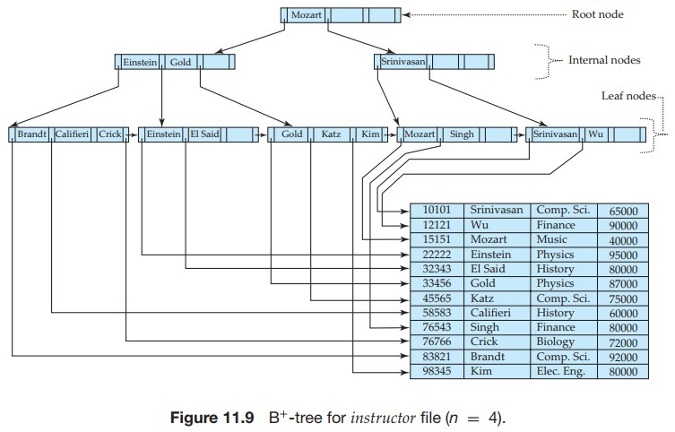
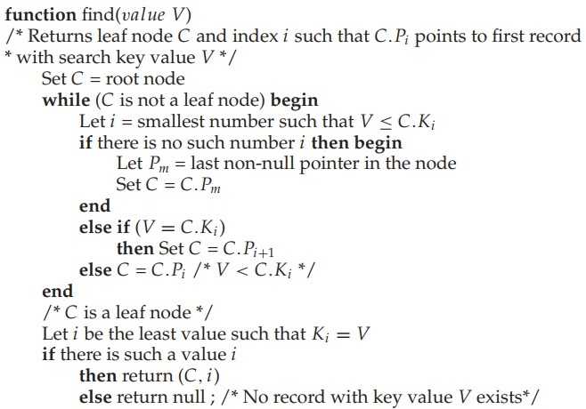
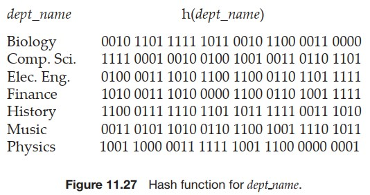

# 数据库存储和索引

这篇是《数据库系统概念》第 10，11 章的学习笔记，虽然数据库用了很多年，但是除了用法对数据库本身了解不多，以至于和同事吃饭吹牛的时候只能听他们侃侃而谈，我只能在旁边直呼 666。

为了了解数据库的存储首先要了解存储介质，现在比较多的是机械硬盘和固态硬盘，固态硬盘性能好比较贵，机械硬盘反过来。先说机械硬盘，它有一个机械臂组件和若干个盘片，数据都记录在盘片上，机械臂的末端是一个读写头，悬浮在盘片上，当盘片旋转时读写头就能读取到数据。为了方便盘片会划分为磁道（就是一个个同心圆），磁道再被划分成扇区。


机械硬盘读取数据分三步

1. 机械臂找到对应的磁道
2. 盘片旋转找到起始地址
3. 盘片旋转读取扇区数据

这三步里第一步最耗时，盘片越大越慢，其次是第二步。这里可以用坐地铁打比方，当想乘坐地铁去一个地方的时候，去地铁站是最费时的，尤其据地铁站很远。然后是等地铁费时，尤其是上一班刚走，一旦坐上了地铁，那么坐三个站还是五个站其实区别不大。

因此为了优化性能，每次读取的时候会把整个扇区都读到内存里，反正费不了多长时间，不读白不读。也因此内存和磁盘之间的数据交换通常按「块」来，这个「块」有叫 block 的，也有叫 page 估计不严谨可以混着用。

另外操作系统有局部性原理：时间局部性（Temporal Locality）和空间局部性（Spatial locality）。其中空间局部性说的是，当前被读取到的地址，后续操作高概率读取附近的下一地址。程序员被要求写出局部性高的代码。

固态硬盘是基于闪存（flash memory）技术的一种硬盘，和机械硬盘原理不一样，数据会按照 block 组织，每个 block 划分成很多个 page 读写以 page 为单位，它的写操作有点奇特，不是直接在原 page 上写而是把整个数据写到新的 page 然后擦除旧的 page。

更多的相关内容可以也可以看看《计算机组成原理》6.1 章节，里面还讲了为什么 ROM 明明可以写，却叫 ROM (read only memory)。

一块硬盘的性能是有极限的，为了提高硬盘的性能和可靠性发展出了一种叫 RAID(redundant arrays of independent disks) 的技术。冗余提高可靠性，多块磁盘并行写提高性能。不同的 RAID 方案分类成不同的 RAID 等级，所以 RAID 等级之间没有明确的递进关系。

比较常见的是 RAID 1，RAID 5。RAID 1 数据按块拆分，冗余一份，相当于两块硬盘当一块用，性能和可靠性都很好，性能好是因为数据分块可以同时并行向多块硬盘写，可靠性好是因为每份数据有一份冗余，缺点是空间利用率低 50%。

RAID 5 至少三块硬盘，数据按块拆分，额外存储一份奇偶校验位用于数据重建。也就是说三块硬盘当两块用，空间利用率是 (N - 1) / N * 100%，N 是总共的硬盘数量。

RAID 5 重建数据的原理是这样的，以三块硬盘为例。

假设第一块硬盘第一个扇区的数据是  

```
10010011101110110001101...
```
第二块硬盘第一个扇区的数据是

```
10000001000000010000000...
```

那么第三块硬盘第一个扇区存放的就是校验位数据，偶数个 1 存 0，奇数个 1 存 1。

```
00010010101110100001101...
```

这样最终在每块硬盘上的数据是这样的

```
10010011101110110001101...
10000001000000010000000...
00010010101110100001101...
```

现在假设第二块硬盘损坏了

```
10010011101110110001101...
_______________________...
00010010101110100001101...
```

系统可以根据剩余的两块数据开始重建数据

```
10010011101110110001101...
1000___________________...
00010010101110100001101...
```

只要构成阵列的硬盘里仅有一块损坏的情况下，数据是可以重建的，包括直接拔掉一块硬盘换块新的进去，数据也能恢复，但是如果两块以上的数据损坏了就没办法了。所以会有任务定时扫描及时发现错误并重建。

虽然越多的硬盘构成 RAID 5 阵列，利用率会越高（N 越大 N - 1 / N 越大）。但是可靠性会下降，硬盘越多，损坏超过两份的可能性就越大。

数据库记录以「块」的形式阻止，「块」是定长的存储单元，比如 4-8k。

对于定长记录，每块能存储的记录条数是固定的，为了方便插入和删除记录，维护空闲列表，记录块中的可用空间，和内存管理有点像。



不定长记录更复杂，用一种叫分槽的页结构（slotted-page structure）来组织记录。



每个「块」有一个头信息，包含

1. 记录条目的数量
2. 空闲空间的末尾地址
3. 一个包含记录的位置和大小的数组

数据库记录从后往前插入数据，这样空闲空间一直是连续的，删除记录需要移动原来记录保证空闲空间是连续的。这种结构允许指针直接指向记录而要指向头文件中的条目。

对于 blob 和 clob 这种特别大的数据类型，记录不存储原始内容，只存储指针，保证记录大小尽量小于块大小。


数据库的索引和字典的索引原理一样。索引可以有多个层级，字典的索引除了本身还有一层 A-Z 的索引。

索引涉及一槽子术语，没什么卵用的知识增加啦。

+ 超码（super key）：一个或多个属性的集合，可以唯一确定一条记录（这里的属性就是表字段，下同）
+ 候选码（candidate key）：最小的超码
+ 主码（primary key）：只有一个属性的超码，工作中都喊主键
+ 搜索码（search key）：用来查找记录的属性
+ 复合搜索码（composite search key）：包含好几个属性
+ 顺序索引（ordered indices）：基于值的顺序排序
+ 散列索引（hash indices）：基于 hash 函数，将值均匀分布到若干个桶
+ 聚集索引（clustering index）：也叫主索引（primary index），指索引顺序和包含记录的文件顺序相同，不是主键属性也可以是主索引。
+ 非聚集索引（nonclustering index）：也叫辅助索引（secondary index），没上面这条要求就是非聚集索引。
+ 索引项（index entity）：一个搜索码 + 指向记录的指针构成一条索引项，也可以叫索引记录（index record）
+ 稠密索引（dense index）：每个搜索码的值都有索引项
+ 稀疏索引（sparse index）：部分搜索码的值有索引项
+ 多级索引（multilevel index）：索引上面还有一层索引，套娃。

B+ 树索引，一种平衡树，即从根到叶子节点的路径长度相同，与二叉树不同，B+ 树分叉的数量 [⌈n/2⌉, n)，n 越大，树越矮。非叶子节点搜索码的后面跟一个指针指向下一个节点，叶子节点搜索码的前面有一个指针指向记录，叶子节点的最后一个指针指向下一个叶子结点。

把 B+ 树的非叶子节点遮住的话就是一个链表，非叶子节点的作用是为了更快的找到叶子节点。



假设搜索值为 V 的记录，查询过程从根节点开始，寻找第一条大于等于 V 的条目，然后跳转到对应的节点，直至找到叶子节点，遍历需要的次数等于树高。另外一个节点是一次磁盘读取，没有浪费又没有冗余，优雅的雅痞。



B+ 树更新操作包括插入和删除，情况就更复杂了，有兴趣的可以看看原文，在 11.3.3 章节。我看不懂但我大受震撼！

散列索引用散列函数（hash function）把索引均匀分布到若干个桶，与 B+ 树需要遍历树不同，散列函数在给定值之后可以立刻定位是哪个桶。根据散列方法不同分成静态散列（static hashing）和动态散列（dynamic hashing)，区别是桶的数量是否可变。

静态散列桶数量固定，这个设计会有个问题，随着数据库记录越来越多，桶就装满了，有一个办法是再弄一个溢出桶（overflow bucket）记录存到溢出桶里面，然后用一个指针指向溢出桶。

静态散列在最初定义桶容量也比较复杂，定太大，浪费空间，定太小，数据一多全是溢出桶。

为了解决静态散列的问题，发明了一些列动态散列技术，其中有一种叫做可扩充散列（extendible hashing）。

可扩充散列用二进制表示计算出来的散列值，然后选取前 i 位来当散列值，如果桶满了 i++ 然后满了的那个桶分裂成两个桶。



比如要把上面这些记录插入到大小为 1 的桶里面，流程是这样的。

最初 i = 0 就 1 个桶（2^0 = 1），Biology 被插入到桶里