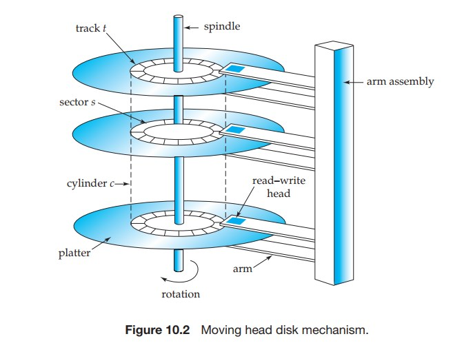

# 数据库存储和索引

这篇是《数据库系统概念》第 10，11 章的学习笔记，虽然数据库用了很多年，但是除了用法对数据库本身了解不多，以至于和同事吃饭吹牛的时候只能听他们侃侃而谈，我只能在旁边直呼 666。

为了了解数据库的存储首先要了解存储介质，现在比较多的是机械硬盘和固态硬盘，固态硬盘性能好比较贵，机械硬盘反过来。先说机械硬盘，它有一个机械臂组件和若干个盘片，数据都记录在盘片上，机械臂的末端是一个读写头，悬浮在盘片上，当盘片旋转时读写头就能读取到数据。为了方便盘片会划分为磁道（就是一个个同心圆），磁道再被划分成扇区。



机械硬盘读取数据分三步

1. 机械臂找到对应的磁道
2. 盘片旋转找到起始地址
3. 盘片旋转读取扇区数据

这三步里第一步最耗时，盘片越大越慢，其次是第二步。这里可以用坐地铁打比方，当想乘坐地铁去一个地方的时候，去地铁站是最费时的，尤其据地铁站很远。然后是等地铁费时，尤其是上一班刚走，一旦坐上了地铁，那么坐三个站还是五个站其实区别不大。

因此为了优化性能，每次读取的时候会把整个扇区都读到内存里，反正费不了多长时间，不读白不读。也因此内存和磁盘之间的数据交换通常按「块」来，这个「块」有叫 block 的，也有叫 page 估计不严谨可以混着用。

另外操作系统有局部性原理：时间局部性（Temporal Locality）和空间局部性（Spatial locality）。其中空间局部性说的是，当前被读取到的地址，后续操作高概率读取附近的下一地址。程序员被要求写出局部性高的代码。

固态硬盘是基于闪存（flash memory）技术的一种硬盘，和机械硬盘原理不一样，数据会按照 block 组织，每个 block 划分成很多个 page 读写以 page 为单位，它的写操作有点奇特，不是直接在原 page 上写而是把整个数据写到新的 page 然后擦除旧的 page。

更多的相关内容可以也可以看看《计算机组成原理》6.1 章节，里面还讲了为什么 ROM 明明可以写，却叫 ROM (read only memory)。

一块硬盘的性能是有极限的，为了提高硬盘的性能和可靠性发展出了一种叫 RAID(redundant arrays of independent disks) 的技术。冗余提高可靠性，多块磁盘并行写提高性能。不同的 RAID 方案分类成不同的 RAID 等级，所以 RAID 等级之间没有明确的递进关系。

比较常见的是 RAID 1，RAID 5。RAID 1 数据按块拆分，冗余一份，相当于两块硬盘当一块用，性能和可靠性都很好，性能好是因为数据分块可以同时并行向多块硬盘写，可靠性好是因为每份数据有一份冗余，缺点是空间利用率低 50%。

RAID 5 至少三块硬盘，数据按块拆分，额外存储一份奇偶校验位用于数据重建。也就是说三块硬盘当两块用，空间利用率是 (N - 1) / N * 100%，N 是总共的硬盘数量。

RAID 5 重建数据的原理是这样的，以三块硬盘为例。

假设第一块硬盘第一个扇区的数据是  

```
10010011101110110001101...
```
第二块硬盘第一个扇区的数据是

```
10000001000000010000000...
```

那么第三块硬盘第一个扇区存放的就是校验位数据，偶数个 1 存 0，奇数个 1 存 1。

```
00010010101110100001101...
```

这样最终在每块硬盘上的数据是这样的

```
10010011101110110001101...
10000001000000010000000...
00010010101110100001101...
```

现在假设第二块硬盘损坏了

```
10010011101110110001101...
_______________________...
00010010101110100001101...
```

系统可以根据剩余的两块硬盘开始重建数据

```
10010011101110110001101...
1000___________________...
00010010101110100001101...
```


