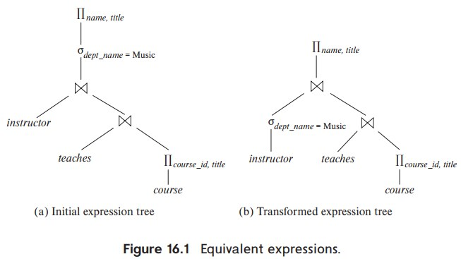

# 数据库查询和查询优化

这篇是《数据库系统概念》第 12，13 章学习笔记，看到这里发现了个坑爹的事，这本书已经有第七版了，然后我看的是第六版，尴尬。

数据库的最基本用法之一就是查询，也就是通过 SQL 查询需要的数据。SQL 是一种声明式编程语言（declarative programming language），这种语言只描述「做什么」而不管怎么做。与之相对的是命令式编程语言（Imperative programming language），不仅要描述「做什么」还要描述「怎么做」，比如 C 语言。

由于 SQL 只描述「做什么」那总要有别的什么东西来完成怎么做，是不是有种似曾相识的感觉。执行 SQL 可以粗略的分三步

1. SQL 解析和转换，转成关系代数（relational algebra）
2. 优化，从众多执行计划中挑一个少花时间的
3. 执行

先说关系代数，这里的关系（relation）是有序对的集合，类似 {(12121, Wu, Finance, 90000), (15151, Mozart, Music, 40000)} 这样的结构，集合里的每个元素叫做 4-元组（4-tuple），4 表示元组里面的元素数量。是不是和数据库的表和行很像，其实就是一回事。为了有亲切感，我后面都用「表」来指代关系，用「行」来指代元组，用「字段」指代域。

有序对的元素又分别来自各自的集合，比如 12121 和 15151 来自同一个集合，我们可以叫它 ID 集合，这个集合也叫作域（domain），类似的还有 name 集合，department 集合，salary 集合。我们说 12121, Wu, Finance, 90000 有关系就是指他们构成的元组在关系的集合里。

有意思的是函数也是一种关系，比如函数 f(x) = x + 1 可以看做是 {..., (0, 1), (1, 2), ...} 的集合，也就是元组 (x, f(x)) 的集合，只是这个集合的个数是无限的。

代数大意是研究数学符号和处理这些符号的规则，这个词来自一本书的标题，作者是穆罕默德。这个默罕默德和那个宣称自己是最后一任先知的默罕默德应该不是一个人。

初等代数操作数是正整数，操作符是加减乘除，关系代数也一样，只不过操作数是关系，操作符有下面定义的这些，不全


查询操作

$$
\sigma_{dept_name="Physics"}(instructor)
$$

投影操作

$$
\Pi_{ID, name, salary/100}(instructor)
$$

符合操作

$$
\Pi_{name}(\sigma_{dept_name="Physics"}(instructor))
$$

笛卡尔积

$$
instructor \times teaches
$$

join 操作

$$
instructor \Join_\theta teaches \equiv \sigma_\theta(instructor \times teaches)
$$

集合操作，这个简单交并差和普通集合操作一样

赋值操作

$$
course_fall_2017 \leftarrow 
$$

重命名操作

$$
\rho_{x(A_1, A_2, ..., A_n)}(E)
$$


$$
\begin{aligned}

\text{查询操作                } &\sigma_{dept_name="Physics"}(instructor) \\
\text{投影操作                } &\Pi_{ID, name, salary/100}(instructor)

\end{aligned}
$$

把 SQL 转成关系代数的原因是代数可以用规则来运算，能运算才能优化选出最省时的执行计划。关系代数和 SQL 有点像，但又不完全一样。

然后是一些等价规则

$$
\begin{aligned}
\sigma_{\theta_1 \wedge \theta_2}(E) &\equiv \sigma_{\theta_1}(\sigma_{\theta_2}(E)) \\
\sigma_{\theta_1}(\sigma_{\theta_2}(E)) &\equiv \sigma_{\theta_2}(\sigma_{\theta_1}(E)) \\
\Pi_{L_1}(\Pi_{L_2}(...(\Pi_{L_n}(E))...)) &\equiv \Pi_{L_1}(E) L_1 &\text{条件：} \sube L_2 \sube ... \sube L_n \\
\sigma_\theta(E_1 \times E_2) &\equiv E_1 \Join_\theta E_2 \\
\sigma_{\theta_1}(E_1 \Join_{\theta_2} E_2) &\equiv E_1 \Join_{\theta_1 \wedge \theta_2} E_2 \\
E_1 \Join_\theta E_2 &\equiv E_2 \Join_\theta E_1 \\
(E_1 \Join E_2) \Join E_3 &\equiv E_1 \Join (E_2 \Join E_3) \\
(E_1 \Join_{\theta_1} E_2) \Join_{\theta_2 \wedge \theta_3} E_3 &\equiv E_1 \Join_{\theta_1 \wedge \theta_3} (E_2 \Join_{\theta_2} E_3) &\text{条件：} \theta_2 \text{只涉及} E_1, E_2 \text{的属性}\\
\sigma_{\theta_1}(E_1 \Join_\theta E_2) &\equiv (\sigma_{\theta_1} (E_1) \Join_\theta E_2) &\text{条件：} \theta_1 \text{只涉及} E_1 \text{的属性}\\
\sigma_{\theta_1 \wedge \theta_2} (E_1 \Join_\theta E_2) &\equiv (\sigma_{\theta_1} (E_1) \Join_\theta (\sigma_{\theta_2}(E_2)) &\text{条件：} \theta_1 \text{只涉及} E_1 \text{，} \theta_2 \text{只涉及} E_2 \\
\Pi_{L_1 \cup L_2} (E_1 \Join_\theta E_2) &\equiv (\Pi_{L_1}(E_1)) \Join_\theta (\Pi_{L_2} (E_2)) &条件 L_1 是 E_1 的属性，L_2 是 E_2 的属性 \\
\Pi_{L_1 \cup L_2} (E_1 \Join_\theta E_2) &\equiv \Pi_{L_1 \cup L_2} ((\Pi_{L_1 \cup L_3 (E_1)}) \Join_\theta (\Pi_{L_2 \cup L_3} (E_2))) &条件：L_1, L_2 分别是 E_1，E_2 的属性，L_3 涉及 \theta 但不在 L_1 的属性，L_4 同理 \\
\sigma_\theta(E_1 \cap E_2) &\equiv \sigma_\theta (E_1) - E_1 \\
\Pi_L (E_1 \cup E_2) &\equiv (\Pi_L (E_1)) \cup (\Pi_L (E_2)) \\
\sigma_\theta(_G \gamma_A (E)) &\equiv _G \gamma_A (\sigma_\theta E) \\
E_1 ⟗ E_2 &\equiv E_2 ⟗ E_1 \\
E_1 ⟕ E_2 &\equiv E_2 ⟖ E_1 \\
\sigma_{\theta_1} (E_1 ⟕_\theta E_2) &\equiv (\sigma_{\theta_1} (E_1))  ⟕_\theta E_2 \\
\end{aligned}
$$


有了这些操作符和等价规则，一条 SQL 就可以被解析为代数表达式，比如 SQL

```
select name, title from instructor 
natural join teaches 
natural join (select course_id, title from course) 
where instructor.dept_name = 'Music';
```

可以被解析为

$$
\Pi_{name, title} (\sigma_{dept_name = "Music"} (instructor \Join (teaches, \Join \Pi_{course_id, title} (course))))
$$

然后根据等价规则可以转化为

$$
\Pi_{name, title} ((\sigma_{dept_name = "Music"} (instructor) \Join (teaches, \Join \Pi_{course_id, title} (course))))
$$



根据等价规则变换出的表达式数量是非常夸张的，n 张表的自然连接有 (2(n - 1))! / (n - 1)! 种链接顺序。这个数字怎么算的可以搜关键词 Catalan numbers，或者看《离散数学》第 8 版 8.1.2 章节例题 5，给这帮数学大佬跪了。

再看优化，为了挑选合适的执行计划就需要评估执行计划，直接评估时间不现实，转而评估可能涉及的行数。

评估需要一些额外的信息，常用的是 

+ n, 表行数量
+ b, 表保存的「块」数量
+ l, 每一行的大小
+ f, 每「块」里面有几行
+ V(A, r), 表 r 的字段 A 有多少个不同的数值

一般来说 b = ⌈ n / f ⌉，有些数据库为了估计更准还会保存直方图，也就是字段一定范围内的行数。没有直方图的时候通常就假设字段值是均匀分布的。

$$
\def\arraystretch{2}
\begin{array}{c:c:c}
   关系代数 & 估算公式 & 备注 \\ \hline
   \sigma_{A = a}(r)  & \frac{n}{V(A, r)} \\
   \hdashline
   \sigma_{A < v}(r) & n * \frac{(v - min(A, r))}{(max(A, r) - min(A, r))} \\
   \hdashline
   \sigma_{\theta_1 \wedge \theta_2 \wedge ... \wedge \theta_n} (r) & n * \frac{(s_1 * s_2 * ... * s_n)}{n^n} & s_i 表示 \sigma_{\theta_i} (r) 的数量\\
   \hdashline
   \sigma_{\theta_1 \vee \theta_2 \vee ... \vee \theta_n} (r) & n * (1 - (1 - \frac{s_1}{n}) * (1 - \frac{s_2}{n}) * ... * (1 - \frac{s_n}{n})) \\
   \hdashline
   r \times s & n_r * n_s & \\
   \hdashline
   r \Join s & min (\frac{n_r * n_s}{V(A, r)}, \frac{n_r * n_s}{V(A, s)}) & \\
   \hdashline
\end{array}
$$


因为等价表达式众多，一个个都估算一遍不现实，不然查询费不了多长时间，时间全花在选执行计划了。