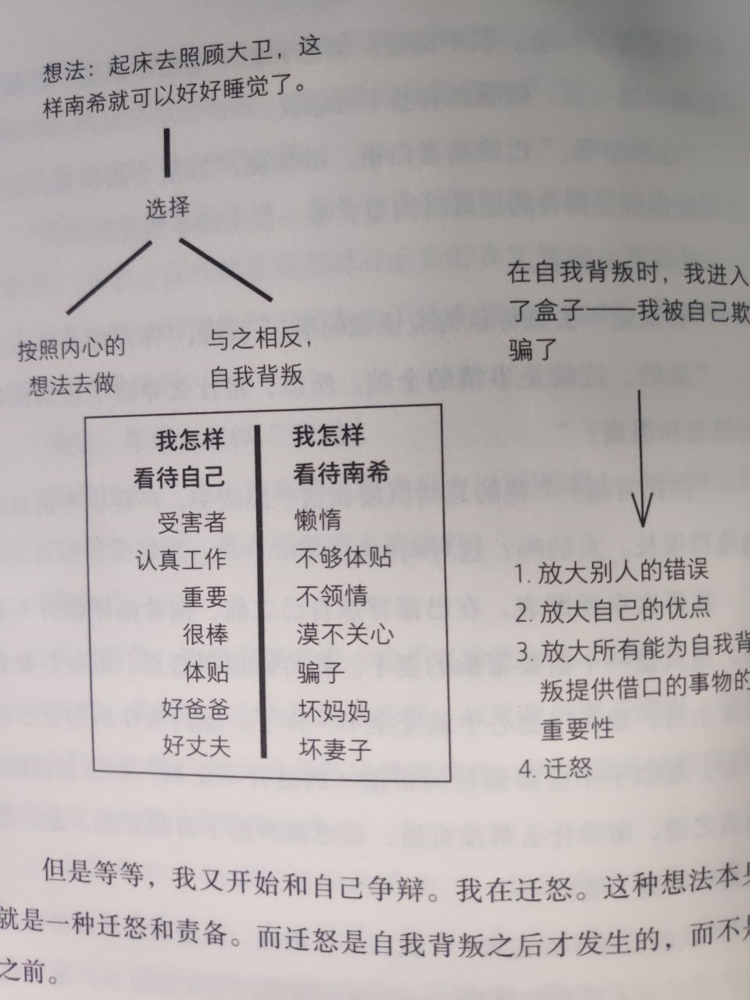

# 《别找替罪羊》读书笔记

我写完《非暴力沟通》读后感的当天，这本书奇迹般的到货了而且还让我买上了。入手后很快就把它看完了，书不厚，周末两天就看完了。另外这本书居然是职场类书籍，光看书名我还以为是心理类的。

整本书讲了一个入职的小故事，在入职的对话中引出一个叫做「盒子」的概念，然后就这个概念分三部分讨论。分别是盒子是什么，怎么进去的，要怎么出来。

盒子是什么，它是自我欺骗。自我欺骗是一种看不见自己身上缺点的行为。书里据了个例子：一家医院的其中一个病区产薅热（一种产后感染）死亡率特别高，医生们寻找原因，唯一明显的区别是这个病区由医生和护士来接生，其他病区是助产护士来接生。最后的最后他们发现医生才是主要原因，因为这家医院的医生会研究尸体，他们手上的细菌才是导致产薅热的主要原因。这个让我想起之前看鬼谷的视频里讲中世纪的外科医生以绅士的手是洁净的，而拒绝洗手。

我们自我欺骗，就进入盒子，一旦进入可能永远困在里面。

书中举了南希一家的例子，巴德和南希正在睡觉，这是孩子大卫开始啼哭，巴德察觉到哭声，觉得应该起身照顾大卫，这样南希就能好好睡觉，但是巴德并没有这么做。于是巴德的一系列心理活动开始了。

巴德可能会觉得南希是假装在睡觉，她懒惰，不懂得照顾孩子，不会为他人着想的妻子。

而巴德我每天勤勤恳恳上班已经很累了，明天早上还有很重要的工作，我还敏锐的发现了大卫哭声，是一个好父亲。

这个思维模式相当的真实，屁股决定脑袋。

> 自我背叛
>1. 心里觉得要为别人做些什么，实际行动却背道而驰，这种行为叫做自我背叛。
>1. 于是，我开始为了自我背叛的行为找理由。
>1. 当我用一种自以为正确、公正的眼光看待现实时，我看到的现实时扭曲的。
>1. 所以，就在自我背叛时，我进入了盒子。
>1. 长此以往，盒子就成了我的特质，而我会一直带着这个盒子走下去。
