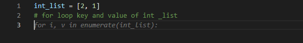
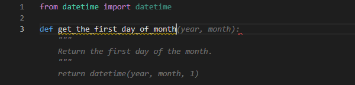
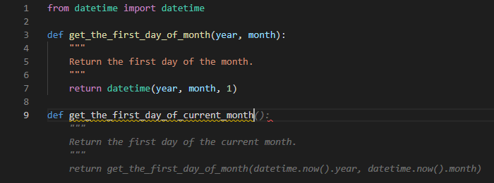
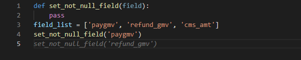
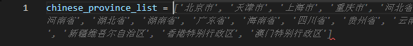
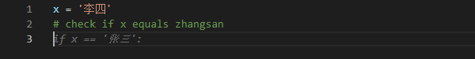

# Copilot 使用体验

Copilot 是代码自动补全插件，与传统不同它通过 AI 识别程序员的意图来自动补全代码，官方简介是 Your AI pair programmer。

Copilot 是基于 OpenAI Codex 开发的，后者是 openAI 公司用包括 github 在内的数十亿行源码训练的。

Copilot 目前是免费的，需要申请资格，顺着文档步骤做就行，其中有一步就是申请资格，蛮快的，我从申请到通过大约过了 3 天。

整体使用下来还是蛮舒服的，我最近会写点 python 和 node 代码，这俩语法我都不太熟悉，可以节省很多问谷老师的时间。

比如带索引 for 循环列表，关键字我总记不住，一般会谷歌一下，有了这个插件可以写注释，回车，然后等插件补全，按 Tab。

在比如写工具类

这个插件写重复代码也很舒服，比如下面这个代码，从第二句 set_not_null_field 开始只要负责按 Tab 就行。

也许有小伙伴会说你这个例子写个 for 循环不是更好么，写那么多重复代码丢不丢人。

这不是因为菜嘛 /手动狗头。

另外还发现了一些有意思的特性，比如

有一个朋友指出这个插件可能会读取代码上下文，有一定的安全隐患，偷代码啥的。