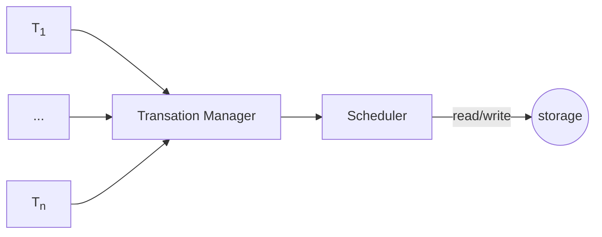
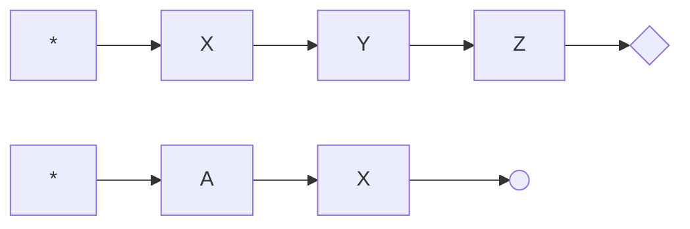
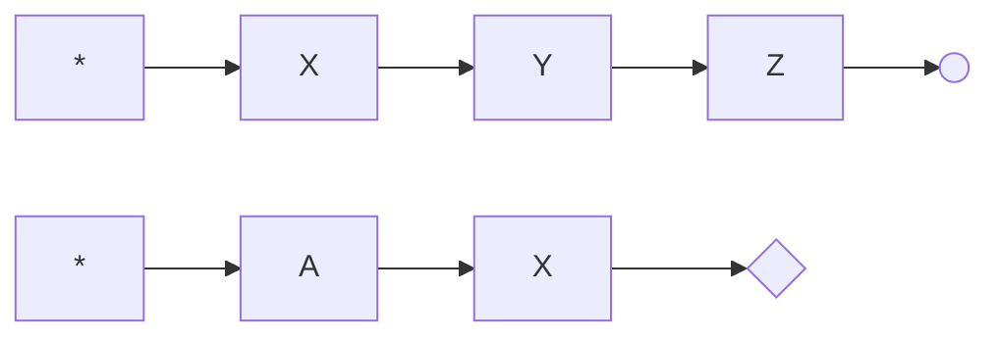

# 数据库并发控制

*写下这份笔记的时候我虽然看了两边这个章节，然鹅依旧没怎么搞懂，笔记可能有错误，有兴趣的建议直接看原书，一手知识最靠谱*

*程序员阅读这本书最好的时机在大学，其次是现在。*

总体来看，并发控制系统类似十字路口，每辆进入路口的车子都看做一个事务，红绿灯是协议，在这个协议下产生调度，什么时候右转，什么时候直行，什么时候左转，避免交通事故。



为了实现特定的调度，需要设计不同的协议。协议可以理解为一组定义的规则，比如靠右行驶、红灯停、绿灯行，硬要反过来也不是不行，只是会特别诡异。

并发控制系统控制事务的先后顺序，生成合理的调度。又因为事务的主要操作是 read/write，所以讨论调度简化为讨论事务的 read/write 的顺序。

接下来汇总书里的协议，在此之前先解释一些概念，事务、ACID、隔离等级这些就不解释了，八股文都背过。

+ 串行（Serial）：事务按照顺序一个一个串行执行。
+ 可串行化（Serializability）：一组事务虽然并发执行，但是结果和事务串行执行是一致的。交叉执行的主要是每个事务里的 read/write 操作
+ 死锁（Deadlock）：打架的时候互相扯头发，谁先放手谁是狗
+ 可恢复性（Recoverable）：事务 T<sub>j</sub> 读取 T<sub>i</sub> 写入的数据，那么 T<sub>i</sub> 要先提交
+ 级联（Cascadeless）：事务 T<sub>j</sub> 读取 T<sub>i</sub> 写入的数据，那么 T<sub>i</sub> 要在 T<sub>j</sub> 读这个数据之前提交。无级联的调度一定具有可恢复性。
+ 饿死（Starvation）：事务因为某些原因老被插队，导致迟迟不能完成，等锁或者冲突被重启都可能导致饿死。

事务产生调度最好具有可串行化，可恢复性，不会死锁，不会级联回滚，不会饿死，但历史告诉我们通常没这等好事。

O 支持，X 不支持，? 代表我不知道。

|协议|可串行化|免死锁|可恢复|无级联|免饿死|
|--|:--:|:--:|:--:|:--:|--|
|2PL                    |O|X|X|X|X|
|Strict-2PL             |O|X|O|O|X|
|Rigorous-2PL           |O|X|O|O|X|
|Tree                   |O|O|X|X|?|
|TSO                    |O|O|X|X|X|
|Thomas' Write rule     |O|O|X|X|X|
|Validation-Based       |?|O|O|O|X|
|Multiversion-TSO       |O|X|X|X|?|
|Multiversion-2PL       |O|X|O|O|X|
|SI                     |X|O|O|O|?|
|Crabbing               |O|X|?|?|?|
|B-link tree locking    |?|O|?|?|?|


**2PL**

一种基于锁的协议，中文名两阶段锁协议，Two-Phase Locking Protocol。

+ 增长阶段（Growing phase）：事务可以获得锁，但不能释放锁。
+ 缩减阶段（Shrinking phase）：事务可以释放锁，但不能获得新锁。

获取最后一个锁的时间点叫做锁点（lock point），事务的顺序是锁点的顺序。

常用的锁有两种模式

+ 共享锁（Shared）：事务拿到数据项 Q 的共享锁（记为 S），那么事务对 Q 可读不可写。
+ 排它锁（Exclusive）：事务拿到数据项 Q 的排它锁（记为 X），那么事务对 Q 可读可写。

锁相容（compatible）指的是数据项已经有锁了，还能马上拿到锁，能拿到就是相容。用相容函数（ compatibility function）表示，比如 S 和 X 的相容性是

||S|X|
|--|--|--|
|S|true|false|
|X|false|false|

只有一种情况相容，Q 上挂的是共享锁，另一个事务要求的也是共享锁，其他情况都要等。

2PL 防止锁过早释放。锁过早释放可能造成数据不一致，比如某个事务执行到一半，写了一些数据，没写另一写数据，这时释放锁，刚好另一个事务来了，把写过的，没写过的数据全读走了，这就尴尬了。

另外因为共享锁是兼容的，排它锁在等待数据释放共享锁，但是一直有事务请求共享锁插队，就会导致拿排它锁的事务饿死，改良后可避免。

锁转换（lock conversions）机制。共享锁升级成排它锁或者排它锁降级为共享锁，升级只能发生在增长阶段，降级只能发生在缩减阶段。

锁管理器用锁表（lock table）管理锁信息，结构类似 HashMap。这里的锁表指的是保存锁信息的表，不是把表锁了。

**Strict-2PL**

2PL·改，中文名严格两阶段锁协议，Strict Two-Phase Locking Protocol，两阶段锁的基础上，额外保证事务提交前不释放排它锁。

**Rigorous-2PL**

2PL·改二，中文名强两阶段锁协议，Rigorous Two-Phase Locking Protocol，两阶段锁的基础上，额外保证事务提交前不释放任何锁。

有些语境下说的 2PL 指的是 Rigorous-2PL。

**Tree**

另一种基于锁的协议，中文名树形协议，优点不会死锁，缺点需要额外信息-数据库图（database graph）。

数据库图是有向无环图，顶点是数据项，边 d1 --> d2 表示所有都要访问 {d1, d2} 的事务必须按照 d1, d2 的顺序访问。

树形协议只用排它锁，每个事务最多对一个数据项加一次锁

+ 事务首次加锁可以对任何数据项
+ 接下来事务对数据项 Q 加锁的前提是当前事务持有 Q 父节点上的锁。
+ 数据项可以随时解锁
+ 事务对数据项加锁和解锁后，不能再对这个数据项加锁

树形协议不保证可恢复性和无级联回滚，通过改良可支持。

**TSO**

一种基于时间戳的协议，中文名时间戳排序协议，Timestamp-Ordering Protocol。事务顺序是时间戳顺序。

简单理解就是事务要读的数据被人写过就回滚，要写的数据被人读过/写过也回滚，其他情况正常完成事务。

时间戳可以是系统时钟或者逻辑计数器，每个数据项关联两个时间戳，发生 read/write 操作需要更新。

+ W-timestamp(Q) : 最新 write 时间戳
+ R-timestamp(Q) : 最新 read 时间戳

事务 T 进入系统赋予时间戳 TS(T)

+ 事务 T 发出 read(Q) 操作
  + if TS(T) < W-timestamp(Q) 拒绝操作，T 回滚
  + if TS(T) >= W-timestamp(Q) 执行 read 操作 R-timestamp(Q) = max(R-timestamp(Q), TS(T))
+ 事务 T 发出 write(Q) 操作
  + if TS(T) < R-timestamp(Q) 拒绝操作，T 回滚
  + elif TS(T) < W-timestamp(Q) 拒绝操作，T 回滚
  + else 执行 write 操作 W-timestamp(Q) = TS(T)

TSO 可能会饿死，比如长事务要更新某个值，但是一堆短事务频繁读这个值。

TSO 不保证可恢复性和无级联的，有几种改良手段。

1. 改变事务结构
   1. 事务的所有写操作放到最后
   2. 所有写组合成一个原子操作，执行写过程中，任何事务不允许访问已写入的数据。
   3. 事务中止后重新分配时间戳重启
2. 借助锁，读未提交数据的操作用锁推迟到更新数据的事务提交之后
3. 使用提交依赖保证可恢复性

**Thomas' Write Rule**

+ 事务 T 发出 read(Q) 操作
  + if TS(T) < W-timestamp(Q) 拒绝操作，T 回滚
  + if TS(T) >= W-timestamp(Q) 执行 read 操作 R-timestamp(Q) = max(R-timestamp(Q), TS(T))
+ 事务 T 发出 write(Q) 操作
  + if TS(T) < R-timestamp(Q) 拒绝操作，T 回滚
  + **elif TS(T) < W-timestamp(Q) T 尝试写入的值已经过时，忽略 write 操作**
  + else 执行 write 操作 W-timestamp(Q) = TS(T)

TSO 改版，只有加粗这一条不一样，它直接丢弃写操作而 TSO 是回滚。

它的串行化是视图可串行化，不是冲突可串行化，具有更高的并发度。

这个协议我理解不了， 总觉得它和 TSO 只能对一个。改天再查查，关键字 View Serializability, blind write。

**Validation-Based**

中文名有效性检查协议。

有效性检查协议把事务分三个阶段

+ 读阶段（Read phase）：事务读取需要的数据，保存在局部变量
+ 有效性检查阶段（Validation phase）：事务进行有效性测试，判断是否可以执行写操作。
+ 写阶段（Write phase）：有效性检测通过，数据写入数据库，只读事务没有这个阶段。

有了进行有效性测试，事务需要关联这些数据

+ Start(T)：事务开始时间
+ Validation(T)：事务完成读阶段，开始严查的时间
+ Finish(T)：事务完成写阶段的时间

用 Validation(T) 当做事务的时间，即 TS(T) = Validation(T)

事务 T<sub>i</sub> 通过有效性测试条件

+ 任何满足 TS(T<sub>k</sub>) < TS(T<sub>i</sub>) 的事务 T<sub>k</sub> 必须满足下面两个条件之一
  1. Finish(T<sub>k</sub>) < Start(T<sub>i</sub>)。
  2. T<sub>k</sub> 写数据项与 T<sub>i</sub> 读数据项不相交，且 Start(T<sub>i</sub>) < Finish(T<sub>k</sub>) < Validation(T<sub>i</sub>)。

简单理解就是后来的事务想要通过测试，要么前面的事务都写完了，要么读的数据和前面事务写的数据不相交，且前面的事务在我开始验证前写完。

这个协议适合读多写少的场景，幸运的是实际业务场景大多都是读多写少。

有效性检查协议是一种乐观的并发控制（Optimistic Concurrency-Control）它假设事务能够执行，并最终有效。相反，锁和时间戳排序是悲观的，它们一检测到冲突，事务就需要等待或者回滚，哪怕这个调度可能是冲突可串行化的。

**Multiversion-TSO**

一种多版本并发控制协议，核心思想是每次写操作都产生一个新版本，用时间戳标记，这样读操作就可以选合适的版本返回。

这个协议缝合多版本和时间戳排序。

数据项 Q 由一组版本 <Q<sub>1</sub>, Q<sub>2</sub>, ...Q<sub>m</sub>> 组成，每个 Q<sub>k</sub> 关联三个属性

1. Content：Q<sub>k</sub> 的值
2. W-timestamp(Q<sub>k</sub>)：Q<sub>k</sub> 创建的时间戳
3. R-timestamp(Q<sub>k</sub>)：Q<sub>k</sub> 的最后读取时间戳

协议内容

+ 事务 T<sub>i</sub> 发出 read(Q) 操作
  + 返回最大的 W-timestamp(Q) <= TS(T<sub>i</sub>) 的 Q<sub>k</sub> 内容
  + R-timestamp(Q<sub>k</sub>) = max(R-timestamp(Q<sub>k</sub>), TS(T<sub>i</sub>))
+ 事务 T<sub>i</sub> 发出 write(Q) 操作
  + if TS(T<sub>i</sub>) < R-timestamp(Q<sub>k</sub>) 回滚事务 T<sub>i</sub>
  + elif TS(T<sub>i</sub>) = W-timestamp(Q<sub>k</sub>) 覆盖 Q<sub>k</sub> 的内容
  + else 创建新的 Q 版本

优点：读请求从不等待，从不失败，完美贴合现实业务场景读多写少。

缺点：需要更新时间戳，额外保存各版本信息而且冲突通过回滚解决，开销大。

Q<sub>k</sub> 的有效区间指的是这个时间区间的事务读取的 Q 是 Q<sub>k</sub> 这个版本。假设 Q<sub>k</sub> 的时间戳是 t 那么 Q<sub>k</sub> 的有效区间是

1. Q<sub>k</sub> 是最后版本，那么区间是 [t, ∞)
2. Q<sub>k+1</sub> 版本的时间戳是 s 那么 [t, s)

Multiversion-TSO 不保证可恢复性和无级联回滚，通过改良可以保证。


**Multiversion-2PL**

另一种多版本控制协议，Multiversion + Rigorous-2PL，区分对待只读事务和更新事务。

**不确定接下来的理解是否正确**

数据项只有一个时间戳，用一个叫做 ts-counter 逻辑计数器表示。

只读事务同 Multiversion-TSO。

更新事务 T 持有排它锁到事务结束，同 Rigorous-2PL，对事务中的每一条数据项

+ 事务 T 发出 read(Q)
  + 获得 Q 的共享锁
  + 获得最大 TS(T) <= W-timestamp(Q<sub>k</sub>) 的 Q<sub>k</sub> 内容
+ 事务 T 发出 write(Q)
  + 获得 Q 的排他锁
  + 创建新版本 Q<sub>m</sub> 设置 W-timestamp(Q<sub>m</sub>) = ∞
+ 事务 T 提交阶段
  + TS(T) = ts-counter + 1
  + 所有这个事务中创建的数据项 W-timestamp = TS(T) 相当于从 ∞ --> TS(T)。
  + ts-counter += 1

**SI**

又一种多版本控制协议，中文名快照隔离。

从概念上讲，每个事务都有一份数据库快照，事务的所有操作都在快照上执行，最后通过一个原子操作提交，保证其他事务的快照要么看到所有变更，要么一个变更也看不到，听起来像 git。

事务 T 关联两个时间戳

+ StartTS(T)：事务 T 开始的时间
+ CommitTS(T)：事务 T 请求验证的时间

数据项只有一个时间戳，事务 T 创建的数据项 Q<sub>k</sub> 时间戳 W-timestamp(Q<sub>k</sub>) = CommitTS(T)

只读事务 T 读取 W-timestamp(Q<sub>k</sub>) <= StartTS(T) 的 Q<sub>k</sub> 版本。

两个更新事务并发提交，需要特殊处理，避免更新丢失（lost update），书里介绍两种：先提交者获胜、先更新者获胜

T<sub>i</sub> 和 T<sub>j</sub> 并发的条件，满足一个就是并发。

1. StartTS(T<sub>j</sub>) <= StartTS(T<sub>i</sub>) <= CommitTS(T<sub>j</sub>)
2. StartTS(T<sub>i</sub>) <= StartTS(T<sub>j</sub>) <= CommitTS(T<sub>i</sub>)

一个事务从开始到提交的这段时间内，有别的事务开始了，那么就并发了。

先提交者获胜。方框的字母代表更新的数据项，圆圈代表提交，菱形代表中止。都改了数据项 X 先提交的那个事务赢了，另一个中止。



事务 T 开始验证，分配 CommitTS

+ 检查事务 T 要写入的数据有没有已经提到到数据库的。
+ 如果有，事务中止
+ 没有，事务 T 提交，更新和写入数据库


先更新者获胜。方框的字母代表数据项，圆圈代表提交，菱形代表中止。都改了数据项 X 先改了 X 的那个事务赢了，另一个中止。



+ 事务 T 获得写锁
  + if 这个数据项被其他并发事务更新，事务 T 中止
  + else 事务 T 执行操作
+ 事务 T 无法获得写锁，T<sub>j</sub> 持有写锁，等待 T<sub>j</sub> 提交或中止
  + if T<sub>j</sub> 中止，事务 T 拿到锁，执行前面的动作
  + if T<sub>j</sub> 提交，事务 T 中止
+ 事务提交或者中止都释放锁。

快照隔离不保证可串行化。举个例子

|T<sub>i</sub>|T<sub>j</sub>|
|--|--|
|read(A)||
|read(B)||
||read(A)|
||read(B)|
|A = B||
||B = A|
|write(A)||
||write(B)|

这个调度可以完美避开所有冲突，然后并发执行完成，但结果不一致。

串行执行 <T<sub>i</sub>, T<sub>j</sub>> 得到两个 B，

串行执行 <T<sub>j</sub>, T<sub>i</sub>> 得到两个 A，

快照隔离得到一个 A 一个 B，咋样都不等价。

上面这个例子叫做写偏斜（write skew），指的是一对事务，读的数据项是对方写的，并且写的数据项没有交集。

根据业务情况酌情考虑是否使用快照隔离，特别介意的有几种改良方案，视具体数据库支持

+ 用快照隔离改良型，可串行化快照隔离（Serializable Snapshot Isolation）简称 SSI
+ 一些系统支持不同的事务不同的隔离等级
+ 一些系统提供人为冲突手段，比如 for update

**不做读有效性检查的乐观并发机制**

终于见到个眼熟的，这个实际业务偶尔会用，对于每个更新的元组，检查版本号和第一次读取事务时的版本号

+ 版本号一致，执行更新，版本号 +1
+ 版本号不一致，事务中止，回滚所有更新

**Index-Locking Protocol**

一种索引用的协议，中文名索引锁协议。

+ 每张表至少一个索引
+ 事务 T<sub>i</sub> 只有通过索引才能访问元组
+ 事务查找元组需要持有索引的共享锁
+ 事务 T<sub>i</sub> 先更新完元组的索引，才能插入/删除/更新元组，更新索引需要持有所有相关的索引叶子结点上的排它锁，无论是更新前的还是更新后都要。
+ 元组照常获得锁
+ 遵守两阶段锁协议

这个协议在两阶段锁的基础上，对索引进行加锁，可以规避一些幻象现象（phantom phenomenon）。

比如 

```
T1
select * from instructor 
    where dept_name = 'Physics';

T2
insert into instructor values
    (11111, 'zhangsan', 'Physics', 1000);

T3
update instructor set dept_name = 'Music' 
    where dept_name = 'Physics'
```

如果只锁元组，那么 T<sub>1</sub>, T<sub>2</sub> 锁的不是同一个数据项，两个事务都可以执行成功，导致不可串行化。

假如字段 dept_name 上有索引，用索引锁协议，那么 T<sub>1</sub> 需要持有 Physics 的共享锁，T<sub>2</sub> 需要持有 Physics 的排它锁，这时可以保证可串行化。

索引锁协议让 T<sub>1</sub>，T<sub>2</sub> 的冲突具象化为对索引项 Physics 的冲突，而不是虚无缥缈的幻象，避免幻想现象。

事务 T<sub>3</sub> 也一样，持有索引项 Physics, Music 排它锁。

好像有把幻想现象叫做的幻读的，我试了下 mysql 在 rr 隔离级别下，类似 id > 10 这样的范围查询不会发生幻想现象，可能哪个版本支持了？

类似概念还有脏读，不可重复读，这些是因为在较低的隔离级别下的正常现象，如果业务场景不允许这些情况，最简单的办法就是调高隔离级别，不过 mysql 默认就是 rr 没这些问题。


**Crabbing**

另一种索引用的协议，中文名蟹行协议

+ 查找值，拿到根节点共享锁，沿着 B+ 树向下遍历，拿到所有相关子节点共享锁，然后释放根节点共享锁，重复直至叶子节点。
+ 插入/删除值
  + 采用查找值的方式找到叶子节点
  + 拿到叶子节点排它锁，插入/删除值
  + 如果需要分裂/合并/重分配，拿到父节点排它锁，然后执行分裂/合并/重分配
  + 向上递归处理分裂/合并/重分配，如果不需要则释放锁

这个协议的查询过程有点像螃蟹走路而得名，先伸出一条腿，然后另一条腿跟上。

**B-link tree locking**

B-link 树的内部节点在 B+ 树的基础上多维护一个指向右兄弟的指针。B+ 树只有叶子节点有这个指针。

+ 查找值，拿到根节点共享锁，沿着 B+ 树向下遍历，先释放根节点，再拿到子节点共享锁，重复直至叶子节点
+ 插入/删除值
  + 采用查找值的方式找到叶子节点
  + 拿到叶子节点排它锁，插入/删除值
  + 如果需要分裂/合并/重分配，拿到父节点排它锁，然后执行分裂/合并/重分配
  + 向上递归处理分裂/合并/重分配，如果不需要则释放锁

和蟹行协议的区别是先释放锁再加锁，这会有异常情况，比如父节点已经被分裂/合并/重分配弄得不存在，这个协议需要侦测这些问题并解决。

协议整完了，插播一个尴尬的事，在 mysql 上验证隔离等级时，突发奇想要改表结构，然后通过 Navicat 添加了一个字段，一点保存，啪，卡住，未响应。淡定淡定常有的事，熟练的调出任务管理器结束进程。

重新打开 Navicat 字段果然没加上，重新加，保存，啪，卡住，哦吼，事情开始不对劲了。

再来一次，果然还是卡住，不死心，直接登录 mysql 服务器，用命令行加，啪，还是卡住。

唔唔唔，不出意外的话应该出意外了。

用 ```SHOW FULL PROCESSLIST;``` 查看线程列表，几条 sql 稳稳当当的卡在「Waiting for table metadata lock」上了，咨询了谷老师，它说一般是哪个事务没提交造成。

那就对了，刚刚手动开了一堆事务，有几个没提交纯属正常，不过问题来了，我 TM Navicat 都崩溃了，哪里去找没提交的事务，淦。

继续问谷老师，它说，你试试 ```SHOW ENGINE INNODB STATUS;``` 重点看看 ```TRANSACTIONS``` 这一节，是不是有活动的事务，我一看，还真有

```
...
------------
TRANSACTIONS
------------
Trx id counter 514786
Purge done for trx's n:o < 513798 undo n:o < 0 state: running but idle
History list length 30
LIST OF TRANSACTIONS FOR EACH SESSION:
---TRANSACTION 421205672912408, not started
0 lock struct(s), heap size 1136, 0 row lock(s)
...
---TRANSACTION 513801, ACTIVE 1935 sec
2 lock struct(s), heap size 1136, 1 row lock(s)
MySQL thread id 3193, OS thread handle 139730386065152, query id 179563 ...
...
```

事务 513801 是活动的，但我也不知道怎么杀事务，不过 thread id 3193 这个我熟，干它。```KILL 3193``` 世界恢复了秩序。

不同版本可能命令不一样，我的 mysql 版本。

```
SELECT VERSION();

5.7.25
```

然后我想重现一下这个问题，发现只能重现到 Navicat 卡住，未响应，再次打开就无事发生。不死心直接登录服务器重现，这下重现是能重现，但是诡异的是 ```SHOW ENGINE INNODB STATUS;``` 找不到线程信息了，我去，这么神奇的嘛。

后面查了下这才是正常现象，连接关闭后事务应该会自动中止。

通过这个 sql 可以得到一些信息，```INNODB_TRX``` 是事务表，```PROCESSLIST``` 是线程表，这个 sql 展示正在运行的的事务对应的线程的状态。如果这个线程是 Sleep 的那可能就是它占着茅坑不拉屎。

```
select  p.*,t.* from information_schema.INNODB_TRX t
left join information_schema.`PROCESSLIST` p
on t.trx_mysql_thread_id = p.id
where t.trx_state = 'RUNNING'
```

不知道听谁说过一句话，当你不了解一个东西，那么它处处都是奇迹，绝了。

串行调度、可串行化调度、冲突可串行化

|调度 1|T<sub>1</sub>|T<sub>2</sub>|
|--|--|--|
||read(A)||
||write(A)||
||read(B)||
||write(B)||
|||read(A)|
|||write(A)|
|||read(B)|
|||write(B)|

|调度 2|T<sub>1</sub>|T<sub>2</sub>|
|--|--|--|
||read(A)||
||write(A)||
|||read(A)|
|||write(A)|
||read(B)||
||write(B)||
|||read(B)|
|||write(B)|

调度 1 是串行调度，调度 2 是可串行化调度，调度 1 和 调度 2 冲突等价，绕口令一样。

两个事务操作相同的数据项且至少有一个写操作，那么我们说两个事务冲突（conflict）。

冲突的事务里有不冲突的指令，比如调度 2 里 T<sub>1</sub> 的 read(B) 和 T<sub>2</sub> 的 write(A) 不冲突，可以交换顺序。

通过交换不冲突指令生成调度，叫做冲突等价（conflict equivalent）。

调度经过一系列不冲突交换，最终生成串行调度，那么这个调度是冲突可串行化（conflict serializable）。

比如调度 2，把 T<sub>1</sub> 的 read(B) 和 write(B) 一直往上移就能得到调度 1 那么调度 2 就是冲突可串行化。

用优先图（precedence graph）侦测调度是否冲突可串行化，图论真无处不在。

优先图是有向图，顶点代表事务，边 T<sub>1</sub> --> T<sub>2</sub> 由 3 条规则确定

1. T<sub>1</sub> 执行 write(X) 先于 T<sub>2</sub> 执行 read(X)
2. T<sub>1</sub> 执行 write(X) 先于 T<sub>2</sub> 执行 write(X)
3. T<sub>1</sub> 执行 read(X)  先于 T<sub>2</sub> 执行 write(X)

调度 2 的优先图很简单，就是 T<sub>1</sub> --> T<sub>2</sub>

当优先图是无环图，那么调度是冲突可串行化的。通过优先图能得到串行化顺序（serializability order）。

除了冲突等价还有别的等价，就没有继续了解了。

先记到这里把，我感觉开头内容已经忘了。

我要见证奇迹去了，bye。

封面图：