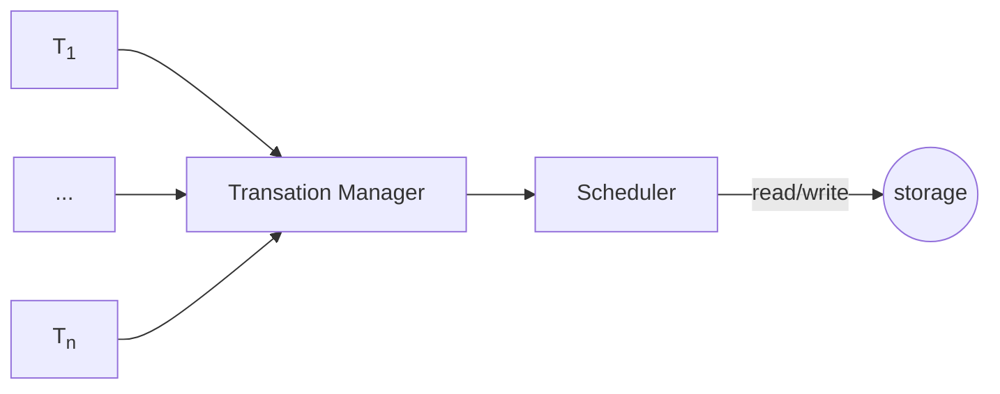
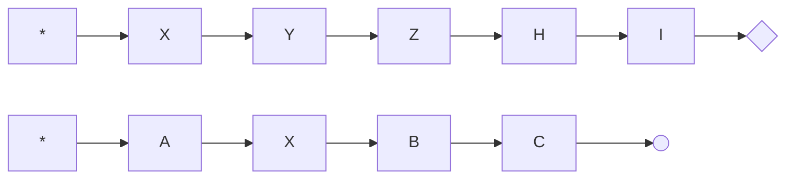
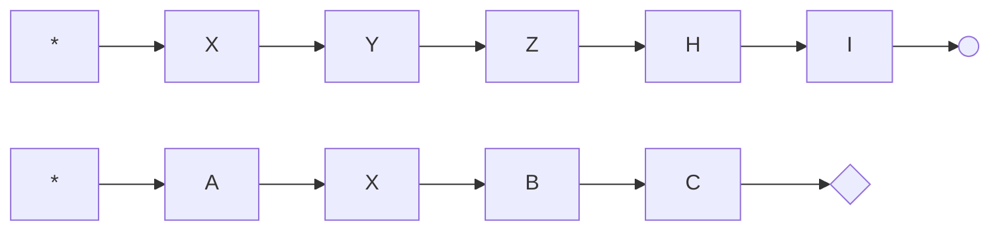
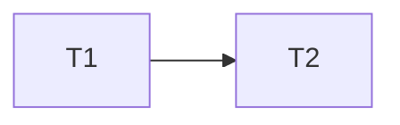

# 数据库并发控制

*写下这份笔记的时候我已经看了两边并发控制了，然鹅依旧没怎么搞懂，笔记可能有错误，有条件的建议直接看原书，一手知识最靠谱*


总体来看，并发控制系统类似十字路口，每辆进入路口的车子都看做一个事务，红绿灯是协议，在这个协议下产生调度，什么时候右转通行，什么时候执行通行，什么时候左转通行。避免左转和直行冲突。



为了实现特定的调度，需要设计不同的协议，比如靠右行驶、红灯停、绿灯行，硬要反过来也不是不行，只是会觉得别扭。

并发控制的调度就是哪些操作先做，哪些操作后做，有因为事务的主要操作是 read/write，所以讨论调度的时候主要讨论 read/write 的顺序。

接下来汇总一下主流的协议，在此之前先说明一些概念。

事务、ACID、隔离等级这些就不解释了，八股文都背过。

+ 串行（serial）：事务按照顺序一个一个串行执行。
+ 可串行化：一组事务虽然并发执行，但是结果和事务串行执行是一致的。交叉执行的主要是每个事务里的 read/write 操作
+ 死锁：打架的时候互相扯头发，谁先放手谁是狗
+ 可恢复性：事务 Tj 读取 Ti 写入的数据，那么 Ti 要先提交
+ 级联：事务 Tj 读取 Ti 写入的数据，那么 Ti 要在 Tj 读这个数据之前提交。无级联的调度一定具有可恢复性。
+ 饿死：事务因为某些原因老被插队，导致迟迟不能完成，等锁或者冲突被重启都可能导致饿死。

产生调度最好具有可串行化，可恢复性，不会死锁，不会级联回滚。

|协议|可串行化|免死锁|可恢复|无级联|免饿死|
|--|:--:|:--:|:--:|:--:|--|
|2PL                    |O|X|X|X|X|
|Strict-2PL             |O|X|O|O|X|
|Rigorous-2PL           |O|X|O|O|X|
|Tree                   |O|O|X|X|?|
|TSO                    |O|O|X|X|X|
|Thomas' Write rule     |O|O|X|X|X|
|Validation-Based       |?|O|O|O|X|
|Multiversion-TSO       |O|X|X|X|?|
|Multiversion-2PL       |O|X|O|O|X|
|SI                     |X|O|O|O|?|
|Crabbing               |O|X|?|?|?|
|B-link tree locking    |?|O|?|?|?|


**2PL**

一种基于锁的协议，中文名两阶段锁协议，two-phase locking protocol。

+ 增长阶段（Growing phase）：事务可以获得锁，但不能释放锁。
+ 缩减阶段（Shrinking phase）：事务可以释放锁，但不能获得新锁。

获取最后一个锁的时间点叫做锁点（lock point），调度等价的串行顺序是锁点的顺序。

常用的两种模式锁

+ 共享锁（Shared）：事务拿到数据 Q 上的共享锁（记为 S），那么事务对 Q 可读不可写。
+ 排它锁（Exclusive）：事务拿到数据 Q 上的排它锁（记为 X），那么事务对 Q 可读可写。

锁相容（compatible）指的是数据项 Q 已经有锁了，还能马上拿到锁，用相容函数（ compatibility function）表示，比如 S 和 X 的相容性是

||S|X|
|--|--|--|
|S|true|false|
|X|false|false|

也就是说只有 Q 上挂的是共享锁，另一个事务要求的也是共享锁，才能成功，其他情况都要等。

锁释放也很讲究，释放早，可能造成数据不一致，比如某个事务执行到一半，写了一些数据，另一部分数据还没写就释放锁了，刚好另一个事务把写过的，没写过的数据全读走了，这就尴尬了。

释放晚容易死锁，谁也不撒手。

另外因为共享锁是兼容的，排它锁在等待数据 Q 释放共享锁，但是一直有事务请求共享锁插队就会饿死，改良后可支持。


锁转换（lock conversions）机制。共享锁升级成排它锁或者排它锁降级为共享锁，但升级只能发生在增长阶段，降级只能发生在缩减阶段。

锁管理器用锁表（lock table）管理锁信息，结构类似 HashMap。这里的锁表指的是保存锁信息的表，不是把表锁了。

**Strict-2PL**

2PL·改，中文名严格两阶段锁协议，strict two-phase locking protocol，两阶段锁的基础上，额外保证事务提交前不释放排它锁。

**Rigorous-2PL**

2PL·改二，中文名强两阶段锁协议，rigorous two-phase locking protocol，两阶段锁的基础上，额外保证事务提交前不释放任何锁。

**Tree**

另一种基于锁的协议，中文名树形协议，优势是不会死锁，缺点是多一份额外信息-数据库图（database graph）。

数据库图是有向无环图，顶点是数据项，边 d1 --> d2 表示所有事务访问数据项 d2 之前必须访问 d1。

树形协议只用排它锁，每个事务最多对一个数据项加一次锁

+ 事务首次枷锁可以对任何数据项
+ 接下来事务对数据项 Q 加锁的前提是当前事务持有 Q 父节点上的锁。
+ 数据项可以随时解锁
+ 事务对数据项加锁和解锁后，不能再对这个数据项加锁

树形协议不保证可恢复性和无级联回滚，通过改良可支持。

**TSO**

一种基于时间戳的协议，中文名时间戳排序协议，Timestamp-Ordering Protocol。调度等价的串行顺序是时间戳顺序。

简单理解就是事务读的数据被人写过就回滚，写的数据被人读过/写过也回滚，其他情况正常完成事务。

时间戳可以是系统时钟或者逻辑计数器，每个数据项关联两个时间戳，发生 read/write 操作就会更新。

+ W-timestamp(Q) : 最新 write 时间戳
+ R-timestamp(Q) : 最新 read 时间戳

事务 T 进入系统赋予时间戳 TS(T)

+ 事务 T 发出 read(Q) 操作
  + if TS(T) < W-timestamp(Q) 拒绝操作，T 回滚
  + if TS(T) >= W-timestamp(Q) 执行 read 操作 R-timestamp(Q) = max(R-timestamp(Q), TS(T))
+ 事务 T 发出 write(Q) 操作
  + if TS(T) < R-timestamp(Q) 拒绝操作，T 回滚
  + elif TS(T) < W-timestamp(Q) 拒绝操作，T 回滚
  + else 执行 write 操作 W-timestamp(Q) = TS(T)

事务 T 被回滚后，赋予新的 TS(T) 重试。

长事务要更新某个值，但是一堆短事务频繁读这个值，长事务就可能饿死。

TSO 也是不保证可恢复性和无级联的，有几种改良手段。

1. 改变事务结构
   1. 事务的所有写操作放到最后
   2. 所有写组合成一个原子操作，执行写过程中，任何事务不允许已写入的数据。
   3. 事务中止后重新分配时间戳，然后重启
2. 借助锁，读未提交数据的操作用锁推迟到更新数据的事务提交之后
3. 使用提交依赖保证可恢复性

**Thomas' write rule**

+ 事务 T 发出 read(Q) 操作
  + if TS(T) < W-timestamp(Q) 拒绝操作，T 回滚
  + if TS(T) >= W-timestamp(Q) 执行 read 操作 R-timestamp(Q) = max(R-timestamp(Q), TS(T))
+ 事务 T 发出 write(Q) 操作
  + if TS(T) < R-timestamp(Q) 拒绝操作，T 回滚
  + **elif TS(T) < W-timestamp(Q) T 尝试写入的值已经过时，忽略 write 操作**
  + else 执行 write 操作 W-timestamp(Q) = TS(T)

TSO 改版，只有加粗这一条不一样，它直接丢弃写操作而 TSO 则是回滚。

Thomas 写规则我理解不了， 我总觉得它和时间戳排序协议只能对一个。改天再查查，关键字 View Serializability, blind write。

它是视图可串行化，不是冲突可串行化，具有更高的并发度。

**Validation-Based**

中文名有效性检查协议。

有效性检查协议把事务分三个阶段

+ 读阶段（Read phase）：事务读取需要的数据，保存在局部变量中
+ 有效性检查阶段（Validation phase）：事务进行有效性测试，判断是否可以执行写操作。
+ 写阶段（Write phase）：有效性检测通过，事务的数据写入数据库，只读事务没有这个阶段。

有了进行有效性测试，事务需要关联这些数据

+ Start(T)：事务开始时间 
+ Validation(T)：事务完成读阶段，开始严查的时间
+ Finish(T)：事务完成写阶段的时间

用 Validation(T) 当做事务的时间，即 TS(T) = Validation(T)

事务 Ti 通过有效性测试要求

+ 任何满足 TS(Tk) < TS(Ti) 的事务 Tk 必须满足下面两个条件之一
  1. Finish(Tk) < Start(Ti)。
  2. Tk 写数据项与 Ti 读数据项不相交，且 Start(Ti) < Finish(Tk) < Validation(Ti)。

第一种 Tk 都写完了，Ti 才开始，肯定保证串行。

第二种 Tk 写的数据和 Ti 读的数据不相交，所以只要在 Validation(Ti) 之前写完即可保证串行。

这个协议适合读多写少的场景，幸运的是实际业务场景大多都是读多写少。

有效性检查协议是一种乐观的并发控制（optimistic concurrency-control）它假设事务能够执行，并最终有效。相反，锁和时间戳排序是悲观的，它们检测到冲突时，事务就需要等待或者回滚，哪怕这个调度可能是冲突可串行化的。

**Multiversion-TSO**

一种多版本并发控制协议，核心思想是每次写操作都产生一个新版本，用时间戳标记。这样读操作就可以选合适的版本返回。

这个协议缝合多版本和时间戳排序。

数据项 Q 由一组版本 <Q<sub>1</sub>, Q<sub>2</sub>, ...Q<sub>m</sub>> 组成，每个 Q<sub>k</sub> 关联三个属性

1. Content：Q<sub>k</sub> 的内容，事务 T 的内容
2. W-timestamp(Q<sub>k</sub>)：Q<sub>k</sub> 创建的时间戳
3. R-timestamp(Q<sub>k</sub>)：Q<sub>k</sub> 的最后读取时间戳

协议内容

+ 如果事务 Ti 发出 read(Q) 操作
  + 返回最大的 W-timestamp(Q) <= TS(Ti) 的 Qk 内容
  + R-timestamp(Qk) = max(R-timestamp(Qk), TS(Ti))
+ 如果事务 Ti 发出 write(Q) 操作
  + if TS(Ti) < R-timestamp(Qk) 回滚事务 Ti
  + elif TS(Ti) = W-timestamp(Qk) 覆盖 Qk 的内容
  + else 创建新的 Q 版本

优点：读请求从不等待，从不失败，完美贴合现实业务场景读多写少。

缺点：需要更新 R-timestamp(Q) 而且冲突通过回滚解决，开销大。


Qk 的有效区间指的是这个区间事务读取的 Q 是 Qk 这个版本。假设 Qk 的时间戳是 t 那么 Qk 的有效区间是

1. Qk 是最后版本，那么区间是 [t, inf)
2. Qk+1 版本的时间戳是 s 那么 [t, s)

不保证可恢复性和无级联删除，通过改良可以保证。


**Multiversion-2PL**

另一种多版本控制协议，Multiversion + Rigorous-2PL，区分对待只读事务和更新事务，**不确定接下来的理解是否正确**

数据项只有一个时间戳，用一个叫做 ts-counter 逻辑计数器表示。

只读事务同 Multiversion-TSO。

更新事务 T 持有排它锁到事务结束，对事务中的每一条数据项

+ 事务发出 read(Q)
  + 获得 Q 的共享锁
  + 获得最大 TS(T) <= W-timestamp(Qk) 的 Qk 内容
+ 事务发出 write(Q)
  + 获得 Q 的排他锁
  + 创建新版本 Qm 设置 W-timestamp(Qm) = ∞
+ 事务提交阶段
  + TS(T) = ts-counter + 1
  + 所有这个事务中创建的数据项 W-timestamp = TS(T) 相当于从 ∞ --> TS(T)。
  + ts-counter += 1

**SI**

中文名快照隔离

从概念上讲，每个事务都有一份数据库快照，事务的所有操作都在快照上执行，最后通过一个原子操作提交，保证其他事务的快照要么看到所有变更，要么一个变更也看不到，听起来像 git。

事务 Ti 关联两个时间戳

+ StartTS(Ti)：事务 Ti 开始的时间
+ CommitTS(Ti)：事务 Ti 请求验证的时间

数据项只有一个时间戳，事务 T 创建的数据项 Qk，W-timestamp(Qk) = CommitTS(T)

只读事务 Ti 读取 W-timestamp(Qk) <= StartTS(Ti) 的 Qk 版本。

两个更新事务并发提交，需要特殊处理，避免更新丢失（lost update），书里介绍两种：先提交者获胜、先更新者获胜

Ti 和 Tj 并发的条件，满足一个就是并发。

1. StartTS(Tj) <= StartTS(Ti) <= CommitTS(Tj)
2. StartTS(Ti) <= StartTS(Tj) <= CommitTS(Ti)

通俗的说就是一个事务从开始到提交的这段时间内，有别的事务开始了，那么就并发了。

先提交者获胜，方框的字母代表数据项，圆圈代表提交，菱形代表中止。



事务 T 开始验证，分配 CommitTS

+ 通过事务 T 要写入的数据有没有发生变化
+ 如果有，事务中止
+ 没有，事务 T 提交，更新和写入数据库


先更新者获胜，方框的字母代表数据项，圆圈代表提交，菱形代表中止。



+ 事务 T 获得写锁
  + 如果这个数据项被其他并发事务更新，事务 T 中止
  + 否则事务 T 执行操作
+ 事务 T 无法获得写锁，Tj 持有写锁，等待 Tj 提交或中止
  + if Tj 中止，事务 T 拿到锁，执行前面的动作
  + if Tj 提交，事务 T 中止
+ 事务提交或者中止都释放锁。

快照隔离不保证可串行化。举个例子

|Ti|Tj|
|--|--|
|read(A)||
|read(B)||
||read(A)|
||read(B)|
|A = B||
||B = A|
|write(A)||
||write(B)|

这个调度可以完美避开所有冲突，然后并发执行完成，但结果是不一致的。串行执行 <Ti, Tj> 得到两个 B，串行执行 <Tj, Ti> 得到两个 A，快照隔离得到一个 A 一个 B。

上面这个例子叫做写偏斜（write skew），指的是一对事务，读的数据项是对方写的，而且写的数据项没有交集。

根据业务情况酌情考虑是否使用快照隔离，特别介意的有几种方案，视具体数据库支持

+ 用快照隔离改良型，可串行化快照隔离（serializable snapshot isolation）简称 SSI
+ 一些系统支持不同的事务不同的隔离等级
+ 一些系统提供人为冲突手段，比如 for update

**不做读有效性检查的乐观并发机制**

这个熟啊，实际偶尔会用，对于每个更新的元组，检查版本号和第一次读取事务时的版本号

+ 版本号一致，执行更新，版本号 +1
+ 版本号不一致，事务中止，回滚所有更新

**索引锁协议**

+ 每张表至少一个索引
+ 事务 Ti 只有通过索引才能访问元组
+ 进行查找的事务需要有索引的共享锁
+ 事务 Ti 先更新完元组的索引，才能插入/删除/更新元组，更新索引需要所有相关的索引叶子结点上的排它锁。
+ 元组照常获得锁
+ 遵守两阶段锁协议

这个协议在两阶段锁的基础上，在对索引进行加锁，用来规避幻象现象（phantom phenomenon）

比如 

```
T1
select * from instructor where dept_name = 'Physics';

T2
insert into instructor values(11111, 'zhangsan', 'Physics', 1000);

```

如果只锁元组，那么 T1, T2 锁的不是同一个数据项，两个事务都可以执行成功，导致不可串行化。

但假设 dept_name 是索引，用索引所协议，那么 T1 需要持有 Physics 的共享锁，T2 需要持有 Physics 的排它锁，这时可以保持可串行化。

索引锁协议让 T1，T2 的冲突具象化为对 Physics 的冲突，而不是虚无缥缈的幻象，规避幻想现象。

好像有把幻想现象叫做的幻读的，我试了下 mysql 在 rr 隔离级别下，类似 id > 10 这样的范围查询是不会发生幻想现象的，估计后面的版本避免了。

类似概念还有脏读，不可重复读，这些是因为在较低的隔离级别下的正常现象，如果业务场景不允许这些情况，最简单的办法就是调高隔离级别，不过 mysql 默认就是 rr 没这些问题。


**Crabbing**

中文名蟹行协议

+ 查找值，用共享模式锁住根节点，沿着 B+ 数向下遍历，共享模式锁住子节点，然后释放根节点共享锁，重复直至叶子节点。
+ 插入/删除值
  + 采用查找值的方式找到叶子节点
  + 用排它锁锁住叶子节点，插入/删除值
  + 如果需要分裂/合并/重分配，用排它锁锁住父节点，然后执行分裂/合并/重分配
  + 向上递归处理分裂/合并/重分配，如果不需要则释放锁

这个协议的查询过程有点像螃蟹走路而得名

**B-link tree locking**

B-link 树的内部节点在 B+ 树的基础上多维护一个指向右兄弟的指针。B+ 数只有叶子节点有这个指针。

+ 查找值，用共享模式锁住根节点，沿着 B+ 树向下遍历，先释放根节点，在共享锁锁住子节点，重复直至叶子节点
+ 插入/删除值
  + 采用查找值的方式找到叶子节点
  + 用排它锁锁住叶子节点，插入/删除值
  + 如果需要分裂/合并/重分配，用排它锁锁住父节点，然后执行分裂/合并/重分配
  + 向上递归处理分裂/合并/重分配，如果不需要则释放锁

和蟹行协议的区别是，一个先锁后释放，一个先释放后锁。

插播一个尴尬的事，在 mysql 上验证隔离等级时，突发奇想想加个字段，然后通过 navicat 添加了一个字段，一点保存，啪，卡住，未响应，熟练的调出任务管理器结束进程

重新打开 navicate 字段果然没加上，重新加，保存，啪，卡住，哦吼，事情开始不对劲了。

再来一次，果然还是卡住，不死心，直接登录 server 服务器，上命令行加，啪，还是卡住。

唔唔唔，不出意外的话应该是出意外了。

用 ```SHOW FULL PROCESSLIST;``` 查看线程列表，几条 sql 稳稳当当的确卡在「Waiting for table metadata lock」上了，咨询了谷老师，它说一般是哪个事务没提交造成。

那就对了，刚刚手动开了一堆事务，有几个没提交纯属正常，不过问题来了，我 TM navicat 都崩溃了，哪里去找那个没提交的事务，淦。

继续问谷老师，它说，你试试 ```SHOW ENGINE INNODB STATUS;``` 重点看看 ```TRANSACTIONS``` 这一节，是不是有活动的事务，我一看，还真有

```
...
------------
TRANSACTIONS
------------
Trx id counter 514786
Purge done for trx's n:o < 513798 undo n:o < 0 state: running but idle
History list length 30
LIST OF TRANSACTIONS FOR EACH SESSION:
---TRANSACTION 421205672912408, not started
0 lock struct(s), heap size 1136, 0 row lock(s)
...
---TRANSACTION 513801, ACTIVE 1935 sec
2 lock struct(s), heap size 1136, 1 row lock(s)
MySQL thread id 3193, OS thread handle 139730386065152, query id 179563 ...
...
```

事务 513801 是活动的，但我也不知道怎么杀事务，不过 thread id 3193 这个我熟，干他。```KILL 3193``` 世界清静了。

我的 mysql 版本，不同版本可能命令不一样。

```
SELECT VERSION();

5.7.25
```

等我再想重现这个问题时，只能重现到 navicat 卡住，未响应，再次打开时表结构已经变更完成了。不死心直接登录服务器重现，这下重现是能重现，但是诡异的是 ```SHOW ENGINE INNODB STATUS;``` 找不到线程信息了，我去，这么神奇的嘛。

后面查了下这才是正常现象，连接关闭后事务应该会自动中止的。

最后通过这个 sql 可以得到一些信息，```INNODB_TRX``` 是事务表，```PROCESSLIST``` 是线程表，这个 sql 展示正在运行的的事务对应的线程的状态。如果这个线程是 Sleep 的那可能就是它占着茅坑不拉屎。

```
select  p.*,t.* from information_schema.INNODB_TRX t
left join information_schema.`PROCESSLIST` p
on t.trx_mysql_thread_id = p.id
where t.trx_state = 'RUNNING'
```


串行调度、可串行化调度、冲突可串行化

|调度 1|T1|T2|
|--|--|--|
||read(A)||
||write(A)||
||read(B)||
||write(B)||
|||read(A)|
|||write(A)|
|||read(B)|
|||write(B)|

|调度 2|T1|T2|
|--|--|--|
||read(A)||
||write(A)||
|||read(A)|
|||write(A)|
||read(B)||
||write(B)||
|||read(B)|
|||write(B)|

调度 1 是串行调度，调度 2 是可串行化调度，调度 1 和 调度 2 冲突等价，绕口令一样。

两个事务操作相同的数据项且至少有一个写操作，那么我们说两个事务冲突（conflict）。

冲突的事务里也有不冲突的指令，比如调度 2 里 T1 的 read(B) 和 T2 的 write(A) 不冲突，那么就可以交换顺序。

一个调度通过交换不冲突指令生成另一个调度，那么这两个调度冲突等价（conflict equivalent）。

一个调度经过一系列不冲突交换，最终与一个串行调度等价，那么这个调度是冲突可串行化（conflict serializable）。

比如调度 2，把 T1 的 read(B) 和 write(B) 一直往上移就能得到调度 1 那么调度 2 就是冲突可串行化。

用优先图（precedence graph）侦测调度是否冲突可串行化，图论真无处不在。

优先图是有向图，顶点代表事务，边 T1 --> T2 由 3 条规则确定

1. T1 执行 write(X) 先于 T2 执行 read(X)
2. T1 执行 write(X) 先于 T2 执行 write(X)
3. T1 执行 read(X)  先于 T2 执行 write(X)

其实就是有冲突的指令之间确定了先后顺序。拿调度 2 举例，很简单，就是 T1 --> T2



当优先图是无环图，那么调度是冲突可串行化的。通过优先图还能得到串行化顺序（serializability order）。

除了冲突等价还有别的等价，就没有继续了解了。

先记到这里把，我感觉开头内容已经忘了。

封面图：