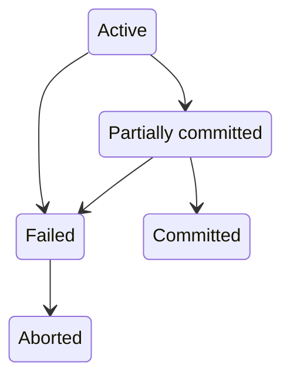

# 数据库恢复系统

恢复系统 (Recovery System) 负责保证数据原子性和持久性。事务并不是一直能成功，有概率被中止，被终止的事务叫做回滚，一般可以用日志 (log) 管理。

事务有 5 个状态

+ 活动（Active）：初始状态
+ 部分提交（Partially committed）：执行完最后一条语句
+ 失败（Failed）：发现不能继续正常的执行
+ 中止（Aborted）：事务回滚并且数据库恢复到事务执行前
+ 已提交（Committed）：完成事务

已提交的事务不能回滚，如果硬要达到回滚的效果，执行补偿事务（compensating transaction）“回滚”，类似 git 的 revert 命令。

17.7 章节内容

