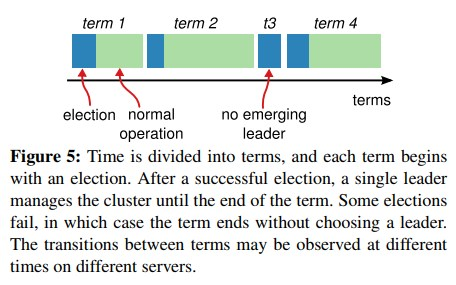

# Paxos & Raft 开荒

事情缘由是同事给我发了两篇论文 GFS 和 MapReduce。这两篇论文的大名 6，7 年前就听过了，不过当时比较菜，论文下载后愣是第一章都看不完。一方面是当时和英文还没有亲和力，一方面是那时候根本不知道分布式是啥。

这么多年过去了，又想挑战一下，然后就开始看了。神奇的是在不考虑细节的情况下，我居然能看懂它在讲什么。刷完就膨胀了，想着还有一篇 BigTable 也一并读了吧。

然后现实给了我一记头槌，BigTable 这篇一堆的生词，什么 Chubby，Paxos，SSTable，Memtable。

这里记一下 Paxos 和 Raft 的笔记，其他的内容等 CRUD 完再说。

我查到的资料里，入门 Paxos 最好的是 Martin fowler 的这篇 [12]。

在接触 Paxos 之前我通过区块链了解过共识算法的一鳞半爪，对它的理解是通过一个个块组成链条状的结构。每个块一经决定就永不改变，那么想当然的认为 Paxos 实现的也是这种结构。

这导致我在看论文 [10]，把提案号和块编号当成一个东西，使得我没法理解 P2a 这条规则。

实际上这俩不是一个东西，论文里主要描述的是 Single-Decree Synod 约等于对一个块的值达成共识。

解开这个误解后论文 [10] 第 1，2 章的内容就好理解很多了。

Paxos 把参与者分成三个角色 proposer，acceptor，learner，一个节点可以扮演全部三种角色。这里的 learner 最没参与感，基本没它什么事。

Paxos 分成两个阶段 prepare 和 accept，为什么这么分论文里有讲，我不太懂，但我大受震撼。

**prepare 阶段**

Proposer 提出编号为 n 的提案（此时没有值 v），要求所有收到提案的 acceptor 不接受提案号小于 n 的提案，如果 acceptor 已经接受过提案，那么把最近接受的提案返回。

Proposer 收到半数以上的同意才允许进入下一阶段。Proposer 翻一下收到的返回里有没有提案，如果有，那么下一阶段只能用这个提案的值，如果没有，则由 proposer 自己选定合适的值 v。

**accept 阶段**

Proposer 要求所有收到请求的 acceptor 接受提案（此时有值 v），acceptor 除非此前承诺过比 n 还大的提案（通过 prepare），不然就必须接受。

Proposer 收到半数以上的同意，那么这个值 v 就被选中了。后面任凭其他节点怎么发提案，这个值是不会改变的。

论文 [11] 里增加了 commit 阶段，通知节点某个值被选中了。这个 commit 阶段打消了我之前的疑惑。因为虽然经过了 prepare 和 accept 阶段，但知道哪个值被选中的只有发起提案的 proposer，其他节点并不知道。当然想知道也简单，发个提案就知道了。

上面这整个过程叫一个 paxos 实例。一个实例对应一个永不改变的值，可以有很多提案号。

只有一个值不变感觉用处不大，然后有一个扩展是 KV 存储，为每个 key 开启一个 Paxos 实例，这样每个 key 会唯一对应一个值。

再进一步扩展，把 KV 存储的 key 换成递增的序号 1, 2, 3, ... 然后 value 存储对应的命令，比如 set('foo', 1)，这样所有的服务器能得到一个顺序和指令都一样的指令集，按顺序执行指令，就能保证所有的服务器状态一致。

我们常用的软件，如 mysql、redis 等，用相同的顺序执行相同的指令，一定能得到相同结果，这是确定性有限状态机的特点。

Paxos 扩展出来的协议还有一堆，各有各的目标，没有继续深入了。

搜索 Paxos 的过程中知道了另一个算法 Raft，这是为容易理解而生的共识算法。我的感觉是 Paxos 更偏向理想，Raft 偏向现实。

Raft 论文 [4] 在多处强调容易理解（Understandable），同时强调容易理解对算法是多么的重要，整体读下来，感觉它对 Paxos 怨念颇深。

Raft 确实好理解很多，它赋予每个节点 3 种状态 leader，follower，candidate，在任何时候只能处于这三种状态的一种。

Raft 有 leader 掌控全局，这个设计能简化不少。

Raft 的超时机制挺有趣的。每个节点会设置一个随机时间的时钟，然后开始倒计时，如果倒计时成功结束，那么本节点认为 leader 十有八九是遭遇不测了，自己申请上位。

相对的 leader 会定期向每个节点发送心跳，告诉它们老实点，我还活着，收到 leader 心跳的节点，倒计时增加随机时间。

Raft 把时间分成 terms，每个 term 从选举 leader 开始，下一次 leader 选举结束。Term 有编号，每进行一次选举就自增，选举和复制日志都要用这个编号。不同的节点可以处在不同的 term 下。

Leader 选举，当节点倒计时结束（election timeout）它向所有节点发送 RequestVote RPC 请求，节点收到请求，检查 leader 是否是集群节点，比较自己和它的日志谁的新（通过 term 编号和日志编号），如果它的新且自己还没投过票，就投同意票，得到半数以上投票则选举成功。因为是半数以上得票所以不会产生两个 leader 这样的尴尬事。

Raft 通过复制日志保证节点状态一致。Leader 通过 AppendEntries RPC 请求把日志传播给所有 follower，在当前 term 下 Leader 把日志同步给大多数 follower 那么这条日志及之前的日志都被算作已提交。至于为什么要当前 term 下，论文里有个例子，描述了前一个 term 的日志同步给大多数 follower 是有被覆盖的风险的。

日志里存的都是命令，每个节点自行决定要执行多少已提交的日志。

有了 leader 选举和日志复制两个机制，Raft 可以保证所有的节点的状态最终是一致的。

系统配置变更：Raft 收到配置变更请求进入 joint consensus 阶段，这个比较难理解，我也不保证我理解是对的。

1. 新旧配置合并作为一条日志记录，然后传播给所有节点。与普通日志不同的是节点收到这种日志后立即使用，不需要等到日志提交
2. 新旧配置对应的日志提交
3. 新配置作为一条日志记录写入，传播给所有节点
4. 新配置记录提交后，集群完成切换

读完这些，对 Paxos 和 Raft 有了些阶段性成果，用玩游戏来打比方就是副本前几号 Boss 的攻略看了，下一步就是去经历一次次团灭。

读了这些论文后，发现老外的那些论文也不全是晦涩难懂。有些设计、介绍可能还是论文更清晰，毕竟这些是作者的一手知识，总不会有人比作者还懂吧，又不是懂王。

整理了下查到的结果，感兴趣的小伙伴可以读读原文

[1] https://en.wikipedia.org/wiki/Consensus_(computer_science). *多个服务器就某一个值达成一致*

[2] https://en.wikipedia.org/wiki/Consistency_model. *一致性模型，本来想搜 Consistency 但是搜不到，共识和一致之间似乎些许差异*

[3] https://en.wikipedia.org/wiki/Paxos_(computer_science). *一系列共识算法，有很多变种 Multi-Paxos、Fast-Paxos*

[4] https://raft.github.io/raft.pdf. *另一种共识算法，强调容易理解*

[5] https://lamport.azurewebsites.net. *发明 Paxos 的巨佬，LaTeX 也是他弄出来的*

[6] https://lamport.azurewebsites.net/pubs/pubs.html. *Lamport 的作品库*

[7] https://en.wikipedia.org/wiki/Finite-state_machine. *一个抽象概念，用来描述计算的，看起来我们写的代码都是确定性有限状态机范畴*

[8] https://github.com/apache/cassandra. *一个开源 KV 库，据说用的是 Paxos 协议*

[9] https://lamport.azurewebsites.net/pubs/lamport-paxos.pdf. *当数学公式出现的瞬间，我就知道这论文不是我现在该读的*

[10] https://lamport.azurewebsites.net/pubs/paxos-simple.pdf. *应该是目前最通俗易懂的 Paxos 介绍了，不过只重点介绍了单一实例的情况*

[11] https://lamport.azurewebsites.net/video/consensus-on-transaction-commit.pdf. *Paxos 增加了 commit 阶段的介绍*

[12] https://martinfowler.com/articles/patterns-of-distributed-systems/paxos.html. *Martin fowler 关于 Paxos 的介绍*

[13] https://stackoverflow.com/questions/26589137/why-is-multi-paxos-called-multi-paxos

[14] https://stackoverflow.com/questions/64753009/does-anyone-have-any-recommendatation-for-multi-paxos/64759874#64759874

[15] https://github.com/cocagne/paxos

[16] https://github.com/Tencent/phxpaxos

[17] https://www.youtube.com/watch?v=JEpsBg0AO6o&t=0s. *paxos 介绍视频*

[18] https://www.youtube.com/watch?v=YbZ3zDzDnrw&t=3035s. *raft 介绍视频*

[19] https://raft.github.io. *raft 的可视化动画，挺有意思的*

Wiki 时常抽风不能访问，我在 github 留了一份快照

https://github.com/sbwkl/sbwkl.github.io/tree/master/material/org.wikipedia.cn

封面图：[Photo by Nathan Cowley from Pexels](https://www.pexels.com/photo/green-grass-on-sand-overlooking-body-of-water-1300510)