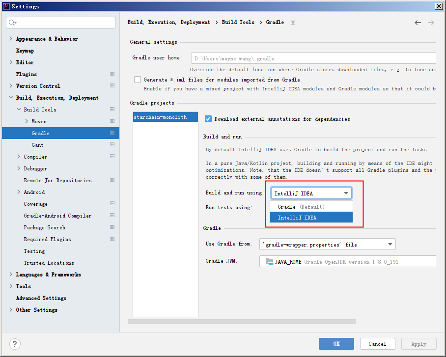

# 《深入理解 JAVA 虚拟机》 学习笔记

这本书朋友推荐挺久了，一直没有看，最近几周抽空看完了，收获不少，摘录了一些。

**增加信心**

从这本书里面找到了自信，为什么这么说，因为这本书看出了查漏补缺的感觉。不同于之前看的几本书，那不是看缺什么，而是看有什么，看得怀疑人生。

这说明这些年的工作还是有点用的，虽然大部分在重复，总有一点在积累。

**调优本地开发环境**

以前说起 jvm 调优，第一反应是调服务器进程，然后发现没啥好调，也不太敢调。

其实作为一个 Java 开发，本地一直有很多进程可以调，以前咋就没注意捏，灯下黑么。

我本地的开发环境还真有点问题，内存不足，有几次都闪退了，升级到了 16G 还是缺。

原因我倒是知道一点，大概有几个问题

1. 随着项目开发调试，莫名多出 Java 进程驻留在系统里，每个占用 200M-800M 不等。
2. 开发工具 idea 的内存占用会越来越离谱，偶尔能上 3g。

莫名变多的 Java 进程是 gradle 启动的，经过一番搜索，发现是配置问题。



上图中红框位置选择 Intellij IDEA 就解决了，奇怪的是之前 2018 版好像没这个问题。

而且这进程都叫 gradle daemon 了，每次启动都创建，真的不是 bug 么。


然后是 idea 问题，通过 visualVM 查看 jvm 参数。发现两个参数不对劲 -Xmx2048m -XX:+UseG1GC。G1 是高性能垃圾收集器，相对的内存占用会多一点，所以我换了一个 CMS。

至于 -Xmx2048m 我都不记得设置过这个参数，重新调了参数

```
-Xms750m
-Xmx900m
-XX:+UseParNewGC
-XX:+UseConcMarkSweepGC
-XX:MaxMetaspaceSize=650m
```

方法区本来想给 512m 的，但有小概率会超出，然后疯狂 GC，又 GC 不掉东西，直接卡死。

说实话 idea 非堆内存占用比堆内存还多，真的牛批，不知道往里面塞了什么东西。

然后给开发中的项目也限制了下内存，这些进程占用内存不多，给个 300 顶天了。

加了这些参数后至少内存占用不会到 99% 了。

这次折腾实际也没解决多少问题，只是用了下几个工具，培养下和它们的感情。另外 visualVM 最好把所有插件都装上，不然功能有点寒酸。

**了解 Class 文件是个什么东西**

跟着书中的例子，把字节码文件从头读了一遍，读前读后明显感觉看 Class 文件的眼神不一样了。

看懂 Class 文件，需要频繁查阅《Java 虚拟机规范》，这个应该算是虚拟机的需求文档吧。

底层表示一般是长度 + 内容组合，Class 文件也不例外，看来这些老爷子口味都差不多。

书中的例子是这样的

```
package com.beibei.starchain.monolith;

public class TestCase {

    private int m;
    public int inc() {
        return m + 1;
    }
}
```

编译出来的字节码是这样的

```
  offset  0  1  2  3  4  5  6  7  8  9  A  B  C  D  E  F
00000000 CA FE BA BE 00 00 00 34 00 16 0A 00 04 00 12 09
00000010 00 03 00 13 07 00 14 07 00 15 01 00 01 6D 01 00
00000020 01 49 01 00 06 3C 69 6E 69 74 3E 01 00 03 28 29
00000030 56 01 00 04 43 6F 64 65 01 00 0F 4C 69 6E 65 4E
00000040 75 6D 62 65 72 54 61 62 6C 65 01 00 12 4C 6F 63
00000050 61 6C 56 61 72 69 61 62 6C 65 54 61 62 6C 65 01
00000060 00 04 74 68 69 73 01 00 28 4C 63 6F 6D 2F 62 65
00000070 69 62 65 69 2F 73 74 61 72 63 68 61 69 6E 2F 6D
00000080 6F 6E 6F 6C 69 74 68 2F 54 65 73 74 43 61 73 65
00000090 3B 01 00 03 69 6E 63 01 00 03 28 29 49 01 00 0A
000000A0 53 6F 75 72 63 65 46 69 6C 65 01 00 0D 54 65 73
000000B0 74 43 61 73 65 2E 6A 61 76 61 0C 00 07 00 08 0C
000000C0 00 05 00 06 01 00 26 63 6F 6D 2F 62 65 69 62 65
000000D0 69 2F 73 74 61 72 63 68 61 69 6E 2F 6D 6F 6E 6F
000000E0 6C 69 74 68 2F 54 65 73 74 43 61 73 65 01 00 10
000000F0 6A 61 76 61 2F 6C 61 6E 67 2F 4F 62 6A 65 63 74
00000100 00 21 00 03 00 04 00 00 00 01 00 02 00 05 00 06
00000110 00 00 00 02 00 01 00 07 00 08 00 01 00 09 00 00
00000120 00 2F 00 01 00 01 00 00 00 05 2A B7 00 01 B1 00
00000130 00 00 02 00 0A 00 00 00 06 00 01 00 00 00 03 00
00000140 0B 00 00 00 0C 00 01 00 00 00 05 00 0C 00 0D 00
00000150 00 00 01 00 0E 00 0F 00 01 00 09 00 00 00 31 00
00000160 02 00 01 00 00 00 07 2A B4 00 02 04 60 AC 00 00
00000170 00 02 00 0A 00 00 00 06 00 01 00 00 00 07 00 0B
00000180 00 00 00 0C 00 01 00 00 00 07 00 0C 00 0D 00 00
00000190 00 01 00 10 00 00 00 02 00 11
```

参照规范，Class 文件应该长这样

```
ClassFile {
    u4             magic;
    u2             minor_version;
    u2             major_version;
    u2             constant_pool_count;
    cp_info        constant_pool[constant_pool_count-1];
    u2             access_flags;
    u2             this_class;
    u2             super_class;
    u2             interfaces_count;
    u2             interfaces[interfaces_count];
    u2             fields_count;
    field_info     fields[fields_count];
    u2             methods_count;
    method_info    methods[methods_count];
    u2             attributes_count;
    attribute_info attributes[attributes_count];
}
```

开头四个字节固定为 0xCAFEBABE，这是一个魔数，表示这是一个 Class 文件，这个魔数似乎也解释了为啥 Java 的图标是杯咖啡。

接下来四个字节是次版本号和主版本号，分别是 0x0000 和 0x0044 换成十进制是 0 和 52，反编译代码会看到 `Decompiled .class file, bytecode version: 52.0 (Java 8)`。


然后是常量池，头两个字节表示数量 0x0016，转成十进制是 22 代表的是有 1~21 个常量。

这个挺反常的，光是索引是从 1 开始就很奇怪了，22 表示的是 21 个常量更是诡异，怕不是把索引 0 也算进去了。

21 个常量读完到 0x000000FF 占了大半的空间了。


为了方便后续看常量，用 javap 输出

```
$ javap -v TestCase.class
...
Constant pool:
   #1 = Methodref          #4.#18         // java/lang/Object."<init>":()V
   #2 = Fieldref           #3.#19         // com/beibei/starchain/monolith/TestCase.m:I
   #3 = Class              #20            // com/beibei/starchain/monolith/TestCase
   #4 = Class              #21            // java/lang/Object
   #5 = Utf8               m
   #6 = Utf8               I
   #7 = Utf8               <init>
   #8 = Utf8               ()V
   #9 = Utf8               Code
  #10 = Utf8               LineNumberTable
  #11 = Utf8               LocalVariableTable
  #12 = Utf8               this
  #13 = Utf8               Lcom/beibei/starchain/monolith/TestCase;
  #14 = Utf8               inc
  #15 = Utf8               ()I
  #16 = Utf8               SourceFile
  #17 = Utf8               TestCase.java
  #18 = NameAndType        #7:#8          // "<init>":()V
  #19 = NameAndType        #5:#6          // m:I
  #20 = Utf8               com/beibei/starchain/monolith/TestCase
  #21 = Utf8               java/lang/Object
...
```

接着是一些访问标识，接口啥的，跳过。

接着是字段，字节码 0x00000108 ~ 0x00000112 部分

```
  offset  0  1  2  3  4  5  6  7  8  9  A  B  C  D  E  F
...
00000100                         00 01 00 02 00 05 00 06
00000110 00 00
```

按照规范来读是：一个字段，private 修饰，名字是 #5 常量，类型是 #6 常量，没有属性。

```
field_info {
    u2             access_flags;
    u2             name_index;
    u2             descriptor_index;
    u2             attributes_count;
    attribute_info attributes[attributes_count];
}
```

接着是方法，字节码 0x00000112 ~ 0x0000018F 部分，先跳过。

最后是属性，字节码 0x00000190 ~ 0x00000199 部分

```
  offset  0  1  2  3  4  5  6  7  8  9  A  B  C  D  E  F
...
00000190 00 01 00 10 00 00 00 02 00 11
```

按照规范读是：一个属性，属性名是 #16 常量（SourceFile），属性长度 2，属性值是 #17 常量。

属性格式最复杂，而且能嵌套，能出现在多种结构里。

根据指向常量的值来确定属性名，比如这个属性是 SourceFile，方法的结构里还有 Code 属性，可以任意扩展。

属性的前六个字节是固定的，两个指向常量，四个表示长度。


然后回过来看方法部分，读这部分花的时间最多，字节码这种格式恶心的地方在于只要搞错一个字节，后面全错位了。

```
  offset  0  1  2  3  4  5  6  7  8  9  A  B  C  D  E  F
...
00000110       00 02 00 01 00 07 00 08 00 01 00 09 00 00
00000120 00 2F 00 01 00 01 00 00 00 05 2A B7 00 01 B1 00
00000130 00 00 02 00 0A 00 00 00 06 00 01 00 00 00 03 00
00000140 0B 00 00 00 0C 00 01 00 00 00 05 00 0C 00 0D 00
00000150 00 00 01 00 0E 00 0F 00 01 00 09 00 00 00 31 00
00000160 02 00 01 00 00 00 07 2A B4 00 02 04 60 AC 00 00
00000170 00 02 00 0A 00 00 00 06 00 01 00 00 00 07 00 0B
00000180 00 00 00 0C 00 01 00 00 00 07 00 0C 00 0D 00 00
```

按照规范读是：2 个方法

第一个方法（0x00000114 开始），public 修饰，方法名是 #7 常量，描述符是 #8 常量，一个属性，属性值是 #9 常量（Code），长度是 0x2F 个字节（三行少一个，到 0x00000150）。

第二个方法（0x00000151 开始），public 修饰，方法名是 #14 常量，描述符是 #15 常量，一个属性，属性值是 #9 常量，长度是 0x31 个字节（三行多一个，到 0x0000018F）

```
method_info {
    u2             access_flags;
    u2             name_index;
    u2             descriptor_index;
    u2             attributes_count;
    attribute_info attributes[attributes_count];
}
```

两个方法都有 Code 属性，按照规范格式如下

```
Code_attribute {
    u2 attribute_name_index;
    u4 attribute_length;
    u2 max_stack;
    u2 max_locals;
    u4 code_length;
    u1 code[code_length];
    u2 exception_table_length;
    {   u2 start_pc;
        u2 end_pc;
        u2 handler_pc;
        u2 catch_type;
    } exception_table[exception_table_length];
    u2 attributes_count;
    attribute_info attributes[attributes_count];
}
```

Code 属性里的 code 部分对应方法体实现。

第一个方法的 code 一共 5 个字节。

```
  offset  0  1  2  3  4  5  6  7  8  9  A  B  C  D  E  F
...
00000120                               2A B7 00 01 B1
```

这玩意儿要根据《Java 虚拟机规范》指令集部分翻译，翻译过来是

```
2A          aload_0
B7 00 01    invokespecial 0x0001
B1          return
```

其实就是调用了父类的构造方法，#1 常量是 Object 的 \<init\> 方法。

第二个方法同理，抠出来 code 部分一共 7 个字节

```
  offset  0  1  2  3  4  5  6  7  8  9  A  B  C  D  E  F
...
00000160                      2A B4 00 02 04 60 AC
```

翻译过来是

```
2A          aload_0
B4 00 02    getfield 0x0002
04          iconst_1
06          iadd
AC          ireturn
```

这些指令能看懂个大概，#2 常量是字段 m，加 1 返回。

Java 字节码有自己的指令集还是蛮震惊的，它这是想给 CPU 指令做一层统一的规范么。

Class 文件和 gcc 编译过程中产生的 Relocatable object file 有点像，都是半成品。虚拟机加载后进行
链接组成能运行的程序，这灵活性确实很大，全动态链接。

**了解编译器是什么东西**

Java 代码不严谨的说有两次编译阶段。一次是从文本文件编译成字节码文件 .java --> .class，另一次是字节码编译成机器码。

第一次很熟悉，干 Java 开发的多多少少都有接触，只是大多用 maven 或者 gradle 直接编辑成 jar 文件了，解压开就是 Class 文件。

第二次是 Hotspot 虚拟机的名字的来源，指的是虚拟机会把执行比较多的字节码（热点代码）编译成机器码提高运行效率，干这活的编译器通称 JIT 编译器。

比较神奇的是 Java 还有提前编译器（AOT）直接把静态代码编译成机器码，这…… 万物皆轮回么。

另外好消息是编译字节码用的 javac 居然是 Java 写的，最先进的 Graal 编译器也是 Java 写的。

编译这部分等以后看完龙书再回来实战，如果看得懂的话。

**泛型居然是技术债**

Java 的泛型擦除是综合各方面因素之后的妥协，用了最简单的实现，直接擦除掉泛型类型，这样就能兼容之前版本的字节码，然后增加类似强转的功能就成了。

因为这个擦除的原因，下面这段代码是非法的，挺反直觉，据说 C# 能这么用。

```
public class Info<E> {
    public void xxx() {
        E obj = new E();
    }
}
```

希望不久的将来能不非法了，现在泛型用起来有种别扭的感觉。

封面图：[Photo by Pixabay from Pexels](https://www.pexels.com/photo/brown-wooden-dock-462024)