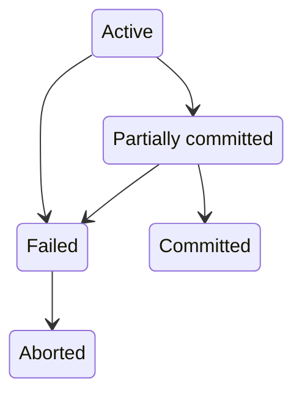
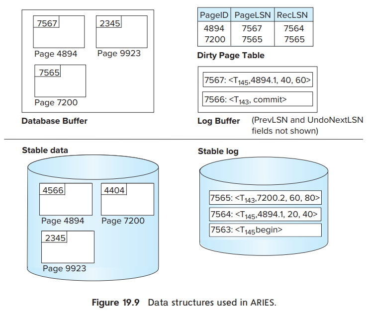

# 数据库恢复系统

恢复系统 (Recovery System) 负责保证数据原子性和持久性。事务可能成功，可能中止，被中止的事务叫回滚。

事务有 5 个状态

+ 活动（Active）：初始状态
+ 部分提交（Partially committed）：执行完最后一条语句
+ 失败（Failed）：事务不能继续正常执行
+ 中止（Aborted）：事务回滚，数据库恢复到事务执行前
+ 已提交（Committed）：完成事务

已提交的事务不能回滚，如果硬要达到回滚的效果，执行补偿事务（compensating transaction）“回滚”，类似 git 的 revert 命令。

恢复系统会用到稳定存储器（stable storage），这是一个抽象概念，假定保存在稳定存储器的数据不会丢失，至于怎么保证，就不管了。

数据在磁盘和内存之间移动有两个操作 input(B) 和 output(B)，数据访问抽象为两个基本操作 read(X) 和 write(X)。

无论是 read 还是 write 如果发现数据项 X 不在内存里，都需要通过 input(B) 把数据加载到内存。但是 output，为了效率不会每次 write 都执行。

抽象做的杠杠的，这些个老头子想的真多。

最常用的恢复技术基于日志记录，还有别的叫 shadow copying（不知道中文翻译是啥）。

ARIES 恢复算法

这个是当前最先进的恢复算法，基于日志记录实现，有几个特别的地方。

1. 用日志顺序号（LSN）唯一标识日志记录，每页维护页日志顺序号（PageLSN）
2. 支持物理逻辑（physiological）redo 操作
3. 使用脏页表（dirty page table）记录脏页，脏页就是内存和磁盘数据不一样的页
4. 使用模糊检查点（fuzzy-checkpoint）机制

日志记录可以分成物理日志和逻辑日志，先说好理解的物理日志。

事务可以被一系列日志记录表示，形如

+ <Ti start>
+ <Ti commit>
+ <Ti abort>
+ <Ti, Xj, V1, V2>
+ <Ti, Xj, V1>

前三条表示事务的开始，提交和中止。

第四条表示事务 Ti 的数据项 Xj 从 V1 变为 V2。

第五条是第四条的撤销操作，所以不需要 V2。

一个事务有很多个数据项。

根据这一系列日志记录可以实现 undo 和 redo 功能。

在上图里，是三个事务的执行过程，先忽略掉 checkpoint 这一条。T1 最正常，修改 C 的值之后就提交了，事务结束。

T0 在变更 B 的值之后因某些原因选择回滚，有回滚记录 <T0, B, 2000> 最后标记回滚成功。

T2 是因为系统崩溃了，被迫回滚，系统从崩溃中恢复时，发现 T2 即没有 commit 也没有 abort，标记为未完成事务，然后回滚，所以会看到有两条新的日志 <T2, A, 500> 和 <T2abort> 这是系统恢复时额外补上的。

只要这段日志存在，系统就能保持一致，只要执行一遍这段日志即可，这个过程叫重放历史（repeating history）。

ARIES 在上面的基础上给每条日志一个唯一的日志顺序号，方便定位。

除了物理日志，还有逻辑日志，最大的区别是逻辑日志结束时带一个逻辑撤销操作。

+ <Ti, Oj, operation-beigin>
+ <Ti, Oj, operation-end, U>
+ <Ti, Oj, operation-abort>

Oj 唯一表示一个操作，operation-end 后面的 U 就是逻辑撤销操作

上图中事务 T1 有一段逻辑日志，先是数据项 C 从 700 变为 400，然后结束时操作 U 是 (C, +300) 意味着如果发生回滚，那么 C = C + 300

从这里也可以看出逻辑日志可能不幂等，不能多次执行，处理起来要小心点。

但是有些场景必须要用，比如同一个数据项发生多次变更，这时只能用逻辑操作，比如上图中的数据项 C。而这种情况在并发控制系统中是允许发生的。

ARIES 支持物理逻辑 redo 操作，数据页是物理的，在页内可以是逻辑的，其实我也没咋看懂，大概的意思应该是逻辑操作只可能出现在页内。

ARIES 使用脏页表维护所有内存和磁盘不同的页。

脏页保存 pageLSN 和 recLSN 帮助记录执行了哪些操作。PageLSN 记录最后执行的日志序列号，recLSN 记录最近一条刷到稳定存储器的日志号。

最后是模糊检查点机制。检查点机制为了缩短恢复时间，数据库运行过程中产生大量日志，如果每次恢复都从头执行一遍，太费时了。

执行检查点先暂停事务，然后执行三个步骤

+ 将内存中的日志记录刷到稳定存储器
+ 将内存中的所有变更刷到磁盘
+ 生成一条特殊的日志 \<checkpoint L> 写到稳定存储器，L 表示当前活跃的事务。

执行完成后 \<checkpoint L> 之前的日志大概率没用了，除了那几条和 L 相关的日志。

当数据库启动时，恢复系统开始工作，先扫描到最后一个 checkpoint 把 L 加到 undo-list 里面

然后执行 redo 阶段，顺序重放日志内容，遇到 <Ti commit> 或 <Ti abort>，把对应的事务 Ti 从 undo-list 中移除。遇到 <Ti start> 则把 Ti 添加到 undo-list。

如果 undo-list 不为空，执行 undo 阶段，倒序遍历日志，遇到属于 undo-list 事务的日志，添加补偿日志。遇到 <Ti start> 表示回滚结束，添加 <Ti abort>。

直到 undo-list 为空恢复工作结束，数据库启动完成，事务可以正常开始执行。

为了保证恢复系统能正常工作，刷盘要遵守写日志（WAL）规则

1. <Ti commit> 写入到稳定存储器之后 Ti 进入提交状态
2. <Ti commit> 写入到稳定存储器之前，Ti 相关的其他日志必须先写入稳定存储器
3. 内存中的数据写入磁盘之前，对应的日志必须先写入稳定存储器

执行检查点需要暂停事务，和 jvm 类似，为了减少这个时间，ARIES 使用模糊检查点，不全量刷盘，代价是恢复需要更长的时间（需要执行的日志更多）。不过这种交易通常是值得的。

数据库就先看到这里了，更多的知识到实战中去获取。

前几周又忙起来了，写写东西的习惯差点又没了，养成习惯太难了。

封面图 [Photo by Pixabay from Pexels](https://www.pexels.com/photo/seashore-and-clouds-scenery-262325)