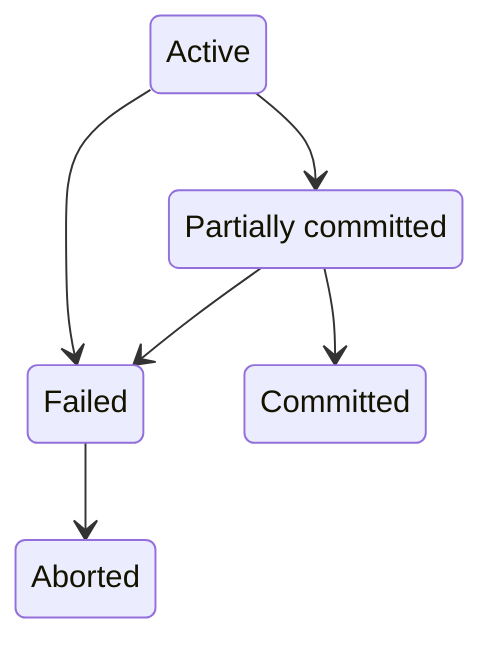

# 数据库恢复系统

恢复系统 (Recovery System) 负责保证数据原子性和持久性。事务并不是一直能成功，有概率被中止，被中止的事务叫做回滚。

事务有 5 个状态

+ 活动（Active）：初始状态
+ 部分提交（Partially committed）：执行完最后一条语句
+ 失败（Failed）：发现不能继续正常的执行
+ 中止（Aborted）：事务回滚并且数据库恢复到事务执行前
+ 已提交（Committed）：完成事务

已提交的事务不能回滚，如果硬要达到回滚的效果，执行补偿事务（compensating transaction）“回滚”，类似 git 的 revert 命令。

恢复系统会用到稳定存储器（stable storage），这应该是一个抽象概念，是假定保存在稳定存储器的数据不会丢失，没有这个假设后面没法玩。

数据在磁盘和内存之间移动有两个操作 input(B) 和 output(B)

数据访问会抽象为两个基本操作 read(X) 和 write(X)，无论是 read 还是 write 如果发现 X 不在内存里，都需要通过 input(B) 把数据加载到内存。至于 output 为了效率不会每次 write 都 output。

恢复系统的一种实现是基于日志 (log) 实现。

事务可以被一系列日志记录表示，形如 <T_i, X_j, V_1, V_2> T_i 表示事务，X_j 表示数据项，V_1 表示旧数据，V_2 表示新数据。

另外再附带三条特殊的日志记录

<T_i start>
<T_i commit>
<T_i abort>

表示事务的开始，提交和中止。

根据这一系列日志记录可以实现 undo 和 redo 功能。

为了避免日志记录过长，引入 checkpoint 机制。它往稳定存储器里面塞一条特殊的日志 <checkpoint L> L 表示 output 到磁盘时还活跃的事务清单。

这样当程序扫描到 <checkpoint L> 时就知道之前的日志已经没用了。
