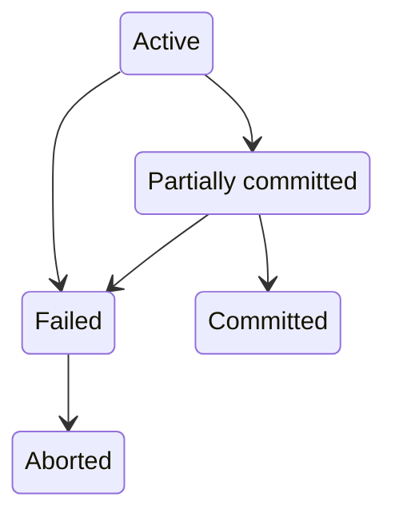

# 数据库恢复系统

恢复系统 (Recovery System) 负责保证数据原子性和持久性。事务并不是一直能成功，有概率被中止，被中止的事务叫做回滚。

事务有 5 个状态

+ 活动（Active）：初始状态
+ 部分提交（Partially committed）：执行完最后一条语句
+ 失败（Failed）：发现不能继续正常的执行
+ 中止（Aborted）：事务回滚并且数据库恢复到事务执行前
+ 已提交（Committed）：完成事务

已提交的事务不能回滚，如果硬要达到回滚的效果，执行补偿事务（compensating transaction）“回滚”，类似 git 的 revert 命令。

恢复系统会用到稳定存储器（stable storage），这应该是一个抽象概念，是假定保存在稳定存储器的数据不会丢失，没有这个假设后面没法玩。

数据在磁盘和内存之间移动有两个操作 input(B) 和 output(B)

数据访问会抽象为两个基本操作 read(X) 和 write(X)，无论是 read 还是 write 如果发现 X 不在内存里，都需要通过 input(B) 把数据加载到内存。至于 output 为了效率不会每次 write 都 output。

恢复系统的一种实现是基于日志 (log) 实现。

事务可以被一系列日志记录表示，形如 <T_i, X_j, V_1, V_2> T_i 表示事务，X_j 表示数据项，V_1 表示旧数据，V_2 表示新数据。

还有 <T_i, X_j, V_1> 表示补偿日志，一般用来回滚数据。

另外再附带三条特殊的日志记录

<T_i start>
<T_i commit>
<T_i abort>

表示事务的开始，提交和中止。

根据这一系列日志记录可以实现 undo 和 redo 功能。

为了避免日志记录过长，引入 checkpoint 机制。它往稳定存储器里面塞一条特殊的日志 <checkpoint L> L 表示 output 到磁盘时还活跃的事务清单，同时把内存中相关数据 output 到硬盘。

执行 checkpoint 时，事务是暂停的，不过不知道这个执行过程是怎么保证原子性的，这要是执行到一半崩了，岂不是很蛋疼。

当程序扫描到 <checkpoint L> 时就知道之前的日志已经没用了。

当恢复系统开始工作时，先扫描到最后一个 checkpoint 把 L 加到 undo-list 里面

然后执行 redo 阶段，顺序重放日志内容，当遇到 <T_i commit> 或者 <T_i abort> 时把对应的事务 T_i 从 undo-list 中移除，当遇到 <T_i start> 则把 T_i 添加到 undo-list。

如果 undo-list 不为空，执行 undo 阶段，倒序遍历日志，遇到属于 undo-list 事务的日志，添加补偿日志。遇到 <T_i start> 表示回滚结束，添加 <T_i abort>。

undo-list 为空恢复工作结束，事务可以正常开始执行。

无论是数据库数据还是日志记录都存在从内存写入存储器的过程，数据库数据写入磁盘，日志记录写入稳定存储器。为了保证恢复系统能正常工作，写入存储器的过程要遵守

1. <T_i commit> 写入到稳定存储器之后 T_i 进入提交状态
2. <T_i commit> 写入到稳定存储器之前，T_i 相关的其他日志必须先写入稳定存储器
3. 内存中的数据写入磁盘之前，对应的日志必须先写入稳定存储器

实际在并发情况下恢复系统会更加复杂

这种日志叫做物理日志，它的好处是 redo 是幂等的，都是往固定的位置写固定的数据，坏处是啰嗦。

比如用分槽的页结构保存数据，如果删除一条数据，其他数据都要移动。用物理日志记录需要挨个记一遍，啰嗦。

用逻辑日志只需记录一个删除操作即可。

ARIES 恢复算法

1. 用日志顺序号（LSN）标识日志记录，每个页维护页日志顺序号（PageLSN）
2. 支持物理逻辑（physiological）redo 操作
3. 使用脏页表（dirty page table）记录脏页，就是内存和磁盘数据不一样的页
4. 使用模糊检查点（fuzzy-checkpoint）机制

因为进行写入检查点的时候事务是暂停的，为了减少这个时间，模糊检查点一次写入少量页以缩短时间，代价是恢复需要更长的时间。不过这种交易通常是值得的。

物理逻辑 redo 操作指的是每页是物理的，在页内是逻辑的，其实我也没咋看懂，大概的意思应该是逻辑操作只可能出现在页内。

