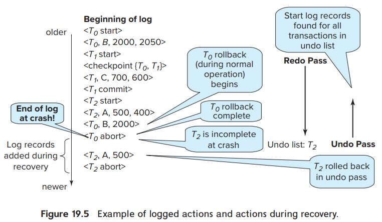

# 数据库恢复系统

恢复系统 (Recovery System) 负责保证数据原子性和持久性。事务并不是一直能成功，有概率被中止，被中止的事务叫做回滚。

事务有 5 个状态

+ 活动（Active）：初始状态
+ 部分提交（Partially committed）：执行完最后一条语句
+ 失败（Failed）：发现不能继续正常的执行
+ 中止（Aborted）：事务回滚并且数据库恢复到事务执行前
+ 已提交（Committed）：完成事务

已提交的事务不能回滚，如果硬要达到回滚的效果，执行补偿事务（compensating transaction）“回滚”，类似 git 的 revert 命令。

恢复系统会用到稳定存储器（stable storage），这应该是一个抽象概念，是假定保存在稳定存储器的数据不会丢失，这也提现了职责分离的思想，保证数据丢给其他组件去干。

数据在磁盘和内存之间移动有两个操作 input(B) 和 output(B)

数据访问会抽象为两个基本操作 read(X) 和 write(X)，无论是 read 还是 write 如果发现 X 不在内存里，都需要通过 input(B) 把数据加载到内存。至于 output 为了效率不会每次 write 都 output。

抽象做的杠杠的，这些个老头子想的真多。

最常用的恢复技术是基于日志记录，还有一种叫 shadow copying（不知道中文翻译是啥）。

ARIES 恢复算法

这个算法似乎是当前最先进的回复算法，基于日志记录实现，有几个特别的地方。

1. 用日志顺序号（LSN）标识日志记录，每个页维护页日志顺序号（PageLSN）
2. 支持物理逻辑（physiological）redo 操作
3. 使用脏页表（dirty page table）记录脏页，就是内存和磁盘数据不一样的页
4. 使用模糊检查点（fuzzy-checkpoint）机制

日志记录可以分成物理日志和逻辑日志，先说好理解的物理日志。

事务可以被一系列日志记录表示，形如 <T_i, X_j, V_1, V_2> T_i 表示事务，X_j 表示数据项，V_1 表示旧数据，V_2 表示新数据。

还有 <T_i, X_j, V_1> 表示补偿日志，一般用来回滚数据。

另外再附带三条特殊的日志记录

<T_i start>
<T_i commit>
<T_i abort>

表示事务的开始，提交和中止。

前面事务状态里的「部分提交」状态，就是 commit 这条日志尚未写入的状态。

根据这一系列日志记录可以实现 undo 和 redo 功能。

在上图里，是 3 个事务的执行过程，先忽略掉 checkpoint 这一条。T_1 最正常，修改 C 的值之后就提交了，C 的值就被固定了。T_0 在变更 B 的值之后因某些原因选择回滚，有回滚记录 <T_0, B, 2000> 最后标记回滚成功。T_2 是因为系统崩溃了，被迫回滚，系统从崩溃中恢复时，发现 T_2 记没有 commit 也没有 abort，会把它标记为未完成的事务，然后回滚，所以会看到有两条新的日志 <T_2, A, 500> 和 <T_2abort> 这是系统恢复时额外补上的。

只要这段日志存在，系统每次启动时执行一遍这段日志，那么每次系统启动后的数据都是一致的，这个过程叫什么重放历史（repeating history）。

ARIES 给每条日志一个唯一的日志顺序号，这个日志号简化一些寻找回滚日志的逻辑。

除了物理日志，还有叫逻辑日志的，和物理日志类似，主要区别是三个特殊的日志不一样，逻辑日志张这样

<T_i, O_j, operation-beigin>

<T_i, O_j, operation-end, U>

<T_I, O_j, operation-abort>

其中 O_j 唯一表示一个操作，operation-end 后面的 U 表示的是一个逻辑撤回操作，比如逻辑日志表示 insert 一条记录，那么 U 就表示 delete，大概是这样的意思。

上面这个图就是既有物理日志也有逻辑日志，事务 T_1 有一段逻辑日志，显示数据项 C 从 700 变为 400，然后结束时操作 U 是 (C, +300) 意味着如果发生回滚，那么 C = C + 300

从这里也可以看出逻辑日志可能会不幂等，不能多次执行，处理起来比物理日志要麻烦点。

ARIES 支持物理逻辑 redo 操作，数据页是物理的，在页内可以是逻辑的，其实我也没咋看懂，大概的意思应该是逻辑操作只可能出现在页内。

为了避免日志记录过长，引入 checkpoint 机制。它往稳定存储器里面塞一条特殊的日志 <checkpoint L> L 表示 output 到磁盘时还活跃的事务清单，同时把内存中相关数据 output 到硬盘。

执行 checkpoint 时，事务是暂停的，不过不知道这个执行过程是怎么保证原子性的，这要是执行到一半崩了，岂不是很蛋疼。

当程序扫描到 <checkpoint L> 时就知道之前的日志已经没用了。

当恢复系统开始工作时，先扫描到最后一个 checkpoint 把 L 加到 undo-list 里面

然后执行 redo 阶段，顺序重放日志内容，当遇到 <T_i commit> 或者 <T_i abort> 时把对应的事务 T_i 从 undo-list 中移除，当遇到 <T_i start> 则把 T_i 添加到 undo-list。

如果 undo-list 不为空，执行 undo 阶段，倒序遍历日志，遇到属于 undo-list 事务的日志，添加补偿日志。遇到 <T_i start> 表示回滚结束，添加 <T_i abort>。

undo-list 为空恢复工作结束，事务可以正常开始执行。

无论是数据库数据还是日志记录都存在从内存写入存储器的过程，数据库数据写入磁盘，日志记录写入稳定存储器。为了保证恢复系统能正常工作，写入存储器的过程要遵守

1. <T_i commit> 写入到稳定存储器之后 T_i 进入提交状态
2. <T_i commit> 写入到稳定存储器之前，T_i 相关的其他日志必须先写入稳定存储器
3. 内存中的数据写入磁盘之前，对应的日志必须先写入稳定存储器

实际在并发情况下恢复系统会更加复杂

这种日志叫做物理日志，它的好处是 redo 是幂等的，都是往固定的位置写固定的数据，坏处是啰嗦。

比如用分槽的页结构保存数据，如果删除一条数据，其他数据都要移动。用物理日志记录需要挨个记一遍，啰嗦。

用逻辑日志只需记录一个删除操作即可。

因为进行写入检查点的时候事务是暂停的，为了减少这个时间，模糊检查点一次写入少量页以缩短时间，代价是恢复需要更长的时间。不过这种交易通常是值得的。

数据库就先看到这里了，基本的概念有了一些模糊的记忆，更多的知识在实战和交谈中获取。