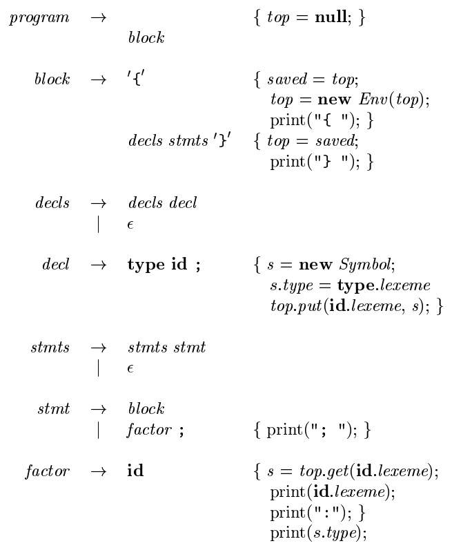

# 《编译原理》 day 9

今天是读《编译原理》的逻辑第 9 天，学习 Symbol Tables（符号表），它保存源程序的各种信息。

符号表是嵌套结构，代码块也是嵌套结构，不知道它俩谁先谁后。实现它的是 Env 类，environment 的缩写，代表 name 到 location 的映射。

Env 主要干三件事：创建符号表，放入条目，拿出条目。

```
public class Env {
    private Hashtable<String, Symbol> table;
    protected Env prev;
    public Env(Env p) {
        table = new Hashtable<>();
        this.prev = p;
    }

    public void put(String s, Symbol sym) {
        this.table.put(s, sym);
    }

    public Symbol get(String s) {
        for (Env e = this; e != null; e = e.prev) {
            Symbol sym = e.table.get(s);
            if (sym != null) {
                return sym;
            }
        }
        return null;
    }
}
```

一个代码块对应一个 Env，代码块的嵌套，在 Env 上表现为 prev 指向前一个符号表，当需要寻找符号时，从当前 Env 开始，从里往外开始找，这个和 Java 的双亲委派有点类似。



这几个带语义动作的产生式看能看懂，但写肯定写不出来，不知道它是怎么被设计出来的。

它表示的意思是把 `{ int x; char y; { bool y; x; y; } x; y; }` 转化为 `{ { x:int; y:bool; } x:int; y:char; }`，标记出变量在使用时的类型。

比如 y 在第一个代码块的类型是 `char` 在第二个代码块被重声明为 `bool` 所以是 `y:bool`。

逐渐开始天书化，嘛，这也在预料之中。

好消息是须弥 3.1 要开了，网传妮露很菜，但问题不大，就凭开大那一眼，我就知道这是要抽的角色。

管她菜不菜，就算强也打不通深渊。

封面图：Twiter 心臓弱眞君 @xinzoruo