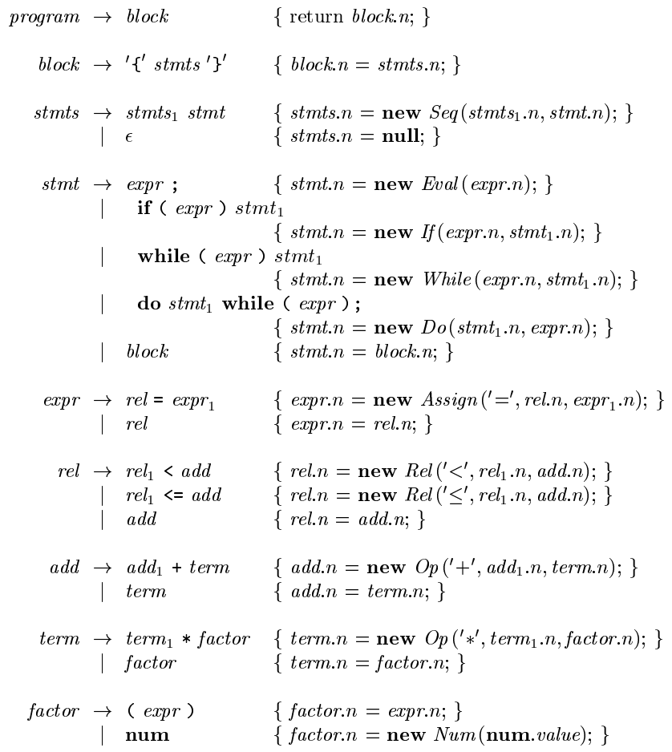
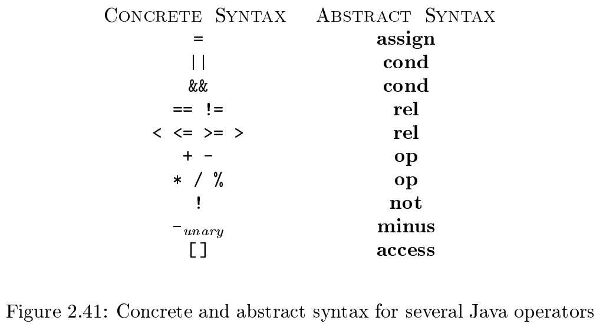
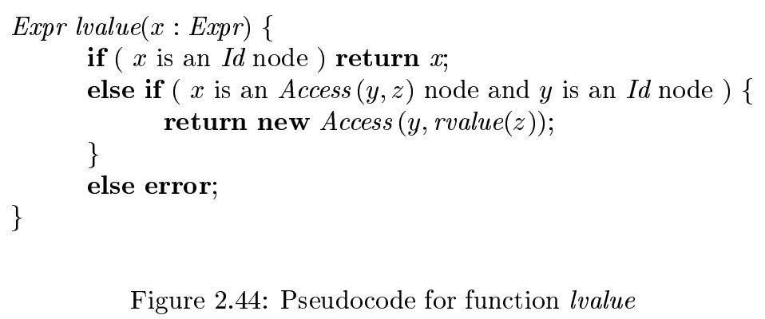
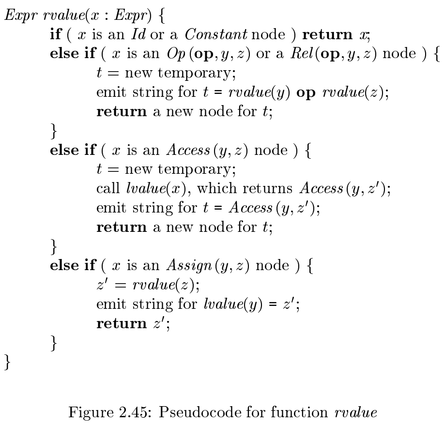

# 《编译原理》 day 10

今天是读《编译原理》的逻辑第 10 天，关于中间代码生成，这节直接给我这小脑瓜子干超载了，到现在脑袋还是嗡嗡的。

中间代码是生成目标代码之前的过度产品，可能存在多种中间代码，分析树可以算其中一种，其他还有 (abstract) syntax trees（抽象语法树）、three-address code（三地址代码）等。

语法树和分析树类似，区别是分析树的内部节点是非终结符，语法树是操作符，另外语法树比分析树简洁，语义动作没了，变量声明没了，其他能没的都没了，分析树有时候叫具体语法树，和抽象相对。

三地址代码有点像一连串表达式，比如表达式 `a[i] = 2 * a[j - k]` 的三地址代码是

```
t3 = j - k
t2 = a[t3]
t1 = 2 * t2
a[i] = t1
```

每行一个指令，这玩意儿往大了说和 relocation object file（可重定向目标文件）有点像，经过 link 后算出具体地址就可以直接运行了。

语法树通过在产生式中嵌入语义动作构建，简版 Java 文法



操作符的一些对应关系



if 语句生成三地址代码伪代码

```
class If extend Stmt {
    Expr E; Stmt S;
    public If(Expr x, Stmt y) {
        E = x;
        S = y;
        after = newlabel();
    }

    public void gen() {
        Expr n = E.rvalue();
        emit("ifFalse " + n.toString() 
            + "goto " + after);
        S.gen();
        emit(after + ":");
    }
}
```

到这里还勉强能理解，再往后的表达式翻译已经放飞自我了。

表达式翻译有两个函数 lvalue 和 rvalue。





初看 rvalue 的条件三和条件四，还以为印刷错误，看了好几遍才看到一个是 Access 一个是 Assign 见了鬼了。

等具体的 Java 代码写出来，还有一次看懂这玩意儿的机会。

不慌，苟住，我们能赢。

封面图：Twiter 心臓弱眞君 @xinzoruo