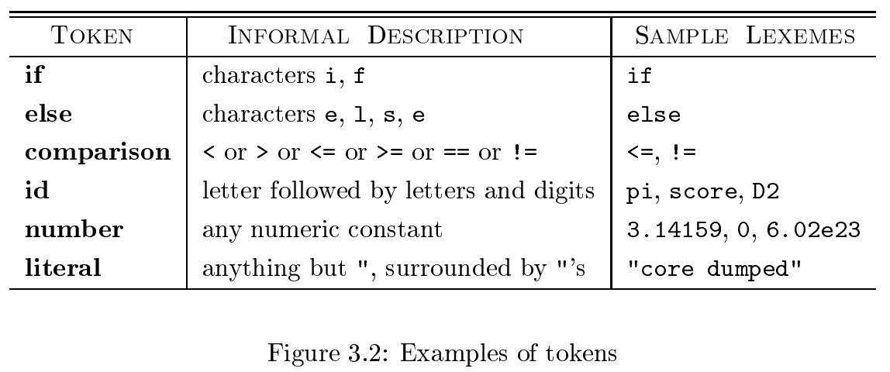

# 《编译原理》 day 12

今天是读《编译原理》的逻辑第 12 天，开始给词法分析添加细节。

词法分析分两个处理过程

1. 扫描阶段做些边角工作，比如删注释、删空格这些
2. 处理扫描阶段的输出，生成 Token。

编译器好强，处处透露着模块化的思想，词法分析和语法分析分开处理也是这种思想，这样做的好处有三

1. 简化编译器设计，这是最大的好处
2. 提高编译器效率，分开后可以各自进行优化
3. 增强编译器移植性，输入设备的特殊性被限制在词法分析中

词法分析涉及的几个相似的术语，但凡涉及名词解释，还是原文好理解。

1. Token：A token is a pair consisting of a token name and an optional attribute value. The token name is an abstract symbol representing a kind of lexical unit
2. Pattern: A pattern is a description of the form that the lexemes of a token may take
3. Lexeme: A lexeme is a sequence of characters in the source program that matches the pattern for a token and is identified by the lexical analyzer as an instance of that token

Token 这个词我花了好长时间适应，在我概念里 Token 就是调用第三方服务时的认证信息，和这里的描述完全时两个东西。

一些能覆盖大多数语言的 Token 分类

1. 一个关键字一个 Token， 比如 if，else
2. 一组运算符一个 Token，比如 >，!=
3. 所有的标识符一个 Token，比如变量名、方法名
4. 一个或多个常量 Token，比如数字
5. 一个标点符号一个 Token，比如括号，逗号这些

对于代码片段 `printf("Total = %d\n", score);`

`printf` 这个字符串是词素，匹配标识符 Token，score 同理。

`( , ;` 匹配标点符号 Token

`"Total = %d\n"` 匹配常量 Token

词法分析器有时会遇到输入无法与任何 Token 匹配，这时就卡住了。最简单的恢复策略是恐慌模式，不断删除字符，直到可以匹配为止，这策略有够暴力的。

讲道理我没法理解为啥它能在实际中工作。

其他的恢复动作还有

1. 删除一个字符
2. 插入一个丢失的字符
3. 替换一个字符
4. 交换两个相邻的字符

这些动作咋都这么可疑捏，这不是把源代码都改掉了么，这尼玛也能工作，理解不能。

