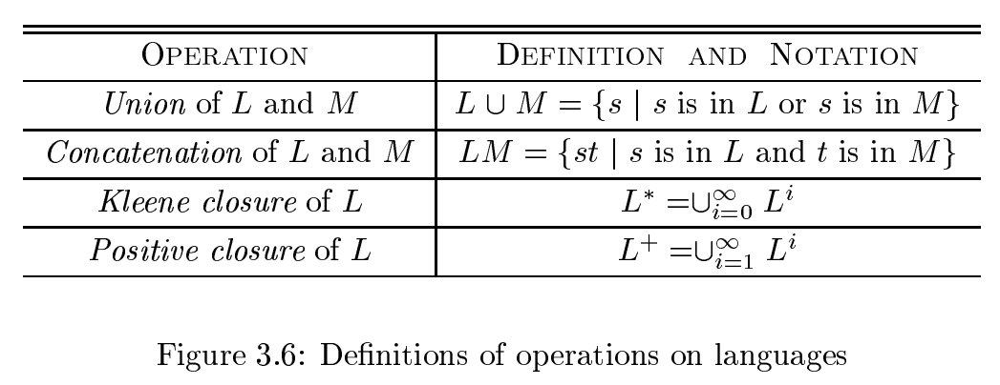

# 《编译原理》 day 13

今天是读《编译原理》的逻辑第 13 天，主要讲了正则表达式，顺带提了一嘴缓冲池。

正则表达式这个翻译也有够难理解的，但是吧好像也没有啥好的翻译。

缓冲池是提高词法分析性能的手段之一，这是因为数据传输花费的时间太多。就好比一辆高铁，拉一个人和拉 200 人花的时间差不多，那肯定选择多拉点人，甚至还想超载。


最简单的缓冲池实现是准备两个池子，第一个满的时候加载数据到第二个池子，第二个满的时候加载数据到第一个，只要一个词素别长的离谱，这种方式都能满足要求。

之前练习我自己实现的时候只用了一个池子，搞得限制贼多，原来要搞两个，又学到了。

然后是重头戏，也是意外惊喜的正则表达式，它是描述词素模式的重要表示方法。

为啥说是意外惊喜，因为我对正则感兴趣很久了，好奇它是怎么实现的，刚好这里遇上了，据说后面章节还有它的实现方式，期待ing。

先上点概念

Alphabet（字母表）是一组有限数量的符号集，比如 {0, 1} 是二进制字母表。

String（字符串）是字母表中符号的一个有穷序列，比如 1010 这样的，它的长度是字符出现的次数，记作 |s|，空串的长度 |ε| = 0。

Language（语言）是字母表上任意可数的字符串的集合，比之前的文法定义更加宽泛了点。

有意思的东西来了，语言可以运算，最重要的有四个运算



画风逐渐数学起来了呀。

第二个操作连接操作可以看做乘法，比如 

$$
s^2 = ss, s^0 = ε
$$

所以后两个闭包操作就是连接 i 次的意思。

不仅可以操作还有代数定律，比如交换律、结合律、分配律


越来越刺激了。

正则表达式的数学形式定义，Σ 表示基础符号，a-z，0-9 之类的，然后

$$
\begin{aligned}
d_1 &-> r_1 \\
d_2 &-> r_2 \\
&... \\
d_n &-> r_n
\end{aligned}
$$

1. 每个 d<sub>i</sub> 都是一个不在 Σ 的新符号
2. 每个 r<sub>i</sub> 是字母表 Σ U {d<sub>1</sub>, d<sub>2</sub>, ..., d<sub>i - 1</sub>} 上的正则表达式。

光看比较抽象，以无符号数字为例，它的定义过程是这样的

```
           digit -> 0 | 1 | ... | 9
          digits -> digit digits
optionalFraction -> . digits | ε
          number -> digits optionalFraction
```

我只能直呼 666。

正则表达式因为太好用，又进行了扩展，增加 + 和 ? 操作，还增加了字符类，让 0 | 1 | ... | 9 可以简便的表示为 [0-9]，扩展后的定义是 

```
 digit -> [0-9]
digits -> digit+
number -> digits (. digits)?
```

逐渐是正则表达式的形状了，原来这些稀奇古怪的符号有这样的背景故事。

封面图：Twiter 心臓弱眞君 @xinzoruo