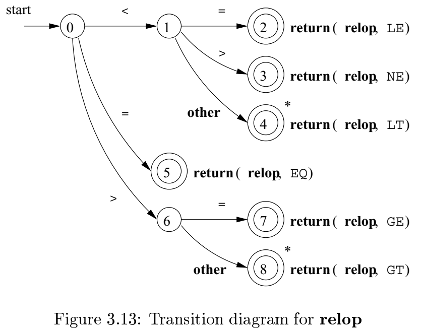
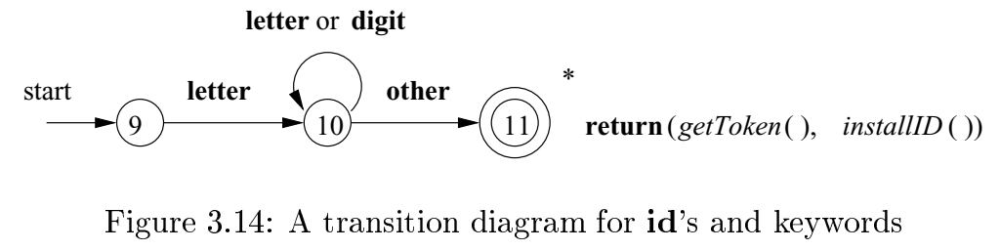
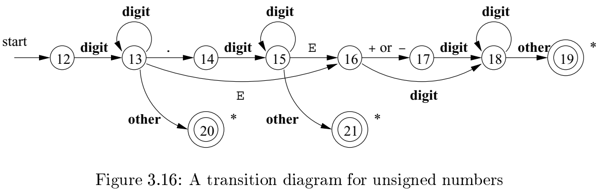

# 《编译原理》 day 15

今天是读《编译原理》的逻辑第 15 天，昨天强攻练习不利，果断改变策略，放弃进攻后续，迂回包抄它们。

所以我看了下一节的内容，识别 Token，用到的 Token 模式

```text
 digit -> [0-9]
digits -> digit+
munber -> digits(.digits)?(E[+-]?digits)?
          // 这个 . 就是单纯的 . 不是通配符
letter -> [A-Za-z]
    id -> letter(letter | digit)*
    if -> if
  then -> then
  else -> else
 relop -> < | > | <= | >= | <>
    ws -> (blank | tab | newline)+
          // 空格啥的，直接忽略
```

正则表达式能用状态转换图表示，和业务中画的状态图很像，以 relop 为例，它的状态转换图是这样的



有两个圈圈的状态是最终状态，意味着已经识别完成，返回 Token。需要注意的是这时候需要回退一个字符，然后进行下一个 Token 识别。

这个图有自动机那味了，带输出的确定性有限状态自动机，没记错的话应该叫这名。

它伪代码，挺简洁优雅的，这种顺着文档写代码的感觉，安逸。

```
TOKEN getRelop() {
    TOKEN retToken = new TOKEN(RELOP);
    while(1) {
        switch(state) {
            case 0:
                char c = nextChar();
                if (c == '<') state = 1;
                else if (c == '=') state = 5;
                else if (c == '>') state = 6;
                else fail();
                break;
            case 1:
            ...
            case 8:
                retract(); // 回退一个字符
                retToken.attribute = GT;
                return retToken;
        }
    }
}
```

我好像知道正则表达式怎么实现了，也能理解为啥恐慌模式选择直接删字符。

同理标识符 id 可以表示为



关键字和标识符模式一样，识别它们有两种策略，第一种是之前学的把关键字预先保留在符号表中，第二种可以分别设计关键字和标识符的转换图，以长的那个为准。

数字这个最复杂，它这个还支持科学计数法




最后需要集成，把多张状态图合成一张状态图，比如 0 9 12 合成一个状态。这里刚好每个字符都唯一确定下一个状态，实际中有可能一个字符确定多个状态，变成非确定性自动机。

其他还有两种方案，一种是 fail() 方法重置指针，启动下一个转换图，另一种是并行执行所有状态图，选最长的那个。

这个转换图真的妙，业务中画了那么多咋就没想到还能这么玩，还是要多读书。

封面图：Twiter 心臓弱眞君 @xinzoruo