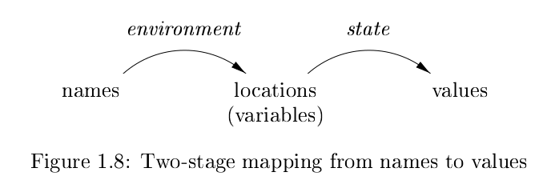

# 读《编译原理》day2

我工作使用的 Java 语言属于第三代语言，第一代是机器语言，只用 `xxd -b` 看过，天书一样，哪怕最简单的 hello world 编译出来的文件内容也多的一匹，gcc 悄咪咪的加了一堆代码。

第二代是汇编语言，这个上学的时候听过，这门考试最后老师说只要你们填了内容全部算对，以至于没有挂科 :joy: 。用 `objdump -d` 能看，也是天书，唯一能认出 mov、add 等有限的几个指令。

第三代就熟悉多了，除了 Java 还有 C、C++、Lisp，都能看懂个大概。据说 Lisp 语言很强大，但不要过分沉迷，容易找不到工作。

第四代是为特定应用设计的语言，比如 SQL。以前很长时间以为 SQL 就是数据库的附属，真的太小看它了。

第五代是基于逻辑和约束的语言，没用过，甚至都不知道语言已经有第五代了。

编译器对编程语言非常重要，要降低高级语言执行开销提高性能，支持语言新特性，利用新硬件能力，一个人扛起了整个家。编译器越强大，编程人员就可以越放飞自我。

高性能系统主要利用两个技术：parallelism & memory hierarchies。

编译器重排序指令，让指令并行更有效。有些处理器还会进行预测以提高性能。内存这边调整数据布局或者访问顺序，访问相同的内存或者相邻的内存，叫做时间局部性和空间局部性。

编译系统的出现对新计算机架构设计产生影响，一般来说编译器听计算机架构的，它说啥是啥，但现在编译系统也很庞大，有些设计也要听一下编译系统的意见，不然有可能设计出来新特性，程序用不起来。

RISC 就是受编译器影响的例子，在编译器之前倾向于设计 CISC 方便汇编开发，这么来看可能是先有的 CISC 我一直以为顺序是反的。我记得 ARM 是 RISC，x86 是 CISC。还有一个豆知识，32 位的标准是 Intel 定的，但是 64 位的标准是 AMD 定的，叫 amd64，所以有些安装包的命名有 `_x86` 但是没有 `_x86_64` 取而代之的是 `_amd64` 其实是一回事。

日常工作中编译器做大的作用就是提示编译错误，这是真好用，但凡尝试过用 vi 写代码就能感受到实时的语法检测是多么美妙的一件事，感恩大佬们。

一些有意思的概念，虽然工作上没什么卵用，但有利于理解书上的内容。

+ Identifier: 通常是一段字符串，指向一个实体
+ Name: 包含 identifier 还可以是表达式，比如 x.y
+ Variable: 指存储中的某个位置

+ Procedure: 翻译是过程，一个可以被调用的子程序，没有返回值
+ Function: 翻译是函数，通常返回某个类型
+ Method: 面向对象语言中使用，通常关联到特定的类

多数情况下混着用也没事，差不多是一回事。

静态和动态，编译时决定的是静态，运行时决定的是动态。

动态作用域像时间，静态作用域像空间，静态作用域让我们找空间上最靠近使用位置的声明，动态作用域让我们找时间上最靠近使用位置的声明。

Java 的重载和重写也是作用域的一种，重载用的是静态策略，重写用的是动态策略。

最有意思的是关于作用域的描述，发现很多语言特性最终都能用作用域来解释。

参数传递机制

1. call-by-value: 传递过去的是一个拷贝，Java 只有值传递，干净
2. call-by-reference: 传递过去的是地址，C 语言有这种机制，老复杂了
3. call-by-name: 已经不用了，有点像代码注入，用传入的参数替换掉程序代码

当年背诵的八股文之一，关于参数传递还有个有意思的例子，比如方法 `foo(Object x, Object y)`，正常这么定义方法 x y 肯定是两个不同的对象，但如果 x y 传同一个对象进去，可能就会产生 bug，这时候 y 就是 x 的别名，这俩其实是一个东西。

到这里第一章的内容就结束了，对编译器整体做了初步解释，稍微打开了一点这个黑盒子。

我看的几本书大体上都是这个模式，第一章都是对整体做个预览，然后接下来开始细节，晕针的那种细。

封面图：Twiter 心臓弱眞君 @xinzoruo