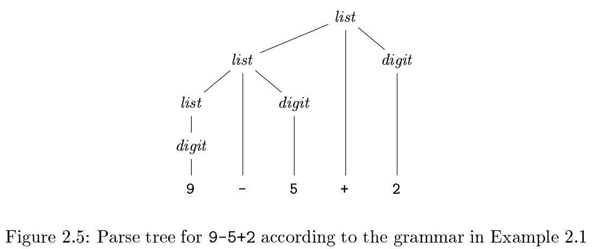
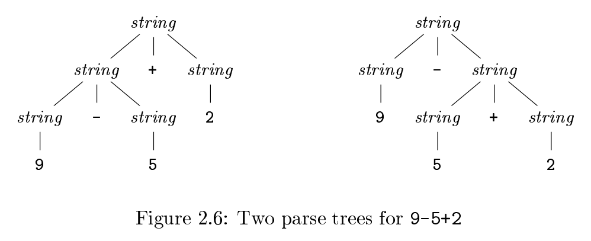

# 《编译原理》 day 3

今天是读《编译原理》的逻辑第 3 天，看到一个叫 production（产生式）的东西，很有意思，以 Java 的 if 语句为例，大概长这个样子

```
stmt -> if ( expr ) stmt else stmt
```

意思是左边的 stmt 可以用右边的形式表示。

这里面的三个 stmt 虽然拼写一样，但表达的内容不同，可以类比成 Java 类的 3 个对象，有时用下标区别。

在这个式子里，stmt, expr 叫做非终结符号，if, (, ), else 叫做终结符号，在左边出现的都是非终结符。

具体看个书里的例子

```
list -> list + digit | list - digit | digit
digit -> 0 | 1 | 2 | 3 | 4 | 5 | 6 | 7 | 8 | 9 |
```

竖线表示「或」的关系，这里有 12 个终结符：0~9 + -，两个非终结符。

产生式集合 + 终结符集合 + 非终结符集合 + 开始符号 = grammer（文法）

从开始符号不断代入产生式，所能产生的所有终结符号串的集合叫做这个文法的语言，因吹斯听。

上面的文法能够表示 10 以内所有的加减表达式，比如表达式：9 - 5 + 2



这种树状结构叫 parse tree（分析树）。

产生式的定义需要小心二义性，比如上面的文法，如果图方便这么定义。

```
string -> string + string | string - string | digit
digit -> 0 | 1 | 2 | 3 | 4 | 5 | 6 | 7 | 8 | 9 |
```

就会有二义性，还是这个表达式：9 - 5 + 2，有两棵分析树



这样的文法需要避免。

运算符的结合性和优先级，当一个操作数左右两边都有操作符，比如（+ 5 +）操作数属于左边的叫左结合，属于右边的叫右结合，+=*/ 都是左结合。

乘除的优先级高于加减，文法的产生式是这么设计的

```
expr -> expr + term | expr - term | term
term -> term * factor | term / factor | factor
factor -> digit | (expr)
```

其实我也不知道它是怎么设计出来的，但这三个产生式确实能正常工作，越往下优先级越高。

到这里已经有疑问了，分析树是怎么产生的？像 9 - 2 + 5 这种简单可以用肉眼看出来，复杂的要怎么搞，期待后面的答案。

封面图：Twiter 心臓弱眞君 @xinzoruo