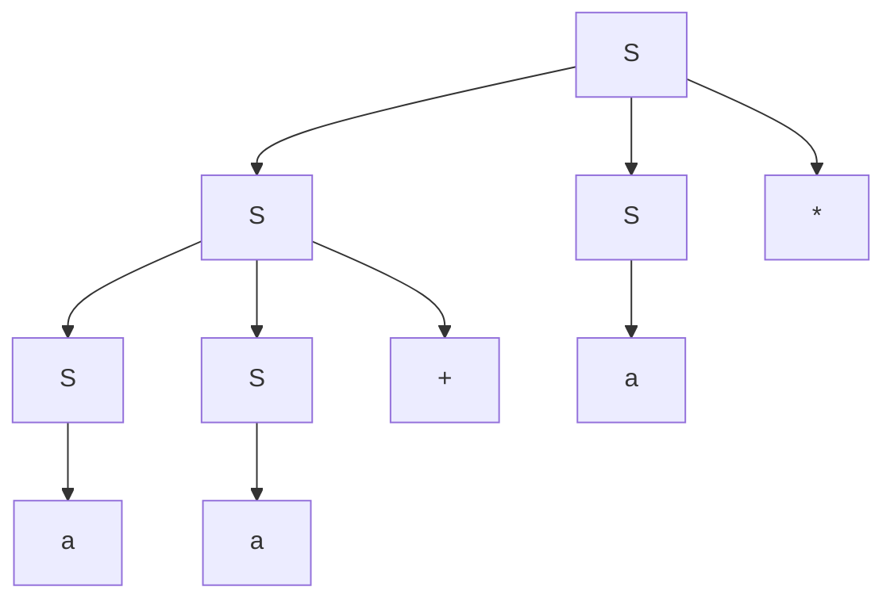

# 《编译原理》 day 4

今天是读《编译原理》的逻辑第 4 天，练习时间。

每次看到练习题都发怵，因为它每次都击碎我的幻觉。


每当我觉得我已经完全了解了的时候，练习题总能给我沉重一击。就是那种感觉：你刚过了新手引导，然后突然要去挑战雷神周本，那种绝望。

练习 2.2.1：考虑这个文法 

```
S -> SS+ | SS* | a

a) 如何生成字符串 aa+a*
b) 为字符串构建一件分析树
c) 这个文法生成的语言是什么，试证明
```

前两小题很简单，



最后一小题不会做，然后我去看答案了，一种豁然开朗的感觉，这些大佬怎么能这么机智。

