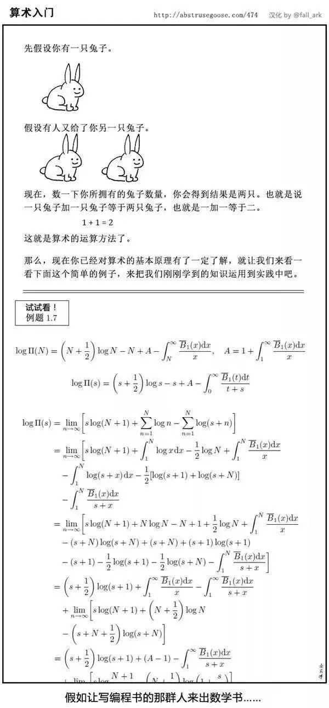

# 《编译原理》 day 4

今天是读《编译原理》的逻辑第 4 天，练习时间。

每次看到练习题都发怵，它总是能恰到好处的击碎我的幻觉。

大概是这样的感觉



很是纠结，感性上太费时间，做一小节练习的时间三小结内容都能看完了，理性上练习能够加深巩固对内容理解。这时候又要感叹一句：“早干嘛去了！

练习：有文法 `S -> S S + | S S * | a` 求解

```
a) 如何生成字符串 aa+a*
b) 为字符串构建一棵分析树
c) 这个文法生成的语言是什么，试证明
```

a，b 很简单，一棵树搞定


c 不会，看了答案，豁然开朗，居然是后缀表达式的文法。


练习：下面这些文法分别生成什么语言，有没有二义性，ε 表示空串

```
a) S -> 0 S 1 | 0 1
b) S -> + S S | - S S | a
c) S -> S ( S ) S | ε
d) S -> a S b S | b S a S | ε
e) S -> a | S + S | S S | S * | (S)
```

解：

```
a) 表示字符串以 n 个 0 开头，n 个 1 结尾，像这样 00..011..1
b) 表示由 + - a 构成的前缀表达式
c) 表示无数个配对的括号对，可嵌套，字符串 ( ) ( ) 有两棵分析树
d) 表示 相同数量的 a 和 b 构成的字符串，字符串 a b a b 有两棵分析树
e) 答案虽然看不懂，但有二义性，字符串 a a * 有两棵分析树
```

练习：构造文法

```
a) 后缀方式的算术表达式
b) 用逗号隔开的左结合的标识符列表
c) 用逗号隔开的右结合的标识符列表
d) 由整数、标识符、运算符 +-*/ 构成的算术表达式
```

解

```
S -> S S + | S S - | digit
digit -> 0 | 1 | 2 | 3 | 4 | 5 | 6 | 7 | 8 | 9

list -> list , id | id

list -> id , list | id

expr -> expr + term | expr - term | term
term -> term * factor | term / factor | factor
factor -> id | num
```

练习：

```
a) 证明下面文法生成被 3 整除的二进制串。

    num -> 11 | 1001 | num 0 | num num  

b) 上面的文法是否生成所有被 3 整除的二进制串
```

a) 初始条件 num = 3 (11) 或者 9 (1001) 可以被 3 整除

假设 num 可以被 3 整除

二进制串 `num 0` 是 `num` 左移一位，能被 3 整除。

二进制串 `num num` 是 `num` 左移 n 位，能被 3 整除

b) 数字 21 的二进制串 10101 不能用文法生成

解这些题感觉就是在硬解硬凑，这感觉不太对，都没点套路啥的么。

封面图：Twiter 心臓弱眞君 @xinzoruo