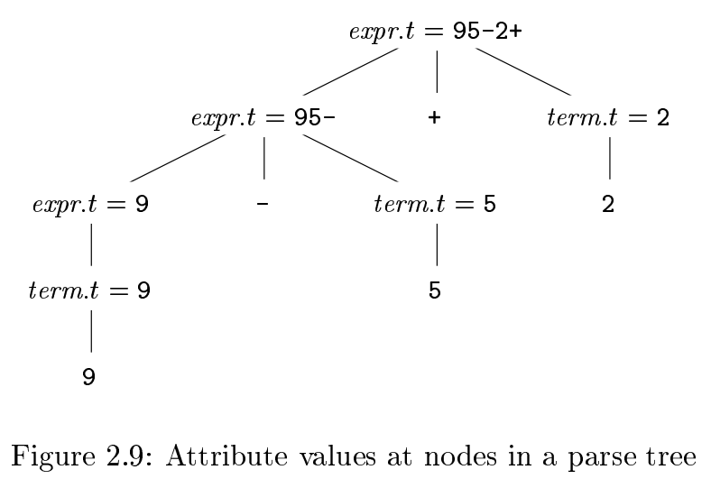
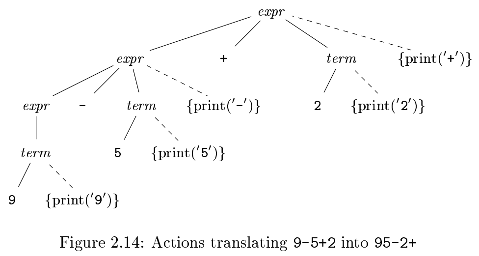

# 《编译原理》 day 5

今天是读《编译原理》的逻辑第 5 天，看的是 syntax-directed translation，翻译过来叫语法制导翻译，好诡异的叫法。

章节内容讲述把中缀表达式转化为后缀表达式，中缀表达式就是常见的操作符在两个数字中间的表达式，后缀表达式类似，只是操作符在两个数字后面，举个例子 9 + 5 是中缀表达式，9 5 + 是后缀表达式，意思一样都是把 9 和 5 加起来。

书里介绍了两种翻译方案，这两种方案顺便解答了一个困扰我多年的问题，果然还是要多读书。

第一种，给终结符和非终结符关联一组属性，这组属性有个专门的称呼，叫 synthesized attributes，接着对每一个产生式关联一组 semantic rules（语义规则）。再然后根据递归依次计算每一个符号的属性，根节点的属性就是需要的结果，口说无凭，一图胜千言。

表达式 9 - 5 + 2 的转换过程

每个符号关联属性 t，父节点的属性 t 根据子节点的属性计算获得，递归计算得到根节点的属性。

产生式 expr -> expr + term 对应的语义规则是 expr.t = expr.t || term.t || +，语义规则可以理解为计算方式。

第二种，在产生式中嵌入代码片段，叫做 semantic actions（语义动作）。

虚线部分就是语义动作，每个节点打印一部分，执行完成后，打印完整的表达式。

产生式 expr -> expr + term 对应的语义动作是 expr -> expr + term {print('+')}

这两种方式都能把中缀表达式翻译成后缀表达式，往大了说就是从一种语言翻译成另一种语言。

这两种方法对递归如何返回/保存数据提供了很好的思路，解决了困扰我好久的问题。

