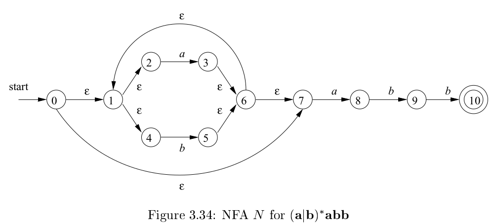
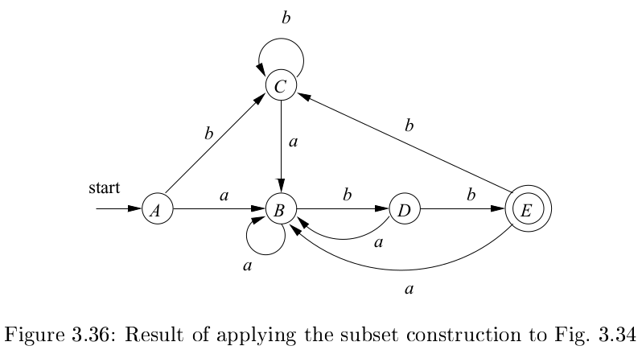

# 《编译原理》 day 17

今天是读《编译原理》的逻辑第 17 天，有穷自动机，听到这名字，我感觉悬了，上一次见到这个词还是在《离散数学》它所在的 13 章整章内容都很魔幻。

所谓有穷指的是状态的个数有穷，它这么说估计还有叫无穷的。

有穷自动机分 Nondeterministic finite automata 和 Deterministic finite automata，简称 NFA 和 DFA。

NFA 包括五个部件

1. 一个有穷的状态集合 S
2. 一个输入符号集合 Σ，不含 ε，多这么一句估计为了 DFA
3. 一个转换函数，入参是状态和符号（含 ε），出参还是状态
4. 一个开始符号，S 的元素
5. 一个结束符号集合，S 的子集

DFA 是特殊的 NFA，输入符号不能为 ε，状态 s 和输入符号 a 能够唯一确定下一个状态。

用文字描述 FA 不是计算机科学的风格，于是有了 Transition Tables（转换表），这玩意儿和邻接矩阵有点像，举个例子



|状态|a     |b    |ε  |
|-- |--    |--   |-- |
|0  |Φ     | Φ | {1，7} |
|1  |  Φ   | Φ | {2，4} |
|2  |  {3}   | Φ | Φ |
|3  |  Φ   |  Φ  | {6} |
|4  | Φ| {5} | Φ|
|5  | Φ|Φ|{6}|
|6  | Φ|Φ|{1，7}|
|7  |{8}|Φ|Φ|
|8  |Φ|{9}|Φ|
|9  |Φ|{10}|Φ|
|10 |Φ|Φ|Φ|

DFA 的转换表少一列 ε，另外不需要用集合表示，它只存在一个状态。

实现 DFA 的伪代码

```
s = s0;
c = nextChar();
while (c != EOF) {
    s = move(s, c);
    c = nextChar();
}
if (c is in F) {
    return "yes";
} else {
    return "no";
}
```

返回 yes 表示匹配字符串，否则不匹配。

到这里都还好理解，然后有意思的东西来了 NFA 转 DFA。

主要通过两个函数实现，T 是 NFA 的状态子集。

1. `ε-closure(T)`: 通过 n 次 ε-产生式能够到达的状态集合 U，n 可以为零。
2. `move(T, a)`: 通过输入 a 能够到达的状态集合。

然后从 T = {s0} 开始，重复计算，直到没有新的 U 产生，口说无凭，以上图为例。

```
ε-closure({0}) = {0,1,2,4,7} = A
// 通过 0 次 ε-产生式到达状态 0
// 通过 1 次 ε-产生式到达状态 1, 7
// 通过 2 次 ε-产生式到达状态 2, 4

ε-closure(move(A, a)) = ε-closure({3,8}) = {1,2,3,4,6,7,8} = B
ε-closure(move(A, b)) = ε-closure({5}) = {1,2,4,5,6,7} = C
// move(A, a) 表示输入 a 能到达的状态
// 再加上使用 ε-产生式能到的状态，才是完全体

ε-closure(move(B, a)) = ε-closure({3,8}) = B
ε-closure(move(B, b)) = ε-closure({5,9}) = {1,2,4,5,6,7,9} = D
// (B, a) 的运算结果没出新子集，还是 B

ε-closure(move(C, a)) = ε-closure({3,8}) = B
ε-closure(move(C, b)) = ε-closure({5}) = C

ε-closure(move(D, a)) = ε-closure({3,8}) = B
ε-closure(move(D, b)) = ε-closure({5,10}) = {1,2,4,5,6,7,10} = E

ε-closure(move(E, a)) = ε-closure({3,8}) = B
ε-closure(move(E, b)) = ε-closure({5}) = C
```

这个计算过程一定可以结束，因为 n 个元素的集合最多只有 2^n 个子集。

得到转换表

|NFA 状态子集|状态|a|b|
|--|:--:|:--:|:--:|
|{0,1,2,4,7}|A | B | C |
|{1,2,3,4,6,7,8}|B | B | D |
|{1,2,4,5,6,7}|C | B | C |
|{1,2,4,5,6,7,9}|D | B | E |
|{1,2,4,5,6,7,10}|E | B | C |

对应的 DFA 转换图



它这个把 NFA 状态子集看成一个整体的思路有点牛逼，这样 DFA 走一步看起来就像 NFA 所有可能的状态并行走了一步。

真不知道这些人是怎么想出这种办法的，恐怖如斯恐怖如斯。

封面图：Twiter 心臓弱眞君 @xinzoruo