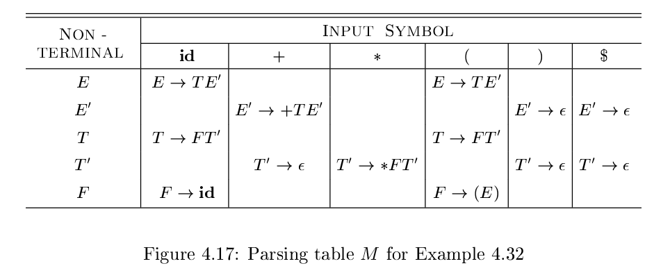

# 《编译原理》 day 26

今天是读《编译原理》的逻辑第 26 天，学习用迭代的方式实现预测分析法。

之前学过一个递归版本，非终结符对应一个函数，终结符调用 match 函数，并且 lookahead 向后移动一格。

当时还有个尾递归转迭代来着，原以为这事就这么结了，没想到这次要把整个方法都改成迭代形式。

实现这个版本需要两个辅助数据结构，一个栈和一个 Parsing Table（预测分析表），栈比较简单，这个预测分析表略复杂。

构造这个表需要两个辅助函数 FIRST(α) 和 FOLLOW(A) 。怎么又是你，这俩在正则那就见过一次，被它按在地上摩擦，冤家路窄，这里又遇上了。

+ FIRST(α): 从 α 推导的符号串的首个终结符集合。如果可以推导出空串，那么 ε 也在这个集合里
+ FOLLOW(A): 紧跟在 A 后面的终结符集合，比如 S => αAaβ 那么 a 在 FOLLOW(A)，如果 A 在最后，结束标记 $ 在 FOLLOW(A)

好家伙，套路都是一样的。

产生式 A -> α \| β，如果要能使用预测分析法，那么 FIRST(α) 和 FIRST(β) 不相交。

FIRST(X) 计算方式分三种情况

1. 如果 X 是终结符，FIRST(X) = {X}
2. 如果 X 是非终结符，有产生式 X -> Y1Y2...Yk，先把 FIRST(Y1) 加入集合，如果 Y1 能推导出空串，再把 FIRST(Y2) 加入集合，依次类推，直到结束（把 ε 加入集合）或者 Yi 不能推导出空串
3. X -> ε，添加 ε 到 FIRST(X)

FOLLOW(X) 计算方式

1. 如果 X 是开始符号，把结束标记 $ 加入 FOLLOW(X)
2. 如果存在产生式 A -> αXβ，把 FIRST(β) - {ε} 加入 FOLLOW(X)
3. 如果存在产生式 A -> αX，把 FOLLOW(A) 加入 FOLLOW(X)

举个例子，下面是消除左递归的中缀表达式文法，长得有点奇怪，计算 E，E'，T，T'，F

+ E  -> T E'
+ E' -> + T E' \| ε
+ T  -> F T'
+ T' -> * F T' \| ε
+ F  -> ( E ) \| **id**

E 的产生式怎么推导 T 都在首位，T 同理，所以他们仨 FIRST 相同。

+ FIRST(E) = FIRST(T) = FIRST(F) = {(, **id**}
+ FIRST(E') = {+, ε}
+ FIRST(T') = {*, ε}

FIRST 还是蛮容易的，肉眼就能看出来。

接着计算 FOLLOW

+ E 是开始符号，FOLLOW(E) 包含 `$`
+ 根据 F -> ( E ) 得到 FOLLOW(E) 包含 `)`
+ 根据 E -> T E' 得到 FOLLOW(E') 包含 FOLLOW(E)
+ 根据 E -> T E' 得到 FOLLOW(T) 包含 FIRST(E') - {ε}
+ 根据 E' -> + T E' && ε 在 FIRST(E') 得到 FOLLOW(T) 包含 FOLLOW(E')
+ 根据 T -> F T' 得到FOLLOW(T') 包含 FOLLOW(T)
+ 根据 T -> F T' && ε 在 FIRST(T') 得到 FOLLOW(F) 包含 FOLLOW(T) 
+ 根据 T' -> * F T' 得到 FOLLOW(F) 包含 FIRST(T') - {ε}

满眼都是 ET，整理一下，得到

+ FOLLOW(E) = {$, )}
+ FOLLOW(E') = {$, )}
+ FOLLOW(T) = {$, ), +}
+ FOLLOW(T') = {$, ), +}
+ FOLLOW(F) = {$, ), +, *}

最后根据 FIRST 和 FOLLOW 构建预测分析表 M，对于每个产生式 A -> α

1. 如果 a 在 FIRST(α)，添加 A -> α 到 M[A, a]
2. 如果 ε 在 FIRST(α)，对于每个在 FOLLOW(A) 的元素 b，添加 A -> α 到 M[A, b]

对于 E -> T E' 根据上面规则 A = E, α = T E'，T 不能推导出空串。

FIRST(T E') = FIRST(T) = {(, **id**}，那么应该出现在 M[T, (] 和 M[T, **id**] 上，其他同理。

有了预测分析表，算法基本就完成了

它用一个栈存放符号，栈底是 $ 元素，充当哨兵。每次应用产生式，就把元素从右往左依次压入栈中，这样弹出的元素是最左边的符号。

这个算法一定有它的深意吧，花了大力气实现一个等价版本，总不能是写着玩的吧。

封面图：Twitter 心臓弱眞君 @xinzoruo