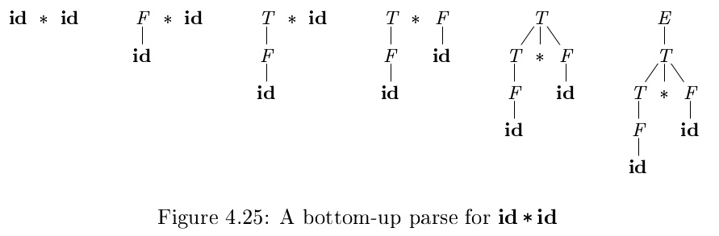
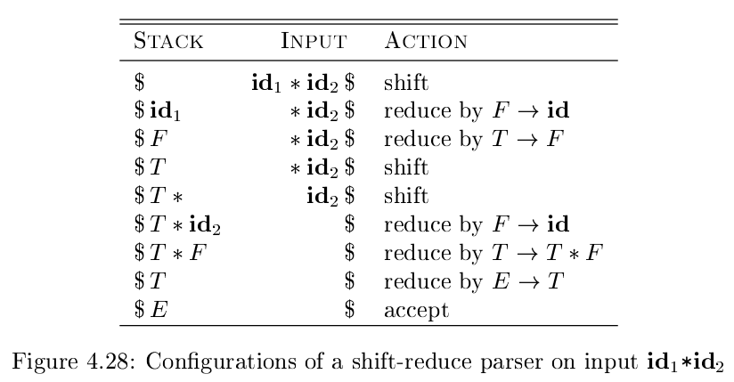

# 《编译原理》 day 27

今天是读《编译原理》的逻辑第 27 天，学习自底向上的语法分析。

这章看完印象最深的是自底向上算法是最右推导的逆过程，其他都没啥印象了。

术语 Reduction 中文版归约，推导的逆过程。术语 Handle Pruning 中文版句柄剪枝。

句柄是真没法理解，上一个类似的词是套接字，不过套接字至少知道是啥，句柄似乎会随着语境的不同而不同。

这里的句柄指的是和某个产生式匹配的子串，句柄剪枝就是对匹配的子串归约。

自底向上构造分析树从叶子结点开始，逐渐减少结点，直至根节点，举个例子

上图是 **id** * **id** 的自底向上构造过程。

+ E -> E + T \| T
+ T -> T * F \| F
+ F -> ( E ) \| **id**

单纯用字符串表示

**id** * **id**, F * **id**, T * **id**, T * F, T, E

这个过程就是归约过程。

这个字符串刚好是最右推导反过来

E => T => T * F => T * **id** => F * **id** => **id** * **id**

这里有个疑问，既然是最右推导反过来，那为啥不直接用最右推导实现算了。

Shift-Reduce Parsing（移入-归约语法分析）

用栈保存符号，当发现句柄时进行归约。

这个算法在这里简单例子上是能理解，但还是有很多疑问，如果是复杂文法，什么条件下移入，什么条件下归约，用那个产生式归约似乎都没什么定论。

看来要期待后续章节给答案了。

另外图里的 Configurations 中文版是格局，当时看到差点笑出声，可能鸡汤喝多了，看某些词都变味了。

封面图：Twitter 心臓弱眞君 @xinzoruo