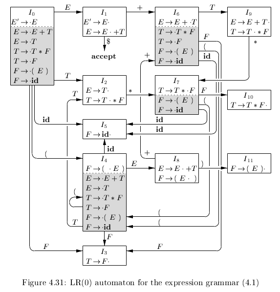
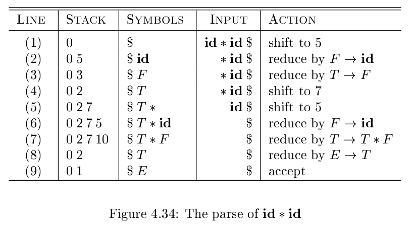

# 《编译原理》 day 28

今天是读《编译原理》的逻辑第 28 天，学习 LR 分析技术。

LR(k) 的 L 指的是输入从左往右扫描，R 指的是最右推导，k 指的是预读 k 个符号，LR 的 k 可以是 0 和 LL(k) 必须大于 1 不同。

看到这里好像可以理解之前的那个为啥叫预测分析法了，之前觉得是预测产生式，但如果理解成预测接下来的符号串就通顺了。

预读 k 个符号确定产生式，预测接下来的符号串匹配产生式 body。LR 则不同，它归约时整个产生式 body 都已经被读到，就不存在什么预测了。

LR 分析技术的优势

1. LR 分析适用范围更广，几乎涵盖所有的编程语言
2. LR 分析方法是已知的最通用的无回溯方法，效率高
3. LR 分析能尽早的发现问题
4. LR 分析是 LL 分析的超集

使用 LR 之前先修改文法，新增符号 S' 和 S' -> S 修改后的文法叫 augmented grammar，这次翻译成增广了。

不过增广通常追加在尾部，这个却是追加在头部。但转念一想 LR 是一个反过来的过程，这样来看，似乎又确实添加在尾巴上，当应用 S' -> S 时意味着分析结束。

LR 分析技术依赖 LR(0) 自动机，既然是自动机就需要状态和转换表。

术语 item: 它是产生式加上一个点。举个例子产生式 A -> XYZ 有四个 item

+ A -> .XYZ
+ A -> X.YZ
+ A -> XY.Z
+ A -> XYZ.

自动机的状态就是 item 集合，通过 CLOSURE 计算，
假设 I 是 item 集合，CLOSURE(I) 等于

1. 把 I 添加到 CLOSURE(I)
2. 如果产生式 A -> α.Bβ 在 CLOSURE(I)，把 B -> γ 添加到 CLOSURE(I)的计算规则

初始状态是 CLOSURE({[E' -> .E]})。

GOTO(I, X) 表示状态的转换，I 是原状态，X 是文法符号，它把 I 的产生式 A -> α.Xβ 转化成 A -> αX.β。约等于把 I 的所有产生式并行的往后移动一格，和 NFA 转 DFA 的逻辑好像。

要素齐了，通过迭代计算可以得到转换图

秀还是它秀，兜兜转转又用上老知识。

有了转换图昨天的问题有解了，当 GOTO(I, X) ！= Φ 时使用移入，否则使用归约，产生式就保存在当前状态里。

上图是根据自动机解析 **id** * **id** 的过程。

最初系统处于状态 0，GOTO(0, **id**) = 5，压入 5，移入 **id**。

GOTO(5, *) = Φ，执行归约 F -> **id**，弹出 5 回到状态 0，输入符号变为 F，GOTO(0, F) = 3，压入 3，依次类推。

不好，我感觉被 LR 圈粉了，突然之间更加喜欢自底向上了。

封面图：Twitter 心臓弱眞君 @xinzoruo