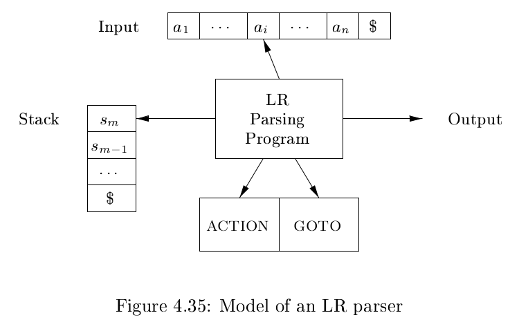

# 《编译原理》 day 29

今天是读《编译原理》的逻辑第 29 天，接昨天，继续学习 LR 分析技术。

LR 分析器的模型和 LL 很像，区别是栈用来保存状态，分析表分成 ACTION 和 GOTO 两部分，ACTION 其实也暗含 GOTO。

通过算法构造分析表

1. 构造 item 集合 {I0, I1, ..., In}
2. 集合 Ii 的状态是 i，构造 ACTION
   1. 如果 A -> α.aβ 在 Ii 且 GOTO(Ii, a) = Ij，设置 ACTION[i, a] = 移入 j
   2. 如果 A -> α. 在 Ii，所有在 FOLLOW(A) 的元素 a，设置 ACTION[Ii, a] = 归约 A -> α
   3. 如果 S' -> S 在 Ii，设置 ACTION[i, $] = 接受，也就是分析完成
3. 对于非终结符 A，如果 GOTO(Ii, A) = Ij，设置 GOTO[i, A] = j
4. 没有设置的条目关联 error
5. 初始状态为 S' -> S 所在的 item 集合，一般是 I0

昨天的文法

+ E -> E + T \| T
+ T -> T * F \| F
+ F -> ( E ) \| **id**

对应下图这个分析表，s5 指的是移入状态 5，r2 表示使用 2 号产生式归约。

LR 伪代码，和 LL 也有点像

剩下的内容全是看不懂的，不仅不懂还不知道哪里不懂。

它似乎很努力的想解释为什么这个算法是正确的，以及在某些情况下会发生冲突，冲突时不能用这个算法解，但不知道从哪里开始电波已经对不上了。

封面图：Twitter 心臓弱眞君 @xinzoruo