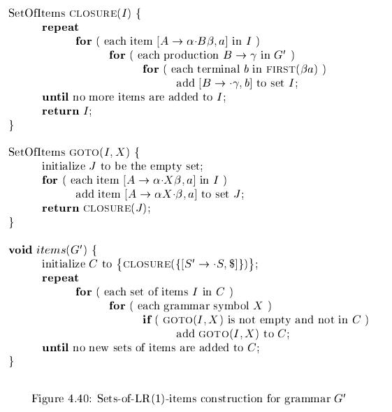
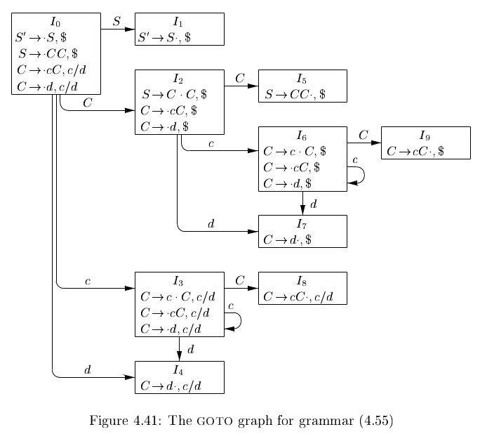
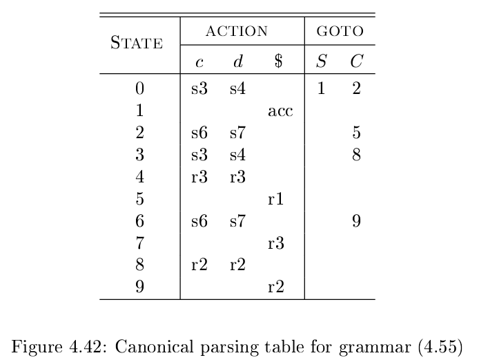
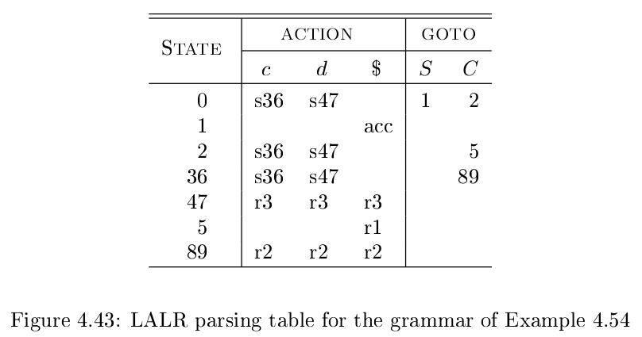

# 《编译原理》 day 30

今天是读《编译原理》的逻辑第 30 天，学习两个更强大的 LR 算法，电波依然没对上，不仅没对上还渐行渐远。

前几天学习的叫 SLR，全称 Simple LR，今天学的这两个，一个叫 canonical-LR(LR)，另一个叫 lookahead-LR(LALR)，主要区别是用的分析表不一样。

话说为啥 canonical-LR 不简称 CLR，而是直接简称 LR，多容易混淆。

SLR 用的是 LR(0) 分析表，item 格式是 [S' -> .S]，LR 用的是 LR(1) 分析表，格式为 [S' -> .S, $]，比 LR(0) 多一部分。

LALR 用的也是 LR(1) 分析表，不过它做了优化，减少状态数量，看这个算法的时候已经不是电波对不上的问题，而是直接失联了。

构建 canonical LR(1) 分析表和构建 LR(0) 差不多，都是分两步，先构建 item 集合，再构建分析表。

构建 item 集合也类似，依赖 CLOSURE 和 GOTO 函数，做了少量调整。

举个例子，增广文法

+ S'-> S
+ S -> C C
+ C -> cC \| d

计算得到的结果是

看着很简单，自己按照步骤演算的时候错的稀里哗啦的，不是这里缺了，就是那里少了，有计算机真的太幸福了。

LR(1) 计算得到 item 集合比 LR(0) 要多，而且会有一些类似状态，比如 I3 和 I6，进入这俩状态的符号都是 c，出去的符号都是 C，c，d。

不仅如此这俩状态的 item 项前半部分都一样，只有后半截不一样，据说这不是偶然而是特性。

接着第二步构建 LR(1) 分析表，步骤依然类似

1. 构造 item 集合 {I0, I1, ..., In}
2. 集合 Ii 的状态是 i，构造 ACTION
   1. 如果 [A -> α.aβ, b] 在 Ii 且 GOTO(Ii, a) = Ij，设置 ACTION[i, a] = 移入 j
   2. 如果 [A -> α., a] 在 Ii，设置 ACTION[Ii, a] = 归约 A -> α
   3. 如果 [S' -> S., $] 在 Ii，设置 ACTION[i, $] = 接受
3. 对于非终结符 A，如果 GOTO(Ii, A) = Ij，设置 GOTO[i, A] = j
4. 没有设置的条目关联 error
5. 初始状态为 [S' -> .S, $] 所在的 item 集合

昨天的文章第 2.3 和 5 条有错误，漏了 `.` 号。

最后构造出来的分析表长这样

看到这里其实自信有点回来的，虽然对细节的理解还很模糊，但大体思路基本有了，而且想着 LALR 估计也是类似的套路，但…… LALR 完全不一样，好不容易燃起的自信又被吹灭了。

LALR 的分析表在 LR(1) 的基础上进行优化，主要把类似的状态进行合并，然后生成状态更少的分析表。那我在想不就和 SLR 差不多了嘛，那 SLR 不能支持的，为啥 LALR 能支持。

经过它一操子牛逼操作，新的分析表长这样，状态 36 指的是合并状态 3 和 6 得到的新状态，其他同理

另外还介绍了高效生成 LALR 分析表的技术和压缩分析表的技术，这些已经无所谓了，有缘再看。

封面图：Twitter 心臓弱眞君 @xinzoruo