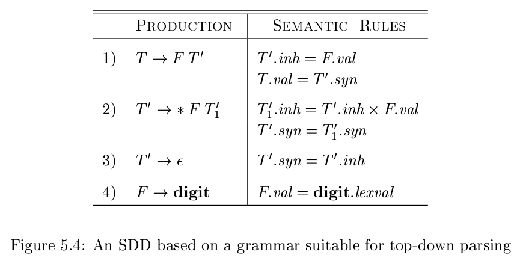
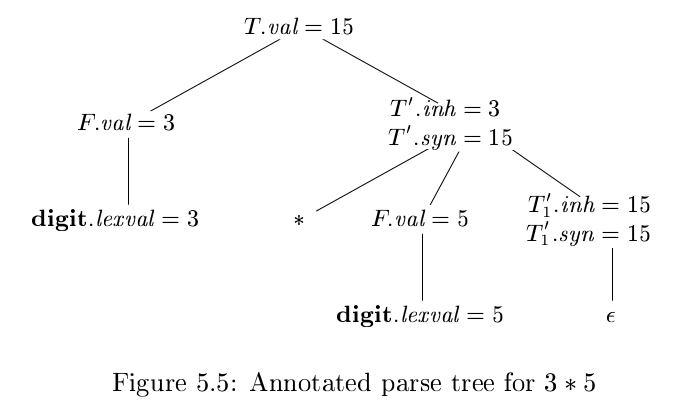

# 《编译原理》 day 33

今天是读《编译原理》的逻辑第 33 天，学习语法制导定义，继承属性，综合属性。

Syntax-directed definition（语法制导定义）简称 SDD，第一眼看到还以为是 SSD。它由文法、属性和语义规则组成，在文法的基础上增加属性和属性的计算方式。

属性分两种继承属性和综合属性，其中综合属性第 2 章见过

+ synthesized attribute: 综合属性通过子节点、本结点的属性计算获得
+ inherited attribute: 继承属性通过兄弟结点、本结点、父节点的属性计算获得

正当我觉得继承属性似乎没啥用的时候，它给我整了个例子。

这是消除左递归之后的文法和对应的语义规则

这是表达式 3 * 5 的分析树以及对应属性

没想到消除左递归后计算过程变得这么诡异，这时需要通过继承属性把左子树的属性 F.val 传递给右子树。

从这个例子看如果语义规则设置不合理，会导致死锁

以产生式 A -> B 为例，A.s 是综合属性，B.i 是继承属性，如果设置语义规则

+ A.s = B.i
+ B.i = A.s + 1

这时候就死锁了，感觉问题一下就复杂了很多。

封面图：Twitter 心臓弱眞君 @xinzoruo