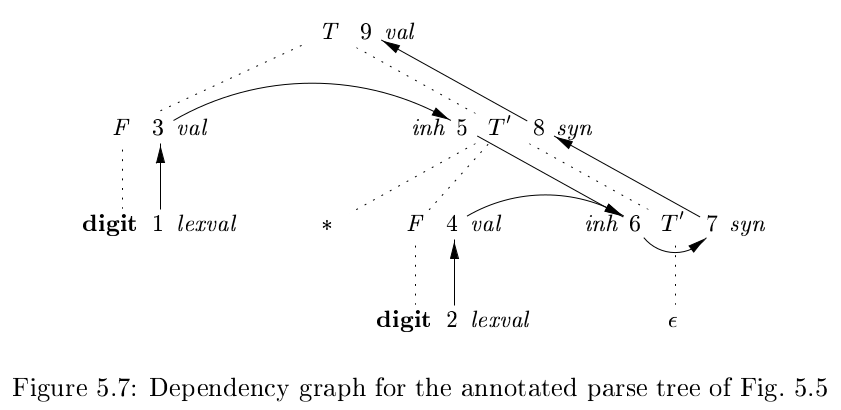

# 《编译原理》 day 34

今天是读《编译原理》的逻辑第 34 天，学习依赖图。

不当的语义规则可能导致属性无法计算，依赖图用来描述分析树属性的顺序。

依赖图的顶点是属性，有向边 (A.a, B.b) 表示属性 A.a 先于 B.b 计算，比如当语义规则设置为 B.b = A.a 时，就有这条边。

一个文法符号有多个属性算多个顶点，所以也会有这样的边 (A.a, A.b)。

结合昨天综合属性和继承属性的定义，综合属性的边应该只会指向父节点或者自己，继承属性就比较花了，除了不会指向父节点，其他方向应该都可以。

SDD 根据属性不同分两类

S-Attributed Definitions: 所有属性都是综合属性

L-Attributed Definitions: 这个比较复杂，简单理解依赖图的边总是从左到右，这里的 L 表示从左到右，属性可能是

+ 综合属性
+ 继承属性，对于产生式 A -> X1X2...Xn，继承属性 Xi.a 只能由下面这些属性定义
  + 产生式头 A 的继承属性
  + 文法符号 X1，X2，...Xi-1 的综合属性和继承属性
  + 文法符号 Xi 的综合属性和继承属性，但依赖图不能有环

大半的复杂性都在继承属性身上。

昨天那个消除左递归的分析树添加属性后是这个样子，1-9 是属性对应的顶点

这个 SDD 从定义上看是 L 属性定义，但分析树不是有两条向左指的边么 (7, 8) 和 (8, 9) 虽然是斜着的。

没有环的依赖图，可以按顺序排成一条直线，这个排序叫拓扑排序。

拓扑排序可以通过不断删除没有进入边的顶点得到。比如上图没有进入边的顶点是 {1, 2} 随便挑顶点 1 删掉（边也一起删了），此时没有进入边的顶点是 {2, 3} 依次类推，拓扑排序可以有多个。

它讲了这么多概念总有种风雨欲来的感觉。

封面图：Twitter 心臓弱眞君 @xinzoruo