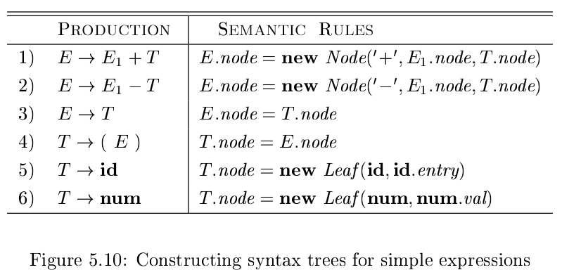
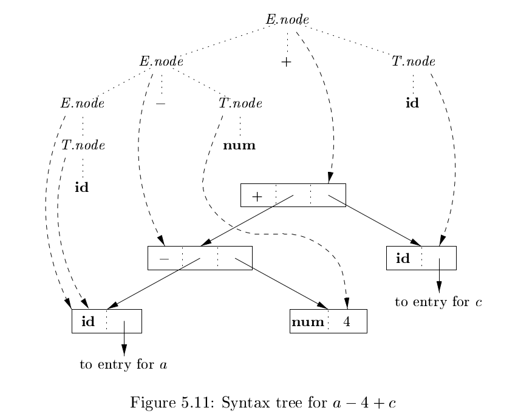
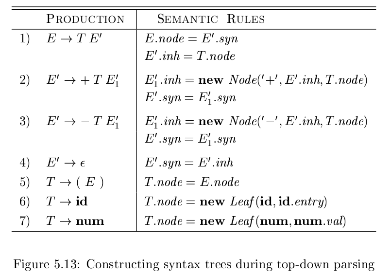
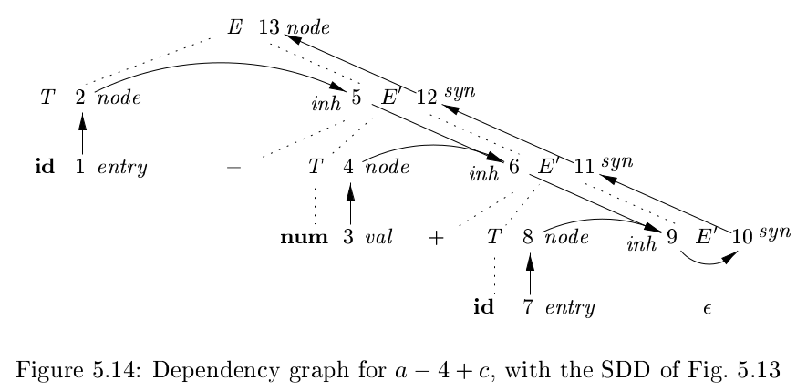

# 《编译原理》 day 35

今天是读《编译原理》的逻辑第 35 天，学习构建语法树。

语法树是一种结构，子节点代表操作数，本体代表操作符，从代码的角度就是一个对象关联一些字段

1. 如果是叶子结点，使用函数 Leaf(op, val) 创建对象，op 是操作符，val 是词法属性值
2. 如果是内部结点，使用函数 Node(op, c1, c2, ..., ck) 创建对象，ci 是子节点

S 属性定义很直观，改一改语义规则很容易生成语法树

表达式 a - 4 + c 语法树构建过程

自底向上构建分析树，归约时创建结点，分析树归约到开始符号，语法树正好创建根结点，完美。

相对的 L 属性定义要恶心不少，SDD 也复杂。

同样表达式 a - 4 + c语法树构建过程

语法树在应用产生式 E' -> ε 时构建完成，然后沿着分析树传回根节点，很难想象代码要怎么写。

这两种方式虽然分析树差的很远，但生成的语法树意外的很一致，到这里才明显的感觉到分析树和语法树确实是两种东西。

分析树受到文法影响，等价的文法也会产出不同的分析树，语法树似乎不会。

似乎能理解为什么管语法树叫抽象语法树，管分析树叫具体语法树。

同时再次感受到自底向上的好。

封面图：Twitter 心臓弱眞君 @xinzoruo