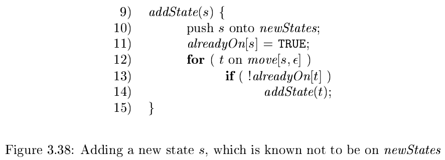
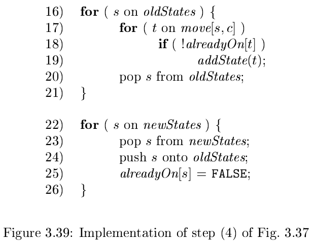

# 《编译原理》 day 18

今天是读《编译原理》的逻辑第 18 天，接昨天内容继续。

实现 NFA 的伪代码

```
S = ε-closure(s0);
c = nextChar();
while (c != EOF) {
    S = ε-closure(move(S, c));
    c = nextChar();
}

if (S ∩ F != Φ) {
    return "yes";
} else {
    return "no";
}
```

对比 DFA 的伪代码，S 既可以看做 NFA 的状态子集，也可以看做 DFA 的单个状态。

然后是实现这个算法的要点，算法是我的弱项，这段看了半天。

根据伪代码描述，需要重点注意的是第一句和第四句，这两句有相似的地方。

实现算法用到三个数据结构

1. 两个栈 oldStates 和 newStates 保存状态信息
2. 一个以 NFA 状态为下标的 alreadyOn 数组，快速查询状态 s 是否已添加
3. 一个二维数组 move 表示 NFA 的转换表，move[s, a] 表示 NFA 状态 s 输入 a 能够到达的状态集合

函数 `ε-closure(s0)` 用 `addState` 实现



这个方法把 s 压入 newStates 然后通过 move[s, ε] 寻找 ε-产生式能到达的状态集合，递归添加到 newStates，alread
On 数组起到缓存的作用，免得重复添加。

迭代状态子集用两个循环实现



第一个循环找到所有的 ε-closure(move(S, c)) 状态子集，第二个循环完成新旧状态赋值，妙啊，不用等号就完成了赋值。

我自己实现了一个 python 版本，很难说有没有 bug 试了几个字符串都能正确识别。

```python
new_states = []
old_states = []

already_on = [False for i in range(1, 12)]

# (a|b)*abb
move = [{'a': [], 'b': [], '': []} for i in range(1, 12)]
move[0][''] = [1, 7]
move[1][''] = [2, 4]
move[2]['a'] = [3]
move[3][''] = [6]
move[4]['b'] = [5]
move[5][''] = [6]
move[6][''] = [1, 7]
move[7]['a'] = [8]
move[8]['b'] = [9]
move[9]['b'] = [10]

def add_state(s):
    new_states.append(s)
    already_on[s] = True
    for t in move[s]['']:
        if not already_on[t]:
            add_state(t)

def iterate_states(c):
    while old_states:
        s = old_states.pop()
        for t in move[s][c]:
            if not already_on[t]:
                add_state(t)
        
    while new_states:
        s = new_states.pop()
        old_states.append(s)
        already_on[s] = False

def nfa():
    add_state(0)
    while new_states:
        s = new_states.pop()
        old_states.append(s)
        already_on[s] = False

    c = next_char()
    while c != '\0':
        iterate_states(c)
        c = next_char()
    return 10 in old_states

def next_char():
    global i
    global input
    if i < len(input):
        c = input[i]
    else:
        c = '\0'
    i += 1
    return c

i = 0
input = 'ab'
print(nfa())
```

算法还是很重要的，它的解题思路，它的数据结构巧用，都有很好的借鉴作用，可惜觉悟的太晚。

作为一个 CRUD boy 反正都是抄代码，不如选点质量高的代码抄，对吧。

封面图：Twiter 心臓弱眞君 @xinzoruo