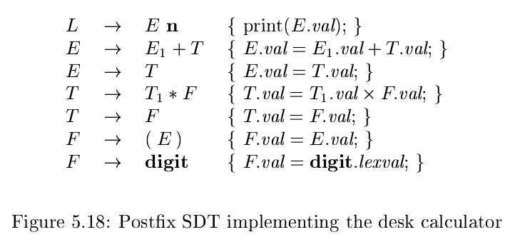
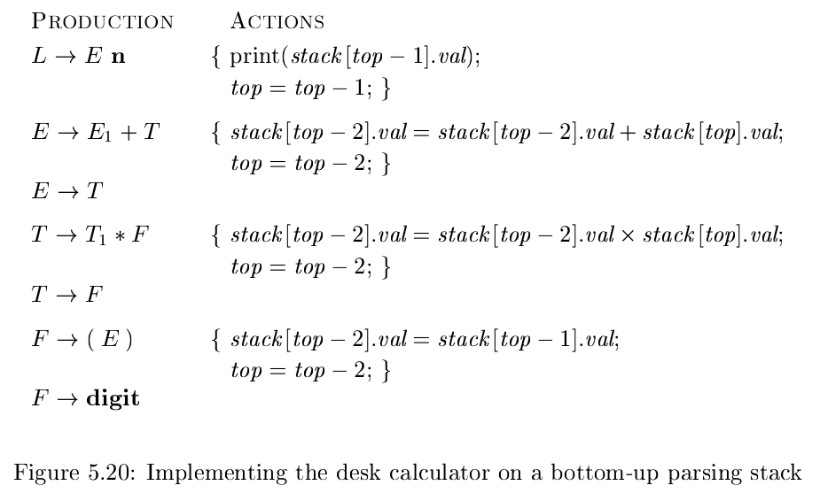
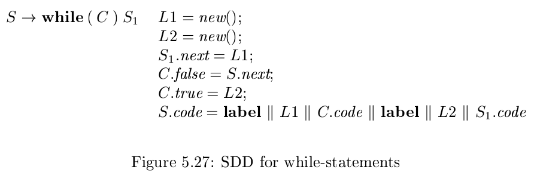
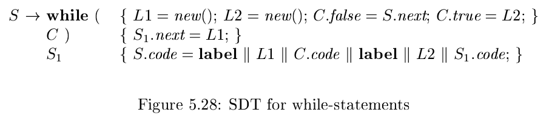

# 《编译原理》 day 36

今天是读《编译原理》的逻辑第 36 天，学习 Syntax-Directed Translation Schemes（语法制导翻译方案）简称 SDT，名字一个比一个唬人，可以简单认为 SDT 是 SDD 的实现。

本节主要介绍两种 SDD 的实现

1. 支持 LR 的文法，S 属性的 SDD
2. 支持 LL 的文法，L 属性的 SDD

很明显第一种要比第二种简单很多很多。

S 属性的 SDD 和 LR 分析技术完美贴合，只要在产生式最后追加语义动作就行，这里再次翻出了前面的例子，第一个产生式结尾的 n 约等于结束符号 #。

这还不够，另外还整了个活，用栈跟踪综合属性，每次都有新的小技巧。

这个栈还是用数组模拟的，另外这张图比较能看出语义规则和语义动作的差异。

语义动作能出现在产生式 A -> X {a} Y 右侧任何位置，X，Y 是文法符号，a 是语义动作，有时候无法在分析过程中同时执行语义动作。

如果要调整文法，比如消除左递归，只要将语义动作看成终结符即可。

L 属性 SDD 转成成 SDT 用下面两条规则

1. 计算非终结符 A 继承属性的语义动作嵌入 A 前面，多个属性按顺序排
2. 计算产生式头综合属性的语义动作放在最后

举个例子，while 语句的文法 S -> while ( C ) S1 的 SDD 如下

S.next，C.false，C.true 都是继承属性，S.code 是综合属性。

根据上面两条，C.true，C.false 放到 C 前面，S1.next 放到 S1 前面，S.code 放最后，于是得到

转确实能转，但不知道为什么这么干就是对的，先暴力记下吧。另外 L2 怎么看着有点多余。

最后 SDT 通用的实现方式

1. 无视语义动作构建分析树
2. 分析树内部结点追加语义动作结点，顺序保持一致
3. 前序遍历分析树，遍历到语义动作结点则执行

封面图：Twitter 心臓弱眞君 @xinzoruo